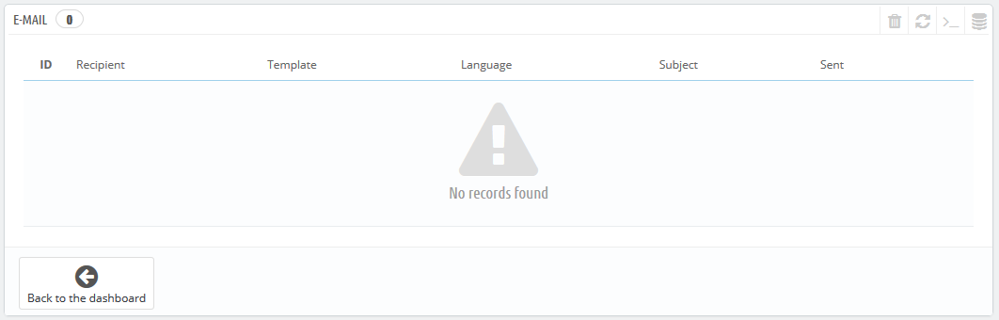
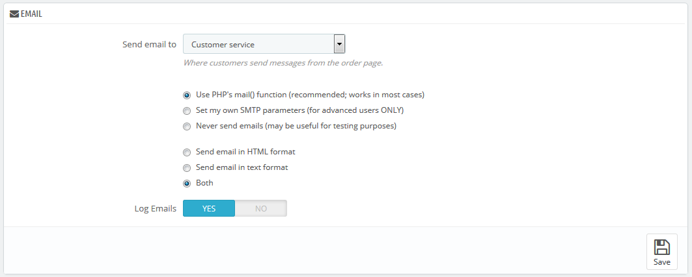
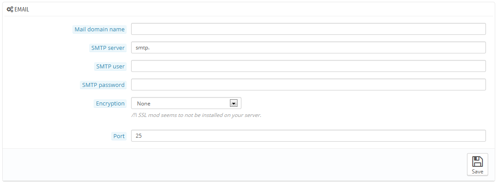
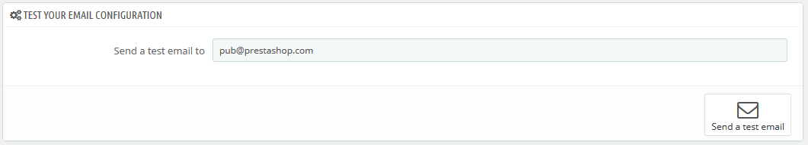

# E-mail instellen

Uw winkel verzend veel berichten tijdens de registratie en bij het bestelproces. Op deze pagina kunt u configureren hoe deze berichten worden verzonden en welke berichten worden verzonden.

## E-mail 

De eerste sectie van de pagina toont een lijst van alle e-mails die zijn verzonden vanuit PrestaShop, met de ontvanger, het gebruikte sjabloon, de taal van de berichten, het onderwerp van de e-mail en de status van de actie.

## E-mail 

Dit is waar u bepaalt hoe uw e-mails worden verzonden en ontvangen.

Dit formulier heeft drie sets aan opties:

* **Verzend e-mail naar**. Dit is een frontend-instelling. Aan het einde van het afrekenproces kan een klant een bericht achterlaten voor het personeel. U kunt kiezen wie dergelijke berichten mogen ontvangen door deze te selecteren uit de dropdown-lijst.
* E-mailinstellingen: hoe e-mails technisch worden verzonden. Maak een keuze uit de drie opties. Zie hieronder voor meer informatie.
* E-mailformaat: hoe e-mails zichtbaar worden verzonden. Kies één van de drie opties. Zie hieronder voor meer informatie.
* **Log Emails**. Schakel dit uit als u niet langer de e-mails die worden verzonden door uw webwinkel wilt bijhouden.

### Technische configuratie 

Configureer PrestaShop om e-mails te versturen naar uw klanten. We adviseren u met klem dat u uw webhost raadpleegt om te achterhalen welke instellingen gebruikt moeten worden. De opties zijn:

* **Nooit e-mails versturen**. Behoud deze instelling voor testdoeleinden. Zodra uw winkel openbaar is, moet u deze instelling vermijden.
* **Gebruik PHPs mail() functie**. Deze instelling wordt aanbevolen. Als dit niet werkt, kunt u gaan voor de SMTP-optie hieronder.
* **Stel mijn eigen SMTP-parameters in**. In dit geval verschijnt er een nieuwe sectie, met meer velden. De informatie voor deze velden hebt u mogelijk ontvangen van uw hostingprovider: mail domeinnaam, SMTP-server, SMTP-gebruiker, etc. Zorg ervoor dat u letterlijk de gegevens van uw hostingprovider overneemt.

De SMTP-configuratieinformatie kan verstrekt worden door:

* Uw systeembeheerder,
* Uw host,
* Uw internetprovider,
* Uw e-mailprovider.

Uw webhost kan vertellen of uw gebruikersnaam wel of niet vereist is. Dit geldt mogelijk ook voor het wachtwoord en de eventuele encryptie.

Bijvoorbeeld, in het geval van Gmail (de e-mailservice van Google), moet u ongeveer deze informatie invoeren:

* SMTP server: [smtp.gmail.com](http://smtp.gmail.com)
* User: [my.user.name@gmail.com](mailto:my.user.name@gmail.com) (example)
* Password: RT22UE87 (example)
* Encryption: SSL
* Port: 465

### Visuele configuratie 

Er zijn twee formaten beschikbaar voor e-mails: HTML ziet er mooi uit, maar dit werkt niet overal; tekst ziet er erg saai en lelijk uit, maar werkt overal.

U kunt ervoor kiezen om slechts één van de twee aan te bieden, maar beide wordt aangeraden.

## Test uw e-mailconfiguratie 

Zodra u uw e-mails hebt geconfigureerd door middel van de twee beschikbare methoden, voert u uw eigen e-mail in, in deze sectie, daarna klikt u op de knop "Stuur een test e-mail".\
Controleer met behulp van uw inbox of u daadwerkelijk de e-mail hebt ontvangen, in het juiste formaat. Als u het niet hebt ontvangen, dan werkt u uw configuratie bij met de juiste informatie.

