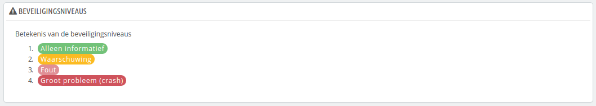
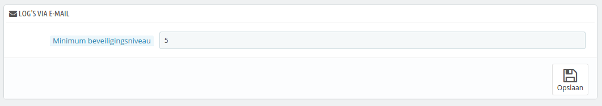

# Logboek bekijken

Fouten kunnen altijd optreden. Meestal bent u er zich niet van bewust, omdat PrestaShop ze stilletjes afhandelt. Maar u wilt er misschien meer over te weten komen, om de meest voorkomende fouten te verhelpen en de stabiliteit van uw winkel te verhogen.

De pagina "Logboeken" is waar u de PHP-fouten kunt opzoeken waar uw winkel last van heeft. Ze worden getoond in de centrale tabel van de pagina en gerangschikt in 4 niveaus:

* **1: Alleen informatief**. Waarschuwingen tijdens run-time. Geeft aan dat het script iets is tegengekomen dat een fout kan zijn, maar zou ook tijdens de normale uitvoer van een script kunnen optreden.
* **2: Waarschuwing**. Run-time-waarschuwingen (niet-fatale fouten). Uitvoeren van het script wordt niet gestopt.
* **3: Fout**.
* **4: Groot probleem (crash)!**. Fatale run-time-fouten. Deze geven fouten aan waarvan de winkel niet kan herstellen, zoals problemen bij het alloceren van geheugen. Het uitvoeren van het script is gestaakt.

De uitleg van deze fouten komen uit de PHP-handleiding. Lees hier meer: [http://www.php.net/manual/en/errorfunc.constants.php](http://www.php.net/manual/en/errorfunc.constants.php).

## Logs via e-mail 

De foutniveaus dienen ook als waarden voor de functie "Logs via e-mail".\
PrestaShop voegt een laatste waarde toe, 5, deze geeft aan dat de beheerder geen notificaties wilt ontvangen, niet voor kleine en grote fouten.

De error logging tool maakt hte mogelijk om een e-mailmelding te ontvangen zodra er een fout optreedt. Notificaties worden verzonden naar het e-mailadres van de winkeleigenaar. En u kunt aangeven vanaf welk niveau e-mails verzonden zouden moeten worden:

* "1" als u alles wilt weten, inclusief de kleinste dingen.
* "3" als u alleen informatie over grote fouten wilt ontvangen.
* "4" als u alleen informatie wilt ontvangen over de allergrootste fouten.
* "5" is de standaardwaarde. Dit betekent dat er geen meldingen worden verzonden.
