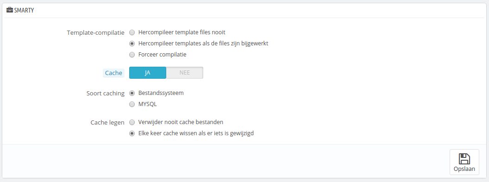
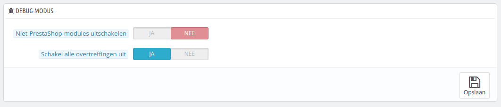
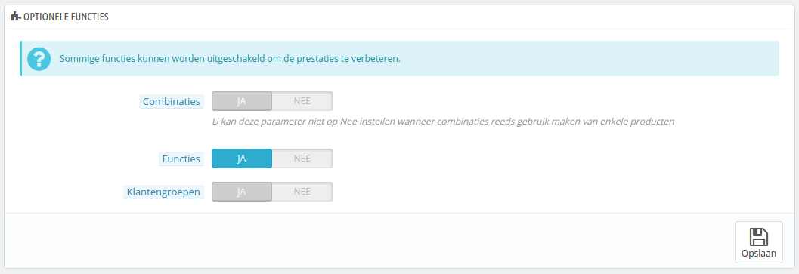
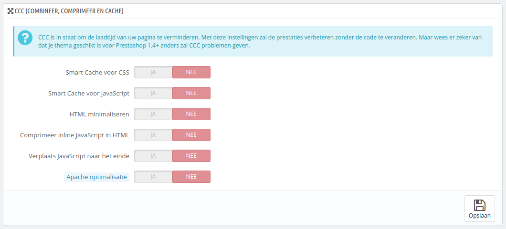
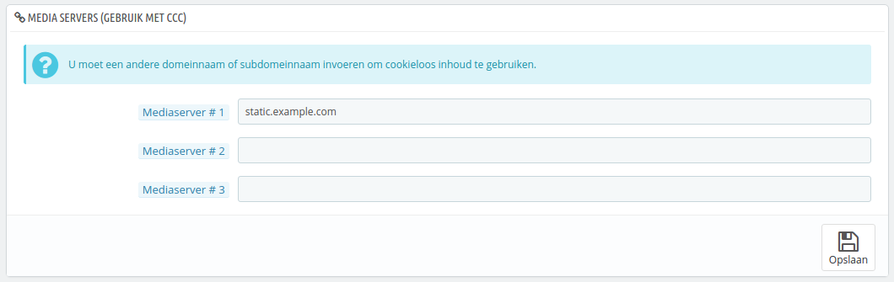
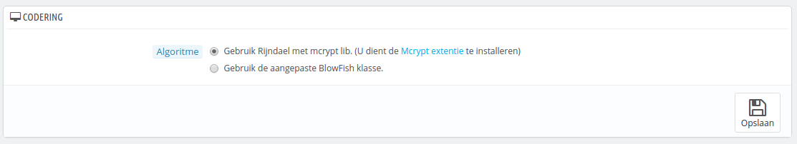
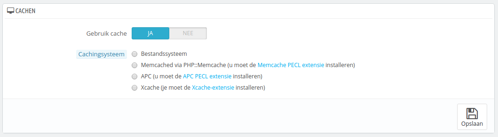

# Prestaties instellen

Deze pagina combineert veel tools en geeft tips die u helpen bij het verbeteren van de prestaties van uw server – met prestaties wordt hier niet de verkoop bedoeld, alhoewel een server die beter presteert een betere ervaring kan bieden aan klanten en dat resulteert weer in meer verkopen.

## Smarty <a href="#prestatiesinstellen-smarty" id="prestatiesinstellen-smarty"></a>

Smarty is de naam van de template-taal die gebruikt wordt door de thema's van PrestaShop. U kunt meer te weten komen over smarty op [http://www.smarty.net/](http://www.smarty.net/)[.](http://www.smarty.net)



Er zijn twee opties:

* **Template-compilatie**. Voor betere frontend-prestaties houdt PrestaShop een cache bij van uw HTML-pagina's.
  * **Hercompileer template files nooit**. Het normale gedrag: HTML-pagina's zijn gecompileerd en gecached; wijzigingen in de bestanden zijn niet zichtbaar.
  * **Hercompileer templates als de files zijn bijgewerkt**. De HTML-pagina's worden gecompileerd en gecached; wijzigingen zijn wel zichtbaar als een bestand is bijgewerkt en PrestaShop dit heeft opgemerkt.
  * **Forceer compilatie**. Schakel dit alleen in als u een thema bewerkt en u de wijzigingen meteen wilt zien.
* **Cache**. Deze optie maakt het mogelijk om de gehele cache uit te schakelen en niet slechts de template-bestanden die gecached zijn. Schakel dit alleen uit als u een thema of module voor PrestaShop probeert te debuggen, anders moet u deze optie ingeschakeld laten.\
  De optie "Cache legen" maakt het mogelijk om de cache-bestanden te verwijderen, in plaats van dit handmatig op uw FTP-server te doen.
* **Soort caching**. Standaard gebruikt Smarty een cachingmechanisme dat gebaseerd is op bestanden. U kunt ervoor kiezen om MySQL te gebruiken als opslag.
* **Cache legen**. Afhankelijk van hoe vaak uw winkel verandert, wilt u misschien nooit de cache-bestanden wissen of slechts als er iets is gewijzigd (zowel producten als design).

## Debug-modus <a href="#prestatiesinstellen-debug-modus" id="prestatiesinstellen-debug-modus"></a>

**Nieuw sinds 1.6.**

Wanneer u in debug-modus bent, kunt u ervoor kiezen om bepaalde functies binnen PrestaShop uit te schakelen, om zo te achterhalen waar een fout veroorzaakt kan zijn:



* **Niet-PrestaShop-modules uitschakelen**. PrestaShop's eigen modules zijn veel getest en zouden geen problemen moeten opleven. Als u deze instelling gebruikt dan kunt u achterhalen of het probleem waar u tegenaan loopt wordt veroorzaakt door code van PrestaShop zelf of door een module van een derde.
* **Schakel alle overtreffingen uit**. Veel functies in PrestaShop kunnen overschreven worden. Als u deze optie inschakelt, dan wordt alle code die functies overschrijven, uitgeschakeld en kunt u achterhalen of een probleem wordt veroorzaakt door PrestaShop of door een module van een derde.

## Optionele functies <a href="#prestatiesinstellen-optionelefuncties" id="prestatiesinstellen-optionelefuncties"></a>

Sommige functies van PrestaShop kunnen worden uitgeschakeld als u ze niet gebruikt, omdat ze uw winkel kunnen vertragen.

Als uw catalogus momenteel producten bevat die gebruik maken van deze functies, dan kunt u deze opties niet uitschakelen. U moet dan eerst enkele gegevens wissen, voordat u de opties kunt uitschakelen.

U kunt de volgende functies uitschakelen:



* **Combinaties**. Productcombinaties maken het mogelijk om een nieuwe productlijn aan te maken van een enkel product: verschillende maten, kleuren, capaciteit, etc.
* **Kenmerken**. _(Voorheen bekend als functies, dit was een foute vertaling)._ Productkenmerken maken het mogelijk om productspecifieke informatie te te voegen: gewicht, materiaal, land van oorsprong, etc.
* **Klantengroepen**. Klantengroepen maken het mogelijk om klanten te groeperen om ze privileges en beperkingen te bieden: kortingen, modulerestricties, etc.

## Combineer, comprimeer en cache (CCC) <a href="#prestatiesinstellen-combineer-comprimeerencache-ccc" id="prestatiesinstellen-combineer-comprimeerencache-ccc"></a>

CCC zijn een aantal gereedschappen, waarmee de server load en laadtijd van de webwinkel verkleind kunnen worden.

Het doet waar het voor staat: het combineert tekstuele bestanden in een groter bestand, waardoor er minder bestanden gedownload hoeven te worden; deze wordt vervolgens met een zip-algoritme gecomprimeerd, om het sneller te kunnen downloaden; uiteindelijk wordt het gecomprimeerde bestand gecached, zodat de server niet elke keer het bestand opnieuw hoeft te genereren en de processor kan ontlasten.

Uw thema moet compatibel zijn met minstens PrestaShop 1.4, anders zal CCC niet werken zoals verwacht. Dit is waarom de meeste opties standaard zijn uitgeschakeld.



* **Smart cache voor CSS**. CSS-bestanden zijn in feite tekstbestanden en kunnen veilig worden gecombineerd en gecomprimeerd.
* **Smart cache voor JavaScript**. JavaScript-bestanden zijn in feite ook tekstbestanden, maar de compressie van dergelijke bestanden kan soms problemen opleveren: zorg ervoor dat u alles goed test, voordat u deze optie inschakelt.
* **HTML minimaliseren**. De HTML-code die gegenereerd wordt door Smarty kan geminified worden. Dat betekent dat PrestaShop de witruimte verwijdert om een aantal bytes te besparen. Dit is meestal veilig.
* **Comprimeer inline JavaScript in HTML**. Sommige thema's hebben de JavaScript-code ingebakken. U kunt deze met rust laten of ook comprimeren. Zorg er net als bij bovenstaande JavaScript-optie ervoor dat u de webwinkel goed test.
* **Verplaats JavaScript naar het einde**. Door de JavaScript-code van uw thema naar het einde te verplaatsen van het HTML-bestand, kunt u de pagina versnellen door inhoud boven de vouw sneller weer te geven.
* **Apache optimalisatie**. Deze instelling verandert de configuratie van uw webserver om het efficiënter te maken voor CCC. Werkt alleen op Apache.

## Media servers <a href="#prestatiesinstellen-mediaservers" id="prestatiesinstellen-mediaservers"></a>

Deze sectie maakt het mogelijk om een deel van uw verkeer door te verwijzen (afbeeldingen en videobestanden, bijvoorbeeld) naar andere servers die u beheert, door andere domeinen of subdomeinen – meestal zijn de bestanden gehost bij een CDN (Content Delivery Network). Standaard ondersteunt PrestaShop tot 3 mediaservers.



Door slechts uw huidige domein in één van de velden in te voeren, kunt u de prestaties niet verbeteren. Hiermee gezegd hebbende, het is gemakkelijker om een mediaserver op te zetten. De voordelen zijn gelijk zichtbaar. U doet dit als volgt:

1. Open een account bij een nieuwe host, één die is gespecialiseerd in distributed content. De meest populaire zijn Akamai ([http://www.akamai.com/](http://www.akamai.com/)), Amazon (met de AWS-services – de service die u zoekt is CloudFront: [http://aws.amazon.com/](http://aws.amazon.com/), gratis account mogelijk binnen de Free Tier) of CloudFlare (naast CDN ook nog andere beveiligingsopties en optimalisaties: [http://www.cloudflare.com/](http://www.cloudflare.com/), heeft veel mogelijkheden binnen het gratis account).
2. Kopieer uw bestanden naar de server van e host. Dit betekent dat de CDN een exacte kopie moet hebben van de volgende mappen van uw webwinkel: `/img`, `/themes` en `/modules`.\
   Reminder: u moet ervoor zorgen dat deze mappen altijd zijn gesynchroniseerd: zelfs als u nieuwe producten toevoegt of uw thema wijzigt, moet de CDN de laatste versies van al deze bestanden hebben.
3. Zodra de CDN is geplaatst voegt u het webadres toe (zoals opgegeven door uw CDN) in het eerste veld, "Media server #1". Als de host meerdere adressen toestaat, voegt u deze toe.

Als u liever hebt dat het lijkt alsof de bestanden vanaf uw domeinnaam zijn gedownload in plaats van een onbekend domein (a78sdhasdf.cloudfront.net voor Amazon, bijvoorbeeld), dan volgt u dit proces:

1. Maak een subdomein aan voor het domein van uw winkel, bijvoorbeeld: `http://cdn1.example.com` (de manier hangt af van de hostingprovider, vraag hen om meer informatie).
2. Plaats een `.htaccess`-bestand in de hoofdmap van het subdomein. Dat bestand moet een enkele regel bevatten:
3.  ```
    Redirect Permanent / http://cdn-adress.com
    ```

    \
    Vervang het adres met het adres van uw CDN. Op deze manier verwijst u klanten automatisch door naar uw CDN.
4. Zodra het subdomein is geplaatst, voegt u het toe aan het eerste veld, "Media server #1". Als de host meerdere adressen toestaat, voegt u deze toe.

Zelfs als u geen CDN-server heeft, kunt u de mediaserver-mogelijkheid inschakelen om ervoor te zorgen dat de browser van een klant meerdere bestanden tegelijk kan downloaden, en hiermee het laden van een pagina versnelt:

1. Configureer uw webserver om meerdere virtuele subdomeinen te gebruiken zoals `images1.example.com`, `images2.example.com` en `images3.example.com`. Allemaal verwijzen ze naar de hoofdmap van PrestaShop.
2. Op de pagina "Prestaties" stelt u elke mediaserver in.

Zodra dit is ingevuld, zal PrestaShop automatisch uw afbeeldingen downloaden vanaf deze subdomeinen. Effectief komen de afbeeldingen vanuit dezelfde map (de hoofdmap), maar de browser opent meerdere verbindingen met uw webserver dan het standaard zou doen, dus hiermee kan de pagina sneller geladen worden.

## Ciphering <a href="#prestatiesinstellen-ciphering" id="prestatiesinstellen-ciphering"></a>

Ciphering betekent het encrypten van data, zodat het niet meer zichtbaar is voor derden. De details van een klantaccount, maar ook uw eigen wordt beschermd door cyphering.



Hieronder staat hoe u het algoritme kunt wijzigen:

* **Gebruik Rijndael met mcrypt**. Standaardkeuze. Snel en veilig, maar vereist dat u de mcrypt-extensie voor PHP hebt geïnstalleerd.
* **Behoud de huidige BlowFish klasse**. Betere beveiliging, maar prestaties worden minder, omdat het langer duurt om de authenticatie te bevestigen voor elke keer dat een pagina geladen wordt. Uw klanten kunnen de extra beveiliging waarderen, maar wachten liever niet langer op de pagina – alhoewel het verschil bijna niet te merken is.

Kies daarom verstandig. Als u de configuratie wijzigt worden de cookies herstelt.

## Cachen <a href="#prestatiesinstellen-cachen" id="prestatiesinstellen-cachen"></a>

De cache van uw server bewaart statische versies van uw dynamische webpagina, om deze sneller te serveren aan klanten en waarmee server load bespaard kan worden.

Meestal moet u eerst bij uw hostingprovider controleren of dit mogelijk is, omdat u speciale instellingen nodig hebt op de server.

Deze sectie maakt het mogelijk om caching in te schakelen en vervolgens een cachingmethode te kiezen:



* **Bestandssysteem**. De statische bestanden worden net als elk ander bestand bewaard op de server. Dit veld toont standaard een "1". Dit is de mapdiepte. Verander deze waarde alleen als u weet wat u doet.
* **Memcached**. Een gedistribueerd cachingsysteem. Erg effectief, al helemaal met meerdere servers, maar u moet er wel zeker van zijn dat uw server/host dit onderteunt – als uw PHP-configuratie de Memcached PECL extensie ondersetunt, dan kunt u dit waarschijnlijk wele gebruiken (u kunt de extensie hier downloaden: [http://pecl.php.net/package/memcache](http://pecl.php.net/package/memcache)). U kunt Memcached servers toevoegen door te klikken op de knop "Server toevoegen".
* **APC**. Alternative PHP Cache is gratis, open en robuust, maar werkt met slechts één server – dit is meestal het geval wanneer u net uw bedrijf hebt gestart. Controleer hiervoor of uw de PECL-extensie hebt geïnstalleerd: [http://pecl.php.net/package/APC](http://pecl.php.net/package/APC).
* **Xcache**. Xcache is een relatief nieuw cachingsysteem, deze is specifiek bedoeld voor de Lighthttpd-server – daarom werkt deze niet met de populaire Apache-software. Lees hier meer over op de volgende site: [http://xcache.lighttpd.net/](http://xcache.lighttpd.net/).
