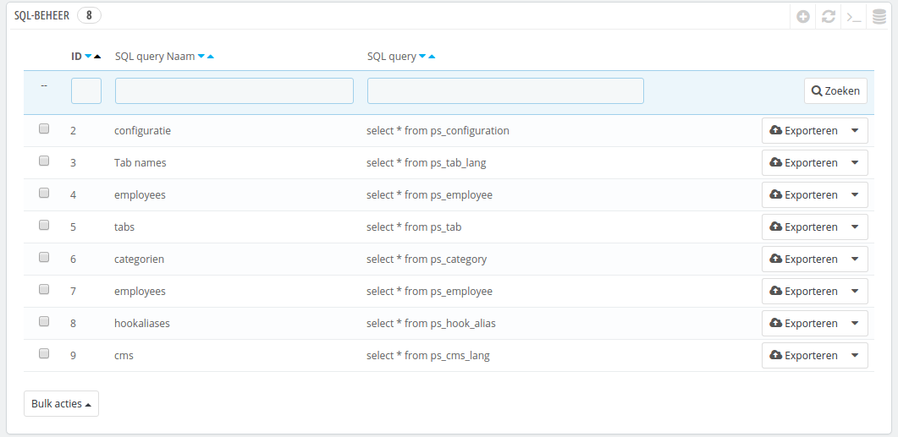
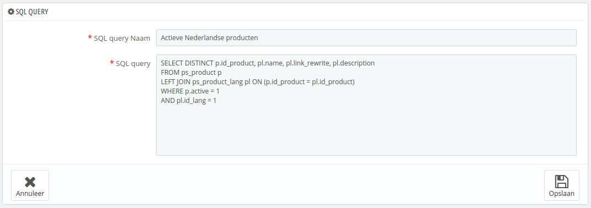
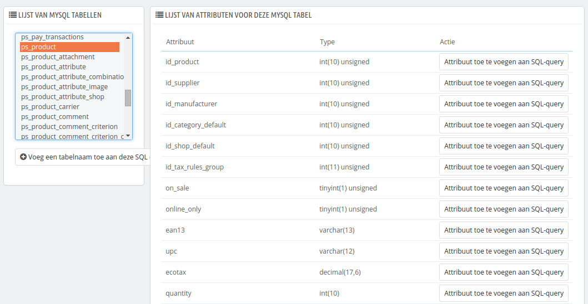
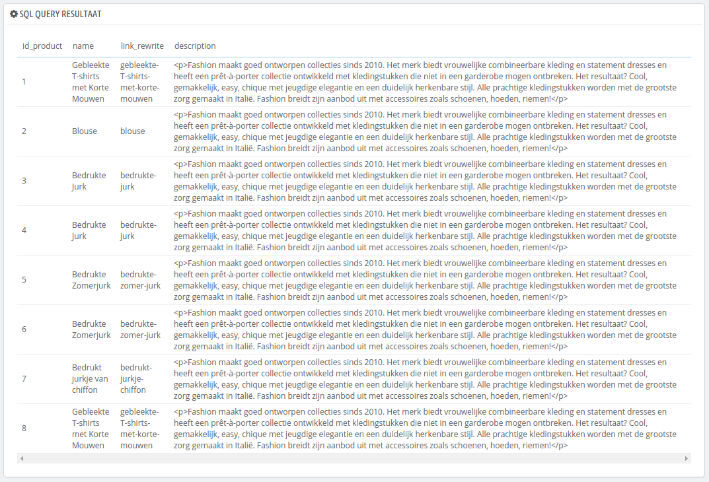
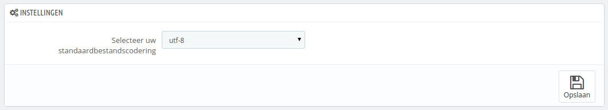

# SQL-beheer

De SQL-beheerder is een complexe functie, die gereserveerd moet worden voor technisch personeel met verstand van databases die gebruikmaken van de SQL-taal. Dit gereedschap is erg krachtig en heel erg handig voor degenen die verstand hebben van databases.



Dit gereedschap maakt het mogelijk om direct SQL-queries uit te voeren op de database van PrestaShop en bewaart de queries om ze later nogmaals uit te voeren. Inderdaad, PrestaShop toont haar database op veel manieren, maar als u meer dan dat nodig hebt, dan is hier een uitgebreidere weergave dan de interface van PrestaShop.\
Door gebruik te maken van de SQL-beheerder kunt u complexe queries uitvoeren op de tabellen en de data weergeven op UW manier.\
Bijvoorbeeld, door gebruik te maken van deze tool tesamen met uw kennis van SQL, kunt u een herbruikbare query maken die u een bijgewerkte lijst toont van klanten die zich hebben geabonneerd op uw nieuwsbrief, of een lijst met producten in HTML- of CSV-formaat.

Om veiligheidsredenen zijn sommige type queries niet toegestaan: UPDATE, SELECT, CREATE TABLE, DROP, etc. In het kort kunt u alleen data lezen (SELECT-query).

Ook worden beveiligde sleutels en wachtwoorden verborgen (\*\*\*\*\*\*\*\*).

## Een nieuwe query aanmaken <a href="#sql-beheer-eennieuwequeryaanmaken" id="sql-beheer-eennieuwequeryaanmaken"></a>

Zoals gebruikelijk stuurt de knop "Voeg een nieuwe SQL query toe" u naar een aanmaakformulier. Het heeft twee velden:

* **SQL query Naam**. Maak de naam zo lang als nodig is.
* **SQL query**. De SQL-query zelf. U bent vrij om enkele JOINs uit te voeren op tussentijdse selecties.



Als toevoeging helpt de sectie "Lijst van MySQL tabellen" u bij het verkennen van de database en maakt het gemakkelijker om queries op te bouwen. Het geeft u een handige en klikbare selector waarme de huidig beschikbare databasetabellen kunnen geworden geselecteerd. Kies een tabel, zodat PrestaShop de attributen en typen weergeeft. Klik daarna op "Attribuut toe te voegen aan SQL-query" om de naam te kopiëren naar het veld "SQL query".



Door het formulier te bewaren wordt u teruggebracht naar de hoofdpagina, met de lijst van queries.

## Een query starten <a href="#sql-beheer-eenquerystarten" id="sql-beheer-eenquerystarten"></a>

Elke bewaarde query in de tabel heeft vier iconen aan de rechterkant van de rij:

* **Exporteren**. Voert de query uit en biedt deze vervolgens aan als CSV-formaat.
* **Bekijken**. Voert de query uit en toont deze als een HTML-tabel in de interface van PrestaShop.
* **Wijzig**. U kunt een query zo vaak bewerken als nodig is, om de query te verbeteren en betere resultaten te verkrijgen.
* **Verwijder**. Zodra een query niet meer wordt gebruikt (of simpelweg omdat het niet meer werkt) kunt u het verwijderen door op deze knop te klikken en uw actie te bevestigen.



## Instellingen <a href="#sql-beheer-instellingen" id="sql-beheer-instellingen"></a>

Er is op dit moment één optie:

* **Selecteer uw standaardbestandscodering**. U kunt de karaktercodering van het gedownloade CSV-bestand bepalen. De standaardwaarde, UTF-8, wordt aangeraden, maar u kunt ook ISO-8859-1 selecteren als u dat nodig hebt.



## Een aantal voorbeeldqueries <a href="#sql-beheer-eenaantalvoorbeeldqueries" id="sql-beheer-eenaantalvoorbeeldqueries"></a>

De mogelijkheden zijn eindeloos, maar hier zijn een paar voorbeelden om u op weg te helpen.

### Alle e-mailadressen van alle klanten tonen <a href="#sql-beheer-allee-mailadressenvanalleklantentonen" id="sql-beheer-allee-mailadressenvanalleklantentonen"></a>

```
SELECT email FROM ps_customer
```

### Alle e-mailadressen van de klanten tonen die zich hebben geabonneerd op uw nieuwsbrief <a href="#sql-beheer-allee-mailadressenvandeklantentonendiezichhebbengeabonneerdopuwnieuwsbrief" id="sql-beheer-allee-mailadressenvandeklantentonendiezichhebbengeabonneerdopuwnieuwsbrief"></a>

```
SELECT email
FROM ps_customer
WHERE newsletter = 1
```

### Alle producten tonen die actief zijn en een beschrijving hebben in het Frans (id\_lang = 4) <a href="#sql-beheer-alleproductentonendieactiefzijneneenbeschrijvinghebbeninhetfrans-id_lang-4" id="sql-beheer-alleproductentonendieactiefzijneneenbeschrijvinghebbeninhetfrans-id_lang-4"></a>

```
SELECT p.id_product, pl.name, pl.link_rewrite, pl.description
FROM ps_product p
LEFT JOIN ps_product_lang pl ON (p.id_product = pl.id_product)
WHERE p.active = 1
AND pl.id_lang = 4
```

### Alle bestellingen tonen met details van de vervoerder, valuta, betaling, totaalbedrag en datum <a href="#sql-beheer-allebestellingentonenmetdetailsvandevervoerder-valuta-betaling-totaalbedragendatum" id="sql-beheer-allebestellingentonenmetdetailsvandevervoerder-valuta-betaling-totaalbedragendatum"></a>

```
SELECT o.`id_order` AS `id`,
	CONCAT(LEFT(c.`firstname`, 1), '. ', c.`lastname`) AS `Customer`,
	ca.`name` AS `Carrier`,
	cu.`name` AS `Currency`,
	o.`payment`, CONCAT(o.`total_paid_real`, ' ', cu.`sign`) AS `Total`,
	o.`date_add` AS `Date`
FROM `ps_orders` o
LEFT JOIN `ps_customer` c ON (o.`id_customer` = c.`id_customer`)
LEFT JOIN `ps_carrier` ca ON (o.id_carrier = ca.id_carrier)
LEFT JOIN `ps_currency` cu ON (o.`id_currency` = cu.`id_currency`)
```
