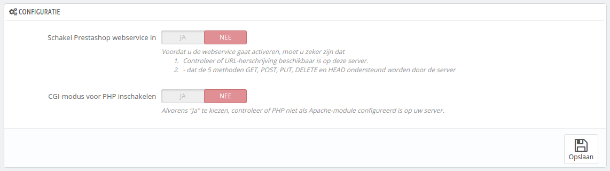

# Webservice instellen

Op deze pagina kunt u de webservice van uw winkel instellen, zodat applicaties van derden toegang krijgen tot uw data. Dit maakt het mogelijk voor tools of uw klanten om beter gebruik te maken van uw winkel (zoals mobiele applicaties).

Een webservice is een communicatiemethode tussen twee elektronische apparaten over een netwerk. Het is afhankelijk van een aantal methoden, formaten en toegangsrechten, zodat de content van de webservice op elk andere geautoriseerde tool weergegeven kan worden en verder kan bouwen op de originele content. Lees er meer over op Wikipedia: [http://en.wikipedia.org/wiki/Web\_service](http://en.wikipedia.org/wiki/Web\_service).

De pagina begint met het weergeven van de bestaande webservice-sleutels in een tabel, als ze er zijn. Een webservice-sleutel is een uniek toegangsrecht dat u aan een ontwikkelaar verleent, die vervolgens een tool kan koppelen aan uw winkel. Deel ze sporadisch, omdat u niet wilt dat iedereen toegang krijgt tot uw data.

Niet elke app kan alles bereiken via de PrestaShop-webservice: u mag bepalen wat mogelijk is. Elke app heeft een unieke verbindingssleutel, met specifieke toegangsrechten.

## Een nieuwe sleutel toevoegen 

De knop "Nieuwe webservice-sleutel toevoegen" brengt u naar het aanmaakformulier:

* **Sleutel**. Een unieke sleutel. U kunt er zelf één aanmaken of ervoor kiezen om er een te laten genereren, door op de knop "Genereren!" te klikken. Ook kunt u een online generator gebruiken. Gegenereerde sleutels zijn vaak veiliger, omdat ze moeilijker zijn om te raden.
* **Sleutel beschrijving**. Een reminder voor wie de sleutel is bedoeld en welke toegangsrechten de sleutel geeft.
* **Status**. U kunt een sleutel te allen tijde uitschakelen. Dit maakt het mogelijk om tijdelijk toegang te geven aan iemand met een sleutel.
* **Permissies**. U hoeft niet ALLE data te delen met een sleutel. U kunt kiezen uit een uitgebreide tabel met permissies. U wilt misschien dat sommige applicaties slechts toegang krijgen tot een paar items (waarvan u wilt dat deze ergens anders beheerd kunnen worden). Kies met verstand.

## Configuratie 

Om veiligheidsredenen moet u ervoor zorgen dat uw winkel SSL ondersteunt!

De configuratie is vrij eenvoudig:

* **Schakel PrestaShop webservice in**. Als u niet wilt dat iedereen toegang heeft tot uw winkel via tools en applicaties van derden, dan houdt u deze optie uitgeschakeld.
* **CGI-modus voor PHP inschakelen**. De CGI-modus is een speciale instelling voor de Apache-server, waarmee u kunt aangeven dat PHP gebruikt moet worden als CGI-script in plaats van als een Apache-module. Ondanks dat CGI bekend staat als veiliger dan een module, is er in mei 2012 toch nog een veiligheidsprobleem geweest. Vraag uw webhost om advies.

Ontwikkelaars kunnen onze documentatie om een webservice-applicatie te bouwen hier vinden: [http://doc.prestashop.com/display/PS16/Using+the+PrestaShop+Web+Service](http://doc.prestashop.com/display/PS16/Using+the+PrestaShop+Web+Service).
