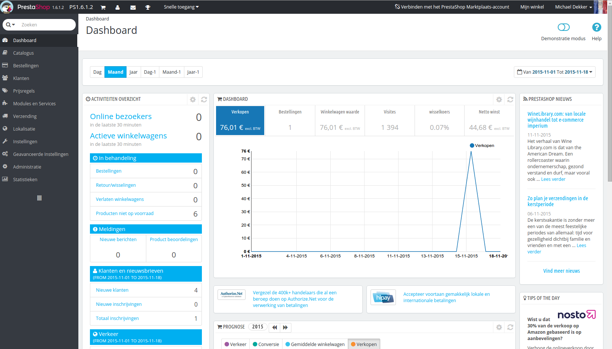

# Kennismaken met het administratiepaneel

**Inhoudsopgave**

/\*\<!\[CDATA\[\*/\
div.rbtoc1597237784136 {padding: 0px;}\
div.rbtoc1597237784136 ul {list-style: disc;margin-left: 0px;}\
div.rbtoc1597237784136 li {margin-left: 0px;padding-left: 0px;}\
\
/\*]]>\*/

* [Kennismaken met het administratiepaneel](kennismaken-met-het-administratiepaneel.md#Kennismakenmethetadministratiepaneel-Kennismakenmethetadministratiepaneel)
  * [Overzicht van de hoofdinterface](kennismaken-met-het-administratiepaneel.md#Kennismakenmethetadministratiepaneel-Overzichtvandehoofdinterface)
    * [De topbalk](kennismaken-met-het-administratiepaneel.md#Kennismakenmethetadministratiepaneel-Detopbalk)
    * [De menu's](kennismaken-met-het-administratiepaneel.md#Kennismakenmethetadministratiepaneel-Demenu%27s)
  * [De knoppen](kennismaken-met-het-administratiepaneel.md#Kennismakenmethetadministratiepaneel-Deknoppen)
  * [Contextuele helpfunctie](kennismaken-met-het-administratiepaneel.md#Kennismakenmethetadministratiepaneel-Contextuelehelpfunctie)
  * [Het Dashboard](kennismaken-met-het-administratiepaneel.md#Kennismakenmethetadministratiepaneel-HetDashboard)
    * [De horizontale balk](kennismaken-met-het-administratiepaneel.md#Kennismakenmethetadministratiepaneel-Dehorizontalebalk)
    * [De linkerkolom](kennismaken-met-het-administratiepaneel.md#Kennismakenmethetadministratiepaneel-Delinkerkolom)
    * [De centrale kolom](kennismaken-met-het-administratiepaneel.md#Kennismakenmethetadministratiepaneel-Decentralekolom)
    * [De rechterkolom](kennismaken-met-het-administratiepaneel.md#Kennismakenmethetadministratiepaneel-Derechterkolom)

## Kennismaken met het administratiepaneel 

Nu dat u PrestaShop 1.6 hebt geïnstalleerd en dat u bent ingelogd in uw administratiepaneel, moet u ervoor zorgen dat u gemakkelijk de weg kunt vinden door de interface van het administratiepaneel, begrijpen wat de notificaties betekenen en waar u specifieke informatie kunt terugvinden.

Het design van het administratiepaneel is compleet veranderd met versie 1.6 van PrestaShop om nog ergonimischer en intuïtiever te zijn alsook beter te laten werken op mobiele apparaten.

Terwijl de meeste pagina's van versie 1.5 nog steeds op dezelfde plek zijn als u verwacht, kan het toch even duren voordat u gewend bent aan de nieuwe interface.

We hebben dit hoofdstuk gemaakt om u te helpen bij het ontdekken van de nieuwe interface van het administratiepaneel. Het is ontworpen om erg ergnomisch te zijn en gemakkelijk om te gebruiken, maar wees er wel van bewust dat u de gehele handleiding moet doorlezen om uw nieuwe online business perfect onder de knie te krijgen!

### Overzicht van de hoofdinterface 

Neem de tijd om het Dashboard te leren kennen – dat is de eerste pagina die u ziet wanneer u inlogt op uw back office. Niet alleen toont het een samenvatting van alles wat u moet weten over uw winkel, samen met een aantal snelle links naar andere delen van het administratiepaneel, maar ook biedt het nieuwe gebruikers van PrestaShop tips met waar zij het beste naar kunnen kijken.

#### De topbalk 

De topbalk van de backoffice is een zwarte balk met een handvol links:

* **(naam van uw winkel)**. Vanaf elke pagina brengt deze link u terug naar het Dashboard.
* **Winkelwagenicoon**. Een badge geeft het aantal nieuwe bestellingen weer als deze er zijn. Als u hierop klikt komt er een paneel tevoorschijn met de nieuwe bestellingen sinds u voor het laatst op dat icoon hebt geklikt. Vanaf daar kunt u één van de nieuwe bestellingen bekijken of naar de lijst met bestellingen gaan.
* **Gebruikersicoon**. Een badge geeft het aantal nieuwe klanten aan als deze er zijn. Als u hierop klikt komt er een paneel tevoorschijn die de nieuw geregistreerde gebruikers weergeeft. Vanaf daar kunt u één van de nieuwe gebruikers bekijken of naar de lijst met gebruikers gaan.
* **Envelope-icoon**. Een badge geeft het aantal nieuwe berichten weer als deze er zijn. Als u hierop klikt komt er een paneel tevoorschijn met de meest recente berichten die de klantenservice heeft ontvangen. Vanaf daar kunt u een dergelijk bericht weergeven of naar de lijst met berichten gaan.
* **Trofee-icoon.** Een badge geeft het aantal nieuwe items weer als deze er zijn. Als u hierop klikt krijgt u uw vooruitgang als verkoper te zien. Vanaf daar kont u de pagina met trofeeën en punten bekijken afkomstig van de "Merchant Expertise" module.
* **Snelle toegang**. Dit is een menu met links die ingesteld kunnen worden via de pagina "Snelle toegang" onder het menu "Administratie".
* **De link " Verbinden met het PrestaShop Marktplaats-account"**. Opent een popup die het mogelijk maakt om uw winkel te verbinden met de Addons-maktplaats en vanaf daar updates te ontvangen voor de modules en thema's die u heeft aangeschaft.
* **"Mijn winkel" link**. Opent een nieuw browsertabblad met de frontend van uw winkel.
* **(uw naam) link**. Een simpele dropdown met een herinnering van het administratieaccount waarmee u momenteel bent ingelogd.
  * **"Mijn voorkeuren" link**. Dit brengt u naar de configuratiepagina van uw account, waar u enkele persoonlijke opties kunt instellen (bijvoorbeeld, de taal van de back office of uw wachtwoord).
  * **"Afmelden" link**. Logt uw account uit.

#### De menu's 

Om uw winkel dagelijks te beheren moet u bladeren door de vele pagina's en opties in de back office.

Standaard is het menusysteem in PrestaShop 1.6 aan de linkerkant weergegeven. U kunt het menu aan de bovenkant van de pagina laten weergeven door de optie "Oriëntatie beheerdersmenu" te wijzigen op uw "Mijn voorkeuren" pagina (deze kunt u bereiken via de link rechtsboven in de topbalk).

In zowel verticaal of horizontaal formaat wordt de inhoud van elk menu weergegeven wanneer de muis over het menulabel zweeft. Dit voorkomt dat u telkens een nieuwe pagina moet laden om het menu uit te klappen.

Als toevoeging kan de verticale versie verkleind worden tot slechts de iconen door op de "parallelle lijnen" te klikken aan de onderkant van het menu.

Elke menu heeft een aantal taken en contexts beschikbaar:

* **Zoekveld met dropdown-lijst**. Deze optie laat u uw winkel doorzoeken.
* **Catalogus**. Dit is het hart van uw winkel, waar u producten kunt toevoegen, categoriën aanmaken, vervoerders en leveranciers instellen, etc.
* **Bestellingen**. Zodra klanten producten toevoegen in hun winkelwagen en afrekenen, ziet u bestellingen staan in dit menu, met de bijbehorende facturen. Dit is ook waar u retouren afhandelt, creditnota's aanmaakt, klantenservice per bestelling kunt beheren, etc.
* **Klanten**. Hier kunt u alle informatie over uw klanten vinden, hun adressen bewerken, klantgroepen aanmaken waarmee u speciale kortingen kunt geven aan specifieke klanten en ook aanhef/titels van klanten beheren.
* **Prijsregels**. Een vrij specifiekd menu, deze zorgt ervoor dat u eenvoudig nieuwe waardebonnen en prijsreducties kunt instellen door middel van een aantal regels.
* **Modules**. Breidt uw winkel uit door nieuwe modules toe te voegen en te activeren: meer dan honderd modules zijn standaard beschikbaar en er zijn er nog veel meer in de Addons-marktplaats ([http://addons.prestashop.com/nl](http://addons.prestashop.com/nl)). Dit is ook waar u thema's kunt beheren en de posities van modules (inclusief de Live Edit feature). Het onderste menu zorgt ervoor dat uw globale instellingen kunt toepassen op betaalmodules.
* **Verzending**. Alles dat gerelateerd is aan de verzending en verzendkosten, maar ook een stukje marketing.
* **Localisatie**. Helpt u bij het aanpassen van uw winkel met lokale instellingen, zoals taal en vertalingen, valuta's, eenheden, belastingen en belastingregels en geografie (regio's, landen, etc.).
* **Instellingen**. PrestaShop is een erg uitbreidbare e-commerceoplossing, en u kunt bijna alle (standaard)functionaliteit aanpassen in het instellingenmenu.
* **Geavanceerde instellingen / Geavanceerde Parameters**. Dit menu bevat links naar tools en belangrijke informatiepagina's die te specifiek zijn om in de andere menu's in te delen. Dit menuitem bevat de Webservice-instellingen, de database-backup tool, prestaties-pagina en nog enkele andere configuratiepagina's.
* **Administratie**. Hier zijn de instellingen die vinden om de back office zelf te beheren. Bijvoorbeeld: de inhoud van het "snelle toegang" menu, de medewerkers met de daarbij behorende toegangsrechten, de volgorde van de menu's en nog enkele andere opties.
* **Statistieken**. Dit menu geeft u toegang tot de talrijke statistieken en grafieken die verzameld en gegenereerd worden door PrestaShop.

Dit zijn de standaardmenu's. Merk op dat modules nieuwe opties kunnen toevoegen aan bestaande pagina's, nieuwe pagina's aan bestaande menu's kunnen toevoegen en zelf nieuwe menu's kunnen toevoegen.

Er is nog een menu beschikbaar wanneer de bijbehorende optie is ingeschakeld:

* **Voorraad**. Dit menu geeft u toegang tot de functies om de voorraad te beheren. Hier kunt u magazijnen, voorraadverplaatsing en leveringsbestellingen beheren.\
  Deze optie kan beschikbaar worden gemaakt op de configuratiepagina van "Producten": activeer simpelweg de optie "Geavanceerd voorraadbeheer" (in het gedeelte "Productvoorraad") en sla uw wijzigingen op om het menu te kunnen zien.

Alle standaardmenu's, inclusief het "Voorraad"-menu, worden in detail uitgelegd in deze handleiding.

### De knoppen 

Veel van de back office pagina's gebruiken knoppen die vaak terug te zien zijn, vaak aan de boven- of onderkant van het scherm. Bijvoorbeeld de productbewerkingspagina kan soms 8 knoppen tegelijk tonen.

Het zijn meer dan simpele snelkoppelingen, ze openen functies die u erg vaak gebruikt.

Het hangt van de context af welke knoppen beschikbaar zijn en daarom hebben twee pagina's vaak niet dezelfde set aan knoppen. Toch zijn er een aantal die u erg vaak zult zien:

* **Nieuwe toevoegne**. Open een pagina waarop u een nieuw item aan kunt maken.
* **Aanbevolen Modules en Services**. Opent een popupvenster met daarin aanbevolen modules.
* **Help**. Opent de online handleiding van de huidige context.

De knop "aangeraden modules" toont u de modules die u kunt toepassen op de huidige context. Bijvoorbeeld de pagina die te vinden is onder "Verzending > Vervoerders" toont de modules uit de categorie "Verzending & logistiek". Dit is erg nuttig wanneer u snel een module zoek waarmee u nog makkelijker en beter een vervoerder kunt instellen.

Veel van de formulieren in de back office worden bevestigd met knoppen aan de onderkant van het scherm:

* **Opslaan**. Bewaart de inhoud van de huidige pagina en gaat terug naar de lijst met huidige items.
* **Opslaan en blijven**. Bewaart de inhoud van de huidige pagina en laat de pagina open.
* **Annuleren**. Terugkeren naar de luist met huidige items.

Tabellen hebben hun eigen knoppen om de gehele lijst en items te beheren:

* **Voeg nieuwe toe**. Maakt een nieuw item aan in de tabel.
* **Exporteren.** Download een CSV-bestand van de huidige tabel.
* **Importeren**. Stuurt u naar de CSV-importeer pagina, waar u CSV-bestanden kunt importeren.
* **Ververs lijst**. Herlaadt de lijst met items om de laatste wijzigingen te tonen.
* **Toon SQL Query**. Toont de SQL query waarmee u dezelfde query kunt uitvoeren in uw eigen SQL manager.
* **Export naar SQL Manager**. Opent PrestaShop's SQL Manager tool (onder "Geavanceerde instellingen"), waar u dezelfde query kunt uitvoeren ("`SELECT ... FROM ... WHERE ...`").\
  Als uw lijst met items was gefilterd (bijvoorbeeld op naam), dan wordt de standaard SQL-statement meegenomen (bijvoorbeeld: "``WHERE 1  AND b.`name` LIKE '%blouse%'``" voor de productlijst).

### Contextuele helpfunctie 

Sinds versie 1.6.0.7 van PrestaShop is de documentatie van de software geïntegreerd in het administratiepaneel: door te klikken op de "Help"-knop vanuit elke willekeurige back office pagina wordt breedte van de hoofdinterface verkleind om ruimte te maken voor een nieuwe kolom. Deze kolom bevat de documentatie voor de desbetreffende sectie van de back office.

Door nogmaals te klikken op de "Help"-knop wordt de helpfunctie weer gesloten. Als u de hulpkolom niet sluit, dan begrijpt PrestaShop dat u deze graag op elke pagina van de back office wilt tonenen en blijft de kolom open, totdat u deze sluit,

Als het browservenster smaller is dan 1220 pixels, dan opent PrestaShop de helpfunctie in een nieuw browservenster in plaats van de ruimte te verkleinen in het huidige venster.

Aan de onderkant van de helpkolom is een klein feedbackformulier te vinden waarmee u PrestaShop kunt vertellen of de geboden hulp nuttig was of niet. U kunt de hulppagina beoordelen door te klikken op één van de 5 mogelijkheden. Als u de twee laagste niveau's aanklikt, dan opent PrestaShop een nieuw formulier om te vragen om uw feedback nader te specificeren. U kunt deze volledig invullen en op "Verzenden" klikken of het formulier sluiten door op het kruisje te klikken. In het laatste geval wordt slechts uw beoordeling naar onze server gestuurd.

### Het Dashboard 

Laten we nu de inhoud van het Dashboard zelf bekijken. Het maakt nogal een hectische indruk bij nieuwe gebruikers, maar u zult ontdekken dat deze een uitstekende samenvatting toont van uw dagelijkse activiteiten.

Het Dashboard is verdeeld in 4 hoofdsecties: een horizontale balk en drie kolommen.

Demo mode

Standaard gebruikt het Dashboard demonstratiedata om beter aan te kunnen tonen waar de verschillende statistieken voor bedoeld zijn.

Wanneer u PrestaShop gebruikt voor een echte webwinkel, moet u deze data uitschakelen, zodat er gebruikt wordt gemaakt van echte data: klik op "Demo mode" knop rechtsboven het scherm en schakel de demonstratiemodus uit.

#### De horizontale balk 

Bovenaan het Dashboard is een enkele balk die u help met het kiezen van het datumbereik waarvan u de dashboard statistieken wilt weergeven. Drie verschillende sets aan opties zijn beschikbaar:

* Huidige dag, maand of jaar.
* Vorige dag, maand of jaar.
* Preciese datumselectie (de knop rechts, deze opent een datumkiezer).

Het kiezen van een optie werkt alle blokken met inhoud bij die zich op het Dashboard bevinden, zodat ze de juiste data tonen voor de gekozen periode. Blokken die niet direct gerelateerd zijn aan de statistieken veranderen niet.

Om een datumbereik te kiezen, kunt beginnen met zowel de eerste als laatste datum van die periode in de kalender (de klikvolgorde maakt niet uit), of u kunt de data typen in het formaat JJJJ-MM-DD in de daarvoor geschikte tekstvelden. Klik op "Toepassen" om de Dashboard te zien veranderen aan uw wensen.

U kunt ook twee periodes vergelijken door de selectiebox "Vergelijk met" aan te vinken. Kies de tweede periode, op dezelfde manier als de eerste (de periodes mogen zelfs overlappen), klik daarna op de "Toepassen"-knop.\
Wanneer u twee periodes vergelijkt, dan veranderen sommige blokken om te vooruitgang (of achteruitgang) van de winkel te tonen (bekijk bijvoorbeeld het blok "Dashboard", deze geeft trends aan met behulp van de Dashboard Trends module).&#x20;

#### De linkerkolom 

Standaard geeft deze kolom data weer uit de Dashboard Activity module. Deze data is een samenvatting van informatie uit de database:

* Online bezoekers in de afgelopen 30 minuten.
* Actieve winkelwagens in de afgelopen 30 minuten.
* Huidige bestellingen, retouren, verlaten winkelwagens en producten zonder voorraad.
* Notificaties voor nieuwe berichten, bestellingen en productbeoordelingen.
* Nieuwe klanten en nieuwe abonnees op de nieuwsbrief.
* Verkeersstatistieken: aantal bezoeken, aantal unieke bezoekers, verkeersbronnen en directe links.

#### De centrale kolom 

De centrale kolom is waar de term "dashboard" tot zijn recht komt: dit gedeelte van het Dashboard toont de gebruiker (u) de meest belangrijke cijfers over de dagelijkse activiteiten van de winkel, samen met een sales-grafiek ne een lijst van de meest recente bestellingen. Elke keer als u inlogt op het administratiegedeelte van uw winkel, bent u gelijk op de hoogte van de huidige status van de winkel. Dit Dashboard is waar u uw winkel tot leven ziet komen.

Er zijn standaard drie blokken aan content in deze kolom, welke verzorgd worden door modules:

* **Dashboard** (Dashboard Trends module). Dit is het hoofdblok met informatie op het dashboard. Met de verschillende grafieken toont deze of het de goede kant op gaat met uw winkel. Klik op één van de verschillende weergaven om de informatie in de grafiek te tonen. Optioneel, wanneer u twee periodes vergelijkt, wordt het verschilt getoond in percentages. Beweeg uw muis over de getallen voor meer details.\
  \
  Door te klikken op het tandwieltje (rechtsboven) wordt er een nieuwe pagina geopend waar u de verschillende kostenposten van uw winkel in kunt voeren (bankkosten, verzendkosten, hostingkosten, etc.), om zo een betere indicatie te krijgen.
* **Uw prognose** (Dashboard Goals module). Dit blok toont de doelen die u hebt gesteld voor de komende maanden en hoe uw winkel presteert ten opzichte van uw verwachtingen. Beweeg uw muis over dit gedeelte om meer details te zien.\
  \
  Afhankelijk van uw maandelijkse resultaten, krijgt u updates over uw aankomende targets. U kunt uw targets in het configuratieformulier instellen (rechtsboven), vul daarna uw verwachtingen per maand in, gebruik daarbij de verwachtte hoeveelheid verkeer, conversiepercentage en gemiddelde waarde van de winkelwagen. De "Verkopen"-kolom zal worden bijgewerkt aan de hand van de door u gestelde targets in de andere kolommen (bijvoorbeeld, voor 1000 bezoekers bij een conversieratio van 2% en en gemiddelde winkelwagenwaarde van $10, krijgt u 1000\*(2/100)\*10 = €200). U kunt de valuta wijzigingen op de pagina "Valuta's", te vinden onder het menu "Lokalisatie".
* **Producten en verkopen** (Dashboard Products module). Dit blok toont een tabel met daarin de laatste bestellingen en een rangschikking van uw producten: best sellers, meest bekeken en meest gebruikte zoektermen (zoals gebruikt in de zoekbalk van uw winkel, niet afkomstig van zoekmachines).\
  \
  U kunt het aantal items dat tegelijk wordt weergegeven aanpasssen met het configuratieformulier van het blok.

#### De rechterkolom 

Deze laatste kolom is een informatieve: het geeft u het laatste nieuws van [PrestaShop.com](https://www.prestashop.com), meldingen over nieuwe PrestaShop-versies en nuttige links.
