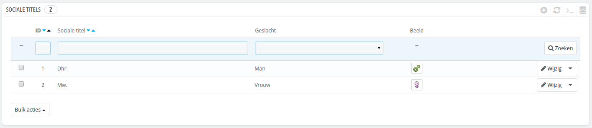
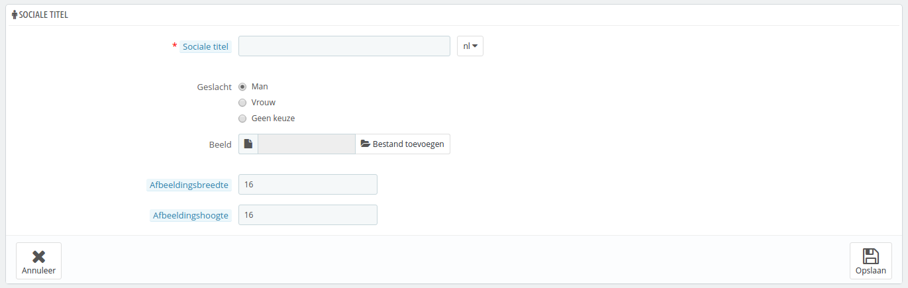

# Aanhefsvormen

De pagina "Sociale titels" helpt u bij het beter definiëren wie uw klanten zien: in de klantenlijst kunt u kiezen om klanten met een specifieke aanhef te tonen. Modules kunnen ook afhankelijk zijn van titels voor bepaalde features.

Door te klikken op de knop "Nieuwe titel toevoegen" wordt er een nieuw formulier geopend:

* **Sociale titel**. U kunt van alles kiezen. ("Sir", "Lady", "Gentleman", etc.) tot de zeer ongebruikelijke ("Jedi", "Magnificent One", "Money Carrier"...) Het belangrijkste is dat de titels goed passen bij de identiteit van uw winkel.
* **Geslacht**. Sommige titels kunnen tot beide geslachten behoren. Kies in dat geval "Geen keuze".
* **Beeld**. Een 16\*16px afbeelding dat bij de titel hoort. Klassieke seksesymbolen zijn Mars en Venus (♂ en ♀), maar er zijn nog veel meer mogelijkheden. PrestaShop maakt het mogelijk om voor elke titel een unieke afbeelding te tonen.
* **Afbeeldingsbreedte** en **Afbeeldingshoogte**. PrestaShop werkt het beste met 16\*16 afbeeldingen en zal uw afbeeldingen verkleinen, wanneer de afbeelding groter is. Ondanks dat, kan het nodig zijn om grotere afbeeldingen te tonen en met deze opties kunt u dat bereiken. Als u "0" invoert, dan gebruikt PrestaShop de oorspronkelijke hoogte of breedte.
