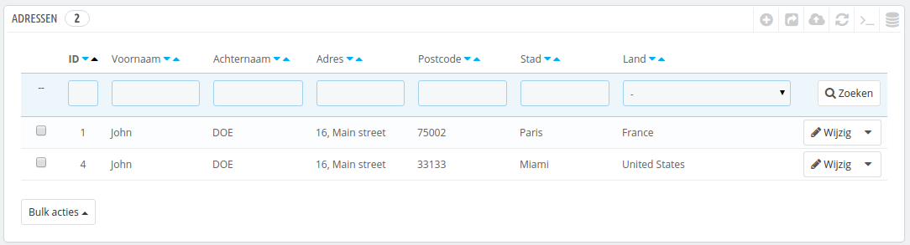
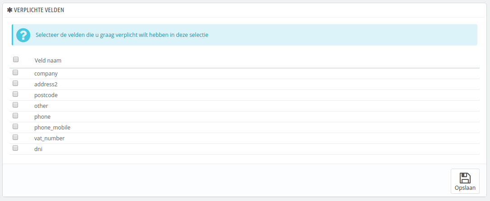
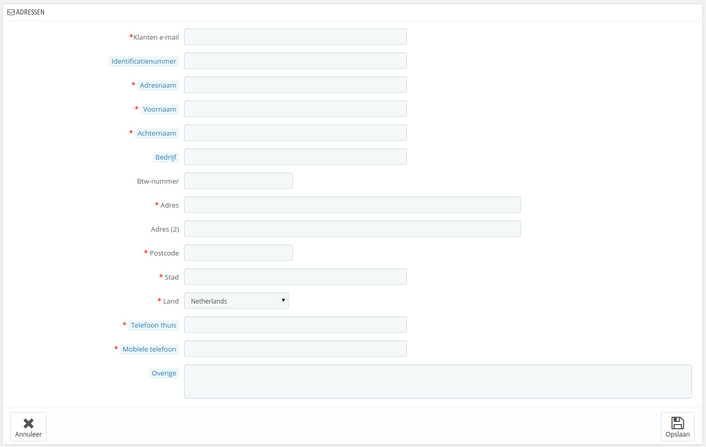

# Klantadressen

Door te klikken op de pagina "Adressen", krijgt u toegang tot de lijst met klantadressen (thuis, werk, etc.). U kunt ze bewerken door te klikken op de knop "Bijwerken", of ze in het geheel verwijderen.

Onder de adressentabel is de knop "Selecteer verplichte velden voor deze selectie". Het opent een formulier waarmee u kunt aangeven of een databaseveld noodzakelijk is of niet door de juiste checkboxen aan te vinken: op deze manier kunt u velden zoals "bedrijf" of "telefoonnummer" verplicht maken wanneer er een nieuw adres wordt geregistreerd in uw winkel.

## Nieuw adres toevoegen 

U hebt zelf de mogelijkheid om een nieuw adres aan te maken voor een klant met de knop "Voeg een nieuw adres toe". Het opent een formulier met de velden zoals u die wellicht verwacht.

Sommige velden hebben, echter, wat extra aandacht nodig:

* **Klanten e-mail**. Dit veld is erg belangrijk: als u een nieuw adres toevoegt voor een klant, dan MOET u deze klant identificeren door middel van zijn/haar e-mailadres. Anders weet PrestaShop bij welke klant het adres hoort.
* **Identificatienummer**. Dit kan het documentnummer zijn van de klant of een uniek BTW-nummer. Dit veld is uiteraard optioneel.\
  Let op: dit veld geeft een hint: "DNI / NIF / NIE". Dat zijn Spaanse acroniemen: DNI betekent "Documento Nacional de Identidad", NIF betekent "Número de Identificación Fiscal" en NIE betekent "Número de Identidad/Identificación de Extranjero".
* **Adresnaam**. Een korte beschrijving van het adres. Dit helpt de klant het juiste adres te selecteren: "Thuis", "Werk", "Tante Beth", etc.
* **Bedrijf**. De naam van het bedrijf van de klant. Optioneel.
* **Btw-nummer**. Het btw-nummer van de klant.
* **Overige**. Extra informatie dat handig kan zijn bij de levering.
