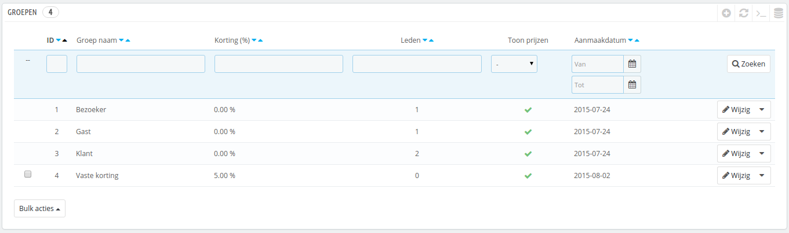
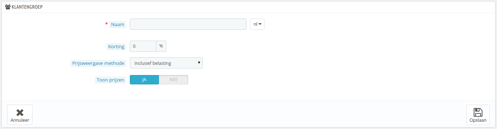
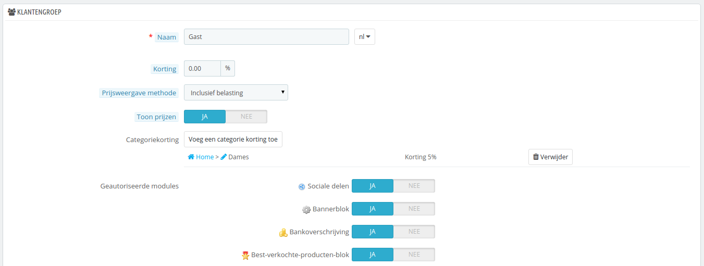
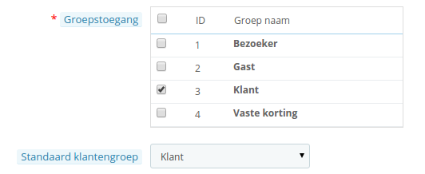

# Klantengroepen

PrestaShop maakt het mogelijk voor u om specifieke klanten extra privileges te geven, door ze in te delen in groepen. U kunt zoveel klantengroepen aanmaken als dat nodig is en een klant toevoegen aan zoveel groepen als u wilt.

Dit wordt allemaal gedaan op de "Groepen" pagina, onder het menu "Klanten".

Standaard zijn er drie groepen zichtbaar:

* **Bezoeker**. Alle personen zonder klantaccount of niet ingelogd.
* **Gast**. Alle personen die een bestelling hebben gedaan als gast – die optie moet ingeschakeld zijn.
* **Klant**. Alle personen die een account hebben aangemaakt in uw winkel en zijn ingelogd.

Deze drie groepen kunnen niet worden verwijderd.

Om meer groepen aan te maken, klikt u op de knop "Voeg een nieuwe groep toe": u krijgt een nieuw formulier.

* **Naam**. Gebruik een korte, maar duidelijke naam.
* **Korting (%)**. De korting die u hier instelt voor leden van deze groep geldt voor alle producten in uw winkel.\
  U kunt ervoor kiezen om geen korting hier in te stellen en in plaats daarvan winkelwagenregels aan te maken. U kunt meer leren over winkelwagenregels via hoofdstuk [Winkelwagenregels](../prijsregels-en-waardebonnen-aanmaken/winkelwagenregels.md).
* **Prijsweergave methode**. PrestaShop wordt regelmatig in de Business-to-Business-sector (B2B) gebruikt. U kunt een klantengroep aanmaken voor klanten die zonder btw kunnen afrekenen. De dropdown-lijst geeft u een keuze tussen "Inclusief belasting" en "Exclusief belasting".
* **Toon prijzen**. Standaard kunnen alle gebruikers de prijzen bekijken. U kunt ervoor kiezen om de prijzen af te schermen voor sommige gebruikers. U kunt er bijvoorbeeld voor zorgen dat klanten alleen prijzen zien wanneer ze een account hebben: vanuit de groepslijst kunt u klikken op het groene vinkje zodat deze wijzigt in een rood vinkje om de prijzen te verbergen.

Zodra deze instellingen zijn toegepast kunt u de groep laten zoals deze is of nog instellingen per categorie of module toevoegen. In het laatste geval moet u de groepsinstellingen nogmaals openen, nadat u deze hebt bewaard: het formulier opent nu met twee extra opties.

* **Categoriekorting**. Klik op de knop "Voeg een categorie korting toe" om een nieuw venster te openen, welke een lijst bevat met alle categorieën. U kunt er één kiezen en een specifieke korting toepassen welke dan alleen voor deze klantengroep en categorie geldt.\
  Let op dat:&#x20;
  * Alleen producten met deze categorie als standaardcategorie krijgen korting. Producten die deze categorie als secundaire categorie hebben worden niet beïnvloed.
  * Deze categoriekorting vervangt alle andere kortingen die leden van deze groep anders zouden krijgen bij deze categorie.
  * U kunt zoveel categoriekortingen toevoegen als u wilt – hiermee kunt u de gehele groep een andere set kortingen geven.
* **Geautoriseerde modules**. Deze sectie maakt het mogelijk om leden van deze groep de toegang te ontzeggen tot bepaalde modules in uw winkel. Het kan bijvoorbeeld voorkomen dat u liever niet hebt dat een bepaalde groep de best verkochte producten in uw winkel ziet.

U kunt een klant toevoegen aan een groep door de klantdetails te bewerken: vanuit de klantenlijst (op de pagina "Klanten" onder het menu "Klanten"), klikt u op de knop "Bijwerken" in de juiste rij. Daarna in de tabel "Groepstoegang" kiest u de groep(en) waartoe u wilt dat de klant behoort. Als u de klant aan meer dan één groep toewijst, zorgt u er dan voor dat de hoofdgroep juist is ingesteld met de optie "Standaard klantengroep".

