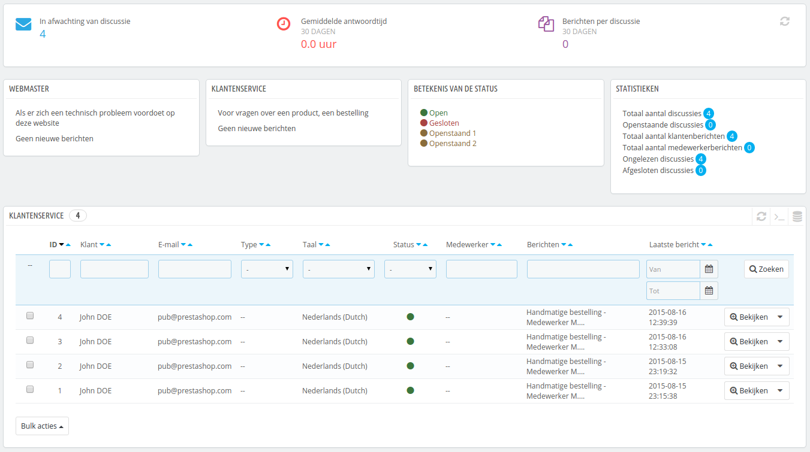
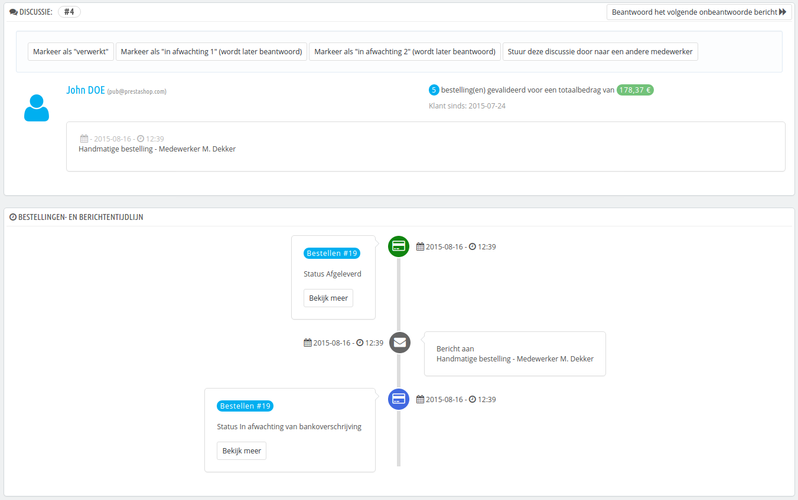
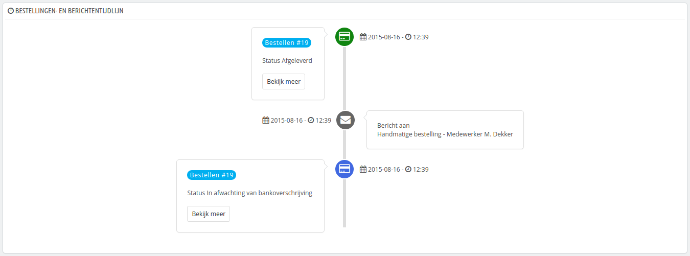
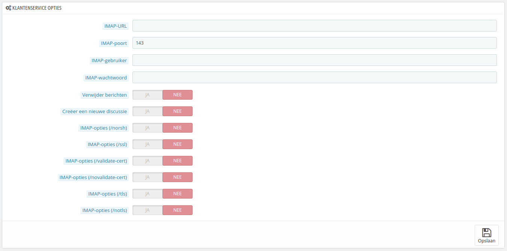

# Klantenservice

PrestaShop maakt het mogelijk om alle verzoeken van uw klanten centraal te beheren. Dit helpt u met het bijhouden van welke berichten een antwoord nodig hebben, in plaats van de ontvangen e-mail te controleren om te zien of iemand het al beantwoord heeft.

In de praktijk toont, het contactformulier in uw winkel, beschikbaar met de link "Contact" aan de bovenkant van uw frontoffice, de klant twee contacten: "Webmaster" en "Klantenservice". De klant hoeft alleen te kiezen wie hij of zei wilt bereiken en daarna de rest van de velden in te vullen. Het bericht wordt daarna opgeslagen in PrestaShop's klantenservice.&#x20;

Discussies worden alleen toegevoegd aan de lijst als de contactpersoon de optie "Berichten opslaan?" heeft ingeschakeld. U kunt deze instelling wijzigen, of meer contacten toevoegen door naar de pagina "Contactpersonene" te gaan, onder het menu "Klanten". Deze pagina wordt in detail uitgelegd in hoofdstuk [Uw contacten](uw-contacten.md).

Als de optie is uitgeschakeld voor de contactpersoon, waarvoor de klant heeft gekozen, dan wordt het bericht simpelweg verzonden naar het e-mailadres van de contactpersoon en niet bewaard in PrestaShop.

U moet er ook voor zorgen dat uw IMAP-instellingen goed zijn, zodat PrestaShop de antwoorden kan ontvangen die verzonden zijn aan het e-mailadres van de contactpersoon. Dit worden gedaan vanuit de sectie "Klantenservice opties" aan de onderkant van de pagina.

Op deze pagina heeft elk contact zijn eigen box, waar u snel kunt zien of er nieuwe berichten zijn (nog niet gelezen). Standaard zijn er twee contacten en door het toevoegen van meer contacten worden de boxen "Betekenis van de status" en "Statistieken" verplaatst.

Deze twee boxen zijn erg handig wanneer u dagelijks berichten verwerkt:

* **Betekenis van de status**. Een simpele herinnering van de kleurcodes die uw team kan toepassen op een discussie.
* **Statistieken**. Een overzicht van de activiteiten van uw klantenservice sinds het begin.

Verder in de lijst zijn de ontvangen berichten te vinden, zowel oud als nieuw.

U kunt een paar opties aan de onderkant van de pagina bewerken, welke van toepassing zijn op alle contacten:

* **Sta bestand upload toe**. Of een klant een bestand mag uploaden. Dit kan handig zijn wanneer er zichtbare problemen zijn op de website en de klant u screenshots wilt toesturen.
* **Standaardbericht**. Het standaardsjabloon voor de antwoorden van uw medewerkers. Hou het simpel, zodat u het kunt aanpassen aan veel situaties, zelfs als het nog een klein beetje bewerkt moet worden voor elk geval.

Als laatste zijn de klantenserviceopties aan de onderkant van de pagina te vinden, waar u uw IMAP-gegevens kunt invoeren.

## Klantenserviceberichten afhandelen 

Elke conversatie met een klant kan in het geheel worden verwerkt door PrestaShop gehele interface, zonder dat er een e-mailprogramma bij komt kijken zoals Outlook of Thunderbird.

In de conversatielijst, klikt u op een rij om de details van de conversatie te bekijken:

* U kunt een handje acties toepassen op een discussie, om ze gemakkelijk te sorteren en ze sneller af te handelen. Er zijn 4 beschikbare acties:
  * **Markeer als "verwerkt"** of **"Heropenen"**. Verandert de status naar "Gesloten" of "Open".
  * **Markeer als "in afwachting 1" (wordt later beantwoord)** en **Markeer als "in afwachting 2" (wordt later beantwoord)**. Deze twee statussen zijn intern: de betekenis mag uw team bepalen. U kunt er ook voor kiezen om ze niet te gebruiken en gebruik te maken van de statussen "Gesloten" en "Open".
  * **Stuur deze discussie door naar een andere medewerker**. Vanaf het moment dat een medewerkt is begonnen met het reageren op een klantenbericht, dan wordt hij verantwoordelijk voor het verzoek. Als gedurende de discussie blijkt dat een andere medewerkt het zou moeten afhandelen, dan kunt u deze knop gebruiken om door middel van een dropdown-lijst een andere medewerker toe te wijzen. De andere medewerker ontvangt een notificatie. Als de persoon waartoe u de discussie wilt doorsturen niet beschikbaar is in de list, kiest u  "Iemand anders" uit de dropdown en er verschijnen twee opties, waarmee u het alternatieve e-mailadres kunt opgeven en een opmerking kunt plaatsen over het bericht
* **Beantwoord het volgende onbeantwoorde bericht**.

Essentiële informatie is beschikbaar:

* Klantnaam en e-mail, welke u kunt gebruiken om toegang te krijgen tot klantinformatie.
* Aantal order, totaalbedrag gespendeerd en registratiedatum van de klant.
* Tijd en datum van het bericht.
* En het bericht zelf.

Om te reageren op deze discussie, gebruikt u het formulier met uw standaardbericht (zoals ingesteld in de sectie "Contactopties" van de pagina "Klantenservice") en klikt u op "Verstuur".

Aan de onderkant van de pagina geeft de "Bestellingen- en berichtentijdlijn" een duidelijk chronologisch overzicht van de gebeurtenissen die te maken hebben met deze conversatie.

## Klantenservice opties 

Deze sectie maakt het mogelijk om PrestaShop zodanig in te stellen dat het toegang krijgt tot uw e-mailserver via IMAP. U moet ervoor zorgen dat alle velden zijn ingevuld, zodat de klantenservice tool goed werkt. De meeste informatie moet door uw webhost zijn verschaft.

* **IMAP-URL**, **IMAP-poort**, **IMAP-gebruiker** en **IMAP-wachtwoord**. Essentiële details om toegang te krijgen tot de e-mailserver via het IMAP-protocol.
* **Verwijder berichten**. Wanner dit is ingeschakeld worden berichten vanaf de server verwijderd zodra PrestaShop ze heeft verkregen. Voorzichtigheid is geboden: dit maakt uw berichten niet langer beschikbaar voor andere e-mailclients.
* **/norsh**. Als dit is ingeschakeld wordt er geen gebruik gemaakt van pre-authenticatie voor de verbinding met uw e-mailserver. Niet aangeraden.
* **/ssl**. Als dit is ingeschakeld, wordt de verbinding met uw e-mailserver niet van encryptie voorzien. Niet aangeraden.
* **/validate-cert**. Als dit is ingeschakeld, dan wordt PrestaShop geforceerd om het SSL/TLS certificaat te valideren.
* **/novalidate-cert**. Als dit is ingeschakeld, dan zal PrestaShop nooit proberen de echtheid van het SSL/TLS certificaat te achterhalen. Handig wanneer de server gebruikmaakt van zelf-gesigneerde certificaten.
* **/tls**. Als dit is ingeschakeld, dan forceert PrestaShop het gebruik van StartTLS om de verbinding van encryptie te voorzien. Servers die geen StartTLS ondersteunen worden geweiger.
* **/notls**. Als dit is ingeschakeld, dan zal PrestaShop geen StartTLS gebruiken om de sessie van encryptie te voorzien, zelf bij servers die het protocol ondersteunen.
