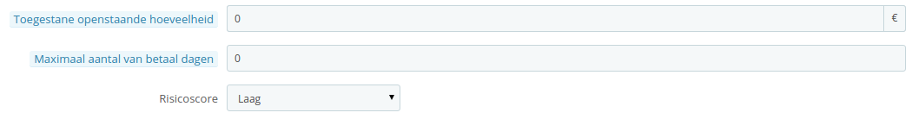
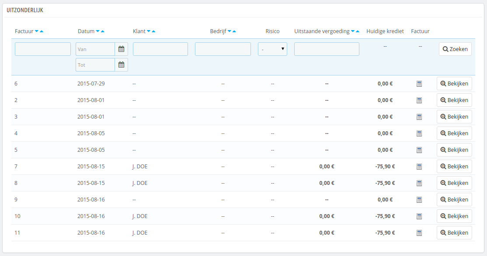

# Openstaand bedrag

Deze pagina is alleen beschikbaar wanneer u in PrestaShop de B2B-mogelijkheid hebt ingeschakeld. Om dat te doen gaat u naar de pagina "Klanten" onder het menu "Instellingen" en kies u Ja bij de optie "Schakel B2B-modus in".

Deze pagina toont het rapport van openstaande bedragen van sommige klanten, dat betekent de bedragen die u toelaat, voordat ze u moeten betalen.

Wanneer B2B-modus is ingeschakeld ("Instellingen > Klanten"), dan worden drie velden toegevoegd, met betrekking tot betaling, aan het formulier waarmee u een klant aanmaakt:

* **Toegestane openstaande hoeveelheid**. Het maximumbedrag dat open mag blijven staan voor deze klant.
* **Maximaal aantal van betaal dagen**. Het maximale aantal dagen dat de klant heeft, voordat hij of zij moet betalen.
* **Risicoscore**. Het is mogelijk om een risicoscore te koppelen aan de klant: Geen, Laag, Middel of Hoog. Het is aan u om te bepalen of een klant een risico vormt of dat deze klant tijdig betaalt.

U moet deze velden invullen voor zakelijke klanten.

## Huidige uitstaande bedragen 

Zodra een klant, met de mogelijkheid om later te betalen, een aankopen doet in uw winkel, dan verschijnt deze op de pagina "Klanten > Uitstaand". Dit zorgt ervoor dat u een overzicht kunt vinden van alle uitstaande facturen.

