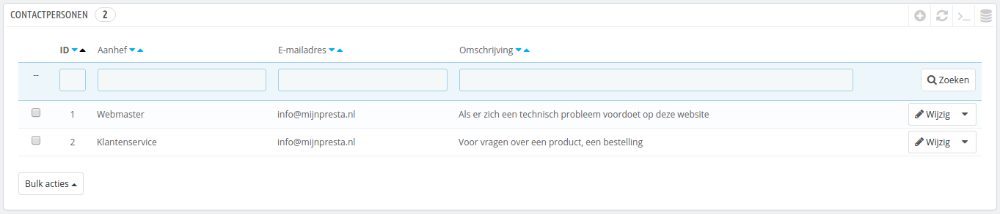
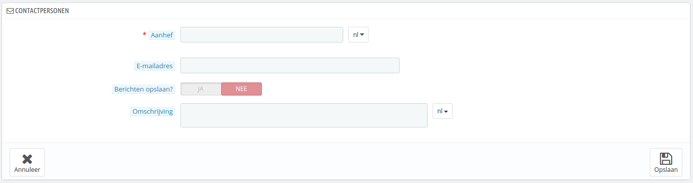
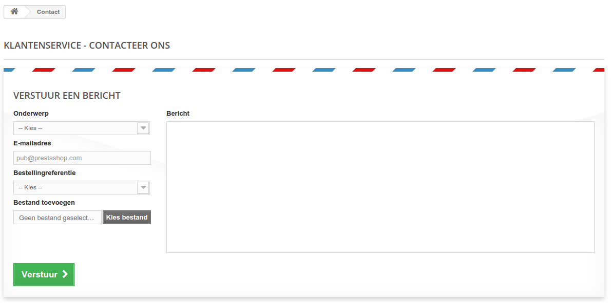

# Uw contacten

Om te kunnen communiceren met uw klanten, kunt u meerdere contactaccounts aanmaken. Bijvoorbeeld: klantenservice, technische ondersteuning, salesafdeling, etc. Deze feature maakt het mogeljk voor uw klanten om direct de juiste persoon te vinden aan de hand van wat ze nodig hebben.

## Een nieuw contactpersoon aanmaken 

Om het bericht naar de juiste ontvanger door te sturen, moet u contacten configureren in uw winkel.

Door te klikken op de pagina "Contacten" onder het menu "Klanten" krijgt u toegang tot de huidige contactlijst.

Klik op de knop "Voeg een nieuwe contactpersoon toe" om het formulier te vinden waarmee u contactpersonen kunt toevoegen.

* **Aanhef**. De naam van de contactpersoon: het kan de naam van zijn een persoon of de naam van de service/afdeling zelf. U kunt ook kiezen voor een zin zoals "Ik heb problemen met mijn bestelling", "Ik wil een product retourneren" of "Ik wil een partner worden".
* **E-mailadres**. Het adres kan hetzelfde zijn als die van een ander contactpersoon. In feite delen alle contacten hetzelfde e-mailadres als u niet echt een team hebt – klanten zullen het niet te zien krijgen, maar het toevoegen van veel contacten kan helpen bij het vertrouwen opwekken voor uw winkel, want het betekent dat er veel mensen voor uw winkel werken.
* **Berichten opslaan?**. Geeft aan of de e-mail bewaard moet worden voor de klantenservice of alleen naar een e-mailadres verzonden moet worden. Als dit is uitgeschakeld, dan helpt PrestaShop u niet bij het beheren van klantenservice-berichten via deze contactpersoon. Het kan handig zijn voor e-mails van partners, want wellicht hebt u liever niet dat uw medewerkers deze zien.
* **Omschrijving**. Hou deze kort, niet langer dan één regel, omdat deze wordt weergegeven op het contactformulier.

## Hoe de klanten contact op kunnen nemen 

Om het juiste team te bereiken vanuit de frontoffice van uw winkel, klikken de klanten op de link "Contacteer ons" aan de bovenkant van de pagina of de link "Contacteer ons" aan de onderkant van de pagina. Het contactformulier verschijnt.

De klant wordt hierna gevraagd om de service te kiezen waarmee contact opgenomen moet worden en voert het e-mailadres is waarna het bericht voltooid wordt. Een dropdown-menu maakt het mogelijk om te kiezen voor welke bestelling het bericht geldt, en zelfs welk product uit de bestelling.
