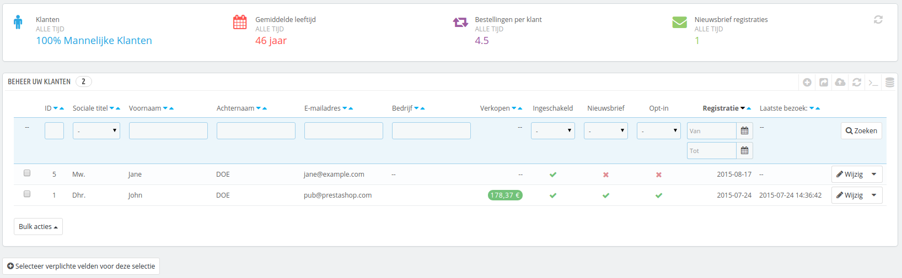
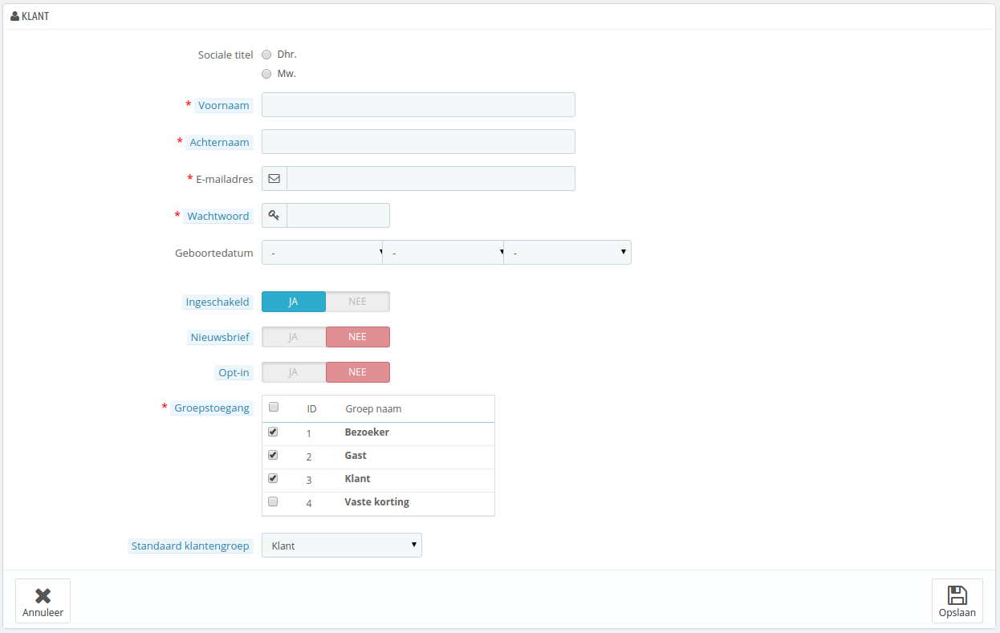
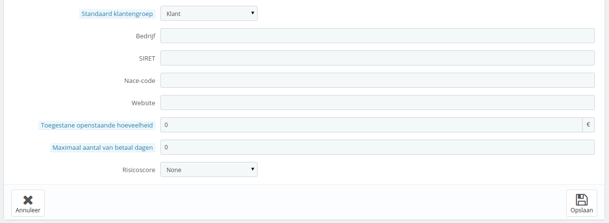
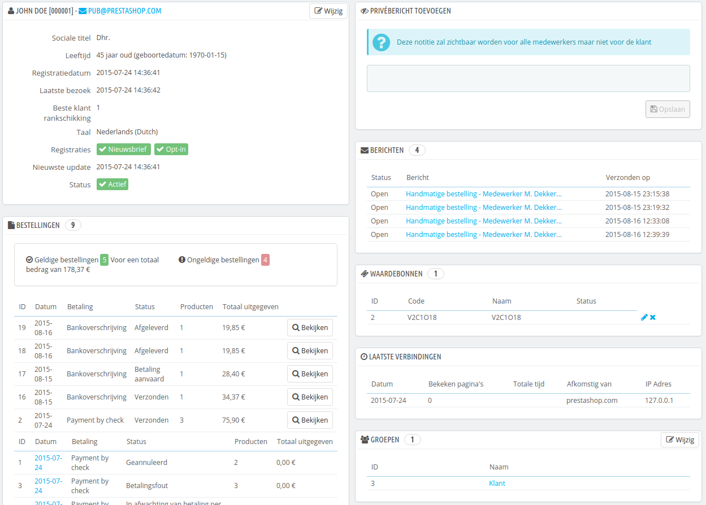
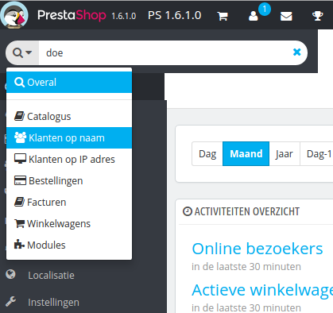
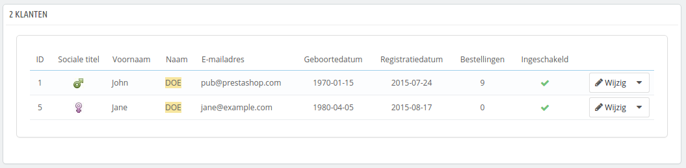
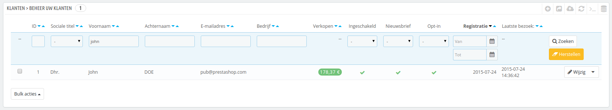

# Uw klanten

De eerste pagina onder het menu "Klanten" geeft u een lijst van alle geregistreerde gebruikers van uw winkel.



Dit geeft u een overzicht van uw klanten, met enkele details waarop u accounts kunt doorzoeken en sorteren:

* **Sociale titel**. Klanten kunnen hun aanhef opgeven, welke gelinkt zijn aan het geslacht en die u kunt gebruiken voor een betere gebruikerservaring.\
  Er zijn twee standaardaanheffen (mw., dhr.), maar u kunt er meer aanmaken (voor bijvoorbeeld Engels, met Miss als extra), op de pagina "Sociale titels", ook onder het menu "Klanten".
* **Leeftijd**. Door op de hoogte te zijn van de leeftijd van uw klanten kunt u beter uw klanten bereiken en de producten kiezen waar zij mogelijk meer in geïnteresseerd zijn.
* **Ingeschakeld**. Geeft aan of het account al dan niet is ingeschakeld. U kunt het account gemakkelijk uitschakelen door te klikken op het groene vinkje
* **Nieuwsbrief**. Geeft aan of de klant is geabonneerd op uw nieuwsbrief of niet. U kunt de klant afmelden voor de nieuwsbrief door op het groene vinkje te klikken.
* **Opt-in**. Geeft aan of de klant toestemming heeft gegeven om e-mails van uw partners te ontvangen. U kunt de klant hiervoor afmelden door op het groene vinkje te klikken. **Meld een klant nooit aan, zonder zijn of haar toestemming, want dit wordt gezien als spam**.
* Registratiedatum en laatste bezoek zijn altijd handig wanneer u accounts wilt sorteren.
* **Acties**. U kunt het account bewerken of voor altijd verwijderen.

Wanneer PrestaShop voor de eerste keer wordt geïnstalleerd, met voorbeelddata, dan heeft PrestaShop een standaardgebruiker, genaamd John DOE.

U kunt deze testgebruiker gebruiken om een aantal van de features van uw winkel te testen en algemeen door de winkel bladen, zoals een echte gebruiker dat zou doen.

Om in te loggen op uw winkel door middel van dit publieke account, gebruikt u deze informatie:

* E-mailadres: [pub@prestashop.com](mailto:pub@prestashop.com)
* Wachtwoord: 123456789

**Voordat u uw winkel opent voor het publiek, zorg er dan voor dat u deze standaardgebruiker hebt verwijderd, of in geval de inloggegevens hebt gewijzigd!** Zo niet, dan kunnen malafide bezoekers het gebruiken om valse aankopen te doen, etc.

Onder de klantentabel is de knop "Selecteer verplichte velden voor deze selectie". Het opent een formulier waarin u aangeeft of een databaseveld al dan niet verplicht is door te checkbox aan te vinken: op deze manier kunt u ervoor zorgen dat velden zoals "nieuwsbrief" of "opt-in" verplicht zijn om aan te vinken zodra een klant een account aanmaakt in uw winkel.

U kunt een lijst van klanten exporteren door te klikken op de exporteerknop aan de bovenkant van de tabel.\
U kunt ook klanten importeren door de importeerknop te gebruiken. U hebt een CSV-bestand nodig in het volgende formaat:

```
"ID";"Sociale titel";"Voornaam";"Achternaam";"E-mailadres";"Verkopen";"Ingeschakeld";"Nieuwsbrief";"Opt-in";"Registratie";"Laatste bezoek:";
"1";"Dhr.";"John";"DOE";"pub@prestashop.com";"178.3700000000";"1";"1";"1";"2015-07-24 14:36:41";"2015-07-24 14:36:42";
```

Meer importeeropties zijn beschikbaar op de pagina "CSV-import" onder het menu "Geavanceerde instellingen".

## Een nieuw klantaccount aanmaken <a href="#uwklanten-eennieuwklantaccountaanmaken" id="uwklanten-eennieuwklantaccountaanmaken"></a>

Om handmatig een nieuw klantaccount aan te maken, klikt u op de knop "Voeg een nieuwe klant toe". Een nieuw formulier verschijnt.



Vul de klantinformatie in:

* **Sociale titel**. Kies tussen de opties die beschikbaar zijn, of maak een nieuwe aan onder "Sociale titels" onder het menu "Klanten".
* **Voornaam, Achternaam, E-mailadres**. Deze zijn essentieel: de namen worden gebruikt in de bevestigingsmail die verzonden wordt door PrestaShop en het e-mailadres wordt gebruikt om mee in te loggen.
* **Wachtwoord**. Kies een wachtwoord, minstens 5 karakters.
* **Geboortedatum**. Deze informatie kan gebruikt worden voor verjaardagse-mails en voor tijdelijke kortingen.
* **Ingeschakeld**. U kunt ervoor kiezen om een account aan te maken, maar deze nog niet in te schakelen.
* **Nieuwsbrief**. Kan worden gebruikt door een nieuwsbriefmodule, om regelmatig informatie te sturen naar klanten die dat graag willen.
* **Opt-in**. Kan gebruikt worden door modules om regelmatig promotieacties van partners te sturen naar klanten die dat graag willen. **Meld een klant nooit aan, zonder zijn of haar toestemming, want dit wordt gezien als spam**.
* **Groepstoegang**. Door klantengroepen te hebben, kunt u groepskortingen aanmaken. Veel andere PrestaShop-functies kunnen zich ook beperkten tot specifieke klantgroepen. U kunt meer te weten komen over klantgroepen in hoofdstuk [Klantengroepen](klantengroepen.md).
* **Standaard klantengroep**. Het maakt niet uit tot hoeveel groepen uw klanten behoren. Hij of zij heeft altijd één standaardgroep.

Als uw klanten hoofdzakelijk uit bedrijven bestaan, dan kunt u B2B-modus inschakelen om nog meer opties te krijgen: ga naar de pagina "Klanten" onder het menu "Instellingen" en kies "Ja" bij de optie "Schakel B2B-modus in".



De B2B-modus voegt een paar bedrijfsspecifieke velden toe:

* **Bedrijf**. De naam van het bedrijf.
* **SIRET**. Het SIRET-nummer (alleen voor Frankrijk) - vergelijkbaar met het KvK-nummer in Nederland.
* **APE**. Activiteitencode (_Activité principale exercée_ - alleen Frankrijk) - vergelijkbaar met SBI-code in Nederland.
* **Website**. De website.
* **Toegestane openstaande hoeveelheid**. Het uitstaande bedrag dat is toegestaan voor het bedrijf.
* **Maximaal aantal van betaal dagen**. Het aantal dagen dat het bedrag open mag blijven staan.
* **Risicoscore**. Uw risicoscore voor dit bedrijf: geen, laag, middel, hoog.

## Klantinformatie bekijken <a href="#uwklanten-klantinformatiebekijken" id="uwklanten-klantinformatiebekijken"></a>

In het geval dat u graag meer informatie over een klant wilt, dan kunt u op de "Bekijken"-knop klikken, aan de rechterkant (of onderkant - mobiel) van elke rij in de lijst met klanten. Een nieuwe pagina verschijnt.



De verschillende secties geven u belangrijke informatie over de gebruiker:

* Klantinformatie, voor- en achternaam, e-mailadres, ID, aanmelddatum, datum van laatste bezoek, rang.
* Informatie over abonnement op uw nieuwsbrief en partnerinformatie, de leeftijd, laatst bijgewerkt en of het account wel actief is.
* Privénotities van de winkelmedewerkers (bijv. u of uw team).
* Berichten van de klant aan de winkel (via de klantenservice).
* De groepen waartoe de klant behoort.
* Samenvatting van de vorige aankopen van de klant. Bedrag besteed, betaalmethode, orderstatus. Voor meer informatie over elke besteling klikt u op het icoon in de actiekolom.
* Samenvatting van de producten die zijn besteld door de klant. Samen met andere dingen zorgt dit ervoor dat u weet of een klant erg dol is op een specifiek product en dat u wellicht een speciale korting kunt geven voor een 10e aankoop. Door te klikken op een product wordt u doorverwezen naar de gekoppelde bestelling.
* Geregistreerd adres.
* Beschikbare waardebonnen / prijsregels.
* Winkelwagens die de klant heeft aangemaakt (maar niet noodzakelijkerwijs heeft afgerekend) sinds aanmelden. Wanneer uw klant zich op dit moment in uw winkel begeeft, dan kunt u real-time zien wat er wordt toegevoegd aan de winkelwagen.
* Vorige sessies in de winkel.

## Zoeken naar een klant <a href="#uwklanten-zoekennaareenklant" id="uwklanten-zoekennaareenklant"></a>

Het zoeken naar een klant in uw PrestaShop-winkel kan op twee verschillende manier worden gedaan.

**De eerste methode** bestaat uit het invoeren van de beschikbare informatie die u hebt in de zoekbalk van PrestaShop. Deze kan gevonden worden in de linkerbovenhoek van uw backoffice. Door "Overal", "Klanten op naam", "Klanten op IP-adres" te selecteren kunt u een zoekopdracht uitvoeren op basis van:

* ID. Het unieke getal dat wordt toegewezen aan de klant in de database.
* Voor- of achternam. Let op dat u niet naar beide kan zoeken: kies of "john" of "doe", maar niet "john doe", want dat werkt niet.
* E-mailadres.
* IP-adres. U kunt zoeken door middel van het IP-adres dat is gebruikt bij de meeste recente sessie van de klant.



De restultaten, wanneer gevonden, worden hierna getoond: de lijst toont u het ID, de aanhef, e-mail, geboortedatum, registratiedatum, bedrag van bestellingen van de klant en of het account actief is. Vanaf hier kunt u de gehele gebruikerspagina bezoeken of de details van de klant bewerken.



**De tweede methode** bestaat uit het bezoeken van de pagina "Klanten" en alle klanten te tonen.



Op deze pagina kunt u de velden aan de bovenkant van de tabel gebruiken, om deze te filteren op de volgende criteria: ID, aanhef, voornaam, achternaam, e-mailadres, leeftijd, accountstatus (ingeschakeld of uitgeschakeld), geabonneerd op nieuwsbrief, geabonneerd op partnerinformatie, registratiedatum en datum van laatste sessie. Voer de criteria in en klik op de knop "Zoeken" aan de rechterbovenkant van de tabel. U kunt hierna de lijst sorteren.

Klik op de knop "Herstellen" om de gehele lijst te herstellen.
