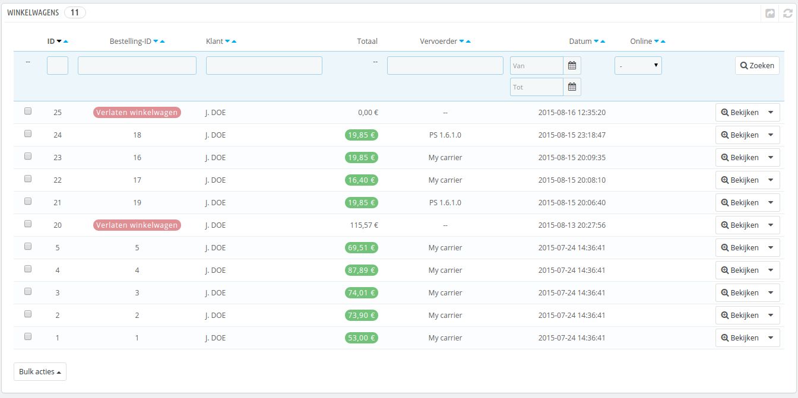
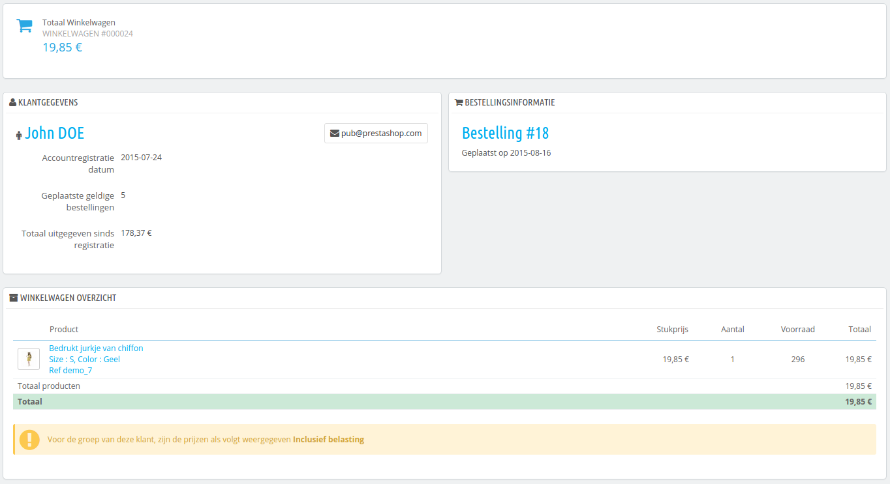

# Winkelwagens

PrestaShop bevat erg veel krachtige marketing features waarmee u in real-time kunt zien welke producten klanten toevoegen aan hun winkelwagens. Er zijn twee manieren om de winkelwagens te bekijken:

1. Ga naar de pagina "Klanten" onder het menu "Klanten", zoek de klant op en bekijk zijn of haar klantprofiel. In dat profiel scrollt u naar de sectie "Winkelwagens" waar u kunt zien welke winkelwagens de klant heeft aangemaakt.
2. Ga naar de pagina "Winkelwagens" onder het menu "Klanten". De winkelwagens zijn gesorteerd op ID. Zoek de klant op.

In beide gevallen kunt u klikken op de knop "Bekijken" om de inhoud van de winkelwagen van uw klant te bekijken en deze informatie te gebruiken om uw commerciële prestaties te verbeteren.

Op de winkelwagenpagina is de belangrijkste informatie te vinden in de sectie met de naam "Winkelwagen overzicht", waar u kunt kiezen welke producten de klant heeft toegevoegd, de prijs van elke item, de hoeveelheid die ze in hun winkelwagen hebben gestopt en het totaalbedrag van de winkelwagen.

Verlaten winkelwagens beheren

Het verlaten van een winkelwagen betekent vaak dat er een verkoop verloren is gegaan. De pagina "Winkelwagens" geeft aan dat winkelwagens niet zijn omgezet in verkopen en dat het aan u is om de klant daaraan te herinneren, zodat ze terug kunnen komen om een aankoop te doen.

Verlaten winkelwagens hebben de actieknop "Verwijderen", terwijl winkelwagens zonder deze actieknop succesvolle winkelwagens zijn geweest. De aankoop is zojuist gedaan en het is aan u om de producten te verzenden.

Standaard is het aan u om contact op te nemen met de klant over zijn of haar verlaten winkelwagen. U kunt de module "Klant volgen" installeren, welke beschikbaar is in de standaardinstallatie en maakt het mogelijk voor u om automatisch waardebonnen te sturen naar klanten die hun winkelwagen hebben verlaten, of aan degene die u wilt bedanken voor hun bestellen, de beste klanten voor hun loyaliteit... Let op dat dit kan zorgen voor misbruik: sommige klanten zullen winkelwagens achterlaten om een waardebon te kunnen ontvangen...

U kunt ook PrestaShop's module 'Herinnering vergeten winkelmand' installeren voor uitgebreidere opties: [http://addons.prestashop.com/nl/checkout/16535-abandoned-cart-pro.html](http://addons.prestashop.com/nl/checkout/16535-abandoned-cart-pro.html).
