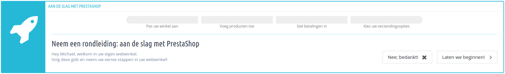
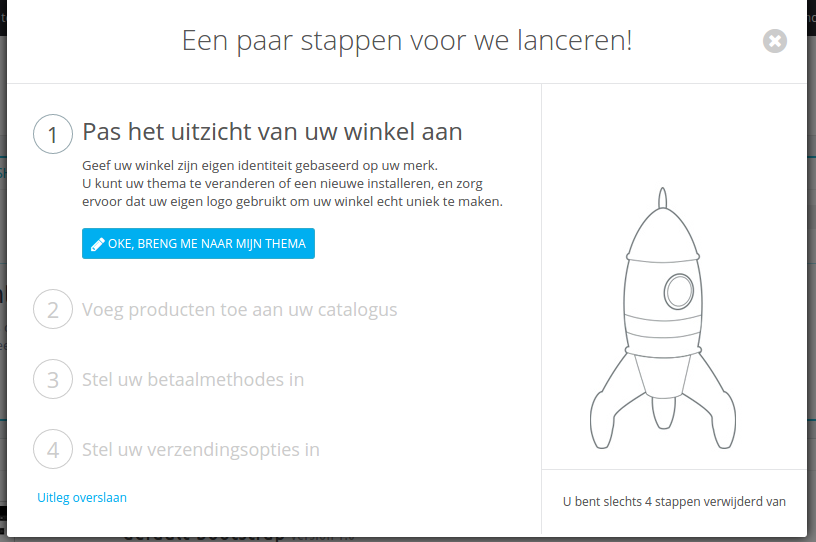
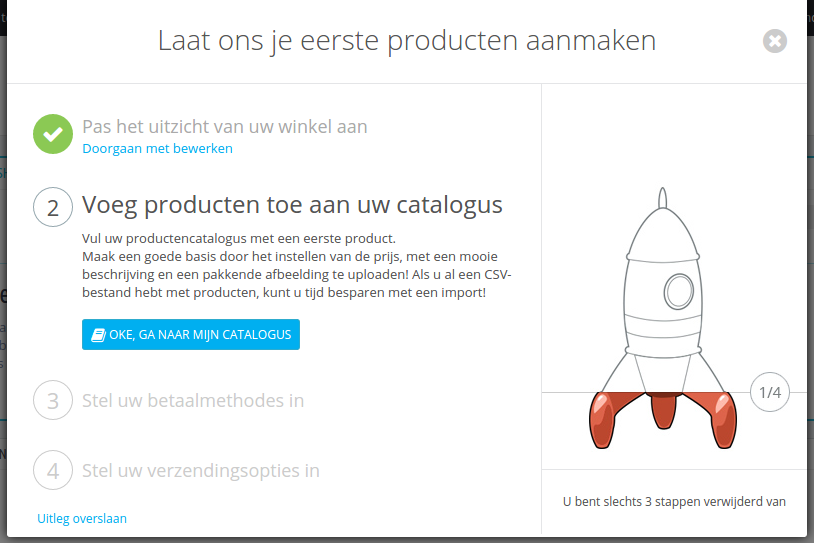
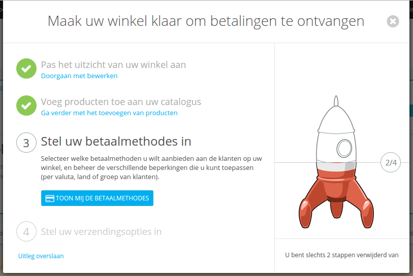
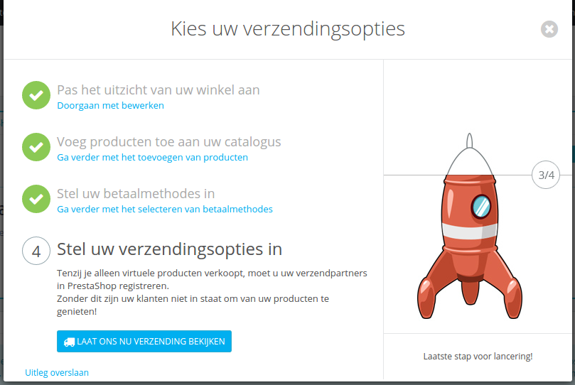
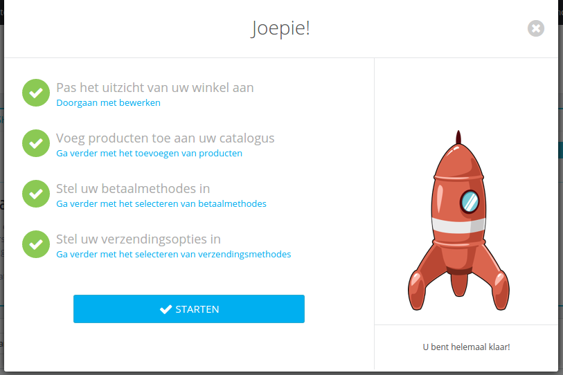
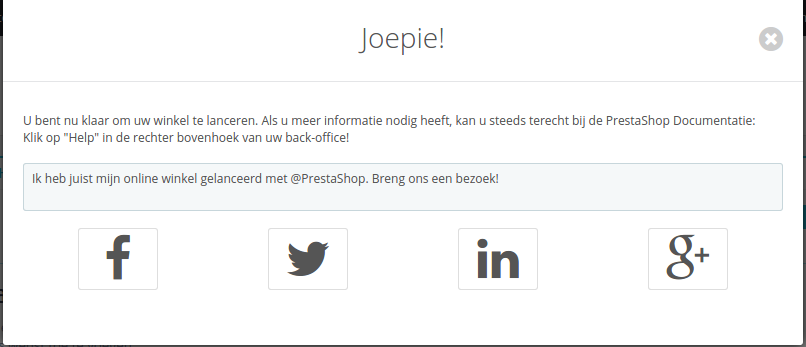

# Kom aan boord van PrestaShop

Sinds versie 1.6.0.11 van PrestaShop wordt na elke nieuwe installatie de module OnBoarding geactiveerd. Deze module is vanaf de grond opgebouwd om nieuwe gebruikers helpen hun weg te vinden door de backoffice. Het toont de mogelijkheden die er zijn tot aanpassen van de winkel, waaronder producten toevoegen aan de catalogus, betaalmethoden instellen en de standaard verzendopties kiezen. Dit wordt allemaal getoond in een speelse interface.

Als u al de weg kent in het PrestaShop administratiepaneel, dan wilt u wellicht de module deactiveren:

1. Ga naar de modulepagina.
2. Zoek naar "OnBoarding" module.
3. Schakel deze uit.

## Hoe de module werkt 

De interface van de module valt niet te missen: het is het eerste bericht dat u boven elke pagina in de backoffice ziet, nog boven de inhoud van de pagina zelf.

Op het eerste gezicht is meteen duidelijk hoe de module werkt: in een handvol gemakkelijke stappen loodst het de gebruiker door alle verschillende opties.

Door de klikken op de knop "Laten we beginnen!" wordt het gehel proces gestart – deze kan op elk moment worden onderbroken en later worden hervat. Het verloop wordt getoond in een venster bovenaan de interface van de backoffice, deze geeft u de volgende instructies, en de hoofdinterface zelf waar u de instructies uitvoert.

## Stap 1: Uw winkel aanpassen 

Deze eerste stap helpt u bij het aanpassen van uw winkel om het uw eigen te maken. Dit wordt gedaan door een nieuw thema te installeren en het uploaden van uw eigen logo.

Op de achtergrond heeft de module de huidige pagina al veranderd in de themaconfiguratiepagina. Klik op "Oké, breng me naar mijn thema" om het venster te verbergen en aan uw thema te werken: u kunt het standaardthema inruilen voor een thema dat al beschikbaar is, of u kunt een nieuw thema downloaden vanaf PrestaShop's marktplaats, Addons: [https://addons.prestashop.com/nl](https://addons.prestashop.com/nl).

Zodra u uw nieuwe thema hebt geïnstalleerd en geactiveerd, gaat u naar de themaconfiguratiepagina om te controleren of alle beschikbare instellingen juist zijn.

Als u klaar bent met het aanpassen van uw thema, klik op de knop "Ik ben klaar, breng me naar de volgende stap".

## Stap 2: Producten toevoegen aan uw catalogus 

De tweede stap brengt u naar het hart van uw winkel: de producten die u verkoopt.

Klik op de knop "Oké, ga naar mijn catalogus" om het venster van de module te laten verdwijnen. De backoffice-pagina bestaat uit een formulier waar u een nieuwe product kun aanmaken. Volg de beschikbare velden en tabs aan de linkerkant en aarzel niet op de helpfunctie te gebruiken om meer te leren over de verschillende mogelijkheden die PrestaShop biedt.

Maak enkele producten aan, probeer ook testproducten toe te voegen, om de werking van de interface beter te leren kennen. Zodra de interface vertrouwd voelt, kunt u uw echte producten toevoegen.

Wanneer u klaar bent met het invoeren van producten, klik u op de knop "Ik ben klaar, breng me naar de volgende stap".

## Stap 3: Uw betaalmethoden instellen 

De derde stap is essentieel: als u geen betaalmethoden instelt, ontvang u ook GEEN betalingen voor de producten die u hebt verkocht!

Klik op de knop "Toon mij de betaalmethodes" om dit venster te laten verdwijnen. De backoffice-pagina bestaat nu uit de betaalmethodenpagina. Het toont u enkele betaalmethodes.

Degene die standaard beschikbaar zijn vereisen geen account, maar betekenen wel dat de verzending vertraagd wordt voordat u de betaling hebt geverifieerd: Bankoverschrijving en Cheque vereisen dat u handmatig de betaling controleert.

PrestaShop raad enkele betaalmethoden aan op dit scherm, welke in feite modules zijn die u kunt installeren. De modules die getoond worden zijn veilige, welbekende en door PrestaShop ondersteunde modules. Ze zijn ook afhankelijk van waar uw winkel is geïnstalleerd: een Amerikaanse winkelier krijgt niet dezelfde opties als een Poolse winkelier. Kies de module waarvan u al een account hebt, of graag mee werkt, en configureer de module met uw accountinformatie. U kunt zoveel betaalmethoden toevoegen als u zelf nodig acht.

Lager in dit scherm, kunt u betaalrestricties instellen die gebaseerd zijn op valuta, klantengroep en land. Kies verstandig, want deze restricties voorkomen dat klanten en bepaalde betaalmethode kunnen gebruiken. Het kan zelfs voorkomen dat sommige groepen helemaal niet meer in uw winkel kunnen afrekenen.

Wanneer u klaar bent met het instellen van uw betaalmethodes, klitk u op de knop "Ik ben klaar, breng me naar de volgende stap".

## Stap 4: Uw verzendmethoden instellen 

De vierde stap is ook een essentiële stap: als u uw verzendingsopties niet instelt, heeft u geen mogelijkheid om klanten te laten betalen voor de verzending. Als u slechts digitale producten verkoopt (PDF, etc.), dan is het begrijpelijk om geen verzendpartner te keizen, maar als u fysieke producten verkoopt, dan moet u aangeven van welke vervoerder u gebruikt wilt maken.

Klik op de knop "Laat ons nu verzending bekijken" om dit venster te laten verdwijnen. De backoffice-pagina is nu de Vervoerders-pagina. Het toont u twee opties: een vervoerder toevoegen of een verzendmodule gebruiken.

Als u alleen digitale producten verkoopt, klikt u op "Uitleg overslaan".

Het toevoegen van een nieuwe vervoerd wordt gedaan in een handige wizard, welke u helpt met alles instellen: naam, transittijd, verzendlocaties en kosten, gewicht/grootte-limieten, etc.

U kunt kiezen voor een snellere methode en een verzendmodule installeren. Enkele zijn standaard weergegeven op de hoofdpagina, maar u vind er meer op de "Modules"-pagina. Installeerd degene waarmee u een contract hebt, en configureeer de module met informatie uit uw contract.

Wanneer u klaar bent met het instellen van uw verzendingsopties, klikt u op "Ik ben klaar, breng me naar de volgende stap".

## Klaar! 

U bent (voor het grootste deel) klaar!

U hebt alle essentiële stapen doorlopen om uw winkel te configurern. Er zijn nog veel meer andere stappen, maar dit zijn de stappen die nodig zijn om op het internet te kunnen verkopen.

Door te klikken op de knop "Starten" worden de instructies van de module beëindigd en krijgt u een korte animatie te zien.

Voordat u uw winkel uit onderhoudsmodus haalt en het beschikbaar maakt voor iedereen, wilt u wellicht even rustig aan doen en alle andere configuratiepagina's in de back office bekijken en vast te stellen of alles is ingesteld zoals u dat wilt. Als dat niet het geval is klikt op u op "Starten" en het kruisje om het venster van deze module te sluiten.

Zodra alles is ingesteld, gaat u naar de onderhoudspagina en schakelt u uw winkel in. Klaar! Veel succes met uw online onderneming! Begin met het promoten van uw winkel: deel de opening van uw winkel mee op sociale media in het laatste venster van de module.

Zodra u helemaal klaar bent, verschijnt de module niet meer in uw backoffice.
