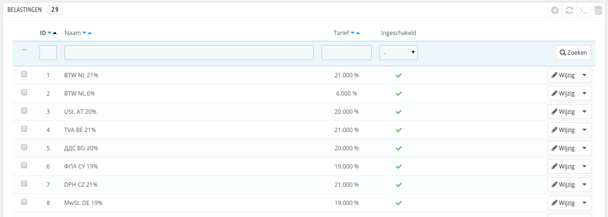
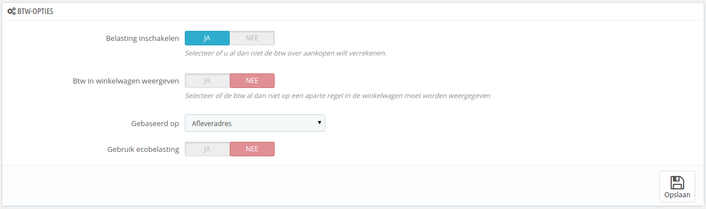
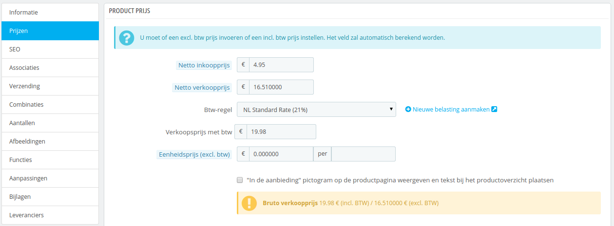
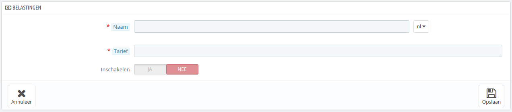

# Belastingen

Belastingen zijn een complex onderwerp, wat volledig begrepen moet worden, want het heeft een significante invloed op uw productprijzen en verzendkosten. Ondanks dat deze handleiding niet bedoeld is om u alle ins en outs te leren over belastingen, doen we toch ons best om u enkele basisbegrippen uit te leggen.

"Onder **belasting** wordt verstaan een algemene, verplichte betaling aan de [overheid](https://nl.wikipedia.org/wiki/Overheid) door een [rechtssubject](https://nl.wikipedia.org/wiki/Rechtssubject), waartegenover geen individuele prestatie van die overheid aan dat rechtssubject staat" – Wikipedia. In het kort moet u voor elk product en dienst die u levert btw afdragen, welke afhankelijk is van uw land. Effectief draagt u een steentje bij aan het functioneren van de overheid (publieke goederen en service) middels een percentage van de toegevoegde waarde van uw goederen en/of diensten.

Er zijn veel verschillende belastingen in de wereld en deze kunnen enorm verschillen, soms binnen een land zelf als het federale staten kent (VS, Duitsland, Spanje, Rusland...). U moet er daarom voor zorgen dat u voldoet aan de eisen van uw land, en zelfs die van de provincie/staat waarin u zich bevindt. Controleer of uw instellingen kloppen bij uw lokale belastingdienst, waar u alle officiële details kunt verkrijgen. In Nederland kunt u de [belastingtelefoon](http://www.belastingdienst.nl/wps/wcm/connect/bldcontentnl/standaard\_functies/prive/contact/belastingtelefoon\_bellen/belastingtelefoon\_bellen) (0800 - 0543 \[gratis]) bellen. In België kunt u terecht bij de [Federale Overheidsdienst Financiën](http://financien.belgium.be/nl/Contact/) (0257 257 57 \[lokaal tarief]).

Standaard geldt in PrestaShop een belasting voor alle landen/staten/zones. Om een belastingregel toe te passen op een enkel land of een aantal landen bij elkaar moet u een belastingregel aanmaken. De belastingregel wordt daarna toegepast per product, bij het aanmaken van een product (tabblad "Prijzen").

U kunt niet gelijk een belasting toepassen op een product; u kunt slechts belastingregels toepassen. Daarom moet u alle relevante belastingen registreren en een belastingregel aanmaken voor de belastingen om aan te geven voor welke landen de belasting geld en een belastingregel toepassen op het product.

## Btw-opties 

Aan de onderkant van de pagina is de sectie "Btw-opties". Deze opties zijn van toepassing op de gehele winkel en alle bestellingen.

* **Belasting inschakelen**. Of belastingen al dan niet worden toegepast op aankopen.
* **Btw in winkelwagen weergeven**. U kunt ervoor kiezen dat de klant niet kan zien welke belastingen van toepassing zijn in de winkelwagen. In dat geval schakelt u deze optie uit.
* **Gebaseerd op**. De klant kan ervoor kiezen om het product al dan niet naar hetzelfde adres te sturen als waar de factuur naar verzonden moet worden. Dit kan een behoorlijke invloed hebben op belastingen. Standaard baseert PrestaShop de belastingen op de belastingregels die van toepassing zijn op het afleveradres, maar u kunt ervoor kiezen om deze te baseren op het factuuradres.
* **Gebruik ecobelasting**. De ecobelasting is bedoeld voor "het promoten van ecologisch duurzame activiteiten door middel van economische sancties". Het is een belasting die winkeleigenaren betalen om de "schadelijke gevolgen van hun acties" te voelen. Kom meer te weten over ecobelasting op deze Wikipediapagina: [http://en.wikipedia.org/wiki/Ecotax](http://en.wikipedia.org/wiki/Ecotax).\
  Zodra u ecobelasting hebt ingeschakeld, krijgen alle producten in uw backoffice een extra optie genaamd "Ecotaks (incl. btw) op het tabblad "Prijzen". U moet dat veld vullen met de exacte waarde van de belasting, welke afhankelijk is van de belastingregels in uw land (het is waarschijnlijk gebaseerd op de productprijs).

Als u ervoor kiest om de ecotaks in te schakelen, nadat u producten hebt toegevoegd, dan moet u deze bijwerken om de belasting op de juiste manier in te stellen voor elk product.\
Als u al de ecobelastingen hebt gezet voor uw producten en u kiest ervoor om ecobelastingen uit te schakelen, dan verliezen al uw producten hun ecotaksinstellingen. Door de ecotaks opnieuw in te schakelen, moet u alle waarden opnieuw invoeren.

The ecotax will also appear to the customer, on the product's page.

## Een nieuwe belasting toevoegen 

Een nieuwe belasting toevoegen is erg gemakkelijk, omdat belastingregels alle logica bevatten om belastingen toe te passen. Het aanmaakformulier voor een belasting is om die reden erg kort:

* **Naam**. Wees erg specifiek. Hierdoor wordt het aanmaken van een belastingregel gemakkelijker.\
  Er wordt aangeraden om herinneringen toe te voegen aan de naam, zoals het land/groep/zone waarvoor de belasting geld en het percentage. Dit helpt u bij het herinneren welke belastingen gebruikt worden in een belastingregel.
* **Tarief**. Het exacte tarief. Het formaat is XX.XX.
* **Inschakelen**. U kunt de belasting te allen tijde in- of uitschakelen.

