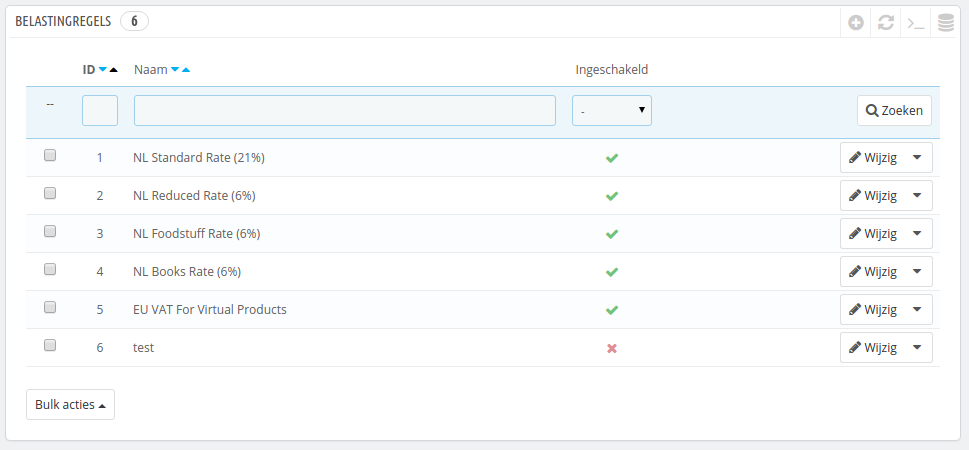
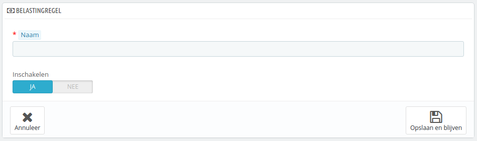
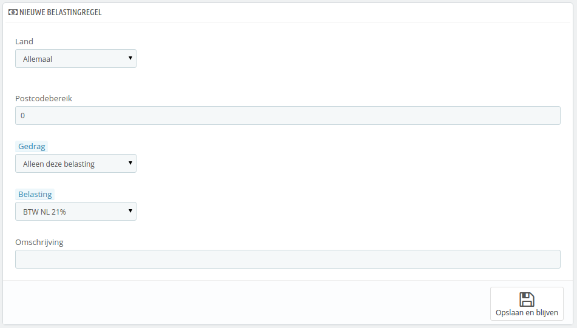

# Belastingregels

Voorheen werden deze regels in PrestaShop btw-regels genoemd. Omdat met deze regels meer kan worden toegepast dan slechts de Belasting Toegevoegde Waarde (denk aan de _sales tax_ in de Verenigde Staten), is deze term hernoemd naar belastingregel.

Belastingregels maken het mogelijk om belastingen toe te passen voor specifieke landen.

Standaard wordt in PrestaShop een belasting toegepast op alle landen/staten/zones. Om een specifiek belastingtarief op een enkel land of een groep landen toe te passen moet u een btw-regel aanmaken. De btw-regel wordt daarna per product toegepast, bij het aanmaken van een product (tabblad "Prijzen").

U kunt niet direct een belasting toepassen op een product; u kunt slechts een belastingregel toepassen. Daarom moet u eerst alle relevante belastingen invoeren en vervolgens een btw-regel aanmaken voor die belastingen om de landen aan te geven waarvoor de belastingen gelden en deze toe te passen op producten.

Een aantal voorbeeldregels zijn al toegevoegd. Dit is afhankelijk van het land dat u kiest bij de installatie van PrestaShop. De belastingregels worden ingesteld voor elke belasting: de regels gelden als een landfilter; ze limiteren het gebruik van de belasting tot een specifiek aantal landen.

U moet een aantal regels bewerken om een beter inzicht te krijgen in de werken van belastingregels.

## Een nieuwe belastingregel toevoegen 

U kunt zoveel belastingregels toevoegen als nodig is aan uw PrestaShop-installatie. Niet alleen dat, maar ook moet u ervoor zorgen dat alle benodigde belastingregels zijn geregistreerd in uw winkel.

Het aanmaken van een belastingregel wordt gedaan in twee stappen:

1. De regel aanmaken:
   * Klik op de knop "Nieuwe belastingregelgroep toevoegen".
   * Geef de regel een naam in het formulier dat verschijnt. Gebruik een handig naam: gebruik de landcode van de regel, de naam, eventueel ook het percentage om zo de regel gemakkelijk terug te kunnen vinden. Als PrestaShop al een belastingregel heeft voor het land, gebruik dan dezelfde stijl voor consistentie.
   * \
     
   * Selecteer of de groep inschakeld moet zijn of niet. U kunt de groep altijd later alsnog inschakelen als dat nodig is.
   * Klik op de knop "Opslaan en blijven". De pagina wordt herladen, met een nieuwe tabel aan de onderkant.
2. Specificeer het land en het gedrag:
   * Klik op de knop "Nieuwe belastingregel toevoegen".
     * Een nieuw formulier verschijnt. Vul de velden in:\
       
     * **Land**. Het land voor de regel die u aanmaakt.
       * **Staat/provincie**. Van sommige landen zijn de staten/provincies geregistreerd in PrestaShop (zie de pagina "Provincies" onder het menu "Lokalisatie") In dat geval kunt u de belasting nog specifieker maken of er juist voor kiezen om de regel op het hele land toe te passen. U kunt meerdere staten en/of provincies selecteren door de CTRL-toets ingedrukt te houden, terwijl u op de namen klikt.
     * **Postcodebereik**. Als van het land de staten/provincies zijn vastgelegd, dan kunt u de belasting beperken tot de postcode. Dit veld zorgt ervoor dat u postcodes kunt invoeren waarvoor de belasting moet worden toegepast: kies een enkele postcode of definieer een gehele reeks, door middel van een streepje. Bijvoorbeeld: "2399AB - 2489GK" voor een reeks tussen (en inclusief) deze twee postcodes.
     * **Gedrag**. Sommige klanten hebben een adres dat past bij meer dan één belastingregel. In dat geval kunt u kiezen hoe deze regel zich moet gedragen:
       * **Alleen deze belasting**. Zal alleen deze belasting toepassen, de andere belastingen worden niet toegepast.
       * **Combineren**. Combineer belastingen. Bijvoorbeeld: 100€ + (10% + 5% => 15%) => 115€.
       * **Achter elkaar**. Belastingen achter elkaar toepassen. Bijvoorbeeld: 100€ + 10% => 110€ + 5% => 115.5€.
     * **Belasting**. De belasting die gebruikt wordt voor deze belastingregel. De regel moet al vastgelegd zijn in PrestaShop. Wanneer dat niet het geval is: kies "Geen belasting", bewaar de regel, maak een nieuwe belasting aan op de pagina "Belastingen" en keer terug om de belasting toe te passen.
     * **Omschrijving**. U kunt een korte tekst toevoegen als herinnering waarom deze regel voor dit land bestaat.
   * Klik op de knop "Opslaan en blijven". Het land wordt aan de onderstaande tabel toegevoegd en u kunt gelijke een ander land toevoegen met de nieuwe lege velden.

De standaardheffing die wordt toegepast op uw producten is gebaseerd op het standaardland van uw winkel.
