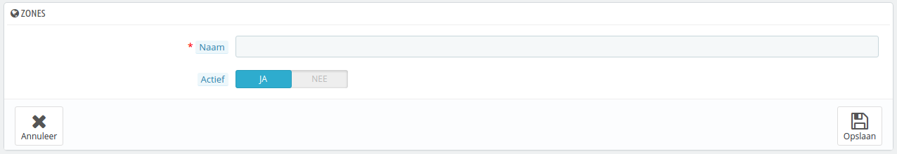
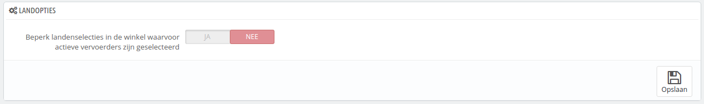
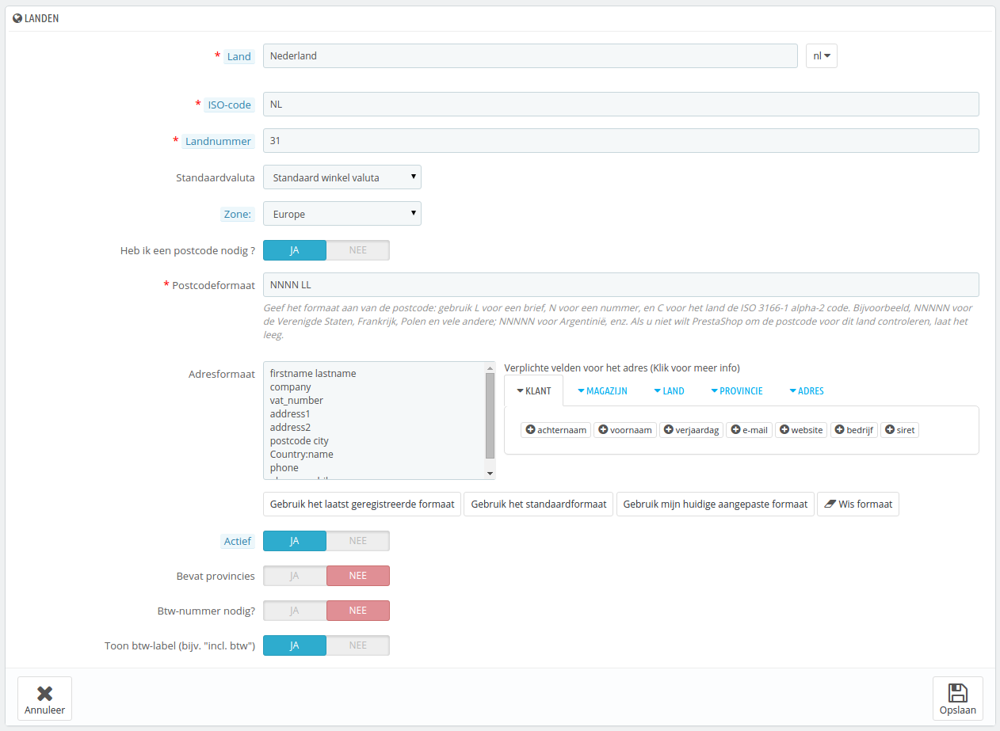

# Landen

Uw PrestaShop-installatie moet alle bestaande landen kennen om ervoor te zorgen dat uw klanten duidelijk kunnen aangeven waar ze in de wereld wonen.

Er zijn grofweg 200 landen in de wereld, maar PrestaShop kent 244 geregistreerde landen. Dit is omdat sommige landen overzeese regio's kennen.\
Bijvoorbeeld, de Franse departementen, voorheen bekend als DOM (Guadelope, Martinique, Mayotte, Reunion en Frans-Guinee) hebben tegenwoordig dezelfde status als de Franse metropolitaanse regio. Op dezelfde manier zijn Alaska en Hawaii eigen staten binnen de Verenigde Staten.\
Nog altijd betekent het verzenden naar Guadelope niet hetzelfde als naar Frankrijk, al was het om de verzendkosten alleen. Daarom zijn de overzeese territoria, etc. in PrestaShop gescheiden van het hoofdland.

Standaard is alleen uw land ingeschakeld. U moet landen één voor één inschakelen, als dat nodig is voor uw klanten. Als u niet zeker bent welke landen u moet inschakelen dan kunt u de statistieken bekijken voor de landen met meeste bezoekers.

Aan de onderkant van de lijst geeft de sectie "Landopties" de mogelijkheid om uw frontoffice alleen te tonen voor de landen waarvoor u vervoerders hebt ingesteld. We raden aan dat u deze intellingen inschakelt, want het voorkomt dat klanten gaan scrollen naar hun land om hun eigen te vinden en dit bespaart ze de moeite.

## Een nieuw land toevoegen 

Normaal komt PrestaShop met alle huidige landen in de database. Maar in het geval er nieuwe landen bij komen, dan komt het voor dat u handmatig een nieuw land moet toevoegen.

* **Land**. De officiële naam van het land dat u wilt toevoegen, in alle ondersteunde talen. Bekijk het Wikipedia-artikel van het land als u twijfels heeft.
* **ISO-code**. De ISO-1366-code van het land, welke u in dit artikel kunt vinden: [http://www.iso.org/iso/country\_codes/iso\_3166\_code\_lists/country\_names\_and\_code\_elements.htm](http://www.iso.org/iso/country\_codes/iso\_3166\_code\_lists/country\_names\_and\_code\_elements.htm).
* **Landnummer**. Het internationale netnummer, welke u kunt vinden in dit Wikipedia-artikel: [https://nl.wikipedia.org/wiki/Lijst\_van\_landnummers\_in\_de\_telefonie](https://nl.wikipedia.org/wiki/Lijst\_van\_landnummers\_in\_de\_telefonie).
* **Standaardvaluta**. U kunt de standaardvaluta van uw winkel gebruiken (zoals ingesteld op de pagina "Lokalisatie" onder het menu "Lokalisatie") of één van de andere geïnstallerde valuta. Onthoud dat als het nodig is, u altijd een nieuwe valuta kunt toevoegen op de pagina "Valuta's".
* **Zone**. De subregio in de wereld waartoe dit land behoort. Asl het nodig is, kunt u nieuwe zones toevoegen op de pagina "Zones" onder het menu "Lokalisatie".
* **Heb ik een postcode nodig?**. Geeft aan of een gebruiker uit dit land verplicht is om een postcode in te voeren bij het invoeren van een adres.
* **Postcodeformaat**. U kunt meer details invoeren over het formaat van de postcode. Als u niets invoert, dan zal PrestaShop het formaat niet valideren.\
  Gebruik de volgende codes voor de postocde: "L" voor een letter, "N" voor een cijfer en "C" voor de ISO-code van het land (de code die u in het veld ISO-code hebt ingevoerd).\
  Als u het formaat van het land niet weet, dan kunt u dit opzoeken in dit Wikipedia-artikel: [http://en.wikipedia.org/wiki/List\_of\_postal\_codes](http://en.wikipedia.org/wiki/List\_of\_postal\_codes). Zorg ervoord dat u de notatie niet kopieert en plakt vanaf Wikipedia, maar deze aanpast aan PrestaShop! Zo geeft Wikipedia bijvoorbeeld "AAA 9999\*" voor Malta, waardoor de notatie in PrestaShop dit wordt: "LLL NNNN" (zonder de laatste \*).
* **Adresformat**. Geeft informatie op over de layout van het adres, wanneer u het toont aan klanten. U kunt op verschillende links klikken aan de linkerkant van het tekstveld om meer velden in te voegen. Op het klantportaal wordt deze volgorde gebruikt om de gegevens van de klant weer te geven. Uw wijzigingen worden alleen opgeslagen als u de gehele pagina opslaat. Als u een vergissing hebt gemaakt, dan kunt u gebruikmaken van één van de hulpknoppen onder het formulier, afhankelijk van uw situatie.
* **Actief**. Een uitgeschakeld land zal niet worden gesuggereerd als een optie wanneer een klant alleen wil registreren en een nieuw account wil aanmaken.
* **Bevat provincies**. Geef aan of het land staten of provincies heeft of niet. Dit voegt een nieuw veld toe aan het adresformulier van PrestaShop. Let op dat "provincies" ook staten, regio's, departementen, etc. kunnen zijn... alles dat nuttig is voor de postbezorging in het desbetreffende land.
* **Btw-nummer nodig?** en **Toon btw-label (bijv. "incl. btw")**. Een Btw-nummer is een identificatienummer gebruikt door de belastingauthoriteiten van het land. Niet elk land maakt gebruik van een dergelijk nummer. Vraag de authoriteiten van het land om meer informatie.
* **Winkelassociatie**. U kunt dit land beschikbaar maken voor een beperkte selectie van uw winkels, bijvoorbeeld voor winkels die alleen een specifieke regio bedienen.
