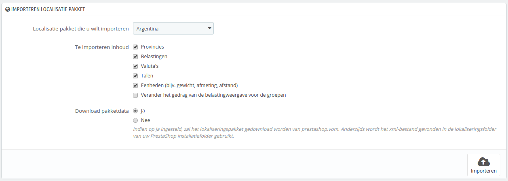
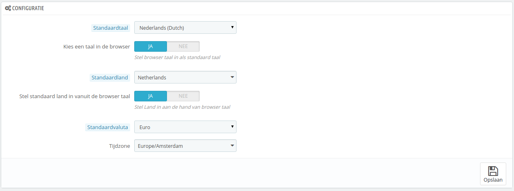
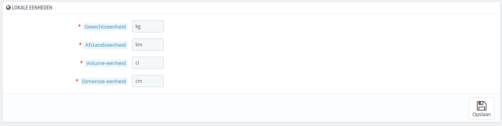
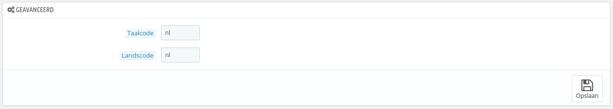

# Lokalisatie

De hoofdpagina van het menu "Lokalisatie" maakt het mogelijk om de gebruikte eenheden voor uw producten te configureren.

## Lokalisatiepakket importeren 

Deze sectie geeft u een uitgebreide lijst van huidige lokalisatiepakketten die u kunt importeren. Niet alleen stelt het de juiste eenheden in voor uw PrestaShop-installatie, maar ook de volgende data wordt toegevoegd:

* **Provincies**. Wanneer u producten verstuurd naar een land, dan kan het belangrijk zijn om op de hoogte te zijn van de provincies/staten, want er kan per provincie of staat een lokale belasting van toepassing zijn. De toegevoegde staten en/of provincies kunnen worden bekeken op de pagina "Provincies" onder het menu "Lokalisatie".
* **Belastingen**. Een belangrijk onderdeel van lokalisatie zijn de lokale belastingen. Er kunnen veel belastingen van toepassing zijn, afhankelijk van het land en/of de staat. PrestaShop geeft u basisondersteuning voor de hoofdbelastingen en belastingregels. De toegevoegde belastingen en belastingregels kunnen worden bekeken en bijgewerkt op de pagina's "Belastingen" en "Belastingregels" onder het menu "Lokalisatie".
* **Valuta's**. Buitenlandse klanten zullen het waarderen wanneer ze prijzen kunnen bekijken in de voor hen bekende valuta. Als u uw winkel beschikbaar stelt voor buitenlanders, moet u minstens valuta kunnen tonen in US Dollars en Euro's naast uw eigen valuta (wanneer deze niet gelijk is aan de genoemde twee). Zodra deze zijn toegevoegd moet u de nieuwe valuta activeren door gebruik te maken van de pagian "Valuta's" onder het menu "Lokalisatie" en ervoor zorgen dat de wisselkoers klopt. De toegevoegde valuta's kunnen bekeken en bijgewerkt worden op de pagina "Valuta's".
* **Talen**. Alle publieke velden in uw winkel kunnen worden weergegeven in meerdere talen en het is  belangrijk dat u ze in ieder geval aanpast bij producten. Naast het importeren van een taal wordt ook het datumformaat (d/m/Y, m/d/Y, d-m-Y, etc.) geïmporteerd en enkele andere gegevens. De toegevoegde talen kunnen worden bekeken en bewerkt op de pagina "Talen" onder het menu "Lokalisatie".
* **Eenheden**. Gewicht, afmeting, afstand: deze eenheden zijn essentieel om een product goed te kunnen omschrijven en voor uw eigen verpakkingsinformatie. Deze kunnen bekeken en bijgewerkt worden op deze pagina, in de sectie "Lokalisatie".
* **Verander het gedrag van de belastingweergave voor de groepen**. Dit is geen data dat geïmporteerd wordt, maar een instelling die u kunt wijzigen wanneer u de data importeert.

Zoals u kunt zien zijn deze extra gegevens optioneel: u kunt ervoor kiezen om de valuta en taal voor een gegeven land te importeren, maar bijvoorbeeld niet de belastingen.

Ondanks dat u niet te veel lokale data moet toevoegen, uit angst dat u wellicht met overweldigend veel data te maken krijgt, kan het handig zijn om lokalisatiepakketten te importeren voor landen waarde meeste bezoekers vandaan komen (volgens uw statistieken).

Afgezien van de standaardeenheden, **kunt u niet automatisch alle data van een gegeven land verwijderen**; als u gegevens wilt verwijderen, moet u dit handmatig doen op de juiste pagina's onder het menu "Lokalisatie".

## Configuratie 

Deze sectie toont vier groepen standaard lokalisatieinstellingen, gesorteerd op belangrijkheid:

* **Standaardtaal**. Dit is de hoofdtaal van uw winkel. Deze instelling heeft invloed op de backoffice-taal (inclusief hoofdtaal van uw producten), maar ook de frontoffice. De taal van de frontoffice kan zich aanpassen aan de taal van de browser van de klant.
* **Standaardland**. The location of your business. If you have headquarters in many countries, use your main or original country.
* **Standaardvaluta**. De valuta waarin uw productprijzen worden ingesteld. Valuta's worden toegevoegd door de ze importeren en te activeren. Als u de standaardvaluta aanpast, nadat u prijzen hebt ingesteld, dan zult u deze opnieuw moeten aanpassen aan de nieuwe standardvaluta. Zorg ervoor dat u een valuta kiest die u voor altijd gaat gebruiken.
* **Tijdzone**. Uw eigen tijdzone. Dit is belangrijk voor bijvoorbeeld dagelijkse kortingen: u weet precies wanneer ze beginnen en eindigen.

Sinds versie 1.6.0.10 hebben de opties "Standaardtaal" en "Standaardland" twee nieuwe instellingen:

* Voor "Standaardtaal" is dit: **Kies een taal in de browser**. PrestaShop stelt de taal in die overeenkomt met de lokalisatiecode van de browser (bijvoorbeeld fr\_CA voor Frans).
* Voor "Standaardland" is dit: **Stel standaard land in vanuit de browser taal**. PrestaShop stelt het land in voor de winkel die overeenkomt met de lokalisatiecode van de browser (bijvoorbeeld fr\_CA voor Canada).

## Lokale eenheden 

De fysieke eenheden zoals getoond in deze sectie (gewicht, afstand, volume, dimensie) worden zowel in uw productsheets als voor uw verpakkingsberekeningen gebruikt – en is essentieel voor de communicatie met uw vervoerder.

Deze waarden kunnen automatisch worden ingesteld wanneer u het lokalisatiepakket voor een land importeert, maar u kunt ze daarna handmatig aanpassen. Als u bijvoorbeeld liever centiliters gebruikt in plaats van liters om het volume aan te geven, dan verandert u de standaard "l" naar "cl".

Voor deze waarden moeten de eenheidssymbolen uit het International System of Units ([http://en.wikipedia.org/wiki/International\_System\_of\_Units](http://en.wikipedia.org/wiki/International\_System\_of\_Units)) worden gebruikt.

## Geavanceerd 

Deze laatste sectie vraagt u om het lokale land en taal van uw server in te stellen, daarbij gebruikmakend van ISO-codes:

* Voor de taal: ISO 639-1 code ([http://en.wikipedia.org/wiki/List\_of\_ISO\_639-1\_codes](http://en.wikipedia.org/wiki/List\_of\_ISO\_639-1\_codes)).
* Voor het land: ISO 3166-1 Alpha 2 code ([http://en.wikipedia.org/wiki/ISO\_3166-1\_alpha-2](http://en.wikipedia.org/wiki/ISO\_3166-1\_alpha-2)).

Deze waarden kunnen worden ingesteld, wanneer u het lokalisatiepakket voor een land importeert, maar u kunt deze daarna handmatig aanpassen.
