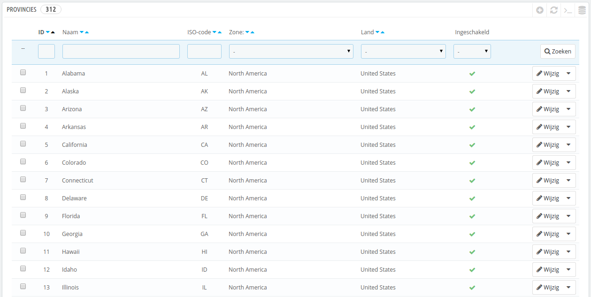
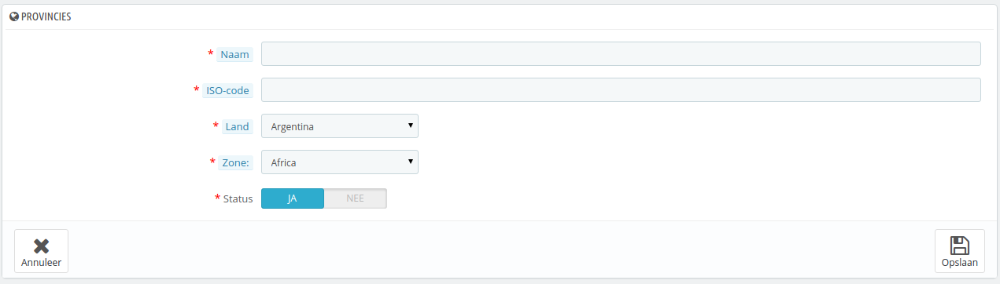

# Staten / provincies

Met "Provincies" worden binnen PrestaShop de administratieve divisies op het hoogste niveau bedoeld. Bij de Verenigde Staten hebben we het dan over _states_; in Italië over _regioni_ (enkelvoud: _regione_); in Frankrijk zijn het _régions_; in het Verenigd Koninkrijk _regions_.\
Standaard biedt PrestaShop een set met staten: 53 _states_ en _territories_ van de VS, 31 Mexicaanse _estados_, 13 Canadese provincies en _territories_, 34 Indonesische _provinsi_, 24 Argentijnse _provincias_, 47 Japanse _todōfuken_ en 110 Italiaanse _province_ (enkelvoud: _provincia_).

Door provincies op de juiste manier in te stellen in uw database kunt u de leveringsmogelijkheden van uw vervoerders beter aan klanten tonen. Deze provincies kunnen ook belangrijk zijn bij het berekenen van belastingen, afhankelijk van het land. Het is daarom belangrijk om alle administratieve divisies van een land in te voeren als ze belangrijk zijn voor een vervoerder. U kunt een lijst van dergelijke divisies vinden op de volgende Wikipedia-pagina: [http://en.wikipedia.org/wiki/Table\_of\_administrative\_divisions\_by\_country](http://en.wikipedia.org/wiki/Table\_of\_administrative\_divisions\_by\_country).

Op dit moment toont het adresformulier binnen PrestaShop slechts de provincies die beschikbaar zijn voor een klant om te kiezen. Kies daarom voor een logische lijst wanneer u provincies toevoegt. Dat is de reden waarom de lijst standaard voor Italië de _province_ bevat (administratieve divisies op het tweede niveau) in plaats van _regioni_ (hoogste niveau).

## Een nieuwe provincie toevoegen 

Laten we een nieuwe provincie toevoegen. Klik op de knop "Nieuwe provincie toevoegen" om naar het aanmaakformulier te gaan.

* **Naam**. De naam van de provincie zoals deze wordt getoond op facturen en het pakket. Het moet daarom in de taal zijn van het bijbehorende land.
* **ISO-code**. De ISO-3166-2 code van de provincie:
  1. Ga naar deze Wikipedia-pagina: [http://en.wikipedia.org/wiki/ISO\_3166-2](http://en.wikipedia.org/wiki/ISO\_3166-2),
  2. Klik op de twee-letter-code van het land (in de kolom "Entry" van de hoofdtabel),
  3. Op die pagina zoekt u de code van de provincie of staat (het zou in een lijst op de pagina te vinden moeten zijn, of in de tekst voor kleinere landen),
  4. Als er één is gevonden, dan verwijdert u het voorvoegsel van het land om de code kleiner dan 4 karakters te houden. Voorbeeld: de volledige ISO-code voor Devon, in het Verenigd Koninkrijk is "GB-DEV". Gebruik simpelweg "DEV" als de ISO-code – het wordt weer gekoppeld aan de landcode met behulp van de dropdown-lijst "Land" (zie volgende stap).
* **Land**. Geef het land aan met de dropdown-lijst.
* **Zone**. Geef hier aan in welke zone de provincie zich bevindt door middel van de dropdown-lijst. Besteedt extra aandacht aan deze instelling om te voorkomen dat de land- en zone-instellingen van PrestaShop door elkaar raken.
* **Status**. Een uitgeschakelde provincie wordt niet als optie getoond wanneer de bezoeker zich registreert door een nieuw account aan te maken.
