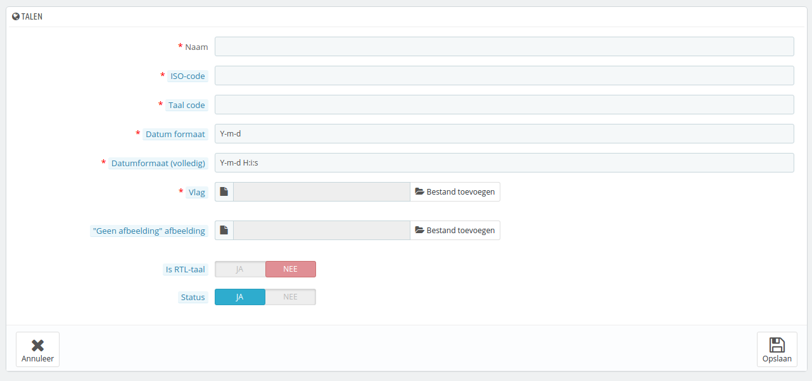

# Talen

PrestaShop ondersteunt out-of-the-box meerdere talen: er is één standaardtaal (de taal die u gebruikt om het te installeren) en nog veel meer talen die beschikbaar zijn om te downloaden.

De pagina "Talen" beheert de talen die u te zien krijgt in uw backoffice en uw winkel.

De pagina toont de talen die al in uw winkel zijn geïnstalleerd, samen met nog meer informatie: ISO-code, taalcode, datumformaat (kort en lang). U kunt een taal in- of uitschakelen door te klikken op het icoon in de kolom "Ingeschakeld".

Het toevoegen van een nieuwe taal bestaat uit simpelweg een lokalisatiepakket importern van een land die de taal gebruikt (op de pagina "Lokalisatie"). Als blijkt dat deze niet werkt, of dat u iets wilt aanpassen, dan kunt u de taal handmatig toevoegen, door gebruik te maken van het formulier dat bereikbaar is met de knop "Nieuwe taal toevoegen".&#x20;

PrestaShop comes multilingual out of the box: there is one default language (the one you used to install it), and many more are available to download.

The "Languages" page manages the languages you will see in your back office and your shop.

The page displays the languages already installed on your shop, along with some information: ISO code, language code, date format (short and full). You can enable or disable a language by clicking on the icon in the "Enabled" column.

Adding a new language is simply a question of importing the localization pack from a country which uses that language (in the "Localization" page). If it turns out this does not work, or that you need something customized, you can add a new language manually, using the form behind the "Add new" button.

## Creating a New Language 

Creating a new language means you will have to translate all of the text for PrestaShop's front-end, back-end, modules, etc., or risk using the default English strings. Translation is made using the tool in the "Translations" page, under the "Localization" menu.

You can also create a new language in order to cater for a language pack that you would have downloaded from the PrestaShop site.

In order to create a new language, you must fill as many of the form's field as possible:

* **Name**. The name is public. If you are creating that language for regional purpose, you may indicate that in the name: "French (Quebec)", for instance.
* **ISO code**. Enter the adequate 2-letter ISO 639-1 code. See [http://en.wikipedia.org/wiki/List\_of\_ISO\_639-1\_codes](http://en.wikipedia.org/wiki/List\_of\_ISO\_639-1\_codes) for more information.\
  If you are importing a language pack, this code should exactly match the one for the pack.
* **Language code**. Enter the adequate 4-letter language code, in the form `xx-yy`, `xx` being the language ISO code (same as above), and `yy` the country ISO code, using ISO 3166-1 alpha-2 ([http://en.wikipedia.org/wiki/ISO\_3166-1\_alpha-2](http://en.wikipedia.org/wiki/ISO\_3166-1\_alpha-2)). See [http://en.wikipedia.org/wiki/IETF\_language\_tag](http://en.wikipedia.org/wiki/IETF\_language\_tag) for more information.
* **Date format**. Countries do not always share the same date representation (See [http://en.wikipedia.org/wiki/Date\_format\_by\_country](http://en.wikipedia.org/wiki/Date\_format\_by\_country)). Hence, when your shop display 02/08/12, a customer from France will understand "August 2nd, 2012" whereas one from the US will understand "February 8th, 2012" – and a japan customer might even read it as "August 12th, 2002". This is why it is important to indicate the date format tied to your language. The letters used should be that of PHP's `date()` function: [http://php.net/manual/en/function.date.php](http://php.net/manual/en/function.date.php).
* **Date format (full)**. Same as the date format above, but including the hour-minute format.
* **Flag**. Upload an image of the flag which best matches the language you want to add. It should be 16\*11 pixels. You recommend you use the free FamFamFam Flags image set: [http://www.famfamfam.com/lab/icons/flags/](http://www.famfamfam.com/lab/icons/flags/).
* **No-picture" image**. Upload an image which will be displayed when a product does not yet have a picture. That image is simply a blank image, with "No image" or "No image available" in this language. The picture should be 250\*250 pixels. You can find existing "No-picture" images in the `/img/l` directory of your PrestaShop installation.
* **Is RTL language**. Some languages are written from right to left, most notably those using Arabic script or the Hebrew alphabet ([http://en.wikipedia.org/wiki/Right-to-left](http://en.wikipedia.org/wiki/Right-to-left)). When a PrestaShop theme is well coded, it is able to handle RTL languages - provided it is clearly set as such.
* **Status**. You may disable a new language until you are ready to translate everything.
* **Shop association**. You can make the language only available to a selection of your shops, for instance shops that target a specific locale.

Once your language is saved and enabled, you can import its language pack. This is done in the "Translations" page, under the "Localization" menu. Use the "Import a language pack manually" tool.

Finally, make sure everything works: go to your shop's front-office and click on the flags at the top. Similarly, customers can now select an additional language by using these icons.
