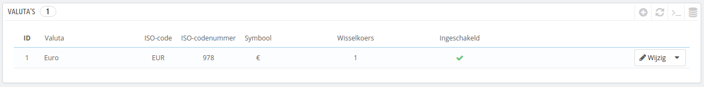
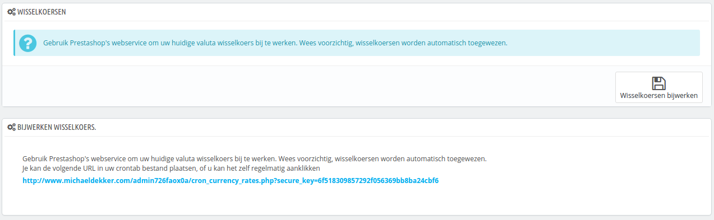
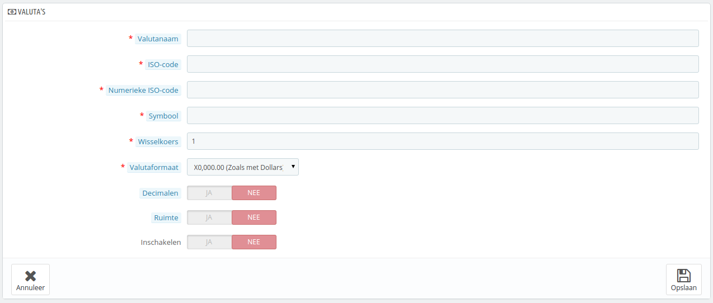

# Valuta's

PrestaShop kan overweg met een groot aantal valuta's. Standaard is er één valuta beschikbaar: die van uw standaardland. Wellicht wilt u nieuwe valuta toevoegen voor uw bezoekers. Klanten zullen het waarderen als ze prijzen kunnen bekijken in hun eigen valuta.

De twee secties aan de onderkant van de pagina "Valuta's" zijn erg simpel, maar vrij belangrijk, want deze gaan over de wisselkoers. Om Wikipedia aan te halen, "De wisselkoers is de prijs van een munt uitgedrukt in een andere munt". Koersen wijzigen dagelijks. Soms zelfs enorm, afhankelijk van de omstandigheden, en uw winkel moet altijd bijgewerkt zijn om de laatste koersen te tonen.

Om de standaardvaluta aan te passen gaat u naar de pagina "Lokalisatie", onder het menu "Lokalisatie" and gebruikt u de optie "Standaardvaluta" in het gedeelte "Configuratie".\
Als de valuta die u wilt gebruiken hier niet beschikbaar is, dan moet u deze nog importeren met het land dat gebruik maakt van deze valuta, door de sectie "Importeren lokalisatie pakket" te gebruiken op de pagina "Lokalisatie".

## De wisselkoersen bijwerken 

In PrestaShop zijn er twee manieren om uw wisselkoersen bij te werken:

* **Handmatig**. In de sectie "Wisselkoersen" klikt u op de knop "Wisselkoersen bijwerken". Dit download een bestand vanaf de [PrestaShop.com](http://www.prestashop.com) servers door middel van de PrestaShop web-service.
* **Automatisch**. Dit is de aangeraden methode. In plaats van telkens op de knop "Wisselkoersen bijwerken" te klikken, kunt u een crontaak aanmaken waarmee het bestand telkens wordt gedownload. Voeg de getoonde URL toe aan uw `crontab` bestand om de automatische update te activeren. Als u niet weet wat een crontaak of crontab bestand is, kunt u het beste contact opnemen met uw hostingprovider.

De koersen worden geleverd zonder garantie: het PrestaShop-team besteedt aandacht aan het leveren van de juiste koersen, maar kunnen desondanks toch afwijken van de werkelijke koersen. Vooral wanneer de koersen enorm fluctueren in een korte tijdspanne.

## Een nieuwe valuta toevoegen 

De makkelijkste manier om de valuta van een land toe te voegen is door het lokalisatiepakket te importeren. Dit wordt gedaan met de pagina "Lokalisatie", onder het menu "Lokalisatie". Zodra u het hebt geïmporteerd, gaat u naar de pagina "Valuta's" om de valuta in te schakelen.

U hebt misschien een valuta nodig die niet te vinden is in één van de lokalisatiepakketten. In dat geval kunt u gebruikmaken van het aanmaakformulier.

* **Valutanaam**. De naam van de valuta. Bij voorkeur in het Engels, omdat dit de taal is die de meeste klanten begrijpen.
* **ISO-code**. De drie-letter ISO 4217 code. Bekijk deze Wikipediapagina: [http://en.wikipedia.org/wiki/ISO\_4217](http://en.wikipedia.org/wiki/ISO\_4217).
* **Numerieke ISO-code**. De ISO 4217 code, bestaande uit drie decimalen. Zelfde Wikipediapagina als bovenstaand item.
* **Symbool**. De symbool van de valuta. Bekijk hiervoor de volgende Wikipediapagina: [http://en.wikipedia.org/wiki/Currency\_sign](http://en.wikipedia.org/wiki/Currency\_sign).
* **Wisselkoers**. Dit is de wisselkoers ten opzicht van de standaardvaluta in uw winkel. Als de standaardvaluta bijvoorbeeld de euro is en de valuta die hier wordt ingevoerde de Amerikaanse dollar is, typt bijvoorbeeld "1.17" (de koers op het moment van schrijven). Gebruik deze website als hulpmiddel: [http://www.xe.com/ucc/](http://www.xe.com/ucc/).
* **Valutaformaat**. Stel in hoe u wilt dat de prijs wordt weergegeven. De X komt overeen met het valutasymbool. U hebt vijf mogelijkheden. In Nederland wordt het formaat X0.000,00 gebruikt. In België is dit 0.000,00X.
* **Decimalen**. U kunt aangeven of uw winkel decimalen moet tonen. Als u ervoor kiest om alle prijzen af te ronden, dan kunnen kortingen en andere prijsvariaties prijzen met decimalen achter de komma veroorzaken. U kunt dat voorkomen met deze optie.
* **Ruimte**. Zodra u een formaat hebt gekozen, kunt u er ook voor kiezen om een spatie tussen het symbool en bedrag te plaatsen. Voor sommige talen is dit noodzakelijk. Spanjaarden gebruiken bijvoorbeeld "50€", terwijl Fransen "50 €" zouden gebruiken. Kies de optie die het beste bij uw winkel past.
* **Inschakelen**. Elke valuta kan op elk gewenst moment weer worden uitgeschakeld. Zowel vanaf de bijwerkpagina als de valutatabel op de pagina "Valuta's".
* **Winkelassociatie**. _Multistore-modus._ U kunt de valuta beschikbaar stellen voor een beperkt aantal winkels, bijvoorbeeld winkels die geschikt zijn voor een specifiek land.
