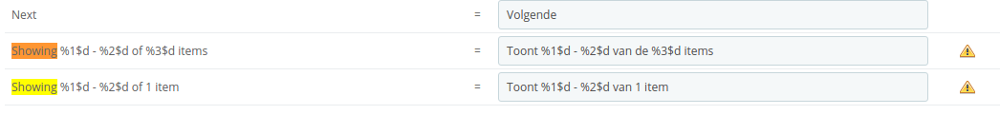
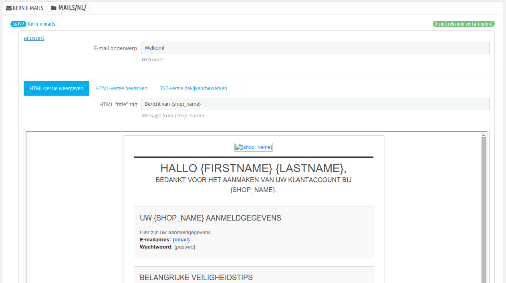

# Vertalingen

PrestaShop biedt volledige vertalingen aan voor uw winkel. Deze pagina helpt u bij het toevoegen en bewerken van vertalingen. Op deze manier hebt u de controle over de vertalingen in uw winkel en kunt u vertaalde [strings](https://nl.wikipedia.org/wiki/Tekenreeks) bewerken zonder dat u hoeft te wachten op officiële vertalingen om de correcties toe te passen.

Zelfs als u het werk van een vertaler niet wilt verbeteren, kunt u wellicht alsnog de gekozen woorden willen aanpassen (minder formeel, minder woorden, etc.), en de verschillende beschikbare teksten aanpassen, oftewel maatwerk toepassen voor uw publiek; zo kan een hip-hop kledingwinkel andere termen gebruiken dan een winkel die luxe horloges verkoopt.

Het aanpassingsproces aan vreemde talen wordt ook _internationalisatie_ _en lokalisatie_ genoemd, of i18n (van _internationalization_) en L10n (van _localization_) in het kort.

Internationalisatie is de eerste stap, waar ontwikkelaar een mechanisme kiezen om de software te vertalen. Alle softwarestrings worden daarna geconverteerd om gebruik te maken van dit mechanisme.\
Lokalisatie is de tweede stap, waar twee- en meertalige gebruikers van de software de oorspronkelijke strings vertalen in hun eigen taal. Lokalisatie kan ook lokale data bieden om de software verder te verbeteren voor lokale gebruikers.\
U kunt meer lezen over i18n en L10n op deze Wikipediapagina: [https://en.wikipedia.org/wiki/Internationalization\_and\_localization](https://en.wikipedia.org/wiki/Internationalization\_and\_localization)

Het PrestaShop-team heeft ervoor gekozen om hun eigen ingebouwde vertalingsmechanisme te gebruiken, zodat iedereen met een PrestaShop-installatie hun winkel naar hun eigen wensen kan aanpassen.\
De vertalingen door de community worden gedaan met een online tool, te vinden op: [https://crowdin.net/project/prestashop-official](https://crowdin.net/project/prestashop-official).

De officiële vertaalpakketten kunnen handmatig worden gedownload vanaf deze pagina: [http://www.prestashop.com/en/translations](http://www.prestashop.com/en/translations).

## Een vertaling aanpassen 

Het belangrijkste gereedschap van de pagina "Vertalingen" is de sectie "Vertalingen aanpassen". Dit is waar u een vertaling kunt aanpassen en elke zin vertalen als u dat wenst.

Kies het gedeelte van de huidige vertaling die u wilt aanpassen:

* **Winkel vertalingen**. De tekst die zichtbaar is voor klanten die door uw winkel bladeren.
* **Winkelachterkant vertalingen**. De tekst voor u en uw team op het administratiepaneel.
* **Foutmelding vertalingen**. De foutmeldingen die op de frontoffice verschijnen.
* **Veldnaam vertalingen**. De namen van de velden in CSV-bestanden.
* **Geïnstalleerde module vertalingen**. De termen die gebruikt worden door de geïnstalleerde modules. Module die beschikbaar zijn, maar niet geïnstalleerd verschijnen niet.
* **PDF-vertalingen**. De termen die gebruikt worden in de gegenereerde PDF-bestanden: facturen, pakbonnen, etc.
* **E-mail template vertalingen**. De termen die gebruikt worden in de e-mailsjablonen.

Sommige categorieën hebben een tweede dropdownlijst die de beschikbare thema's bevat. PrestaShop-thema's hebben hun eigen strings, maar kunnen ook hun eigen module-, PDF- en e-mailsjablonen bevatten. De dropdownlijst maakt het daarom mogelijk om te kiezen voor welk thema u de vertalingen wilt aanpassen.

Een lange pagina verschijnt hierna. Het bevat honderden beschikbare strings van de categorie, soms verdeeld over tientallen velden.

Standaard staan de velden met onvertaalde strings open. Als u ze allemaal wenst te openen, dan klikt u tweemaal op de knop aan de bovenkant: één keer om ze allemaal te sluiten en nog een keer om ze vervolgens allemaal te openen. U kunt velden één voor één openen en sluiten door op de titel te klikken.

Het aanpassen van een vertaling is gemakkelijk:

* Open een veld,
* Bewerk de inhoud,
* Klik op de knop "Opslaan en blijven" om de vertalingen op te slaan en vervolgens meer van deze categorie te vertalen of op de knop "Opslaan" om de vertalingen op te slaan en terug te keren naar de pagina "Vertalingen".

PrestaShop 1.5 introduceerde een nieuwe syntaxis waar strings plaatsaanduidingen kunnen bevatten, zoals `%s`, `%d`, `%1$s`, `%2$d`, etc.

Als u een string vind met een dergelijke plaatsaanduiding, dan betekent dat, dat PrestaShop de aanduidingen vervangt met een dynamische waarde voordat de vertaalde string getoond wordt.\
Bijvoorbeeld de string "Uw bestelling op %s is voltooid.", wordt vervangen met de winkelnaam. Daarom moet u de plaatsaanduiding behouden in de uiteindelijke vertaling; in het Frans zou de vertaling dan het volgende worden: "Votre commande sur %s a bien été enregistrée."

Technisch gezien voorkomt het hebben van plaatsaanduidingen dat strings opgedeeld kunnen worden. Daarom werd, in vorige versies van PrestaShop, de string "Uw bestelling op %s is voltooid." in tweeën gedeeld: "Uw bestelling op" en "is voltooid.". Terwijl deze letterlijke vertalingen werkten voor sommige talen, maakte deze methode het vertalen weer lastig voor veel andere talen. Denk aan RTL-talen (rechts naar links) zoals Arabisch of Hebreeuws. Dankzij plaatsaanduidingen sinds PrestaShop 1.5 zijn zulke strings nu ook te vertalen.\

Sommige strings hebben een waarschuwingsicoon aan de rechterzijde. Deze geven de strings aan met plaatsaanduidingen. U kunt op het icoon klikken om meer informatie te krijgen.\
In het geval dat u een string tegenkomt met een plaatsaanduiding, moet u ervoor zorgen dat de inhoud van de plaatsaanduiding op de juiste plaats in de zin terechtkomt; hiermee een letterlijke vertaling voorkomend.\
Numerieke plaatsaanduidingen (`%1$s`, `%2$d`, etc.) maken het mogelijk voor vertalers om de volgorde van de inhoud van de plaatsaanduidingen te veranderen. Op deze manier kan een Franse vertaler ervoor kiezen om de zin "Bestelling #%1$d van %2$s" te vertalen naar "Commande n°%1$s du %2$s" of "Le %2$s, commande n°%1$s".

### Specifieke kenmerken 

De meeste vertalingscategorieën geven hun strings op dezelfde manier weer: de strings worden gegroepeerd in velden die u in- of uit kunt klappen door op de titel te klikken. De titel geeft het aantal expressies weer die de velden bevatten en wanneer nodig het aantal ontbrekende expressies weergeeft in rood.

Dit geldt voor de meeste categorieën, behalve drie:

* **Foutmeldingen vertalingen**. Strings worden niet gegroepeerd in velden, ze worden allen tegelijk getoond.
* **PDF-vertalingen**. Er is slecht één veld: "PDF".
* **E-mail template vertalingen**. Strings worden opgedeeld in velden, maar bevatten meer dan simpele tekstvelden. Elke e-mail heeft twee templates: een HTML-versie, welke stijl en kleur bevat en een tekstversie met alleen de tekst. De tekstversie kan worden aangepast met de knop "TXT-versie bekijken/bewerken" en de HTML-versie kan bewerkt worden met de knop "HTML-versie bewerken". Door op "HTML-versie bewerken" te klikken, krijg u een WYSIWYG-veld te zien (_What You See Is What You Get –_ Wat u ziet is wat u krijgt) met een volledige bewerker aan de bovenkant (gebaseerd op TinyMCE: [http://www.tinymce.com/](http://www.tinymce.com/\).)). Naast het bewerken van de tekst kunt u ook de kleuren en de stijl aanpassen.\
  De e-mailsjablonen hebben plaatsaanduidingen zoals `{lastname`} of `{shop_name`}, welke vervangen worden door PrestaShop met de actuele waarden zodra de e-mail wordt verzonden. Zorg ervoor dat u de plaatsaanduidingen bewaart in uw vertaling.&#x20;

## Taal toevoegen/bijwerken 

PrestaShop-vertalingen zijn beschikbaar als pakket, welke alle verschillende vertalingscategorieën combineren in één zip-bestand. Veel vertaalpakketten zijn gratis en vrijuit beschikbaar voor u om te downloaden in te installeren, direct vanaf de [PrestaShop.com](http://www.prestashop.com) servers. PrestaShop zorgt ervoor dat het taalpakket wordt gedownload, uitgepakt en de juiste submappen aanmaakt in uw installatie.

U kunt ook de huidige geïnstalleerde vertalingen bijwerken, ook vanaf de [PrestaShop.com](http://www.prestashop.com) servers, maar houdt rekening met het feit dat u uw eigen vertalingen kwijtraakt zodra u ze bijwerkt.

## Taalpakket handmatig importeren 

In het geval dat u geen gebruikt wilt maken van een officieel vertaalpakket, maar liever een aangepaste gebruikt (bijvoorbeeld van iemand die u kunt, of een pakket dat is geëxporteerd vanuit een andere PrestaShop-installatie), dan is dit gereedschap voor u.

Selecteer het zip-bestand, selecteer het thema waarvoor u het vertaalpakket wilt toepassen, klik vervolgens op de knop "Importeren" en het pakket wordt geïnstalleerd.

Als er aan een taalmap bestaat met dezelfde ISO 639-1 code, dan wordt deze vervangen met de bestanden die u importeert.

## Exporteer een taal 

U kunt uw eigen taalkpakket aanmaken met dit gereedschap, als een manier om een backup te maken van uw aanpassen of om uw vertalingen te delen met andere PrestaShop-installaties – die van u zelf of van iemand anders.

Kies de taal en het thema van de vertaling die u wenst te exporteren en klik op de knop "Exporteren".

Het pakket bevat het thema dat uw vertaling zou moeten ondersteunen.

## Kopiëren 

U kunt de inhoud van één taal kopiëren naar een andere. Dit is nuttig wanneer u de taal van een thema wenst te vervangen door dezelfde taal van een ander thema.

Kies de brontaal en -thema, kies de doeltaal en -thema en klik vervolgens op de knop "Kopiëren". In de meeste gevallen zou de taal hetzelfde moeten blijven in de dropdownlijsten.

Als er al een taalmap bestaat voor deze taal voor het doelthema, dan wordt deze vervangen met de bestanden van de taal en thema dat u kopieert.

U kunt ervoor kiezen om eerst een nieuwe taal aan te maken voor het doelthema, voordat u de brontaal er naartoe kopieert.
