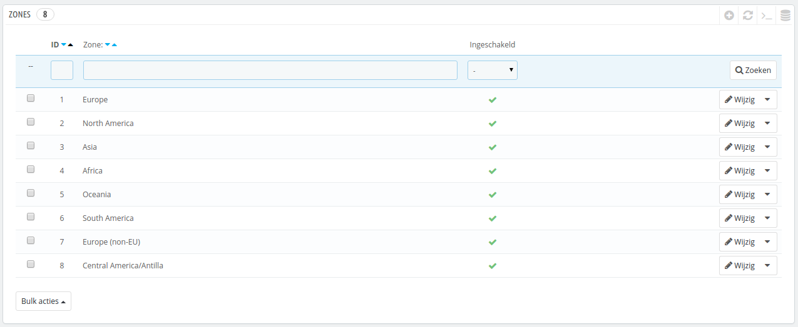
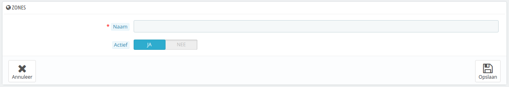

# Zones / gebieden

PrestaShop's zones zijn een lijst met subregio's in de wereld ([http://en.wikipedia.org/wiki/Subregion](http://en.wikipedia.org/wiki/Subregion)). Het helpt bij het categoriseren van landen.&#x20;

Wanneer nodig kunt u meer zones aanmaken: klik op de knop "Nieuwe zone toevoegen" om het aanmaakformulier te openen.

U heeft slechts de naam en status nodig, bijvoorbeeld om aan te geven dat u geen bestellingen toestaat in Oceanië.

Wanneer u in multistore-modus bent kunt u een zone ook koppelen aan een selectie van winkels.
