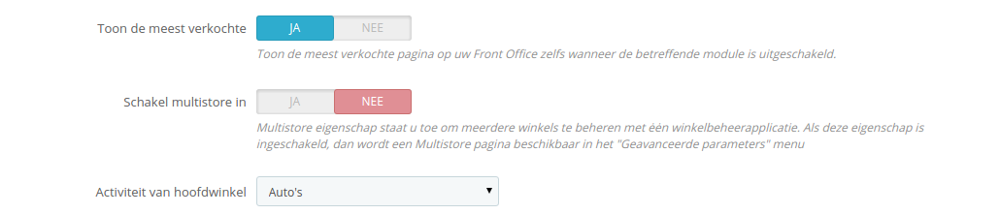

# Meerdere winkels beheren

Eén van de grotere functies binnen PrestaShop is de feature genaamd "multistore". Dit omvat de mogelijkheid om meerdere winkels te beheren vanuit één backoffice.

Dankzij deze feature kunt u veel aangepaste winkel beheren, welke gedeelde elementen hebben. Voor een verhoogde efficiëntie kunt u zelfs winkelgroepen aanmaken.

## Hoe te bepalen of u de multistore-mogelijkheid nodig hebt 

U wilt mogelijk de multistore-mogelijkheid inschakelen, maar wellicht is het niet nodig. Bijvoorbeeld wanneer u een meertalige webwinkel wilt maken, of als u meer dan één valuta toevoegt of als u een ander sjabloon wilt toepassen voor elke categorie.

Hier zijn twee vragen die u moet stellen, voordat u besluit om de multistore-mogelijkheid in te schakelen:

1. Wilt u dat uw winkels verschillende prijzen tonen voor hetzelfde product (naast speciale kortingen voor een klant of klantgroep).\
   **Als het antwoord 'ja' is, dan hebt u de multistore-mogelijkheid nodig.**
2. Als een klant in één winkel koopt, wilt u dan dat de klant geen toegang heeft tot de bestelgeschiedenis en facturen van de andere winkel (zelfs als de klant dezelfde inloggegevens heeft voor beide winkels)?\
   **Als het antwoord 'ja' is, dan heb u de multistore-mogelijkheid nodig**: de winkels delen de winkelwagens en bestellingen niet met elkaar en klanten die items in hun winkelwagen voor winkel 1 stoppen, zien de items van de winkelwagen van winkel 2 niet.

Als het antwoord 'nee' is op beide vragen, dan is de multistore-mogelijkheid niet voor u geschikt.

## De multistore-mogelijkheid inschakelen 

Uw PrestaShop-installatie wijzigen in een multistore-winkel gaat als volgt:

1. Log in op uw beheerpaneel.
2. Ga naar het menu "Instellingen" en kies de pagina "Algemeen".
3. Zoek naar de optie met de naam "Schakel multistore in" en kies "Ja".
4. Bewaar uw veranderingen.

De multistore-mogelijheid is nu ingeschakeld en de pagina "Multistore" is nu zichtbaar onder het menu "Geavanceerde instellingen". Dit is de pagina waar u de verschillende winkels kunt beheren binnen uw PrestaShop-installatie.

## De multistore-mogelijkheid gebruiken 

* [De multistore-interface](de-multistore-interface.md)
* [Een nieuwe winkelgroep aanmaken](een-nieuwe-winkelgroep-aanmaken.md)
* [Een nieuwe winkel aanmaken](een-nieuwe-winkel-aanmaken.md)
* [Een URL voor de winkel instellen](een-url-voor-de-winkel-instellen.md)
* [Gebruiksvoorbeelden](gebruiksvoorbeelden.md)
