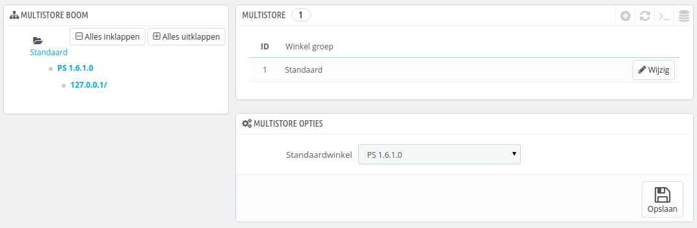
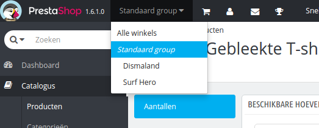
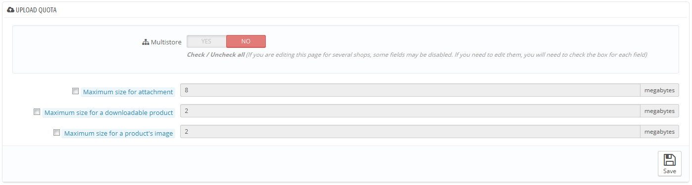

# De multistore-interface

## Uw winkels beheren 

De pagina "Multistore" bestaat uit drie hoofdsecties:

* **Multistore boom**. Geeft een totaaloverzicht van uw winkelgroepen, en zelfs de URL's.\
  Standaard is er één winkel in de standaardgroep: de hoofdwinkel.
* **Multistore tabel**. Toont de beschikbare winkelgroepen. U kunt ze wijzigen door te klikken op de knop "Wijzig".
* **Multistore opties**. Toont de beschikbare opties voor de huidige winkels.
  * **Standaardwinkel**. De standaardwinkel is de winkel die als centrale hub dient voor alle andere (producten, vervoerders, etc.) en is de winkel die als eerste verschijnt wanneer u inlogt in uw administratiepaneel.

## Eén backoffice om ze allemaal te beheren 

Als de multistore-mogelijkheid is ingeschakeld voor uw PrestaShop-instalatie, dan kunnen veel aspecten van PrestaShop aangepast worden per winkel of per winkelgroep.

Dit helpt u bij het begrijpen voor welke winkels de wijzigingen gelden en PrestaShop toont een dropdown-selector aan de bovenkant van elk scherm waar u de omvang van uw wijzigingen kunt bepalen:

* Toepassen op alle winkels binnen uw PrestaShop-installatie.
* Toepassen op winkels binnen de geselecteerde groep.
* Toepassen op de geselecteerde winkel.

Deze shopkiezer toont u voor welke winkels de wijzigingen gelden.

Zodra de multistore-mogelijkheid is ingeschakeld kunnen veel reguliere instellingen op een globale (alle winkels) schaal (vooral de instellingspagina's: lokalisatie, instellingen, geavanceerde instellingen, administratie) worden gewijzigd en daarom worden de opties uitgeschakeld in andere selecties. U kunt nog steeds te instellingen op een kleinere schaal (per winkelgroep of zelfs per winkel) aanpassen als dat nodig is.

Configuratiepagina's zullen er nog steeds hetzelfde uitzien als de winkelselector op "Alle winkels" staat, terwijl als er een kleinere schaal gekozen wordt (winkelgroep of enkele groep) er meer opties ontstaan:

* De optie "Ja/Nee" boven elke sectie op de configuratiepagina.
* Een checkbox naast elke optie.

Beide zijn geschikt voor hetzelfde doel: instellingen inschakelen die anders in de huidige winkelcontext niet beschikbaar zouden zijn. U kunt de opties kiezen die u wilt inschakelen of u kunt de optie laten gelden voor alle winkels met de Ja/Nee optie. Zodra dit is ingeschakeld is het aan u opm de waarde van elke optie aan te passen.

Sommige opties kunnen niet gewijzigd worden in een lokale context: ze tonen de melding "U heeft meer dan één winkel. U moet minstens één winkel selecteren om de betaling te configureren."

De volgende tabel geeft aan welke instellingen beschikbaar zijn onder welke context.

| Item                                                                                                                                                                                                                                 | Per winkel | Per winkelgroep | Alle winkels |
| ------------------------------------------------------------------------------------------------------------------------------------------------------------------------------------------------------------------------------------ | ---------- | --------------- | ------------ |
| Medewerkers                                                                                                                                                                                                                          | X          | X               | X            |
| Klantengroepen                                                                                                                                                                                                                       | X          | X               | X            |
| Producten                                                                                                                                                                                                                            | X          | X               | X            |
| — Prijzen                                                                                                                                                                                                                            | X          | X               | X            |
| — Combinaties en prijzen                                                                                                                                                                                                             | X          | X               | X            |
| — Talen                                                                                                                                                                                                                              | X          | X               | X            |
| — Meerdere afbeeldingen (**behalve de hoofdafbeelding**)                                                                                                                                                                             | X          | X               | X            |
| 
— Beschikbare hoeveelheid voor verkoop, gegeven dat:
<ul><li>De optie "Deel beschikbare voorraad voor verkoop" is ingeschakeld,</li><li>De groep deelt de beschikbare hoeveelheid voor verkoop niet buiten de groep.</li></ul> | X          | X               |              |
| — Alle overige informatie (beschrijving, tags, vriendelijke URL, etc.)                                                                                                                                                               | X          | X               | X            |
| Cataloguswaarden en -attributen                                                                                                                                                                                                      | X          | X               | X            |
| Kortingen: winkelwagenregels                                                                                                                                                                                                         | X          |                 |              |
| Kortingen: catalogus prijsregels                                                                                                                                                                                                     | X          |                 |              |
| Belastingen: belastingregels                                                                                                                                                                                                         | X          | X               | X            |
| Categorieën (**behalve de hoofdafbeelding**)                                                                                                                                                                                         | X          | X               | X            |
| Vervoerders                                                                                                                                                                                                                          | X          | X               | X            |
| Magazijnen                                                                                                                                                                                                                           | X          | X               | X            |
| Geavanceerd voorraadbeheer                                                                                                                                                                                                           | X          |                 |              |
| Leveranciers                                                                                                                                                                                                                         | X          | X               | X            |
| Fabrikanten                                                                                                                                                                                                                          | X          | X               | X            |
| CMS-pagina's                                                                                                                                                                                                                         | X          | X               | X            |
| Contacten                                                                                                                                                                                                                            | X          | X               | X            |
| 
Landen  De status van een land (in- of uitgeschakeld) is gelijk tussen gekoppelde winkels.
                                                                                                                                 | X          | X               | X            |
| Valuta                                                                                                                                                                                                                               | X          | X               | X            |
| Talen                                                                                                                                                                                                                                | X          | X               | X            |
| Modules                                                                                                                                                                                                                              | X          | X               | X            |
| — Haken en uitzonderingen                                                                                                                                                                                                            | X          | X               | X            |
| — In- en uitschakelen                                                                                                                                                                                                                | X          | X               | X            |
| — Configuratie (bijvoorbeeld inloggegevens van PayPal)                                                                                                                                                                               | X          |                 |              |
| Betaalmodules                                                                                                                                                                                                                        | X          | X               | X            |
| — Landbeperkingen                                                                                                                                                                                                                    | X          |                 |              |
| — Valutabeperkingen                                                                                                                                                                                                                  | X          |                 |              |
| — Beperkingen tussen klantengroepen                                                                                                                                                                                                  | X          |                 |              |
| Vriendelijke URL's                                                                                                                                                                                                                   | X          |                 |              |
| Scènes                                                                                                                                                                                                                               | X          | X               | X            |
| Web service account                                                                                                                                                                                                                  | X          | X               | X            |
| Homepage image slider                                                                                                                                                                                                                | X          |                 |              |

Notities

**Categorieën**: een product kan alleen verschijnen binnen een gegeven categorie van een winkel als het gekoppeld is met de categorie binnen de context van de winkel. Met andere woorden: als winkel A en B allebei categorie C hebben, kunnen we de producten P zichtbaar maken in categorie C binnen winkel A, maar niet binnen winkel B.

**Vervoerders**: u kunt vervoerders koppelen per winkel of winkelgroep, maar niet aanpassen per winkel. U moet de vervoerder dupliceren als u dezelfde vervoerder wilt gebruiken met verschillende prijzen in meerdere winkels.

**Magazijnen**: terwijl geavanceerd voorraadbeheer alleen gebruikt kan worden per winkel per keer, kunnen magazijnen binnen winkelgroepen gebruikt worden en u kunt de magazijnen op dezelfde manier blijven beheren voor geavanceerd voorraadbeheer.

Voor elke winkel kunt u specifieke prijzen instellen voor producten, een deel van de catalogus delen of helemaal, productafbeeldingen wijzigen, etc.

U kunt ervoor kiezen om dezelfde klantaccounts te delen tussen winkels waarmee de inloggegevens van klanten worden gedeeld en ze binnen beide winkels ingelogd blijven.

Met geavanceerd voorraadbeheer kunt u precisiewerk toepassen op de koppelingen met uw winkels en magazijnen.
