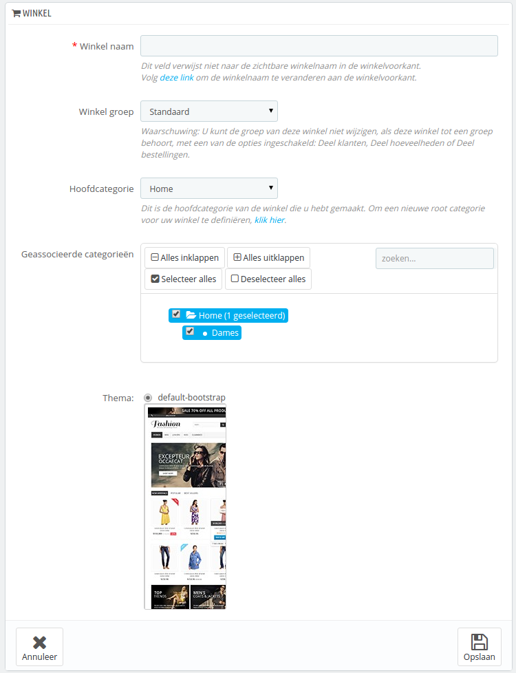
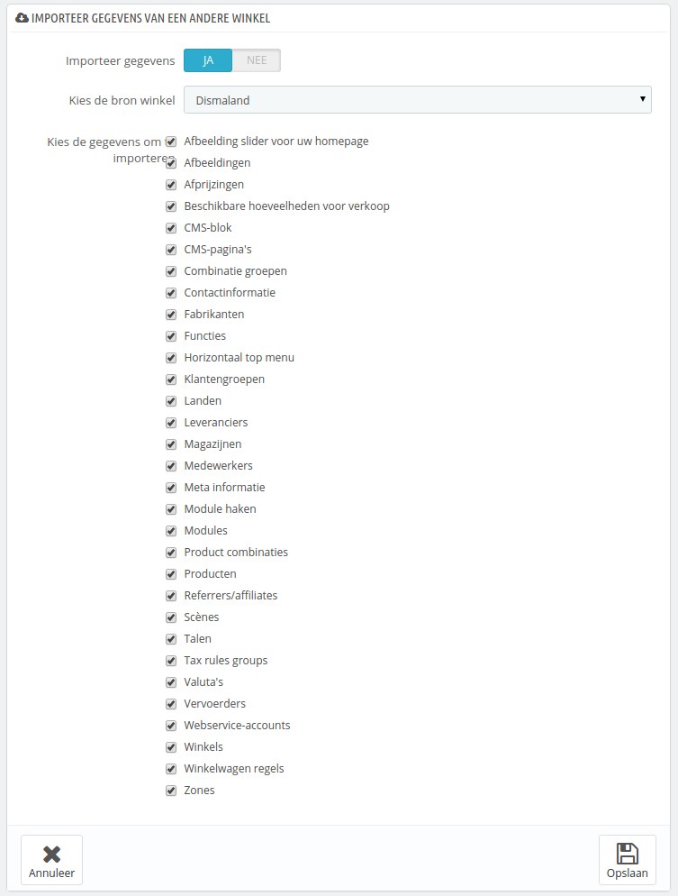

# Een nieuwe winkel aanmaken

Het aanmaakformulier, te bereiken vanaf de pagina "Multistore", maakt het mogelijk om zowel het uiterlijk van de frontoffice (het thema) als de elementen die u wenst te importeren vanuit de hoofdwinkel mee te nemen naar deze nieuwe winkel.

Door te klikken op de knop "Voeg nieuwe winkel toe" worden er twee nieuwe secties zichtbaar. De eerste heeft vijf opties:

* **Winkel naam**. De naam is openbaar: klanten zullen het op veel plaatsen terug zien, zoals de titel van de site of in de e-mails. Zorg ervoor dat de naam goed past bij de winkel.
* **Winkel groep**. Een winkel is beperkt tot één groep. Ook **moet** het bij een groep horen: het kan niet bestaan zonder groep – zelfs als het de enige winkel is binnen de groep.\
  U kunt de winkel niet achteraf verplaatsen naar een andere groep als u binnen de groep één van de drie opties hebt ingeschakeld ("Klanten delen", "Deel beschikbare voorraad voor verkoop", "Orders delen").
* **Hoofdcategorie**. Terwijl de hoofdwinkel de hoofdcatalogus heeft als hoofdcategorie, kan elke andere winkel dezelfde hoofdcategorie gebruiken of een andere categorie gebruiken als hoofdcategorie – effectief is de andere categorie een subcategorie van de hoofdcategorie van de hoofdcatalogus.
* **Geassocieerde categorieën**. Als toevoeging op de mogelijkheid om de catalogus van een winkel te beperken tot een subset van de hoofdcatalogus (zie de optie "Hoofdcategorie" hierboven), kunt u ervoor kiezen om sommige subcategorieën van de hoofdcategorie beschikbaar te stellen in deze winkel.
* **Thema**. U kunt één van de beschikbare thema's gebruiken als thema voor deze winkel. Effectief zorgt dit ervoor dat u precies dezelfde catalogus beschikbaar kunt stellen in twee verschillende winkels, met een verschillend thema, URL of zelfs prijzen.

De tweede sectie "Importeer gegevens van een andere winkel" is waar u de data kunt bepalen die geïmporteerd wordt vanuit een andere winkel.

Het heeft twee opties:

* **Importeert gegevens**. Als deze is uitgeschakeld, dan zal uw winkel geen gegevens delen met een andere winkel, en de sectie wordt gesloten. Dit kan nuttig zijn wanneer u twee compleet verschillende winkels wilt, maar het betekent ook dat u beide winkels van A tot Z moet configureren. Het delen van gegevens zorgt ervoor dat u vervoerders, valuta, modules niet opnieuw hoeft in te stellen. Zorg ervoor dat u goed nadenkt over deze optie, want u kunt niet terugkeren.
* **Kies de bron winkel**. Als u wenst de data te importeren, dan moet u aangeven uit welke winkel de brongegevens komen. Als u al een subwinkel hebt ingesteld, dan kan deze optie helpen bij het kopiëren van de subwinkel.
* **Kies de gegevens om te importeren**. Dit is waar u besluit welke data u wilt importeren vanuit de bronwinkel. Op zijn minst moet u de modules importeren, zelfs als er een aantal uitgeschakeld moet worden, omdat de frontoffice-thema's soms afhankelijk zijn van modules.

Wanneer u een nieuwe product aanmaakt in de nieuwe winkel en dat product bestaat al in een andere winkel, dan doet PrestaShop haar best om de gegevens van het huidige product te suggereren, zodat u niet alles opnieuw hoeft toe te voegen.

Wanneer de winkel bewaart krijgt u een waarschuwing van PrestaShop dat het nog geen URL heeft. Klik op de rode waarschuwing om er één toe te voegen (zie hoofdstuk [Een URL voor de winkel instellen](een-url-voor-de-winkel-instellen.md)).
