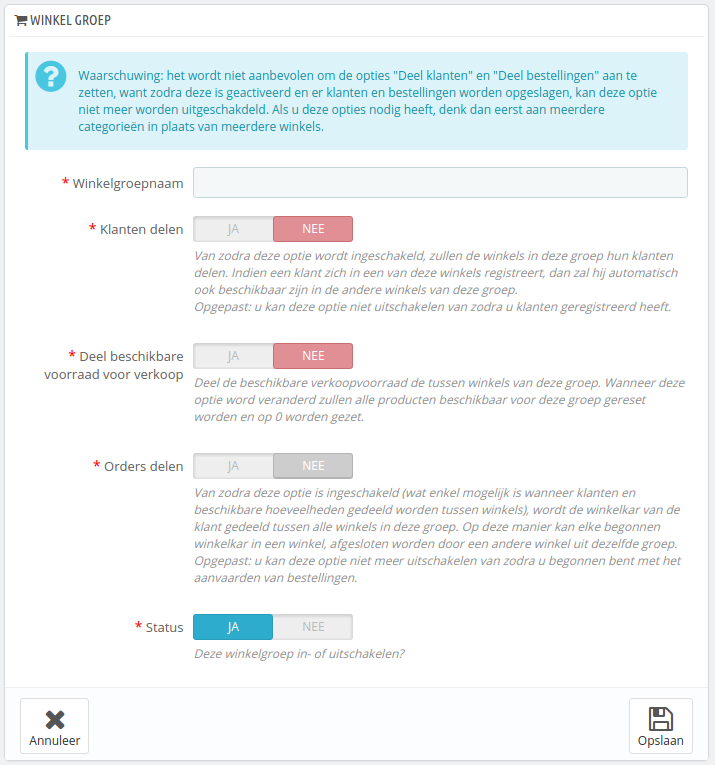

# Een nieuwe winkelgroep aanmaken

Door winkelgroepen te gebruiken kun u gemakkelijk onderdelen uitwisselen tussen winkels binnen de groep: catalogus, medewerkers, vervoerders, modules, etc. Het zorgt ervoor dat u winkelgroepen net zo gemakkelijk kunt beheren als een enkele groep, terwijl u nog steeds de details van elke winkel handmatig kunt instellen.\
Nieuwe instellingen toepassen op alle winkels vereist slechts één actie. Wanneer u zich in multistore-modus bevindt, verschijnt er een dropdown-menu op de meeste administratiepagina's waarmee u het bereik van uw aanpassingen kunt filteren op winkel of winkelgroep.

Technisch gezien, wanneer u een winkelgroep selecteert in het dropdown-menu, dan reflecteert de getoonde entiteit de **vereniging** van de entiteiten binnen de winkelgroep.

Algemeen gezien, worden de instellingen toegepast op alle entiteiten die tot de entiteit in het multistore-dropdown-menu. Dit wordt verder in dit hoofdstuk beschreven.

Door te klikken op de knop "Voeg nieuwe winkel groep toe" wordt er een formulier geopend met slechts een paar velden, maar wel veel tekst: u moet ervoor zorgen dat u alle beschrijvingen goed leest. Omdat sommige opties niet ongedaan gemaakt kunnen worden, is het belangrijk dat u weet waar u mee bezig bent.

De beschikbare instellingen zijn:

* **Winkelgroepnaam**. De naam is privé, klanten kunnen deze niet zien. Zorg nog steeds voor een duidelijke naam: hoe meer groepen u hebt, hoe beter de benamingen moeten zijn. U kunt de naam desnoods later nog aanpassen.
* **Klanten delen**. _**Zodra deze ingeschakeld kunt u de optie niet meer uitschakelen.**_ Dit is handig wanneer u wilt dat klanten dezelfde logingegevens kunnen gebruiken binnen alle winkels in de winkelgroep.
* **Deel beschikbare voorraad voor verkoop**. U kunt verschillende hoeveelheden voor verkoop instellen voor dezelfde producten binnen de winkelgroep. Met deze optie hebben alle winkels binnen de groep toegang tot dezelfde voorraadgegevens van producten.
* **Orders delen**. _**Zodra deze is ingeschakeld kunt u de optie niet meer uitschakelen**_. Deze optie kan alleen worden ingeschakeld als de opties "Klanten delen" en "Deel beschikbare voorraad voor verkoop" zijn ingeschakeld. Met deze optie kunnen klanten ook de bestelgeschiedenis van andere winkels binnen de groep bekijken.
* **Status**. Kies ervoor om de groep gelijk in te schakelen of later. U kunt deze optie desnoods later aanpassen.

Twee winkelgroepen kunnen geen klanten, winkelwagens of bestellingen delen.

Bestaande winkelgroepen kunnen bewerkt worden vanuit de winkelgroepenlijst op de pagina "Multistore": klik op de knop "Wijzig" naast de winkel om het formulier te openen. Zoals verwacht kunt u niet de opties "Klanten delen" en "Orders delen" aanpassen.
