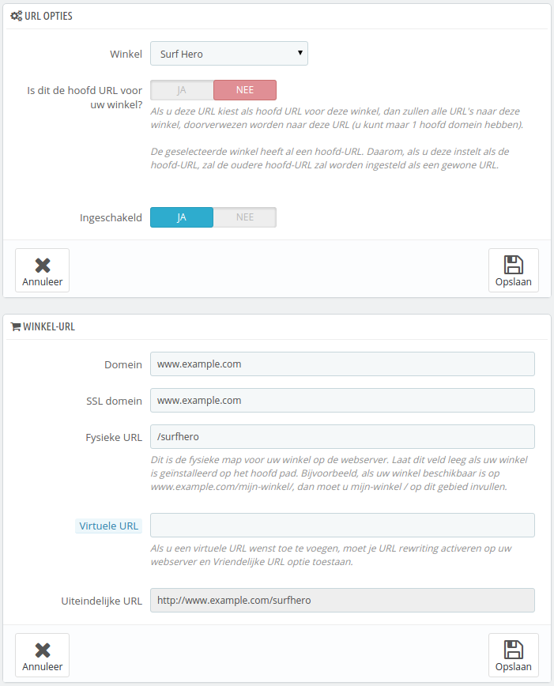

# Een URL voor de winkel instellen

Elke winkel kan zijn eigen webadres hebben (URL) – of zelfs verschillende adressen – afhankelijk van de hoofdwinkel (de eerste winkel die u hebt geïnstalleerd).\
U moet minstens één adres opgeven voor elke winkel.

**Een adres kan niet gedeeld worden tussen winkels**. Als u een URL probeert toe te wijzen aan een winkel die al in gebruik is, dan geeft PrestaShop een foutmelding.\
Aan de andere kant kunt u zoveel winkels hebben op één domeinnaam als u zelf wilt:

*   Gebruikmakend van submappen: [http://www.example.com/men/](http://www.example.com/men/), [http://www.example.com/women/](http://www.example.com/women/), [http://www.example.com/kids/](http://www.example.com/kids/), [http://www.example.com/pets/](http://www.example.com/pets/), etc.

    In het geval van winkels met submappen, zorg er voor dat u twee URL's aanmaakt voor elke winkel: één met de "www." en één zonder!

    Bijvoorbeeld: [http://www.example.com/men/](http://www.example.com/men/) en [http://example.com/men/](http://example.com/men/)

    Anders kan het voorkomen dat als klanten uw tweede winkel proberen te bereiken zonder de "www.", ze teruggestuurd worden naar de hoofdwinkel.
* Gebruikmakend van subdomeinen: [http://men.example.com/](http://men.example.com/), [http://women.example.com/](http://women.example.com/), [http://kids.example.com/](http://kids.example.com/), [http://pets.example.com/](http://pets.example.com/), etc.

Maak zelf geen subdomein of submap aan, op uw server of computer: PrestaShop houdt zelf rekening met het pad voor u en op uw server. Zodra de klant het pad opvraagt, herkent PrestaShop de winkel en serveert het de juiste bestanden en data voor de juiste winkel. Wel moet u uw DNS-instellingen aanpassen aan de subdomeinen.

Natuurlijk kan elke winkel ook zijn eigen domeinnaam hebben.

Een domeinnaam gebruiken

Als u een verschillende domeinnaam wilt koppelen aan andere winkels, in plaats van een winkel met een subdomain/submap, dan moet u dit domein configureren om te verwijzen naar PrestaShop. Het herschrijven van de URL wordt door PrestaShop zelf gedaan.

Als alternatief kunt u een alias voor uw domeinnaam aanmaken dat naar de absolute URL van uw PrestaShop-installatie verwijst. De manier om dit te bereiken hangt af van het controlepaneel en de opties die uw hostingprovider biedt: "Alias" voor Plesk, "Forward" voor CPanel, "Aliasdomain" voor ISPConfig, etc.

Om een URL aan een winkel toe te voegen, selecteert u de winkel in de "Multistore boom"-selector en klikt u op de knop "Voeg nieuwe URL toe". PrestaShop laadt daarna een nieuw scherm met twee secties en acht opties:

* **URL opties**.
  * **Winkel**. Een herinnering om te tonen over welke winkel het gaat. U kunt hier ook een andere winkel kiezen.
  * **Hoofd URL**. Door dit in te schakelen geeft u aan dit u wilt dat alle andere URL's van deze winkel verwijzen naar deze hoofd-URL (waardoor de vorige hoofd-URL een gewone URL wordt).
  * **Status**. U kunt de URL in- en uitschakelen op elk gewenst moment.
* **Winkel-URL**.
  * **Domein**. De domeinnaam van de winkel zelf. Het hoeft niet beperkt te zijn tot een domeinnaam: u kunt ook een subdomein opgeven als u dat wilt. Zorg ervoor dat u geen `http://` toevoegt. Voorbeeld: `www.example.com` of `kids.example.com`.
  * **SSL domein**. Als uw SSL-domein verschilt van uw hoofddomein, vult u hier het SSL-domein in. Voorbeeld: `veilig.example.com` of `secure.example.com`.
  * **Fysieke URL**. Hier is waar u het fysieke pad naar uw installatie op uw server kunt opgeven. Als de shop zich op de root van de domein of subdomein bevindt, laat u dit veld leeg. Voorbeeld: `/` of `/kids`.
  * **Virtuele URL**. U kunt de winkel transparant beschikbaar maken voor klanten door deze optie te gebruiken: door middel van URL's herschrijven kunt u een winkel weergeven zonder een fysieke submap te hebben. Natuurlijk moet URL herschrijven zijn ingeschakel in PrestaShop (Vriendelijke URLs op de pagina "SEO & URLs" onder het menu "Instellingen"). Voorbeeld: `/shoes/`/ Dit werkt alleen voor winkels op een subdomein, niet voor een submap.
  * **Uiteindelijke URL**. Geeft de uiteindelijke URL weer die bovenstaande instellingen hebben veroorzaakt.

