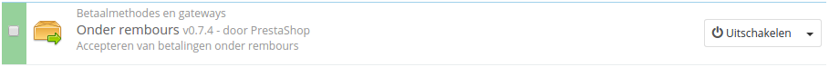
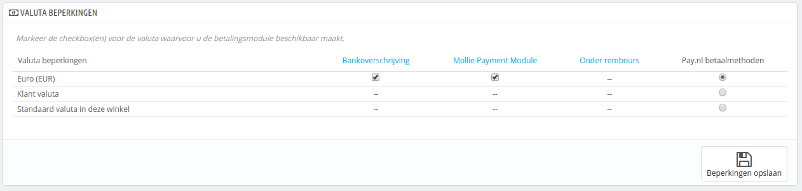
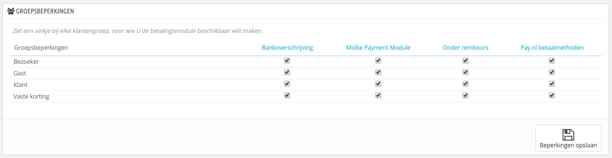
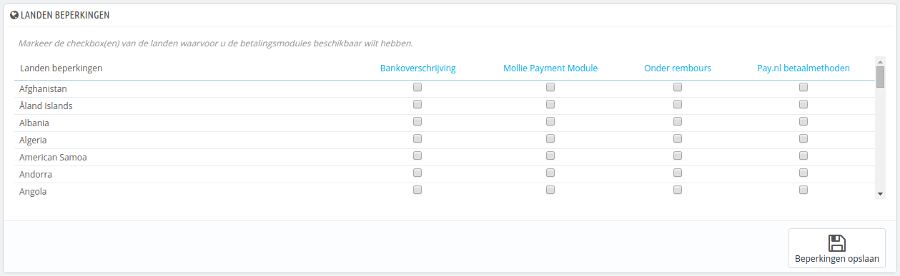

# Betaalinstellingen

Met PrestaShop kunt u geld van klanten accepteren door middel van verschillende betaalmethodes, zoals acceptgiro, bankoverschrijvingen, rembours en met verschillende partnermodules, zoals PayPal, MoneyBookers, HiPay, etc.

Op de pagina "Betaling", kunt u de volgende secties zien:

* **Modulelijst**. In feite een snelkoppeling naar de categorie "Betaalmethodes en gateways" van de modulelijst. U kunt modules direct vanaf deze pagina installeren.
* Drie secties voor beperkingen:
  * **Valuta beperkingen**. Kies met welke valuta de geïnstalleerde betaalmodule zou moeten werken.
  * **Groepsbeperkingen**. Kies voor elke klantgroepen de geïnstalleerde betaalmethoden zou moeten werken.
  * **Landen beperkingen**. Kies voor welke landen de geïnstalleerde betaalmethoden zouden moeten werken.

## Een betaalmodule installeren 

Het installeren van een betaalmodule is in feite niet anders dan het installeren van een gewone module: klik simpelweg op de knop "Installeren" en alles wat overblijft is de module zelf nog configureren.\
U moet veel aandacht besteden aan de instellingen er ervoor zorgen dat ze verwijzen naar uw adres of bankrekening. Het configureren van betaalmodules betekent vaak dat u zich eerst bij de payment service provider moet registereren, oftewel een account hebben bij hun service.

Laten we de module "Onder rembours" installeren. Zoek naar de module in de lijst en klik op de knop "Installeren". Alles wat overblijft is het configureren van de module.\
PrestaShop toont een notificatie aan de bovenkant van de pagina. In het geval van de module "Onder rembours" is er niets te configureren.

## Valuta beperkingen 

Afhankelijk van de betaling kan de valutakeuze van de klanten verschillen.\
U kunt de aangeboden betaalmethoden beperking tot valuta: u kunt er bijvoorbeeld voor zorgen dat klanten kunnen betalen met elke valuta wanneer ze PayPal gebruiken, maar bij Moneybookers bijvoorbeeld alleen met dollars kunnen betalen.

Standaard is alleen de standaardvaluta van uw winkel beschikbaar. Als u er meer nodig hebt, volgt u dit proces:

1. Op de pagina "Localisatie" onder het menu "Localisatie" importeert u het localisatiepakket voor het land dat de valuta heeft waarin u geïnteresseerd bent. Bijvoorbeeld Verenigde staten voor dollars, Verenigd Koninkrijk voor ponden, etc.
2. Op de pagina "Valuta" onder het menu "Localisatie", schakelt u de valuta in die u zojuist hebt geïmporteerd.

Als u het gebruikt van de betaalmethode wilt beperken aan de hand van de valuta van de gebruiker, dan vinkt u de juiste checkboxen aan en klikt u op "Beperkingen opslaan".

Let op dat valutabeperkingen op verschillende manieren werken, afhankelijk van de betaalmodule:

* Voor sommige, zoals Onder rembours, kunt u de standaardinstellingen niet wijzigen.
* Voor anderen, zoals Bankoverschrijving, Betaling per cheque, Skrill, Ogone, etc. kunt u de valutainstellingen wijzigen, behalve voor "Klant valuta" en "Standaard valuta in deze winkel", welke op hun standaardinstellingen blijven.
* Daarna, voor andere modules zoals HiPay of PayPal, kunt u de valutainstellingen wel wijzigen, maar is uw keuze beperkt tot maar één optie.

De klant kan zijn of haar valuta wijzigen door middel van het dropdown-menu aan de bovenkant van elke frontoffice-pagina.

The customer can set his or her currency using the drop-down menu at the top of each front office page.

U kunt de standaardvaluta aanpassen op de pagina "Localisatie" onder het menu "Localisatie".

Als u de standaardvaluta wilt wijzigen _nadat_ u eerst sommige producten hebt geconfigureerd, dan moet u de prijzen voor deze producten herstellen. U kunt het beste de standaardvaluta instellen voordat u uw eerste product toevoegt.

## Groepsbeperkingen 

U kunt de keuze voor beschikbare betaalmethoden limitiren aan de hand van klantengroep: u kunt een aantal klantengroepen instellen waarin klanten toegang hebben tot meer betaalmethoden dan gewone klanten.

U kunt er bijvoorbeeld voor kiezen dat reguliere klanten betalen met PayPal, Skrill en HiPay, terwijl zakelijke gebruikers alleen afrekenen met een bankoverschrijving. Afhankelijk van het type gebruiker en uw keuzes, kunnen klanten alleen betalen met de methodes die u hebt gekozen.

## Landbeperkingen 

U kunt de keuze limiteren tot het land van de klant. U kunt er bijvoorbeeld voor zorgen dat alle betaalmethoden voor klanten uit Frankrijk, Spanje en Duitsland beschikbaar zijn, terwijl klanten uit Italië, het Verenigd Koninkrijk en Zwitserland alleen kunnen betalen per bankoverschrijving.

De tabel toont alle landen die bekend zijn. Als er één ontbreekt, dan kunt u deze toevoegen via de pagina "Landen" onder het menu "Localisatie".

Ook hier, net als bij valutabeperkingen, zijn de beschikbare opties afhankelijk van de betaalmodule.

* Voor sommige is de enige optie uw eigen land.
* Voor andere zijn de enige opties de landen die ondersteund worden door de service: Oostenrijk, België, Frankrijk, etc.
* Alle andere vooraf geïnstalleerde modules zouden moeten werken met alle landen.

Zoek het land op in de alfabetische lijst en vink de boxen aan om een land te selecteren of te deselecteren, zodat u de betaalmethoden al dan niet beschikbaar kunt maken voor dat land. Zodra alle instellingen zijn geconfigureerd, klikt u op de knop "Beperkingen opslaan", te vinden aan de onderkant van de tabel.\
Standaard zijn alle geïnstalleerde betaalmethodes beschikbaar voor alle landen.
