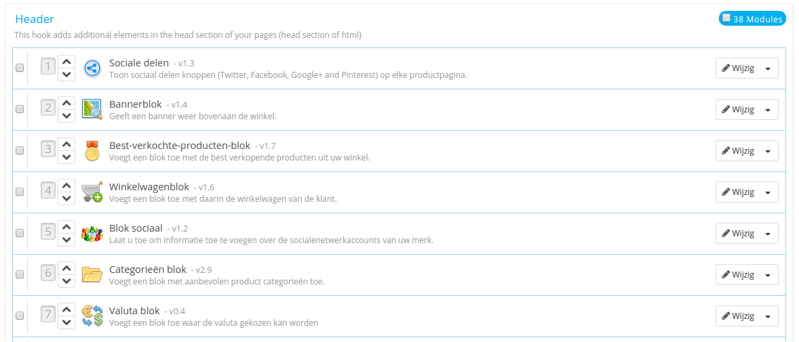
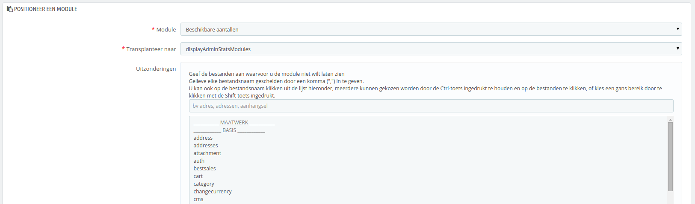
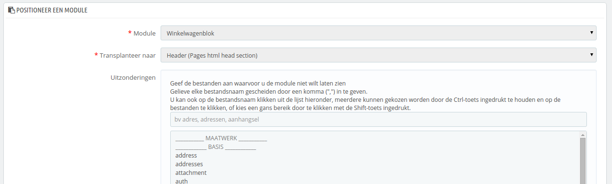
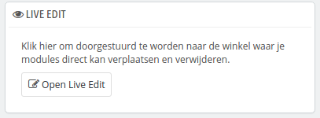
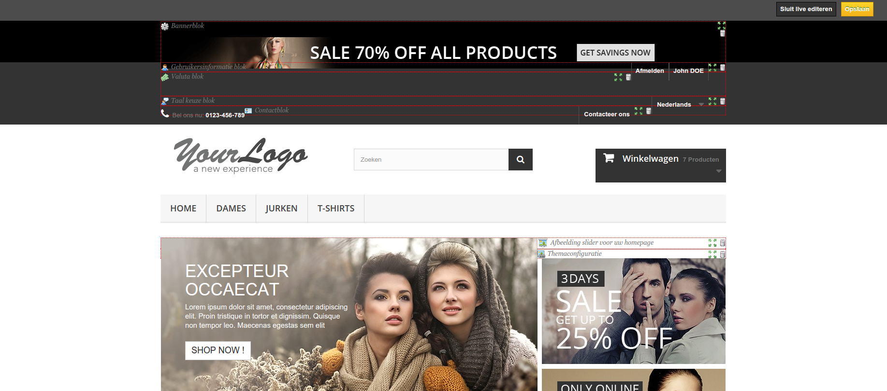

# Frontoffice-posities

/\*\<!\[CDATA\[\*/\
div.rbtoc1597237793572 {padding: 0px;}\
div.rbtoc1597237793572 ul {list-style: disc;margin-left: 0px;}\
div.rbtoc1597237793572 li {margin-left: 0px;padding-left: 0px;}\
\
/\*]]>\*/

* [Frontoffice-posities](frontoffice-posities.md#Frontoffice-posities-Frontoffice-posities)
  * [Een module verplaatsen binnen een haak](frontoffice-posities.md#Frontoffice-posities-Eenmoduleverplaatsenbinneneenhaak)
  * [Een module inhaken op een haak: transplanteren](frontoffice-posities.md#Frontoffice-posities-Eenmoduleinhakenopeenhaak:transplanteren)
  * [Een gepositioneerde module bewerken](frontoffice-posities.md#Frontoffice-posities-Eengepositioneerdemodulebewerken)
  * [Een module losmaken van een haak](frontoffice-posities.md#Frontoffice-posities-Eenmodulelosmakenvaneenhaak)
  * [Een module visueel positioneren: Live Edit](frontoffice-posities.md#Frontoffice-posities-Eenmodulevisueelpositioneren:LiveEdit)
    * [Waar moeten de module naartoe?](frontoffice-posities.md#Frontoffice-posities-Waarmoetendemodulenaartoe?)
  * [Een module transplanteren door de code aan te passen](frontoffice-posities.md#Frontoffice-posities-Eenmoduletransplanterendoordecodeaantepassen)

Een module kan twee weergaven hebben: één in de backoffice (de opties, of zelfs een configuratiescherm) en één in de frontoffice. De frontoffice-weergave is hoe en waar de module wordt getoond binnen het thema van uw winkel.

De positie van een module in uw thema kan gewijzigd worden, want u wilt wellicht dat een blok van uw module hoger wordt geplaatst (of lager) op de pagina dan anderen. In PrestaShop-terminologie heet dit ook wel het "transplanteren" van een module, en wordt gedaan door middel van de tool op de pagina "Posities", onder het menu "Modules en Services". Dit zorgt er effectief voor dat u een module inhaakt op de vele haken die beschikbaar zijn in het huidige thema, zonder dat u code hoeft te schrijven.

De pagina "Posities" toont alle beschikbare haken en de modules die zijn ingehaakt. Veel zijn standaard leeg, maar de meest nuttige kunnen veel modules hebben (de haak displayHeader heeft standaard 33 modules).



Aan de bovenkant van de pagina is er een dropdown-menu waarmee u alleen de haken kunt weergeven waarin u geïnteresseerd bent.\
Standaard toont deze pagina alleen de haken waar u functies op kunt positioneren. Door de checkbox "Laat niet-positioneerbare haken zien" aan te vinken, worden alle haken getoond, zelfs de haken waar u niets op kunt positioneren.

De bovenkant van de tabel van elke haak toont de naam van de haak, de technische naam (en voor sommige een korte beschrijving) en het aantal ingehaakte modules. De tabel geeft een lijst van alle modules die aan de haak zijn bevestigd.

De modules worden in dezelfde volgorde getoond zoals ze verschijnen binnen de haak.

## Een module verplaatsen binnen een haak <a href="#frontoffice-posities-eenmoduleverplaatsenbinneneenhaak" id="frontoffice-posities-eenmoduleverplaatsenbinneneenhaak"></a>

Er zijn twee manieren om de positie van een modules binnen een haak te wijzigen:

* Klik op de pijltjes. De pagina wordt opnieuw geladen en de nieuwe volgorde wordt getoond.
* De rij van de module slepen:
  1. Plaats de muiscursor over het positienummer, zodat de muiscursor veranderd in een "beweeg item" cursor.
  2. Klik en houdt de muisknop ingedrukt terwijl u de cursor beweegt naar de rij waar u wilt dat de module komt te verschijnen: de modulerijen worden gelijk bijgewerkt.
  3. Laat de muisknop los: de huidige positie van de module is bewaard.

Voor de meeste modules kan transplanteren gemakkelijk gedaan worden via de backoffice. Sommige modules vereisen dat u de code aanpast voordat u ze kunt positioneren.

## Een module inhaken op een haak: transplanteren <a href="#frontoffice-posities-eenmoduleinhakenopeenhaak-transplanteren" id="frontoffice-posities-eenmoduleinhakenopeenhaak-transplanteren"></a>

In PrestaShop is het "transplanteren", de actie waarmee een module wordt gepositioneerd op een haak .U kunt meer dan één module bevestigen aan een haak.

Er zijn twee dingen handig om te weten voordat u een module positioneert:

* Sommige modules zijn geschreven om alleen getransplanteerd te kunnen worden op een paar haken.
* Sommige haken zijn geschreven om sommige soorten modules niet te accepteren.

Weest er daarom van bewust dat u niet altijd een module kunt transplanteren op een haak.

Zorg ervoor dat u de cache uitschakelt wanneer u het effect van een nieuwe module op de frontend test. Dit kan u doen door naar de pagina "Prestaties" te gaan, onder het menu "Geavanceerde instellingen".

Het transplanteerproces heeft zijn eigen interface:

1. Ga naar het menu "Modules en Services" en daarvan de pagina "Posities".
2. Klik op de knop "Positioneer een module". Een nieuw venster wordt geopend.
3. In de dropdown-lijst met de naam "Module", selecteert u de module die u wilt positioneren.
4. In de dropdown-lijst met de naam "Translplanteer naar", selecteert u de module die u wilt transplanteren.
5. In het veld "Uitzonderingen", typt u de namen van de pagina's waar u liever niet hebt dat de module verschijnt.\
   U kunt er meerdere tegelijk selecteren door CTRL (of ⌘ voor OS X). U kunt bestanden op dezelfde manier deselecteren: CTRL+klik.
6. Vergeet niet uw wijzigingen op te slaan.



Het dropdown-menu "Transplanteer naar" geeft u een goed overzicht over waar modules geplaatst kunnen worden.

Ook al geeft de dropdown-lijst "Transplanteer naar" een duidelijk overzicht van de beschikbare haken, het kan nog steeds onduidelijk zijn, welke haak u wilt gebruiken om uw module aan te bevestigen. Probeer desnoods een andere haak als het resultaat van uw keuze niet is wat u had verwacht.\
De lijst geeft enkele details: sommige haken hebben een (Engelse) beschrijving achter de naam, bijvoorbeeld:  "This hook adds fields to the form 'attribute value'" voor `displayAttributeForm`. Bekijk de beschrijvingen om de juiste haak te kiezen.

## Een gepositioneerde module bewerken <a href="#frontoffice-posities-eengepositioneerdemodulebewerken" id="frontoffice-posities-eengepositioneerdemodulebewerken"></a>

Elke module heeft twee iconen aan de rechterzijde van de rij: één om de instellingen te bewerken en de andere om de module te verwijderen.

Het bewerken van de instellingen van een module gebruikt dezelfde interface als gebruikt wordt voor het transplanteren van een module. Het grote verschil is dat u niet de instellingen "Module" en "Transplanteer naar" kunt bewerken, omdat deze zijn uitgeschakeld (grijze kleur). U kunt slechts de instelling "Uitzonderingen" aanpassen, welke precies werkt zoals beschreven in sectie "Een module inhaken op een haak: transplanteren" hierboven.\
Ook al kunt u de instellingen "Module" en "Transplanteer naar" niet bewerken, toch kunnen ze een handige reminder zijn van hun huidige positie.



Als u een module wilt verplaatsen naar een andere haak dan moet u de transplanteerinterface gebruiken:

1. Klik op de knop "Transplanteer een module" aan de rechterbovenkant. De transplanteerinterface verschijnt.
2. In de dropdown-lijst "Module" selecteert u de module die u naar een andere haak wilt verplaatsen.
3. In de dropdown-lijst "Transplanteer naar" selecteert u waar u de haak aan wilt bevestigen.
4. In het veld "Uitzonderingen" typt u de naam van de bestand(en) van de pagina's waar u niet wilt dat de module verschijnt.
5. Bewaar uw veranderingen. De hakenlijst verschijnt.
6. Ga naar de haak waartoe u uw module hebt getransplanteerd: het zou daar moeten verschijnen. Verander de positie als dat nodig is.
7. Ga naar de haak waar de module eerst was, en klik op het prullenbak-icoontje om de module los te maken van de haak. Dit voorkomt dat u de module vaker ziet op de pagina.

Controleer altijd uw frontoffice om zeker te zijn dat de module zich op de juiste plek bevindt.

## Een module losmaken van een haak <a href="#frontoffice-posities-eenmodulelosmakenvaneenhaak" id="frontoffice-posities-eenmodulelosmakenvaneenhaak"></a>

Er zijn twee manier om een module los te maken van een haak:

* Een enkele module losmaken: klik op het prullenbak-icoontje naast de rij van de module.
* Meerdere modules tegelijk losmaken: selecteer de modules door de checkbox aan te vinken in hun rij, en klik daarna op de knop "Selectie ontkoppelen", deze kan aan de rechterbovenkant van de pagina gevonden worden.

## Een module visueel positioneren: Live Edit <a href="#frontoffice-posities-eenmodulevisueelpositioneren-liveedit" id="frontoffice-posities-eenmodulevisueelpositioneren-liveedit"></a>

Een andere manier om modules te positioneren op de homepage van de winkel is de 'Live Edit'-modus, deze toont de homepage samen met de tool, zodat u gelijk kunt zien waar uw modules zich bevinden. U kunt de optie vinden op de pagina "Posities" en daarna te klikken op knop "Open Live Edit".



Wanneer u hierop klikt, dan opent PrestaShop de homepage in een nieuw browsertabblad of -venster, met het Live Edit script:

* Alle moduleblokken hebben een rood gestippelde lijn, waarmee u kunt zien welke blokken u kunt verplaatsen.
* Aan de linkerbovenkan verschijnt het icooontje van het bllok, samen met de naam van het blok, waarmee u gemakkelijk hjet juiste blok kunt vinden.
* Aan de rechterbovenkant verschijnen twee iconen:
  1. Een "verplaatsen" icoon: klik hierop om de module te bewegen.
  2. Een "prullenbank" icoon: klik hierop om de module te verwijderen van de homepage.



Aan de bovenkant van de "Live Edit"-modus wordt een taakbalk getoond met twee knoppen: "Sluit live editeren" en "Opslaan".

De knop "Opslaan" is vanzelfsprekend; de andere maakt alle wijzigingen op de "Live Edit"-pagina ongedaan en sluit de sessie.

Zodra u een module hebt verwijderd en u wilt deze terugbrengen, dan moet u naar de pagina "Posities" en het formulier "Positioneer een module" gebruiken.

### Waar moeten de module naartoe? <a href="#frontoffice-posities-waarmoetendemodulenaartoe" id="frontoffice-posities-waarmoetendemodulenaartoe"></a>

Module kunnen niet vrijuit worden bewogen: het is afhankelijk van zowel de haken van het thema als de ondersteuning vanuit een module voor een haak (zoals in bovenstaande sectie). Daarom kunt u alleen modules verplaatsen binnen de context die zij begrijpen: kolom-modules kunnen alleen in een kolom worden geplaatst, terwijl reguliere homepage-modules (in het midden) alleen in hun eigen kolom verplaatst kunnen worden.

Om u een visuele hint te geven of een module bewogen kan worden, wordt er een groen blok getoond als de locatie correct is en een leeg rood blok wanneer dat niet het geval is.

## Een module transplanteren door de code aan te passen <a href="#frontoffice-posities-eenmoduletransplanterendoordecodeaantepassen" id="frontoffice-posities-eenmoduletransplanterendoordecodeaantepassen"></a>

Dit is alleen voor experts: u moet veel kennis hebben van PHP en HTML voordat u een poging kunt wagen om de code van een module aan te passen.

Sommige modules kunnen niet getransplanteerd worden in andere secties van de frontoffice, simpelweg omdat ze de benodigde code niet hebben.

Bijvoorbeeld het blok "Snel zoeken blok" (`/blocksearch`) bevat sjablonen voor zowel kolommen als de header, maar het blok "Valuta" (`/blockcurrencies`) heeft slechts één template-bestand die alleen werkt met de header-sectie. Zo kan ook het blok "Aanbevolen producten" (`/homefeatured`) geplaatst worden in het midden van de homepage.

Als u simpele modules wilt tonen, zoals het blok "Valuta" in een positie waar het niet voor is geschikt, dan moet u de template-bestanden aanpassen.\
Complexere modules zoals het blok "Aanbevolen producuten", kunnen ook worden gewijzigd om op andere delen van de pagina getoond te worden, maar ze moeten gedeeltelijk worden herschreven om hun design aan te passen aan de nieuwe locatie.

Om de transplanteermogelijkheden van een module aan te passen, kunt u de correcte PHP-functie voor de nieuwe haak toevoegen. Bijvoorbeeld, het blok "Valuta" heeft deze functie:

```
function hookTop($params)
{
  ...
}
```

Om het blok "Valuta" op de rechterkolom te krijgen, moet u de functie `hookrightColumn()` toevoegen:

```
function hookRightColumn($params)
{
  ...
}
```

Hierna moet u de code schrijven waarmee de content op de voorpagina wordt getoond. In het makkelijkste geval, betekent dit het kopiëren/plakken van de inhoud van de functie `hookTop()`; worst-case is wanneer u de gehele functie moet herschrijven naar iets dat werkt voor de nieuwe locatie.
