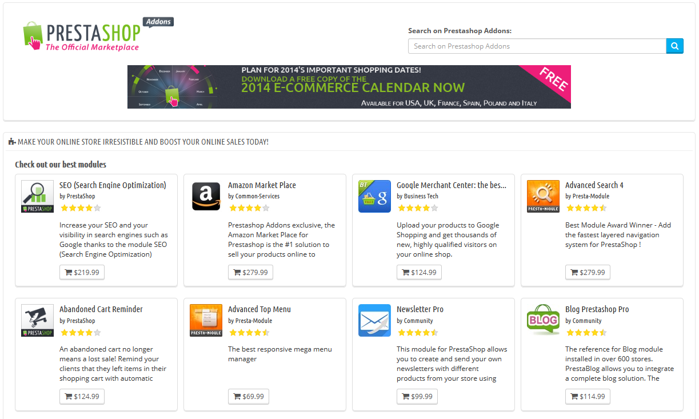
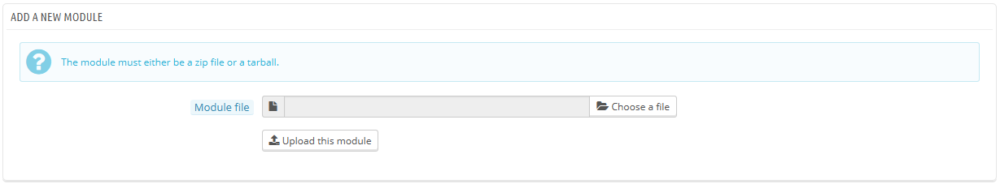
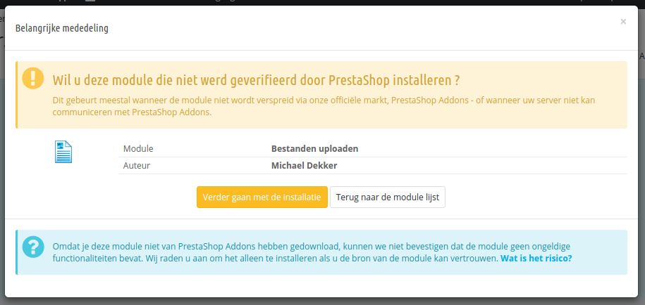
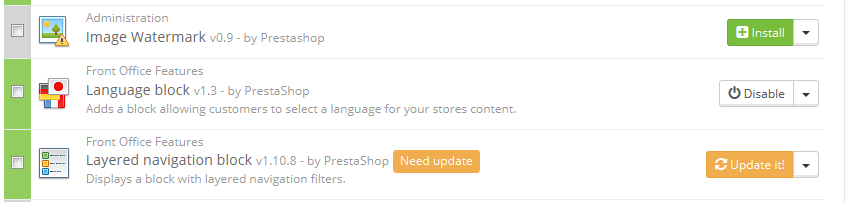
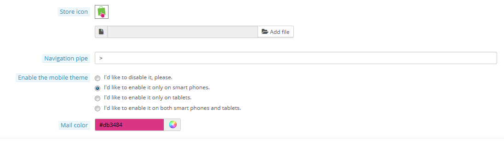

# Module- en themacatalogus

**Table of contents**

/\*\<!\[CDATA\[\*/\
div.rbtoc1597237792939 {padding: 0px;}\
div.rbtoc1597237792939 ul {list-style: disc;margin-left: 0px;}\
div.rbtoc1597237792939 li {margin-left: 0px;padding-left: 0px;}\
\
/\*]]>\*/

* [Modules and Themes Catalog](module-en-themacatalogus.md#Module-enthemacatalogus-ModulesandThemesCatalog)
  * [Een module installeren](module-en-themacatalogus.md#Module-enthemacatalogus-Eenmoduleinstalleren)
    * [Installeren door middel van een formulier](module-en-themacatalogus.md#Module-enthemacatalogus-Installerendoormiddelvaneenformulier)
    * [Installeren door middel van een FTP-client](module-en-themacatalogus.md#Module-enthemacatalogus-InstallerendoormiddelvaneenFTP-client)
  * [Een module bijwerken](module-en-themacatalogus.md#Module-enthemacatalogus-Eenmodulebijwerken)
  * [Een module verwijderen](module-en-themacatalogus.md#Module-enthemacatalogus-Eenmoduleverwijderen)
  * [Een thema installeren](module-en-themacatalogus.md#Module-enthemacatalogus-Eenthemainstalleren)
    * [Installeren door middel van het thema-installatieprogramma](module-en-themacatalogus.md#Module-enthemacatalogus-Installerendoormiddelvanhetthema-installatieprogramma)
    * [Installeren door middel van een FTP-client](module-en-themacatalogus.md#Module-enthemacatalogus-InstallerendoormiddelvaneenFTP-client.1)
  * [Een thema exporteren](module-en-themacatalogus.md#Module-enthemacatalogus-Eenthemaexporteren)
  * [PrestaShop's mobiele template](module-en-themacatalogus.md#Module-enthemacatalogus-PrestaShop%27smobieletemplate)
    * [Het nieuwe mobiele thema installeren voor uw winkel](module-en-themacatalogus.md#Module-enthemacatalogus-Hetnieuwemobielethemainstallerenvooruwwinkel)
    * [Het mobiele thema aanpassen](module-en-themacatalogus.md#Module-enthemacatalogus-Hetmobielethemaaanpassen)
    * [Het standaardthema gebruiken met een ander thema](module-en-themacatalogus.md#Module-enthemacatalogus-Hetstandaardthemagebruikenmeteenanderthema)

## Modules and Themes Catalog 

PrestaShop komt gebundeld met meer dan 120 modules, maar zelfs dat getal kan weinig lijken of u wilt wellicht meer modules bekijken.

Er zijn nog veel meer modules beschikbaar op de website van PrestaShop Addons ([http://addons.prestashop.com/](http://addons.prestashop.com/)). Sommigen zijn gratis, anderen zijn betaald, en u kunt er zeker van zijn dat u iets kunt vinden dat bij u past! Als u een doorgewinterde module-ontwikkelaar of thema-ontwerper bent, dan kunt u uw eigen creaties uitbrengen en verkopen op Addons!

De pagina "Module- & themacatalogus" geeft u snel toegang tot de online Addons database met modules en thema's. De interface is erg gemakkelijk:

* Een zoekveld, waarmee u de gehele inhoud van de Addons website kunt doorzoeken.
* Een lijst met 8 modules die u gelijk kunt kopen.
* Een lijst met 12 thema's die u gelijk kunt kopen.

Een zoekopdracht stuurt u door naar de Addons website, waar meer opties beschikbaar zijn.

Door te klikken op een item wordt de Addons-pagina in een nieuw browsertabblad geopend.

Addons is de officiële marktplaats voor PrestaShop modules en thema's. Dit is waar winkeliers alle noodzakelijke items kunnen kopen om hun website aan te passen en waar auteurs hun creaties kunnen delen met de community.

Modules en thema's kunnen zowel gratis als betaald zijn: de prijs wordt bepaald door de auteur. Neem de tijd om de beschikbare modules en thema's te bekijken, want duur hoeft niet altijd beter te betekenen.

U moet ingelogd zijn, voordat u een module kunt downloaden of beoordelen. Het aanmaken van een account is gratis.

### Een module installeren 

Zodra u een module hebt gedownload van de online Addons-winkel, dan is het aan u om te installeren op uw PrestaShop-site.

Er zijn twee manier om een module te installeren: via een formulier of door middel van uw FTP-client.

#### Installeren door middel van een formulier 

Om een nieuwe PrestaShop-module automatisch te installeren, klikt u op de knop "Nieuwe module toevoegen" aan de bovenkant van de pagina "Modules en Services". Er wordt een nieuwe sectie geopend.

Het formulier in dit gedeelte maakt het mogelijk om het archiefbestand van de module te uploaden, zoals gedownload vanaf de Addons-website. U kunt zowel een `zip`-bestand als `tar.gz` (tarball) uploaden. Het formulier is vanzelfsprekend: blader naar het bestand van de module dat u hebt gedownload en klik op de knop "Upload deze module". Verwijs niet naar de uitgepakte map van het bestand: alleen het archiefbestand!

Zodra u op de knop hebt geklikt, wordt het geüpload naar uw server, uitgepakt, de bestanden op de juiste locatie gezet, de pagina bijgewerkt, en dat allemaal in een paar seconden. PrestaShop toont hierna de melding: "De module is gedownload".

Modules worden standaard niet meteen geïnstalleerd: u moet nog op de knop "Installeren" klikken naast de module, en mogelijk de instellingen van de module aanpassen.

Zodra de configuratie is voltooid, zorg ervoor dat de module gelijk getest wordt om te zien of alles naar behoren werkt.

#### Installeren door middel van een FTP-client 

Om een nieuwe PrestaShop-module handmatig te installeren:

1. Pak het archiefbestand (`zip` of `tar.gz`) van de module uit. Dit moet resulteren in een nieuwe map.
2. Maak met uw FTP-client verbinding met de PrestaShop webserver en plaats de uitgepakte modulemap in de map `/modules` van PrestaShop.\
   Let erop dat u de module NIET upload naar de map van een andere module (wat al snel kan gebeuren als u de map sleept). Upload zowel de map en de bestanden, niet slechts de bestanden.
3. Ga naar uw backoffice, naar de pagina "Modules en Services".
4. Zoek de nieuwe module in de modulelijst. U moet mogelijk een eindje scrollen; u kunt ook gebruikmaken van het zoekveld, welke u de relevante zoekresultaten geeft.
5. In de rij met de nieuwe module klikt u op de knop "Installeren".
6. Uw module is nu geïnstalleerd en moet ook zijn geactiveerd. Als het nodig is, klikt u op de knop "Configureren". Let ook op de waarschuwingen die mogelijk getoond worden in PrestaShop.

Zodra de configuratie is voltooid, zorg ervoor dat de module is getest en alles naar behoren werkt.

Modules kunnen uit veel bronnen afkomstig zijn, en niet allemaal zijn ze betrouwbaar. Dat is waarom er sinds PrestaShop 1.6.0.7 een waarschuwing wordt getoond voor modules die niet geverifieerd konden worden – dat is wanneer ze niet worden geverifieerd door PrestaShop door middel van de Addons-marktplaats. Dit venster laat u kiezen of u verder wilt gaan met de installatie of het installatieproces wilt afbreken.

Bij het installeren van een vooraf beschikbare module of een module die is verkregen door Addons zal dit venster niet worden getoond.

### Een module bijwerken 

Uw PrestaShop-installatie controleert regelmatig bij de Addons-server of er updates zijn voor uw modules. Als dat het geval is, toont PrestaShop de knop "Bijwerken" naast de module. Door erop te klikken zorgt PrestaShop ervoor dat de nieuwe versie wordt gedownload en geïnstalleerd.

### Een module verwijderen 

**Probeer nooit, maar dan ook nooit, een module te verwijderen door de map de verwijderen met uw FTP-client!** U moet PrestaShop het werk voor u laten doen.

Wanneer u een module tijdelijk niet nodig hebt, maar nog wel de configuratie wilt behouden, dan kunt u de module simpelweg uitschakelen: klik op de knop "Uitschakelen". De actieknoppen veranderen in "Inschakelen" en "Verwijder", maar de knop "Deïnstalleren" wordt nog steeds getoond.

Als het u niet uitmaakt of de configuratie wordt behouden, dan klikt u op de knop "Deïnstalleren": de module map is nog steeds te vinden in de map `/modules`, maar de module heeft geen invloed meer op uw winkel.\
Als u de module in zijn geheel van uw server wilt verwijderen, dan klikt u op de knop "Verwijder": PrestaShop gooit de bestanden en data weg.

Zorg ervoor dat uw thema nog steeds werkt als de module wordt verwijderd.

### Een thema installeren 

Zodra u een thema hebt gedownload vanaf de Addons-winkel, dan is het aan u om deze te installeren op uw PrestaShop-winkel.

#### Installeren door middel van het thema-installatieprogramma 

Dit is de aangeraden methode, want het zorgt ervoor dat alle haken van de modules op de juiste posities terechtkomen.

PrestaShop heeft een importeur voor thema's, deze kan bereikt worden vanaf de pagina "Thema's" onder het menu "Instellingen". Klik op de knop "Voeg thema toe" aan de bovenkant van het scherm. Dit scherm toont 3 methoden om een thema te installeren (of "importeren"): vanaf uw computer, vanaf een publieke website of vanaf uw eigen FTP-server. Het geeft u ook een methode om een nieuw thema te maken.

**Thema importeren**

Wat de methode ook is, het proces blijft hetzelfde: aangeven wat de locatie is van het zip-bestand van het thema, vervolgens klikken op "Volgende".

**Importeren vanaf uw computer**: bladeren om het archiefbestand te vinden.\
**Importern vanaf het web**: geef de directe publieke URL op naar het archief.\
**Importeren vanaf FTP**: door uw FTP-client te gebruiken uploadt u het archief naar de volgende map: `/modules/themeinstallator/import/`.

Een snel overzicht wordt getoond in de volgende pagina om aan te geven wat de importeur gaat doen.

Klik op "Volgende" om uw keuze bekend te maken. Het thema wordt nu geïnstalleerd, en PrestaShop vraagt of u ook de modules wilt installeren die zijn geïmporteerd met het thema, wat u liever doet met de huidige moduleconfiguratie en hoe u rekening wilt houden met afbeeldingen.

Klik voor de laatste keer op "Volgende". Een bevestigingspagina toont u alle veranderingen die van toepassing worden op uw PrestaShop-site. Klik op "Voltooien" om het proces af te ronden.

#### Installeren door middel van een FTP-client 

Deze methode wordt niet aangeraden, maar is nog altijd beschikbaar. Wees erg voorzichtig: uw blokken krijgen niet de verwachte posities.

Om een nieuw PrestaShop-thema te installeren via FTP:

1. Pak het archiefbestand van het thema uit (`.zip`). Dit moet resulteren in een nieuwe lokale map, `/themes`, met daarin de map van uw thema.
2. Door gebruik te maken van uw FTP-client, plaatst u de map van het thema (zoals gevonden in de lokale `/themes` map) naar uw PrestaShop webserver. Let erop dat u de map NIET installeert in de map van een ander thema (wat gemakkelijk kan gebeuren tijdens het slepen van bestanden). Upload de gehele map, niet alleen de bestanden die het bevat.
3. (optioneel) Als het archief van het thema een tweede `/modules` map bevat, dan betekent dat dat uw nieuwe thema gebundeld wordt met modules die vereist zijn voor het thema. Gebruik uw FTP-client om de map(pen), zoals gevonden in uw lokale `/modules` map te verplaatsen naar uw PrestaShop-server. Als uw PrestaShop-installatie al een module heeft met dezelfde naam, dan installeert u de meest recente versie van de twee (de module met de meest recente bestanden). Als u er niet zeker over bent, dan kiest u voor de versies die bij uw thema horen, want de kans dat deze werken is het grootst.
4. Ga naar uw backoffice, naar de pagina "Thema's" onder het menu "Instellingen".
5. Selecteer het nieuwe thema in plaats van het huidige thema, door te klikken op het keuzerondje en te klikken op "Opslaan".
6. Uw thema is nu op zijn plaats.
7. (optioneel) Als de thema gebundeld was met een aantal modules, activeert u ze via de "Modules en Services" pagina in de backoffice, en configureert u ze eventueel.

Veel thema's komen met een bestand genaamd `Install.txt`, waar instructies in staan. Zorg ervoor dat u deze volgt om niets te vergeten.

Zodra de configuratie is voltooid, zorg ervoor dat u het thema gelijk test, elke pagina, om te controleren of het naar behoren werkt. Probeer een bestelling volledig af te ronden, van A tot Z – u wilt geen bestellingen missen omdat u niet hebt gezien dat het thema nog niet voltooid was!

### Een thema exporteren 

Een thema exporteren is erg nuttig wanneer u een reservekopie wilt maken voor de zekerheid, een archief maken voor een vriend of het beschikbaar wilt maken op de Addons-marktplaats ([http://addons.prestashop.com/](http://addons.prestashop.com/)). Niet alleen genereert het een compleet zip-archief van uw thema, maar ook voegt het extra informatie toe in een XML-bestand, welke erg nuttig is bij het upload naar Addons en wanneer u het importeert in een andere PrestaShop-site.

Net als bij het importeren van een thema, zijn er twee mogelijkheden om een thema te exporteren: door gebruik te maken van PrestaShop's eigen exporteur of door degene van de Thema-installatie module te gebruiken:

* PrestaShop's exporteur: klik op de knop "Exporteer thema" aan de bovenkant van de pagina "Thema's" (onder het menu "Instellingen").
* Thema-exporteur: open de configuratiepagina van de module, ga daarna naar de sectie "Exporteer een thema".

Selecteer een thema en klik op "Exporteer dit thema". Een configuratieformulier verschijnt waar u enkele instellingen kunt configureren: auteur, themanaam, compatibiliteit, bijgevoegde modules (als ze er zijn), etc.

Zodra alle instellingen goed staan, klikt u op "Genereer dit archief nu". U krijgt snel een bestand, die u kunt downloaden naar uw computer. Bewaar het op uw harde schijf en geeft het daarna een goede naam. Vanaf daar kunt gemakkelijk het thema delen en als het uw eigen creatie is, kunt u deze delen via PrestaShop's Addons website op [http://addons.prestashop.com/](http://addons.prestashop.com/).

### PrestaShop's mobiele template 

Het mobiele thema maakt het mogelijk voor de PrestaShop-winkelier om zijn winkel geschikt te maken voor mobiele apparaten: vanaf de homepage tot het betalingsproces, samen met productpagina's en de gehele conversiefuik.

#### Het nieuwe mobiele thema installeren voor uw winkel 

Het installeren van een mobiel PrestaShop-thema is eenvoudig:

1. Ga naar uw administratiepaneel.
2. Ga naar de pagina "Thema's" onder het menu "Instellingen".
3. Onder de sectie "Uw huidig thema", gaat u naar het tabblad "Mobiel" en kiest u één van de drie opties, anders dan "Ik wil deze graag uitschakelen".

Standaard wordt het mobiele thema alleen gebruikt voor smartphones, tablets krijgen hetzelfde thema als desktops en laptops. Met deze optie kunt u kiezen om het mobiele thema te gebruiken voor tablets ("Beide" optie), of zelfs te kiezen om het alleen te gebruiken voor tablets (smartphones krijgen het reguliere thema).

Onderstaande informatie geldt grotendeels alleen voor versie 1.5 van PrestaShop.

#### Het mobiele thema aanpassen 

De bestanden van het mobiele thema zijn te vinden in de submap `/mobile` van de map van het huidige thema. Op deze manier, als uw huidige thema het standaard PrestaShop-thema is, dan zijn de mobiele sjabloonbestanden in de map `/themes/default/mobile` van uw PrestaShop-installatie.

Het sjabloon is gemaakt uit HTML, CSS en JavaScript-bestanden: de structuur is daarom hetzelfde als het standaardthema, maar het design verschilt enorm, omdat het gebouwd is voor kleinere schermen van mobiele apparaten.

Daarom als u de kleuren of layout van mobiele templates wilt aanpassen, dan moet u de CSS en/of HTML bestanden aanpassen naar uw wensen. U moet hiervoor wel kennis hebben van webtalen of een ontwikkelaar vragen om hulp.

#### Het standaardthema gebruiken met een ander thema 

De mobiele template is alleen beschikbaar als het huidige thema een `/mobile` submap heeft in zijn eigen map. Veel PrestaShop-thema's hebben geen goed mobiel thema en de gebruikers van deze thema's kunnen niet automatisch een mobiel thema aanbieden aan hun bezoekers.

Tot de tijd dat uw thema wordt bijgewerkt met een mobiel thema, kunt u het standaard mobiele thema gebruiken, dankzij een kleine aanpassen: u hoeft alleen de submap `/mobile` te kopiëren uit de map `/themes/default` en deze in de submap plakken van uw huidige thema.

U gebruikt in dit geval wel het standaard mobiele template in in plaats van een template met een design dat consistent is met uw eigen thema, maar niets kan u weerhouden om de HTML, CSS of JavaScript-bestanden aan te passen aan uw eigen template om het dichterbij uw eigen thema te krijgen.
