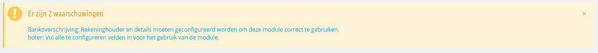
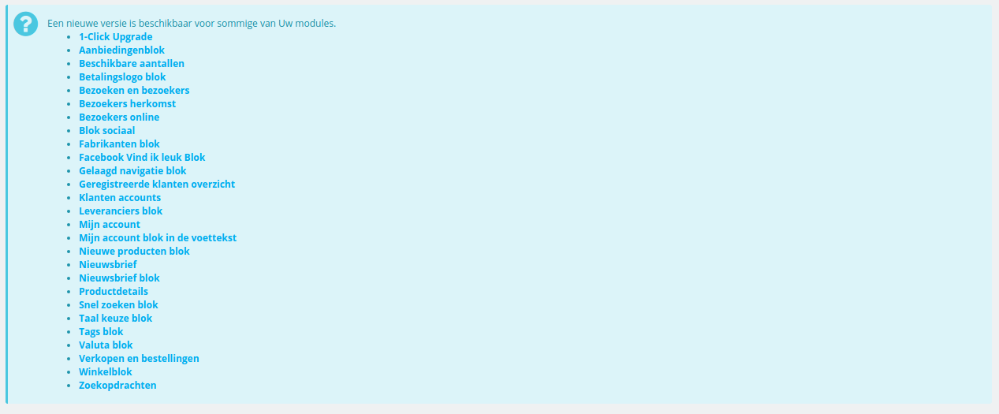
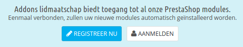
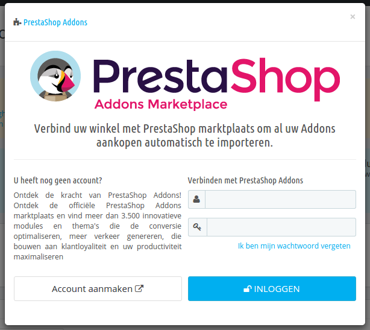
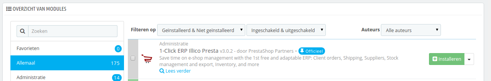
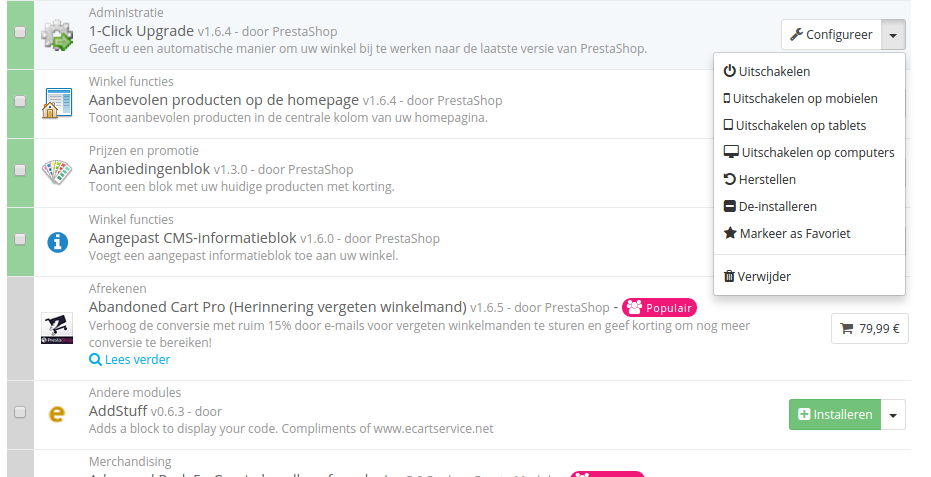

# Uw modules

De pagina "Modules en Services" onder het menu "Modules en Services" geeft u toegang tot de lijst van modules. Op deze pagina kunt u elke modules installeren, deïnstalleren, configureren en bijwerken. Alle vooraf geïnstalleerde modules worden in hun eigen hoofdstuk uitgelegd: [Vooraf geïnstalleerde modules gebruiken](../vooraf-geinstalleerde-modules-gebruiken/). Dit hoofdstuk legt uit hoe de modulepagina werkt.

## Modulenotificaties 

Onder de paginatitel ontvangt u van tijd tot tijd notificaties van geïnstalleerde modules. Meestal helpen de notificaties u bij het afronden van de configuratie van modules die al geïnstalleerd zijn, maar nog niet klaar voor gebruik: het bijwerken van de instellingen zou er voor moeten zorgen dat de waarschuwingen verdwijnen... en uw modules naar behoren werken.

Wanneer een van uw modules een update beschikbaar heeft op de Addons site, dan stelt PrestaShop u op de hoogte, en verschijnt er een knop met de naam "Allen bijwerken" aan de bovenkant van de pagina. Klik op deze knop om alle modules bij te werken.

## Verbinding met Addons 

Gebruikers van PrestaShop Addons zijn eersteklas gebruikers als het aankomt op het beheren van modules! Inderdaad, zodra uw PrestaShop-installatie is verbonden met uw Addons account, worden de modules die u op Addons krijgt automatisch geïnstalleerd en bijgewerkt!

PrestaShop Addons is de centrale marktplaats waar u nieuwe modules en thema's kunt verkrijgen voor uw winkel. Het aanmaken van een account is gratis, klik op de knop "Registreer nu" en het breng u hier naartoe: [https://addons.prestashop.com/nl/login#createnow](https://addons.prestashop.com/nl/login#createnow)

Als u al een Addons account hebt, klikt u op de knop "Aanmelden" op het inlogvenster te tonen.

Voer uw details in en klik op de knop "Inloggen": uw PrestaShop-installatie is nu verbonden met uw Addons account, en vergelijkt uw lokale modules met de versies die te vinden zijn op Addons, en zorgt ervoor dat alle modules bijgewerkt blijven!

## De modulelijst 

Deze lijst zorgt ervoor dat u gemakkelijk de module kunt vinden die u wilt installeren en de bijbehorende instellingen kunt bewerken.

Het eerste gedeelte is waar u kunt zoeken naar een specifieke module of de lijst kunt filteren, totdat u de module hebt gevonden waar u naar zocht.

* **Zoekveld**. Relevante modules worden getoond als u de naam intypt, dit maakt de zoekfunctie snel en gemakkelijk.
* **Filteren op**. De lijst wordt automatisch herladen wanneer u een selectie maakt en toont alle relevante modules.\

  * **Geïnstalleerd & Niet geïnstalleerd**. Meestal wilt u een geïnstalleerd module aanpassen of een nieuwe installeren. Dit filter wordt het meeste gebruikt.
  * **Ingeschakeld & uitgeschakeld**. Geïnstalleerde modules, zijn de modules die geconfigureerd kunnen worden, daarom is dit filter belangrijk.
  * **Auteurs**. U kunt modules filteren op auteur. Standaard is alleen "PrestaShop" beschikbaar, maar naarmate u meer modules toevoegt, hoe nuttiger dit filter wordt.

Aan de linkerkant is een lijst van de modulecategorieën te vinden. Met het aantal modules in de badge. Klik op een categorie om de modules die bij deze categorie horen weer te geven.\
Eén van de categorieën heet "Favorieten" en is standaard leeg. Dit zorgt ervoor dat u een selectie kunt maken van modules die u het meest gebruikt en om ze snel te kunnen bereiken. U kunt uw favoriete modules markeren met de optie "Markeer als Favoriet".

Modules kunnen een van de vier statussen hebben:

* Niet-geïnstalleerd.
* Geïnstalleerd maar uitgeschakeld.
* Geïnstalleerd en ingeschakeld.
* Geïnstalleerd en ingeschakeld, maar met waarschuwingen.

Sommige modules hebben een badge met de tekst "Populair". Deze modules zijn afkomstig van de Addons website. Ze zijn niet gratis: de "Installeren" knop is vervangen door een winkelwagenincoontje, met de prijs van de module. Door te klikken op de knop wordt de modulepagina op de Addons site geopend waar u de module kunt kopen.

Verschil tussen uitschakelen en deïnstalleren

Wanneer u een module niet langer wilt gebruiken, kunt u deze uitschakelen of deïnstalleren. Het resultaat van beide acties is ongeveer hetzelfde: de module is niet langer beschikbaar, de opties verschijnen niet langer in uw backoffice en als er een element was toegevoegd aan uw frontoffice, dan is deze nu ook verdwenen.

Het verschil is dat het uitschakelen van een module de configuratie voor later bewaard, mocht u de module weer willen gebruiken. Het deïnstalleren van een modules zorgt ervoor dat de configuratie uit de database verdwijnt.

Daarom moet u alleen een modules deïnstalleren als u zeker weet dat u de configuratie niet nog een keer gaat gebruiken. Als u echt zeker bent dat u de module nooit meer gaat gebruiken in uw winkel, dan kunt u zelfs kiezen voor de optie "Verwijderen".

## Acties uitvoeren op modules 

Hier zijn een paar beschikbare acties, afhankelijk van de status van module:

* Gedeïnstalleerde modules:
  * **Installeren**. Dit zorgt ervoor dat de installatie van de module in uw PrestaShop-installatie wordt gestart. De module wordt automatisch ingeschakeld. Het kan nieuwe opties toevoegen aan uw backoffice.
  * **Markeren als Favoriet**. Dit zal de module aan uw favorieten toevoegen.
* Geïnstalleerde modules:
  * **Configureren**. Sommige modules hebben een configuratiepagina. In dat geval bieden ze een "Configureren" knop om toegang te krijgen tot een nieuwe interface waar de gebruiker de instellingen aan kan passen.
  * **Uitschakelen**. Wanneer een module is geïnstalleerd, is deze gelijk ingeschakeld. U kunt het uitschakelen, wat ervoor zorgt dat de opties van de module uit de backoffice verdwijnen, maar de configuratie voor later nog beschikbaar blijft.
    * **Uitschakelen op mobielen**. Dit schakelt de frontoffice-weergave voor deze module uit op mobiele apparaten (smartphones, etc.).
    * **Uitschakelen op tables**. Dit schakelt de frontoffice-weergave voor deze module uit op tablets.
    * **Uitschakelen op computers**. Dit schakelt de frontoffice-weergave voor de module uit op desktop computers.
  * **Herstellen**. Dit herstelt de module naar de fabrieksinstellingen.
  * **Deïnstalleren**. Dit schakelt de module uit en verwijdert de bijbehorende data.
  * **Markeren als Favoriet**. Dat zal de module toevoegen aan uw favorietenlijst.
  * **Verwijder**. Dit zal de module verwijderen vanuit uw modulelijst, evenals de bestanden en data vanaf uw server.

Modules met een hoge rangschikking kunnen gepromoot worden tot uw modulelijst, afhankelijk van uw landinstellingen. Ze verschijnen naast reguliere modules, maar hun actieknop bevat niet de tekst "Installeren", maar in plaats daarvan "€ 30". Door te klikken op de knop wordt u naar de modulepagina op Addons gebracht, waar u kunt inloggen, de module kunt kopen en vervolgens downloaden. Vanaf daar kunt u het installeren in uw winkel.
