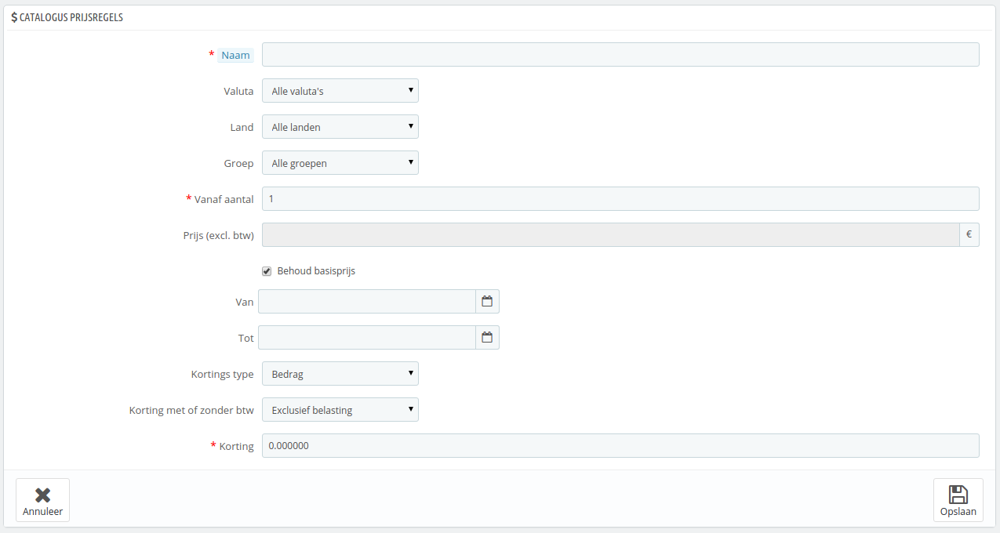
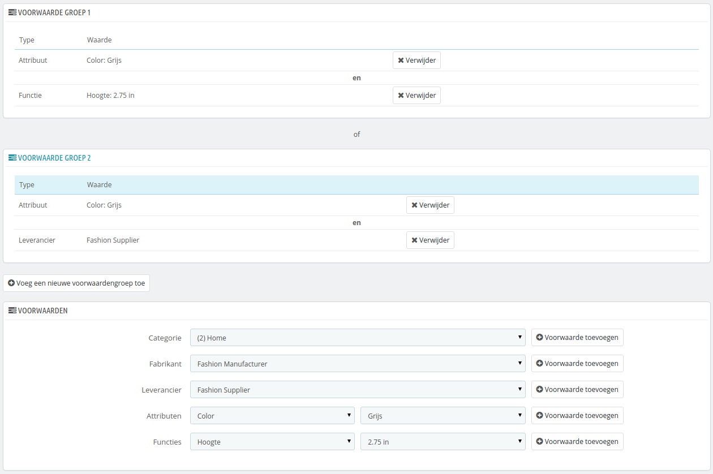

# Catalogus prijsregels

Catalogus prijsregels maken het voor u mogelijk om prijsreducties in te stellen per categorie, fabrikant, leverancier, attribuut of kenmerk. Zoals de naam suggereert, zorgt dit type regels dat het geld voor een bepaalde productenreeks; het kan niet worden gebruikt voor een enkel product. Als u korting wilt toepassen op een enkel product, dan moet u een winkelwagenregel aanmaken of een specifieke prijs (tijdens het bewerken van een product, het tabblad "Prijzen").

U kunt bijvoorbeeld een regel instellen dat ervoor zorgt dat Spaanse klanten, die bij de groep "Goede klanten" horen 10% korting krijgen op elektronica en producten van Sony in de eerste week van juli.

De pagina "Catalogus prijsregels" geeft al uw huidige regels weer, welke u kunt bewerken of verwijderen door te klikken op de iconen in de statuskolom. Als u een regel wilt uitschakelen, dan verandert u de einddatum naar gisteren.

## Een nieuwe catalogus prijsregel aanmaken 

Het aanmaakformulier heeft twee secties die ervoor zorgen dat u precies de regels aanmaakt die u wilt.

### Specifieke prijsregels 

Het eerste formulier is gemakkelijk te begrijpen.

Dit is waar u kunt instellen wie van deze regel profiteren, wat de korting moet zijn en andere eigenschappen.

* **Naam**. De naam is publiek, dus zorg voor een toepasselijke naam.
* **Winkel**. _Alleen multistore-modus_. De regel geldt voor klanten van een specifieke winkel. Alleen beschikbaar wanneer u minstens twee winkels hebt.
* **Valuta**. De regel geldt voor klanten die betalen met een specifieke valuta.
* **Land**. De regel geld voor klanten uit een specifiek land.
* **Groep**. De regel geldt voor klanten die bij een specifieke klantengroep behoren.
* **Vanaf aantal**. De regel wordt toegepast als minstens dit aantal producten overeenkomt.
* **Prijs (excl. btw)**. De nieuwe prijs voor het product. Hier kunt u de publieke prijs instellen als het product overeenkomt met de regels. Standaard wordt de basisprijs getoond.
* **Van** en **Tot**. De regels gelden in dit tijdsframe.
* **Kortings type**. De korting kan een geldbedrag zijn maar ook een percentage.
* **Korting met of zonder btw**. De korting kan met of zonder btw zijn.
* **Korting**. De waarde voor de korting. Afhankelijk van het kortingstype is dit "€10" (afhankelijk van standaardvaluta) of "10%".

U kunt natuurlijk al deze regels combineren.

### Voorwaarden 

De voorwaardensectie is waar u alle producten kunt kiezen waarvoor de catalogus prijsregels gelden. Dit verschijnt alleen wanneer u klikt op "Voeg een nieuwe voorwaardengroep toe".

Voorwaarden zijn gebouwd rondom voorwaardengroepen. Dit betekent dat de data uit de sectie erboven toegepast kunnen worden op veel verschillende productreeksen.\
Voorwaarden zijn gegroepeerd op een alomvattende manier: alle voorwaarden van de groep moeten van toepassing zijn voordat de catalogus prijsregels van toepassing zijn. Vanwaar de "en".\
Dat terwijl de voorwaardengroepen exclusief zijn: alleen één groep moet van toepassing zijn, voordat de catalogus prijsregels worden toegepast. Vanwaar de "of".

De standaard voorwaardengroep is leeg. U kunt voorwaarden toevoegen door gebruik te maken van de dropdown-menu's aan de onderkant van de sectie.

* Kies een categorie of een ander type selectie en klik daarna op de knop "Voorwaarde toevoegen".
* De voorwaarde verschijnt in de voorwaardengroep. U kunt zoveel voorwaarden toevoegen als u wilt.
* Zodra een groep is voltooid en u een nieuwe groep wilt aanmaken, klikt u op de knop "Voeg een nieuwe voorwaardengroep toe". Een nieuwe groep verschijnt hierna, welke u op dezelfde manier kunt invullen.

Standaard worden nieuwe voorwaarden toegevoegd aan de groep die voor het laatst is aangemaakt. Als u nieuwe voorwaarden wilt toevoegen aan een vorige groep, klikt u op de groep om deze te markeren en uw voorwaarden toe te voegen.

U kunt momenteel een voorwaardengroep niet verwijderen
