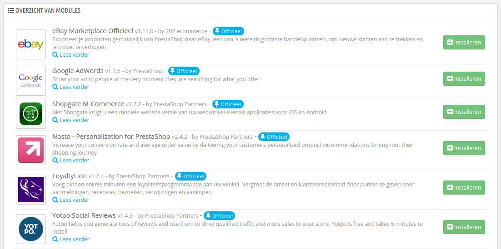

# Marketingmodules

Deze pagina verzamelt alle modules voor uw PrestaShop-installatie die voor marketing zeer belangrijk zijn. Het zorgt voor een snelkoppeling naar bepaalde categorieën binnen de modulepagina.

De modules op deze pagina komen uit de categorie "Reclame en marketing" op de pagina "Modules en Services".

U kunt modules direct installeren vanaf deze pagina. Zodra u op de "Installeren" klikt, dan wordt de module geïnstalleerd en wordt u naar de pagina "Modules en Services" gebracht, waar u de configuratiepagina van de module kunt openen door op de knop "Configureren"  te klikken. U kunt ook teruggaan naar de pagina "Marketing" om de configuratiepagina te openen of de modules te verwijderen, uitschakelen, herstellen of deïnstalleren, afhankelijk van de staat van de module.
