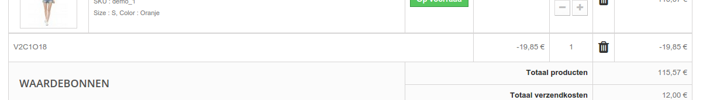

# Winkelwagenregels

De pagina "Winkelwagenregels" geeft u toegang tot een geavanceerde tool dat het waardebonnensysteem van PrestaShop 1.4 opvolgt. Doorgewinterde PrestaShop-gebruikers zullen niet verrast zijn met de features die zijn toegevoegd, maar al zijn gewend aan de nieuwe naam: wanneer deze handleiding waardebonnen noemt, dan hebben we het in feite over winkelwagenregels – welk verschillen van creditnota's.

Verschil tussen een creditnota, een waardebon en een winkelwagenregel

Een creditnota is op de eerste plaats het geschreven bewijs dat een product is geretourneerd. Meestal kan de gebruiker deze gebruiken als een waardebon.

Een waardebon is een kortingscode welke niet per se gebonden hoeft te zijn aan een retour of terugbetaling en welke meer vormen aan kan nemen dan een simpele creditnota:

* Een korting op een bestelling (percentage).
* Een korting op een bestelling (bedrag).
* Gratis verzending

U kunt een waardebon toepassen op alle klanten, op een klantengroep of op een enkele klant; u kunt de vervaldatum bepalen.

Een winkelwagenregel is in feite een geavanceerde versie van een waardebon: naast wat een waardebon kon doen in PrestaShop 1.4, heeft het winkelwagensysteem, geïntroduceerd met PrestaShop 1.5 nog meer te bied:

* Naam van de korting.
* Sta de klant toe slechts een gedeelte te gebruiken.
* Prioriteiten instellen.
* De compatibiliteit tussen regels instellen.
* Korting alleen voor specifieke vervoerders.
* Korting werkt alleen met een specifieke productreeks en/of categorieën en/of fabrikanten en/of leveranciers en/of attributen... of alles tegelijk.
* Zorg ervoor dat de korting alleen toegepast kan worden op verzendkosten en/of korting op gehele bestelling en/of een gratis cadeau... of tegelijk.

In deze handleiding worden de termen "waardebonnen" en "winkelwagenregels" door elkaar gebruikt.

De pagina "Winkelwagenregels" toont de huidige bestaande winkelwagenregels, die u in of uit kunt schakelen door op de iconen in de kolom "Status" te klikken.

## Een nieuwe winkelwagenregel aanmaken 

Een waardebon kan automatisch aangemaakt worden, nadat een product is geretourneerd, maar u kunt ook altijd zelf een nieuwe waardebon aanmaken, en de eigenschappen zeer precies bepalen.

Het aanmaakformulier heeft drie tabbladen, die er voor zorgen dat u precieze regels en waardebonnen aanmaakt.

### Informatietabblad 

Het eerste tabblad "Informatie" bevat de eigenschappen waaraan de regels herkend kunnen worden en de hoofdinstellingen.

* **Naam**. De naam is publiek, dus kies een toepasselijk naam.
* **Omschrijving**. De omschrijving is niet publiek. Hier kunt u bijvoorbeeld uw medewerkers uitleggen waarom de prijsregel is aangemaakt.
  * **Code**. Geef uw regel een unieke code. U kunt er handmatig een aanmaken (en daarbij leesbare woorden gebruiken, zoals 1VOUCH4JOE), of ervoor zorgen dat PrestaShop een unieke string genereert door te klikken op de konp "Genereren". Natuurlijk kunt u ook een andere string-generator gebruiken (zoals bijvoorbeeld [http://www.random.org/strings/](http://www.random.org/strings/)).\
    Let op dat wanneer er geen code beschikbaar is de prijsregel automatisch geldt voor klanten die aan de voorwaarden voldoen:
  * Als er een code is, dan moeten klanten deze invoeren bij het afrekenen.
  * Als er geen code is, dan wordt de prijsregel automatisch toegepast bij klanten die er gebruik van mogen maken.
* **Markeer**. Als dit is ingeschakeld, dan zal PrestaShop de gebruiker laten weten dat er een waardebon beschikbaar is om in de winkelwagen te plaatsen.
* **Gedeeltelijke gebruik**. Als dit is uitgeschakeld, dan kan de regel/waardebon slechts één keer worden gebruikt, ondanks dat het niet volledig is gebruikt. Als deze optie is ingeschakeld, dan wordt er een nieuwe waardebon aangemaakt als de huidige niet volledig is gebruikt.
* **Prioriteit**. Als een klant (of klantengroep) meer dan één waardebon mag gebruiken of als er meer dan één waardebon voor een bestelling mag worden gebruikt, dan voegt PrestaShop de waardebonnen één voor één toe in alfabetische volgorde. U kunt deze volgorde wijzigen door een prioriteit toe te wijzen. Standaard hebben alle waardebonnen een prioreiteit van 1. Als u het een hoger getal geeft dan wordt de waardebon toegepast na een waardebon met een lager getal.
* **Status**. U kunt een regel in- en uitschakelen wanneer u dat nodig acht.

### Voorwaarden 

Het tweede tabblad, "Voorwaarden", bevat een grote set aan mogelijkheden, waarmee u precies kunt instellen wie gebruik mogen maken van deze regel.

* **Beperk tot een specifieke klant**. Dit is waar u kunt aangeven dat de waardebon die u aanmaakt voor één klant is. Als u bijvoorbeeld vertraging hebt gehad met een bestelling en u wilt de klant compenseren, dan kunt u een waardebon aanmaken die alleen door deze klant te gebruiken is. Om de klant snel te vinden typt u de eerste letters van de voornaam, achternaam of e-mailadres in het tekstveld.\
  Als dit veld leeg is, dan begrijp PrestaShop dat elke klant de korting kan gebruiken... tenzij u een klantengroep hebt toegevoegd als voorwaarde (zie checkbox "Klantengroep selectie" hieronder).
* **Geldig**. De standaard geldigheid is één maand, maar u kunt dit beperken tot één week of één dag.
* **Minimaal aantal**. Het minimale bestedingsbedag voor de waardebon kan hier worden ingevoerd. Uw waardebon wordt dan alleen geldig als dit bedrag is bereikt. U kunt ervoor kiezen om in dat bedrag de belasting en verzendkosten mee te laten rekenen.
* **Totaal beschikbaar**. Stel het aantal beschikbare waardebonnen in: dit kan "1" zijn voor één klant of als de bon alleen voor de eerste klant gebruikt mag worden.
* **Totaal beschikbaar voor elke klant**. U kunt instellen hoeveel waardebonnen elke klant mag gebruiken. Dit getal kan hoogstens gelijk zijn aan het totale aantal beschikbare waardebonnen.
  * Als dit getal kleiner is dan het totaal, dan kan de klant niet alle waardebonnen gebruiken.
  * Als u dit getal op "1" laat staan, dan kan elke klant deze waardebon slechts één keer gebruiken. Zorg er in dat geval dat de waardebon bij een klantengroep hoort, in plaats van slechts één klant.

De checkboxen aan de onderkant van deze sectie zijn erg belangrijk, omdat ze u helper bij het verder instellen van de prijsregel.

* **Land selectie**. U kunt ervoor zorgen dat deze waardebon voor een beperkt aantal landen gebruikt kan worden. Het land wordt bepaald aan de hand van het verzendadres.
* **Vervoerder selectie**. U kunt ervoor zorgen dat de klant de korting alleen krijgt als hij of zij gebruikt maakt van een specifieke vervoerder.
* **Klantengroep selectie**. Dit is erg nuttig. Dankzij PrestaShop's klantengroepensysteem, kunt u een korting aanmaken die gelijk bij een gehele klantengroep wordt toegepast en hier bovenop nog meer voorwaarden kunt stellen dankzij de winkelwagenregels.
* **Compatibiliteit met andere winkelwagenregels**. Standaard kan een winkelwagenregel samengaan met andere regels. Met deze optie kunt u voorkomen dat andere winkelwagenregels tegelijkertijd met deze worden toegepast. De optie verschijnt alleen wanneer u meer dan één winkelwagenregel hebt.
* **Product selectie**. Een andere nuttige optie. Deze zorgt ervoor dat u automatisch waardebonnen aanmaakt voor winkelwagens met specifieke producten. Deze optie wordt hieronder in meer detail uitgelegd.
* **Winkel selectie**. _Alleen in multistore-modus._ Standaard geldt een winkelwagenregel voor alle winkels. Met deze optie kunt u ervoor zorgen dat deze regel alleen geldt voor een selectie van uw winkels.

De optie "Product selectie" zorgt voor een heel nieuw formulier en maakt het voor u mogelijk om niet alleen waardebonnen per product aan te maken, maar ook per categorie, per fabrikant, per leverancier en zelfs per attribuut. Als bonus kunt u deze ook combineren om uw klanten nog beter van dienst te zijn.

U kunt bijvoorbeeld automatisch waardebonnen aanmaken voor uw klant in de vorm "Koop minstens 3 Apple-producten en krijg gratis verzendkosten!"\
De configuratie hiervan is erg precies. U kunt zoveel productselecties aanmaken als nodig is, door deze stappen te volgen:

1. Klik op de knop "Product selectie" om een nieuwe sectie toe te voegen.
2. Geef het aantal producten aan dat nodig is om de korting te activeren.
3. Geef minstens één regel op, van het type dat u graag wilt: producten, attributen, categorieën, fabrikanten, leveranciers. U kunt ook zoveel regels per productselectie toevoegen als u zelf wilt, zelfs één voor elke type als dat nodig is.
4. Door te klikken op "Toevoegen" wordt er een nieuwe regel toegevoegd aan de selectie. Voor elk type moet u de details invoeren. Klik op de knop "Kies" en er wordt een venster geopend, met de opties voor dit type (producten, categorieën...). Verplaats de items van het linkerpaneel naar de rechter door middel van de knop "Toevoegen" en sluit het venster met de "X" aan de rechterbovenkant. Als er slechts één item is geselecteerd, dan krijgt het veld de naam; anders wordt hier de hoeveelheid getoond.

U kunt zoveel regels toevoegen als nodig is. Deze regels zijn cumulatief: ze gelden allemaal of de korting wordt niet toegepast.

Productselecties zijn onafhankelijk: u kunt er zoveel toevoegen als u wilt en ze beïnvloeden elkaar niet. Dit zorgt ervoor dat u een gehele reeks aan producten kunt aanmaken waarvoor de winkelwagenregel geldt.

### Acties 

Het derde en laatste tabblad, "Acties", is waar u kunt kiezen waaruit de korting bestaat.

* **Gratis verzending**. De regel geeft klanten gratis verzending.
* **Korting toepassen**.
  * **Procent (%)**. De regel biedt een korting als percentage op de gehele korting. Bijvoorbeeld, stel dat de bestelling €200 is, exclusief belasting. De regel heeft een waarde van 15%. Klanten die gebruik mogen maken van deze regel betalen nu €170 (exclusief belasting en verzendkosten).
  * **Bedrag**. De regel geldt als bedrag op het totaal. Stel dat de bestelling €200 is, exclusief belasting. De regel biedt €20 korting op de aankoop. Klanten die gebruik mogen maken van deze regel betalen nu slechts €180 (exclusief verzendkosten). U kunt ervoor kiezen of belasting al dan niet onder de korting valt.
  * **Geen**. De regel biedt geen korting op de bestelling. Door deze optie te kiezen wordt de volgende sectie, "Pas korting toe voor", verborgen.
* **Pas korting toe voor**.
  * **Bestelling (exclusief verzendkosten)**. De korting geldt voor de gehele bestelling.
  * **Specifiek product**. U kunt kiezen voor welk product de korting zou moeten gelden: type de eerste letters van het producten en kies het uit de lijst met gevonden namen.
  * **Goedkoopste product**. Alleen beschikbaar voor de optie "Procent (%)".
  * **Geselecteerde product(en)**. De klant kan kiezen voor welke producten de korting zou moeten gelden. Alleen beschikbaar voor de optie "Procent (%)".
* **Verzend een gratis cadeau**. U kunt ervoor kiezen om een gratis cadeau te verzenden onder bepaalde voorwaarden (en de korting in zijn geheel over te slaan). Er verschijnt een veld: type de eerste letters van het product en kies het uit de lijst met gevonden namen.

Zodra alles is bewaard kunt u de waardebon naar uw klanten sturen of het systeem de winkelwagenregels automatisch toe laten passen, afhankelijk van uw instellingen.

Uw waardebon verschijnt op de pagina "Winkelwagenregels", onder het menu "Prijsregels". U kunt ze op elk moment verwijderen of aanpassen. Als de waardebon was gekoppeld aan een specifieke groep of klant, dan verschijnt deze in de frontoffice, in de sectie "Waardebonnen" van de klantportal, maar ook in de winkelwagen (als u daarvoor kiest), waar ze ervoor kunnen kiezen om de regel toe te passen.

Winkelwagenregels die zijn ingesteld om te gelden voor alle klanten verschijnen niet op de pagina "Mijn waardebonnen": hij of zij moet ervan op de hoogte zijn om de bon te kunnen gebruiken. Het is aan u om klanten op de hoogte te stellen van dergelijke waardebonnen.

Om de winkelwagenregels toe te passen, moet de klant zijn of haar winkelwagen bezoeken en de waardebon invoeren in het veld "Waardebonnen" en klikken op "Oké". De klant kan de waardebon niet toepassen als de bestelling al afgerekend is.

Zodra de waardebon is toegepast, wordt deze zichtbaar in het overzicht en is de prijsverandering zichtbaar.

