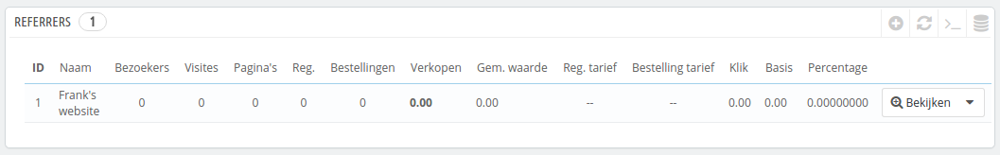
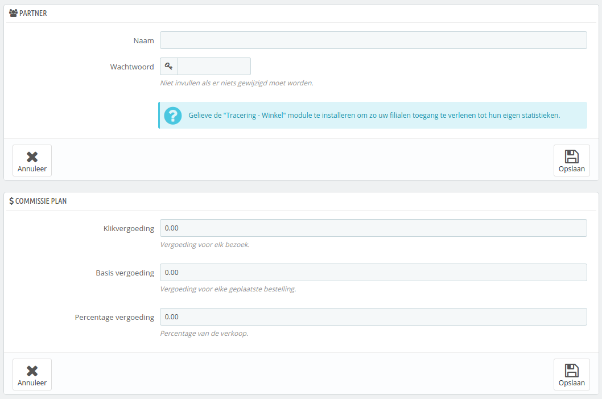
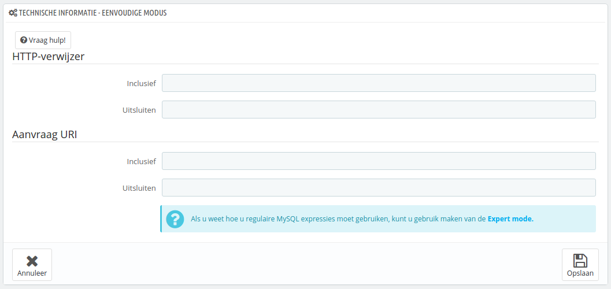
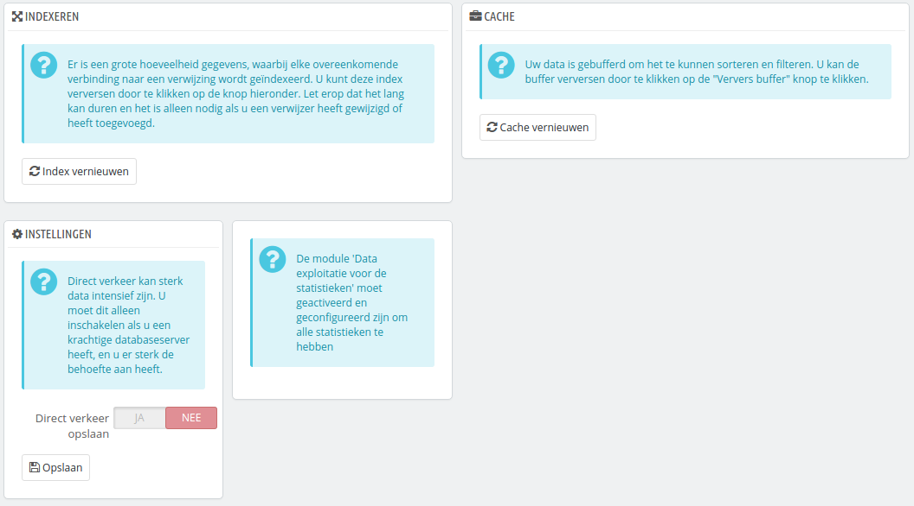

# Referrers bekijken

Een referrer betekent een website die u minstens één bezoeker heeft opgeleverd. Deze website bevat een link naar uw webwinkel en helpt u bij het opbouwen van een publiek en levert dus meer verkopen op.

Sommige referrers zijn belangrijker voor u dan anderen: u hebt wellicht partners met links naar uw winkel op hun eigen site en zowel u als uw partners willen graag weten hoeveel bezoekers de links naar u hebben gebracht. U kunt zelfs uw partners betalen om een link naar uw winkel te tonen, afhankelijk van de waarde die u eraan hecht.\
Dit wordt ook _affiliation_ genoemd en de pagina "Referrers" helpt u bij het opbouwen van een affiliate program, waar zelfs uw partner mee kan verbinden om het aantal bezoeken en verkopen te kunnen zien die de links hebben opgeleverd. Geregistreerde affiliates genereren verkeer naar uw winkel, u wilt hen belonen voor de bezoekers en het affiliateprogramma kan u beiden de statistieken tonen.

PrestaShop's referrer tool kan vergeleken worden met een statistiekendashboard die niet slechts beschikbaar is voor uw eigen personeel. Wanneer u een affiliate campaign begint voor een site, dan kunt u de site toegang bieden tot alle activiteiten die relevant zijn via een URL die met een wachtwoord is afgeschermd: [http://example.com/modules/trackingfront/stats.php](http://example.com/modules/trackingfront/stats.php).

In de lijst met referrers, de klik-, basis- en percentagevergoeding worden berekend op basis van de actuele kliks, verkopen en percentage van verkopen vanaf de referrersite.

## Een nieuwe referrer toevoegen 

De affiliate portal biedt uw partners toegang tot een deel van uw site. Ze hebben toegang tot de statistieken over de flow van bezoekers vanaf hun site naar uw winkel. Om een eigen ruimte aan te maken voor partners, moet u een account aanmaken in uw affiliateprogramma, daarna vastleggen hoe u hen wilt betalen op basis van het verkeer en verkopen die het heeft opgeleverd.

Om een nieuwe affiliate partner toe te voegen klikt u op de knop "Nieuwe referrer toevoegen" welke u naar een aanmaakformulier leidt.

Elke sectie is belangrijk:

* **Partner**. Het account van de partner binnen uw affiliateprogramma.
  * **Naam**. Om de affiliate portal in uw backoffice te kunnen bereiken heeft uw partner een account nodig; u kunt een naam of e-mailadres gebruiken, maar zorg ervoor dat u gegevens gebruikt die uw partner gemakkelijk kan onthouden.
  * **Wachtwoord**. De eerste keer dat u het account aanmaakt bewaart PrestaShop het wachtwoord samen met de loginnaam. Als u het account wilt bewerken (bijvoorbeeld wanneer u de commissie wilt aanpassen), dan zal het wachtwoordveld leeg blijven. Dit betekent niet dat er geen wachtwoord is; pas zodra u het lege veld invult wordt het wachtwoord veranderd.
* **Commissie plan**. Dit is waar u kunt de vergoedingen voor uw partners kunt invoeren – dit betekent de vergoeding die u uw partners verschuldigd bent voor het verkeer dat wordt gegenereerd.
  * **Klikvergoeding**. Dit bepaalt hoeveel een bezoeker vanaf de partnersite waard is. Elke keer als een bezoeker vanaf de partnersite uw website bezoekt door op de link te klikken, krijgt de partner het opgegeven bedrag.
  * **Basisvergoeding**. U kunt uw partners ook belonen zodra een bezoeker vanaf hun site één van uw producten koopt. Dit betekent dat het bedrag alleen verschuldigd is als er een aankoop wordt gedaan tijdens de sessie die volgt op de doorverwijzing vanaf de partnersite.
  * **Percentage vergoeding**. Naast de basisvergoeding of als vervanging kunt u partners ook belonen met een percentage van de verkoop die gemaakt zijn tijdens sessies die volgen op bezoeken vanaf de partnersite.
* **Technische informatie - eenvoudige modus**. Dit is erg belangrijk, omdat hiermee het systeem de partner kan onderscheiden van andere referrers. Zodra dit is geconfigureerd moet u een aantal tests uitvoeren om vast te kunnen stellen of alles naar goed is ingesteld.
  * **HTTP-verwijzer**. In het veld "Inclusief" vult u de domeinnaam in van de partner.
  * **Aanvraag URI**. In het veld "Inclusief" vult u het laatste gedeelte van de query-string in. Het systeem zal referrers bijhouden met een speciale query-string. U kunt bijvoorbeeld referrers bijhouden die het argument `?prestaff=` gebruiken in hun URL. Hiermee kunt u referrers beter onderscheiden.
* **Technische informatie - Expertmodus**. Terwijl de simpele modus gebruik maakt van MySQL's "LIKE"-functie, maakt de expertmodus gebruik van reguliere expressies binnen MySQL. Dit kan erg handig zijn, maar tegelijkertijd vrij lastig. Zorg ervoor dat u bekent bent met reguliere expressies voordat u verder gaat.

De helpsectie geeft u handige indicaties waarmee u de affilliate kunt instellen. Lees het goed door.

## Instellingen 

De referrerinstellingen bestaan vooral uit gereedschappen waarmee u het beste uit uw affilateprogramma kunt halen.

Er zijn drie mogelijkheden:

* **Indexeren**. U moet eenmalig op de knop "Index vernieuwen" klikken zodra u een nieuwe referrer hebt toegevoegd en u het verkeer van deze referrer wilt analyseren.
* **Cache**. PrestaShop bewaart de data die het verzameld in de cache. U kunt op de knop "Cache vernieuwen" klikken om de cache te verversen.
* **Direct verkeer opslaan?** Direct verkeer bestaat uit bezoekers die uw website direct bereiken, door de URL te typen in hun browser. Deze gebruikers zijn belangrijk, omdat ze uw website kennen en geïnteresseerd zijn in uw producten (in tegenstelling tot bezoekers die doorverwezen zijn, die wellicht door toeval uw website bereiken). Door ook deze data op te slaan in uw database kan uw database meer belast worden. Dit is waarom deze optie standaard niet is ingeschakeld. Schakel deze alleen in als u weet waar u mee bezig bent.
