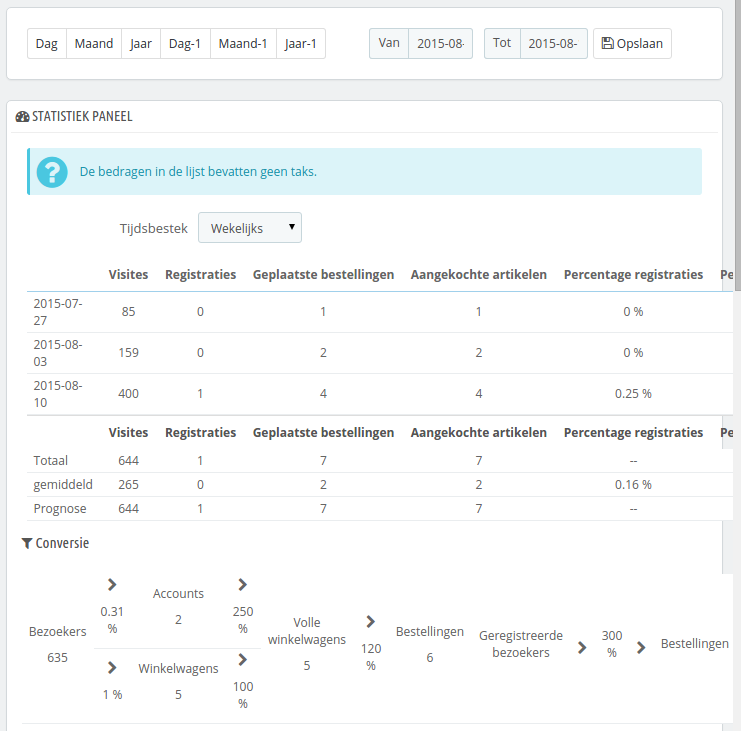
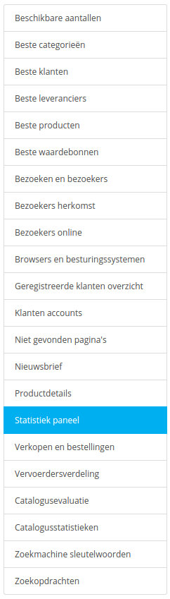

# Statistieken bekijken

Deze sectie toont het nut van de verschillende beschikbare statistieken. Door te klikken op elke een categorie in de balk aan de zijkant, wordt de hoofdpagina herladen met de bijgewerkte statistieken.\
Voor sommige statistieken wordt een complexe uitleg gegeven, hierbij wordt u geholpen om de data te begrijpen dat getoond wordt, zodat u de informatie beter kunt gebruiken om uw winkel te verbeteren en de conversie te verhogen.

De data wordt verzameld vanaf de dag dat u PrestaShop installeert. Als u liever hebt dat deze data wordt verzameld zodra uw winkel opent (en daarmee testdata te vermijden), kunt u ook de de statistieken tijdelijk uitschakelen.

## Hoofdinterface 

Standaard wordt het dashboard getoond op deze pagina, als overzicht van de vele statistieken die zijn bijgehouden door PrestaShop sinds de opening van uw winkel.

Aan de bovenkant van de pagina is een balk die u helpt bij het kiezen van de periode van de getoonde statistieken. Drie soorten opties zijn mogelijk:

* Huidige dag, maand of jaar.
* Vorige dag, maand of jaar.
* Nauwkeurige datumselectie.

Het dashboard bevat 8 secties:

* De hoofdstatistieken. Dit is het hart van uw statistieken. Binnen een enkele tabel geeft PrestaShop u een overzicht van de belangrijkste statistieken die zijn verzameld voor de geselecteerde periode: bezoekers, nieuwe registraties, nieuwe bestellingen, aantal items gekocht binnen alle bestellingen, percentage registraties over alle bezoekers, percentage van bezoekers met bestelling, aantal gebruikte waardebonnen, totaalbedrag van alle bestellingen.\
  U kunt de nauwkeurigheid aanpassen met de dropdown-selector, aan de rechterbovenkant van de sectie. De mogelijke periodes zijn: dagelijks, wekelijks en jaarlijks.\
  De drie regels aan de onderkant van de tabel worden niet beïnvloed door de geselecteerde periode: totaal, gemiddelde en voorspellingen maken het mogelijk om een betere schatting te maken van de toekomst van uw winkel.
* **Conversie**. Deze sectie geeft u een idee van hoeveel een bezoeker of geregistreerde klant waard is in uw winkel, gebaseerd op het aantal bestellingen dat ze hebben geplaatst. Het is een goede indicatie van hoe uw winkel presteert.\
  Het verschil tussen een "winkelwagen" en een "volle winkelwagen" is dat een winkelwagen de wagen is van een bezoeker met slechts producten en een volle winkelwagen is een wagen met producten EN een afleveradres EN een gekozen vervoerder – in het kort is de wagen _bijna volledig_ door het afrekenproces gekomen, het enige dat nog moet gebeuren is het betalen zelf.
* **Betalingsverdeling**. Deze sectie toont welke betaalmethoden het meest worden gekozen door betalende klanten. Op basis van deze getallen kunt u ervoor kiezen om uw winkel of bedrijf aan te passen aan de populairste methoden, of om een specifieke methode aan te bevelen als keuze.\
  Door gebruik te maken van de dropdown-selector "Zone" aan de rechterbovenkant van de sectie kunt u de statistieken beperkten tot een specifieke geografische zone en dus zien welke methode het beste werkt in een gegeven regio.
* **Categorieverdeling**. Dezes sectie geeft categoriespecifieke informatie. Voor elke categorie toont het nuttige statistieken: producten, verkopen, percentage van verkopen in een specifieke taal van de gehele winkel, percentage verkopen van de gehele winkel, gemiddelde productprijs. Als u ziet dat er een categorie is die beter verkoopt dan een andere, dan kunt u uw marketing daarop aanpassen. U kunt ook de slechtere categorieën promoten door middel van kortingen, waardebonnen, etc.\
  Door gebruik te maken van de dropdown-selector "Zone" aan de rechterbovenkant van de sectie kunt u de statistieken beperkten tot een specifieke geografische zone en dus zien welke methode het beste werkt in een gegeven regio.
* **Taalverdeling**. Uw klanten kunnen de gewenste taal opgeven bij het registreren, en u kunt de taalverdeling in deze sectie bekijken. Zorg ervoor dat u alle producten voorziet van de correctie vertalingen voor in ieder geval de twee populairste talen.
* **Zoneverdeling**. U kunt andere secties filteren op zones, maar deze sectie geeft u direct een overzicht van het aantal geregistreerde klanten en geplaatste bestellingen (en de respectievelijke percentages).
* **Valutaverdeling**. Als u meer dan één valuta accepteert, dan kunt u de statistieken beperken tot een zone en zien welke valuta het populairste zijn in gegeven regio's.
* **Attribuutverdeling**. Dit is meer een interne statistiek waarmee u kunt zien welke attributen en attribuutgroepen het meeste worden gebruikt voor uw producten.

## Door de statistieken navigeren 

De meeste statistiekdata kan gedownload worden als CSV-bestand, door te klikken op de exporteerknop.

* **Beschikbare hoeveelheden**. Deze sectie geeft u een overzicht van de huidige hoeveelheden.
* **Beste** **categorieën**. Deze sectie toont de prestaties van uw winkel per categorie. U kunt ontdekken hoe veel producten in elke categorie zijn verkocht, de bijbehorende omzet tonen evenals het aantal bezochte pagina's. Zorg ervoor dat u regelmatig de consistentie van uw resultaten tussen verschillende categorieën controleert om de cohesie van uw winkel aan te passen.
* **Beste klanten**. Deze sectie toont de beste klanten in uw winkel. Het toont hun e-mailadressen evenals het aantal keer dat ze de website hebben bezocht en hoeveel ze hebben gespendeerd. Zorg ervoor dat u deze pagina in de gaten houdt om uw beste klanten te volgen. Door te klikken op de knoppen aan de bovenkant van de kolommen, kunt u aangeven hoe u deze data wilt sorteren.
* **Beste waardebonnen**. Deze sectie toont de populairste waardebonnen, winkelwagenregels en catalogus prijsregels die u hebt aangemaakt en verspreid, al dan niet persoonlijk of door middel van een campagne. De tabel toont ook de omzet en het aantal coupons dat is gebruikt.
* **Best-verkochte producten**. Deze sectie toont de best verkopende producten. U kunt de behaalde omzet tonen, de dagelijkse verkopen, aantal page views en de hoeveelheid op voorraad. Met deze tabel kunt u uw hoofdproducten achterhalen en besluiten of u uw prijzen wilt verhogen/verlagen of kortingen wilt uitdelen.
* **Browsers en besturingssystemen**. Deze sectie informeert u over de webbrowsers die gebruikers en klanten gebruiken om door uw winkel te bladeren. U moet ervoor zorgen dat uw website compatibel is met deze browsers, in ieder geval de drie populairste. Het vertelt u ook of uw winkel bekeken wordt op mobiele apparaten zoals een smartphone. Als dit aantal significant is, dan moet u nadenken over een mobiele versie van uw winkel.\
  Ten slotte ziet u welke besturingssystemen gebruikt worden door uw bezoekers. Zorg ervoor dat uw winkel compatibel is met de gebruikte platformen.
* **Vervoerdersverdeling**. Deze pagina geeft aan welke vervoerders het meeste worden gebruikt door uw bezoekers. U kunt de resultaten filteren op bestelstatus. Als u ontdekt dat een vervoerder niet vaak wordt gebruikt, ondanks dat deze snel en efficiënt is, dan kan het nuttig zijn om deze een prominentere plaats te geven tijdens het afrekenen om op deze manier de klanttevredenheid te verhogen.
* **Catalogusevaluatie**. Deze sectie geeft u een overzicht van de prestaties van uw catalogus. U kunt bekijken welke producten actief zijn of controleren of de beschrijving klopt in de actieve talen in uw winkel. U kunt ook zien of uw producten genoeg afbeeldingen hebben, of ze goed verkopen en de huidige voorraadstatus bekijken. De totaalscore voor elk product wordt getoond door middel van een gekleurd icoon. U kunt criteria opgeven door de tabel aan de bovenkant van de pagina in te vullen en vervolgens de instellingen op te slaan.
* **Catalogusstatistieken**. Deze sectie bevat praktische informatie over de verkochte producten in uw winkel en uw catalogus als geheel. Deze statistieken kunnen gefilterd worden op categorie door gebruik te maken van de dropdown-selector aan de rechterbovenkant van de sectie. U kunt invloed uitoefenen op de prestaties van uw catalogus door te volgende indicatoren te analyseren:
  * **Beschikbare producten**. Het aantal beschikbare producten in dezes categorie (standaard alle categorieën).
  * **Gemiddelde prijs (basis prijs)**. De gemiddelde productprijs in de geselecteerde categorie.
  * **Bekeken productpagina's**. Aantal productpagina's die bekekene zijn door potentiële klanten. Vergelijk deze data tussen verschillende categorieën om te zien welke categorie de meeste productviews oplevert of het tegenovergestelde. Gebruik deze informatie om uw catalogus te verbeteren.
  * **Producten gekocht**. Het aantal gekochte producten in elke categorie.
  * **Gemiddeld aantal bekeken pagina's**. Het gemiddeld aantal productpagina's in de categorie die zijn bezocht.
  * **Gemiddeld aantal aankopen**. Het gemiddeld aantal aankopen in de geselecteerde categorie.
  * **Beschikbare afbeeldingen**. Geeft aan hoeveel afbeeldingen gekoppeld zijn aan de producten in de geselecteerde categorie. Een snelle manier om te ontdekken of er afbeeldingen ontbreken voor sommige producten is om te controleren of er minder afbeeldingen zijn dan producten.
  * **Gemiddeld aantal afbeeldingen**. Aantal afbeeldingen gedeeld door het aantal producten in de geselecteerde categorie.
  * **Producten nooit bekeken**. Sommige producten zijn nooit bekeken door bezoekers. Controleer de pagina's om te achterhalen waar dat aan kan liggen.
  * **Producten nooit gekocht**. Sommige producten zijn nooit gekocht door klanten. Dit is een serieus probleem en u moet de oorzaak achterhalen.
  * **Conversie verhouding**. Geeft de relatie tussen het aantal bezoekers en het aantal aankopen weer. Het is belangrijk dat deze waarde zo hoog mogelijk is.
  * Een tabel aan de onderkant van de pagina geeft aan welke producten in de categorie nooit zijn gekocht. U wilt wellicht de prijzen aanpassen of een betere beschrijving gebruiken.
* **Klanten accounts**. Deze pagina toont een grafiek met het aantal klantaccounts in uw winkel. Met deze informatie kunt u de impact van uw marketingcampagnes meten. U kunt het aantal bezoekers die zich abonneren, maar nooit iets bekijken, zien, net als het aantal klanten dat een account aanmaakt en gelijk een bestelling afrekent.&#x20;
* **Nieuwsbrief**. Deze pagina toont statistieken over nieuwsbriefabonnees. U kunt deze database gebruiken om klanten geïnformeerd te houden. De nieuwsbrief help meestal bij het verhogen van verkeer naar u winkel. Als u het aantal abonnees wilt verhogen, probeert u dan waardebonnen/winkelwagenregels te koppelen aan de nieuwsbrief.\
  U kunt alle adressen van de abonnees bekijken via de module "Nieuwsbrief" op de pagina "Modules en Services".
* **Niet gevonden pagina's**. Deze pagina vertelt u welke pagina's van de catalogus bezoekers hebben getracht te bekijken, maar niet hebben kunnen vinden (resulterende in een zogeheten "HTTP 404"-fout). Dit is nuttig om potentiële technische problemen met uw website te vinden, die uw verkoop kunnen hinderen.
* **Productdetails**. Dezes pagina toont u alle producten in uw winkel op referentienummer, naam en beschikbare voorraad. U kunt uw resultaten sorteren door het dropdown-menu boven de productcategorie te gebruiken. Door te klikken op een product krijgt u toegang tot de productstatistieken.\
  U kunt daarna een grafiek bekijken met twee sets aan data: verkopen en aantal bezoekers op een productpagina. De conversie van een product wordt ook getoond.
* **Geregistreerde klanten overzicht**. Deze sectie is verdeeld over 5 grafieken:
  * **Geslachtsverdeling**. U kunt zien hoe klanten zijn verdeeld over de verschillende sociale titels die u hebt ingesteld – standaard Mr. en Mv., maar er kunnen ook ander zijn, zoals Dr. of Sr. Daarom kunt u deze grafiek niet vertrouwen voor de exacte geslachtsverdeling, tenzij u de aanheffen hebt gelimiteerd tot de geslachten.
  * **Leeftijdsverdeling**. U kunt ontdekken hoe klanten zijn verdeeld over de verschillende leeftijden. Als u ziet dat de leeftijdsverdeling anders is dan u had verwacht, wilt u wellicht nog een keer nadenken over uw marketingcampagnes.
  * **Landverdeling**. U kunt snel raadplegen in welke landen uw winkel het meeste wordt bekeken. Dit kan u helpen bij het focussen tijdens een marketingcampagne op een enkel land.
  * **Valutaverdeling**. U kunt zien welke valuta gebruikt worden in uw winkel en in welke verhoudingen.
  * **Taalverdeling**. U kunt zien in welke talen uw winkel het meeste wordt bekeken en op basis daarvan besluiten dat u een specifieke vertaling wilt verbeteren.
* **Verkopen en bestellingen**. Deze twee grafieken representeren de ontwikkeling van de verkopen en bestellingen in uw winkel. Ze kunnen op land worden gefilterd door gebruik te maken van het dropdown-menu aan de recherbovenkant.
  * De eerste grafiek geeft het aantal geldige bestellingen weer, alsook het totaal aantal bestellingen. Met deze grafiek kunt u de periodes analyseren met de meeste bestellingen.
  * De tweede grafiek helpt u bij het visualiseren van uw verkopen. Het kan de periodes analyseren waarin u de beste verkopen had. Dit maakt het mogelijk om een beter inzicht te krijgen in de beste momenten om een marketingcampagne te starten.
* **Zoekmachine sleutelwoorden**. Deze pagina vertelt u welke sleutelwoorden ingevoerd zijn in een zoekmachine die ze uiteindelijk naar uw winkel hebben gebracht. Dit maakt het mogelijk om de termen gemakkelijk te onderscheiden. Zo kunt u zien welke sleutelwoorden ontbreken in deze lijst en dus niet effectief zijn.
* **Zoekopdrachten**. Deze sectie heeft twee indicatoren.
  * De eerste is een grafiek die die verdeling van sleutelwoorden toont die getypt zijn in de zoekbalk van uw winkel. Dit maakt het mogelijk om te zien welke producten het meeste worden gezocht – en waarvan u er veel op voorraad moet hebben.
  * De tweede is een tabel die de bezoeken samenvat. U kunt zien welke sleutelwoorden worden gebruikt, hoe vaak ze worden getypt en hoeveel resultaten beschikbaar zijn. Het is belangrijk dat alle klantverzoeken een resultaat opleveren. Om uw winkel te verbeteren moet u ervoor zorgen dat de producten voldoen aan de eisen van de klant (zoekopdrachten) of extra tags toevoegen aan producten die gemakkelijk herkend kunnen worden.
* **Statistiek paneel**. Dit is de homepage van de pagina "Statistieken" zelf. Het toont een overzicht van de statistieken. Door de klikken op deze optie wordt u naar het globale dashboard gebracht.
* **Bezoekers online**. Deze sectie geeft het aantal huidige bezoekers in uw winkel. U kutn de namen zien en de pagina's die ze bekijken. De data wordt live bijgewerkt zolang bezoekers uw winkel bekijken.
* **Bezoekers herkomst**. De pagina gebruikt een grafiek om de top tien sites en zoekmachines weer te geven die bezoekers naar uw winkel hebben geleid. Meestal spelen zoekmachines een belangrijke rol. Als u een marketingcampagne aanmaakt door artikels te publiceren op andere sites, dan kunt u hier de impact zien. Onder de grafiek staan de namen van de sites die bezoekers hebben opgeleverd, samen met het aantal bezoekers in de rechterkolom.
* **Bezoeken en bezoekers**. Deze pagina geeft u de statistieken van bezoekers in uw winkel en het aantal keer dat ze langskomen. Hoe hoger het getal hoe populairder uw winkel is. De grafiek helpt u bij het begrijpen van het gedrag van uw klanten. Dit komt neer op het zien hoeveel bezoeken uw winkel krijgt en u kunt het vergelijken met het aantal bezoekers (PrestaShop kan herkennen wanneer een klant uw winkel meerdere keren bekijkt. Vanwaar dat het aantal bezoeken veel hoger is dan het aantal bezoekers). Hoe groter het verschil tussen de twee getallen, hoe beter u bent in het behouden van klanten.
