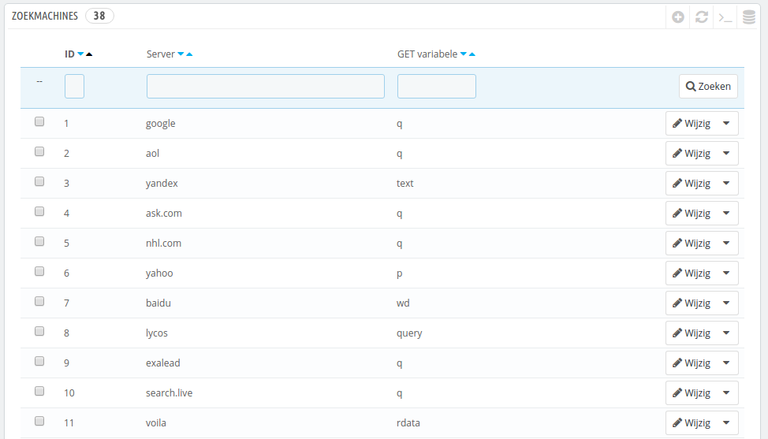
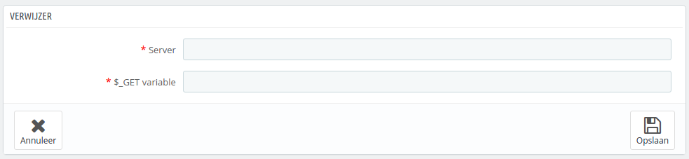

# Zoekmachines instellen

Veel bezoekers zijn afkomstig van zoekmachines. Om te ontdekken waar ze naar op zoek waren en hoe u uw winkel kunt verbeteren voor de zoekopdrachten, moet u de opdrachten achterhalen.

Deze pagina toont een tabel van de zoekmachines die uw installatie van PrestaShop ondersteunt – betekende dat PrestaShop ze herkent en de zoekopdracht kan herkennen die de bezoeker gebruikt vanaf de zoekmachine om uw winkel te vinden.

Ondanks dat Google het grootste marktaandeel heeft, zijn er vele andere zoekmachines die mensen kunnen gebruiken om uw website te vinden. Daarom moet u ook hun resultaten kunnen onderscheiden. Als een onbekende zoekmachine veel bezoekers oplevert, dan wordt het tijd om deze toe te voegen aan uw database – anders worden de bezoekers getoond in uw statistieken als afkomstig van "Andere zoekmachines", wat niet erg handig is.

## Een zoekmachine toevoegen 

Het is erg gemakkelijk om een nieuwe zoekmachine aan uw lijst toe te voegen.

Laten we veronderstellen dat u DuckDuckGo wilt toevoegen, een zoekmachine die privacy hoog in het vaandel heeft staan:

1. Zoek de gehele referrer URL op van de zoekopdracht. Bijvoorbeeld [http://duckduckgo.com/?q=kids+shoes](http://duckduckgo.com/?q=kids+shoes)
2. Neem de domeinnaam welke gekoppeld is aan de zoekmachine en voer deze in bij het veld "Server". In ons geval "duckduckgo".
3. Zoek de query-variabele:
   1. Zoek de query string. Het zou een aantal letters moeten bevatten, gevolgd door een "="-teken, dat weer wordt gevolgd door de query zelf, gesloten door een "&" aan het einde of het einde van de string. In ons geval is dat "q=kids+shoes".
   2. De query-variabele bestaat uit de letters voor het "="-teken. In ons geval: "q". Stop deze in het veld "$\_GET variabele".
4. Klik op de knop "Opslaan" en vanaf nu herkent PrestaShop bezoekers die afkomstig zijn van DuckDuckGo.
