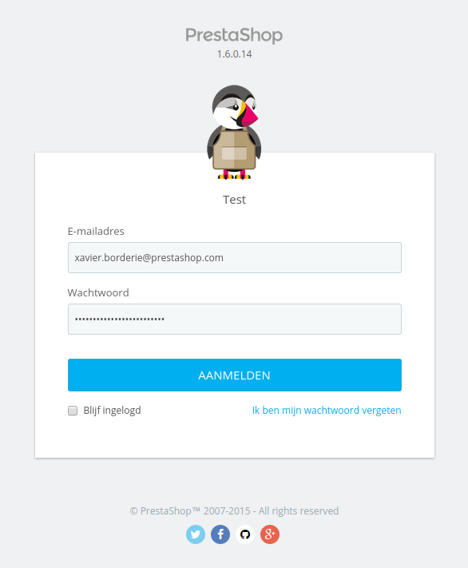
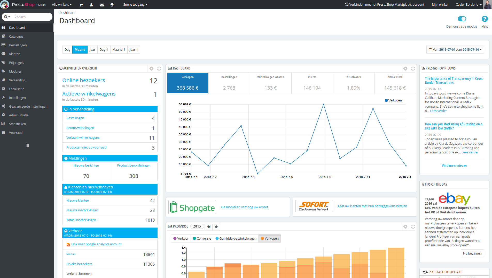

# Verbinding maken met de back office

De PrestaShop back office is de benamiing die gebruikt wordt om het administratiepaneel te beschrijven in deze handleiding. U spendeert de meeste tijd in dit paneel, want alles wat de gebruiker ziet wordt direct door de back office verwerkt: toevoegen/bewerken/verwijderen van producten, vervoerders beheren, pakketten aanmaken, waardebonnen aanmaken, communiceren met klanten, het verbeteren van uw winkel, etc.

Gedurende het installatieproces is de `/admin` map hernoemd naar een map met een unieke code (bijvoorbeed `/admin7890`) om veiligheidsredenen. Gebruik de naam van die nieuwe map om toegang te krijgen tot uw back office (bijvoorbeeld: [http://www.example.com/admin7890](http://www.example.com/admin7890)).

De naamswijziging wordt automatisch gedaan door PrestaShop. Onthoud de mapnaam goed nadat u voor het eerst verbinding maakt met de back office!

U krijgt de loginpagina van het administratiepaneel te zien.

Voer het e-mailadres en wachtwoord in die u heeft geregistreerd toen u PrestaShop installeerde. Klik op de knop "Aanmelden" en u wordt naar het dashboard van de back office geleid. Dit is een soort welkomstpagina voor het configuratiescherm.

Vanaf deze stap kunt u beginnen met het instellen van uw winkel en het verkopen van producten aan uw klanten.

Lees het volgende hoofdstuk van deze handleiding genaamd [Eerste stappen met PrestaShop 1.6](eerste-stappen-met-prestashop-1.6.md) om kennis te maken met de verschillende delen van de back office.
