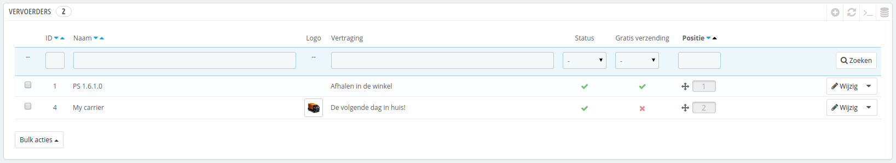
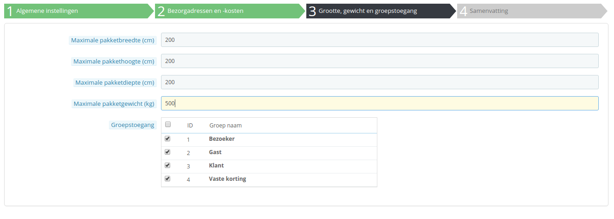

# Vervoerders beheren

U moet vervoerders hebben toegevoegd aan uw PrestaShop-installatie – dat is een indicator over wie uw producten gaat leveren. Ook u of uw winkel kan als vervoerder worden ingesteld (als u bijvoorbeeld lokaal werkt of digitale producten aanbiedt), maar zodra u pakketten verstuurd met frankering en een derde partij gebruikt voor de verzending, zoals PostNL, bpost, DHL, DPD, GLS, UPS, enzovoort, dan moet u hun details invoeren in de database van de winkel. Dit zorgt ervoor dat klanten beter kunnen kiezen uit vervoerders afhankelijk van de kosten en leverdata.

De pagina "Vervoerders" toont een lijnt met uw huidige vervoerders. Vanaf hier kunt u hun status aanpassen, aangeven of er gratis verzending is en de volgorde wijzigen.

Standaard hebt u twee vervoerders in uw database:

* Uw eigen winkel: deze representeert uw eigen fysieke winkel, waar klanten hun producten kunnen komen afhalen. Er is geen prijsreeks of gewichtreeks ingesteld.
* "My Carrier": dit is een voorbeeld van een vervoerder en zou niet in productieomgevingen gebruikt moeten worden. Het heeft slechts één prijsreeks (van €0 tot €10000) en één gewichtreeks (van 0kg tot 10000kg).

Het is aan u om deze standaardvervoerders te verwijderen en nieuwe toe te voegen voor uw klanten. Op zijn minst moet u de vervoerder "My Carrier" aanpassen en de data vervangen met die van een echte vervoerder: naam, details en reeksen. We raden aan dat u de vervoerder "My Carrier" verwijderd en daarna de module van een reeds bestaande vervoerder installeert om uw verzendpartner te registreren in PrestaShop. Dit zorgt voor een betere aansluiting.

Nieuwe vervoerders worden toegevoegd door op de knop "Voeg nieuwe vervoerder toe" te klikken. Dit opent een nieuwe pagina met twee opties:

* **Gebruik één van de voorgestelde vervoerdersmodules**. Het is sterk aangeraden om vervoerders te registreren door een vervoerdersmodule te installeren: dit maakt het proces veel sneller en de instellingen zijn nauwkeuriger.
* **Voeg een nieuwe vervoerder toe**. Als u geen module kunt vinden voor uw verzendparter, tussen zowel de vooraf geïnstalleerde modules als een module op de PrestaShop Addons-marktplaats, dan moet u uw vervoerder registreren door middel van de vervoerderswizard: klik op de knop "Voeg nieuwe vervoerder toe" om deze wizard te openen.

Dit is een scherm dat is toegevoegd in versie 1.6.0.7 van PrestaShop. Het helpt u bij het bepalen of u een vervoerdersmodule kunt installeren of dat u de vervoerder zelf moet instellen door middel van de wizard.

## Een nieuwe vervoerder toevoegen door middel van de wizard 

In dit gedeelte gaan we de gehele vervoerder, van A tot Z toevoegen door middel van de vervoerderswizard. U kunt zoveel vervoerders toevoegen als u zelf wilt.\
Als er een vervoerder is met verschillende services, dan moet u zoveel vervoerders aanmaken in PrestaShop als nodig is en ze scheiden door middel van hun namen:

Veel van de antwoorden op de vragen die gesteld worden door PrestaShop zouden door uw vervoerder geleverd moeten zijn. Controleer bij uw vervoerder of de instellingen goed staan.

Om een nieuwe vervoerder aan te maken, klikt u op de knop "Voeg nieuwe vervoerder toe" op de pagina "Vervoerder" onder het menu "Verzendingen". Dit opent het eerste paneel van de vervoerderswizard.

### Paneel 1: Algemene instellingen 

Dit is waar u de vervoerder omschrijft, door informatie op te geven die de klant nodig heeft om de vervoerder te herkennen en een keuze te maken uit vervoerders.

Laten we de informatie bekijken die dit paneel nodig heeft:

* **Vervoerdersnaam**. De naam is publiek, dus u kunt beter de officiële naam gebruiken. Als u één vervoerder aanmaakt per service die een vervoerder aanbiedt, dan helpt deze naam om onderscheid te maken tussen de services.\
  U moet ook een beschrijving van de service toevoegen. Bijvoorbeeld: "PrestaShipping - pakketten zwaarder dan 100 kg".
* **Transittijd**. De geschatte tijd dat het duurt voordat het pakket wordt geleverd door deze vervoerder in duidelijke taal. Dit wordt getoond aan klanten tijdens het afrekenen. Het helpt hen bij het selecteren van een vervoerder aan de hand van de tijd die ze bereidt zijn om te wachten voordat ze hun pakket ontvangen. Sommige klanten betalen graag meer om hun pakket sneller te ontvangen.\
  U moet dit veld invullen voor alle beschikbare talen, zeker de standaardtaal.
* **Snelheidsrang**. Omdat het veld "Transittijd" elke tekst kan bevatten die u wilt, kan het niet gebruikt worden om de transittijden met elkaar te vergelijken. De instelling "Snelheidsrang" helpt u om de snelheid een nummer te geven, van 0 (erg traag) tot 9 (erg snel). Dit wordt dan gebruikt om vervoerders te sorteren op hun snelheidsrang en helpt klanten bij het kiezen van de vervoerder die ze wensen.
* **Logo**. Het hebben van een logo helpt klanten bij het onderscheiden van vervoerders. PrestaShop vergroot of verkleint uw afbeelding om het in het thema te passen. \
  Het logo verschijnt op elk paneel van de wizard als herinnering welke vervoerder u aan het wijzigen bent.&#x20;
* **Tracking-URL**. Dit veld moet gevuld worden met de tracking-URL die door uw vervoerder wordt gegeven. Voor Frankrijk (La Poste) is dit bijvoorbeeld [http://www.colissimo.fr/portail\_colissimo/suivreResultat.do?parcelnumber=@](http://www.colissimo.fr/portail\_colissimo/suivreResultat.do?parcelnumber=@). Wanneer klanten iets hebben gekocht zien ze de url waarbij de '@' is vervangen door het trackingnummer van de vervoerder.

Klik op "Volgende" voor het tweede paneel.

### Paneel 2: Bezorgadressen en -kosten 

Als eerste geeft dit paneel een handvol instellingen:

* **Voeg afhankelingskosten toe**. Voeg afhandelingskosten wel of niet toe aan de prijs van de vervoerder, zoals gezet op de pagina "Verzendingen > Instellingen".
* **Gratis verzending**. Als dit is ingeschakeld, dan worden er geen verzendkosten in rekening gebracht voor deze vervoerder.\
  Als dit is ingeschakeld, dan kunt u per zone een reeks instellen in het formulier eronder.
* **Facturering**. Wanneer de klant wordt gefactureerd, dan kan PrestaShop twee methoden toepassen, welke afhankelijk zijn van hoe uw vervoerder de kosten berekend.\

  * **Afhankelijk van de totaalprijs**. Prijs hangt af van de totaalprijs van de bestelling.
  * **Afhankelijk van het totaalgewicht**. De prijs hangt af van het totaalgewicht van de bestelling.
* **Btw**. Geeft aan of er btw berekend moet worden over de vervoerskosten. De belastingregel moet al bestaan in PrestaShop (onder "Lokalisatie > Belastingregels").
* **Afwijkende gedrag**. In het geval dat er voor de vervoerder geen verzendkosten gevonden kunnen worden voor de vereiste zone of gewicht, dan kunt u aangeven wat er als alternatief moet gebeuren in PrestaShop. U hebt twee opties:
  * **Kosten van hoogste gedefinieerde klasse toepassen**. PrestaShop neemt de duurste reeks en past de voorwaarden toe.
  * **Vervoerder uitschakelen**. PrestaShop zal de vervoerder niet aanbevelen, omdat de bestelling waarschijnlijk niet geleverd kan worden.

Hierna komt het belangrijke gedeelte: het aanmaken van de vervoerdersreeksen. Dit is een erg belangrijke stap, omdat PrestaShop deze informatie nodig heeft om de juiste verzendkosten te tonen aan de klant. Afhankelijk van de totaalprijs van de bestelling kunnen sommige opties bij vervoerders niet beschikbaar zijn, totdat u een bepaald bedrag hebt bereikt. U moet deze waarden zeer nauwkeurig invullen en bij voorkeur gelijk aan die van de instructies van de vervoerder.

Dit is waar de vervoerderswizard zijn naam eer aan doet. Hier kunt u de prijs- of gewichtreeksen van de vervoerder instellen, reeks voor reeks, en hierbij voegt u alle prijzen toe.

Voor elke reeks, zijn er een paar stappen vereist:

1.  **Stel de limieten in voor de reeks**. Afhankelijk van de keuzen bij "Facturering" toont deze of "Wordt toegepast indien het gewicht" of "Wordt toegepast indien de prijs".

    Let op dat de lagere limiet inclusief is (>=) en de hogere limiet is exclusief (<). Dit betekent dat de hogere limiet dezelfde waarde kan aannemen als de lagere limiet van de volgende reeks, zolang de twee maar niet overlappen.
2. **De prijzen invoeren**. Als zowel de lage en hoge limiet zijn ingevoerd, maakt PrestaShop het veld "All" beschikbaar. Dit is een speciaal veld: elke waarde die u invoert wordt in de velden eronder overgenomen. U kunt daarna de velden aanpassen zoals u wilt.\
   Vink de checkbox aan bij de zones die u wilt inschakelen voor deze vervoerder. Als de vervoerder niet kan leveren naar een zone, dan moet u ervoor zorgen dat de checkbox niet is aangevinkt.
3. **De reeks aanmaken**. Klik op de knop "Voeg nieuwe stap toe". PrestaShop voegt een nieuwe kolom aan zonevelden toe. Begin opnieuw door de lagere en hogere limiet in te stellen voor deze reeks en de prijzen vervolgens in te vullen.

De eenheden voor gewicht en prijzen zijn de standaardeenheden van uw PrestaShop-installatie. U kunt dit aanpassen op de pagina "Lokalisatie" onder het menu "Lokalisatie".

Klik op "Volgende" om naar het derde paneel te gaan.

### Paneel 3: Grootte, gewicht en groepstoegang 

Dit paneel toont twee groepen aan opties:

* **Maximale pakketdiepte/-breedte/-lenghte/-gewicht**. U kunt nu aangeven wat de maximale hoogte, lengte en gewicht zijn. Welke essentieel zijn bij het kiezen van een vervoerder. De waarde gebruikt de standaardeenheden van uw winkel. Deze kunnen worden aangepast op de pagina "Lokalisatie" onder het menu "Lokalisatie".
* **Groepstoegang**. U wilt wellicht dat alleen sommige gebruikers toegang hebben tot een vervoerder. Deze optie is daarvoor geschikt.

Klik op "Volgende" om het vierde en laatste paneel te bereiken.

### Paneel 4: Samenvatting 

Dit laatste paneel geeft u een overzicht van uw instellingen.

Als sommige instellingen verkeerd zijn, dan kunt u terug naar het volgende paneel door te klikken op de knop "Vorige", of door op de tab van het paneel te klikken.\
Als u deze vervoerder wilt bewaren als klad en deze later aanpassen, dan kunt u eerst de vervoerder uitschakelen door de optie "Ingeschakeld" op Nee te zetten.\
Klik op "Voltooien" om uw vervoerder te bewaren.

Wanneer u PrestaShop in multistore-modus gebruikt, dan is er nog een paneel beschikbaar en de volgorde is iets anders:

1. Algemene instellingen
2. **MultiStore**
3. Bezorgadressen en -kosten
4. Grootte, gewicht en groepstoegang
5. Samenvatting

Alle panelen zijn gelijk aan wat hierboven is omschreven. De nieuwe, "MultiStore" maakt het mogelijk om deze vervoerder voor een selectie van uw winkels in te schakelen.

## Een vervoerder toevoegen door middel van een vervoerdersmodule 

PrestaShop heeft een aantal gratis modules, waaronder een aantal modules voor vervoerders, die u gelijk kunt installeren.

De beschikbare modules hangen af van de landinstellingen van uw winkel: als u hebt ingesteld dat uw winkel zich in Frankrijk bevindt, dan krijgt u niet dezelfde modules als wanneer u uw winkel instelt voor de Verenigde Staten!

In het scherm "Voeg een nieuwe vervoerder toe" kunt u kiezen tussen de vervoerderswizard of één van onze aanbevolen modules gebruiken. Het wordt sterk aangeraden om vervoerders te installeren door middel van een module: dit maakt het proces sneller en vaak zijn er meer opties beschikbaar voor een vervoerder.

Afhankelijk van de module, kunt u op zowel de "Installren" knop klikken en PrestaShop het werk laten doen, of op het winkelwagenicoontje klikken. In het tweede geval wordt u naar de Addons-marktplaats gebracht, waar u de module kunt kopen. Zodra u de module hebt gekocht kunt u het installeren en configureren.
