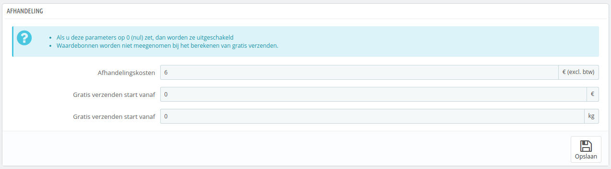
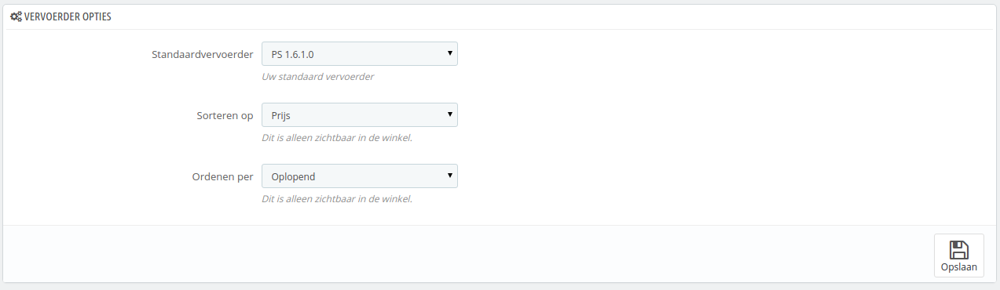

# Verzendinstellingen

De algemene instellingen voor uw vervoerders kunnen gevonden worden onder "Verzending > Instellingen".

Deze pagina toont de opties voor afhandelingskosten:

* **Afhandelingskosten**. Voer de kosten in per afhandeling, die toegevoegd kunnen worden aan de totaalprijs. Dit staat los van uw verzendkosten: het zijn de kosten die u of uw medewerker maken om de producten in te pakken en verzendklaar te maken. Als deze kosten er niet zijn, zet u deze op 0.
* **Gratis verzending start vanaf (valuta)** en **Gratis verzenden start vanaf (gewicht)**. Voer de prijs of gewicht in, waarboven uw klanten gratis verzending ontvangen. U kunt er bijvoorbeeld voor willen zorgen dat klanten geen verzendkosten hoeven te betalen bij bestellingen boven €250.\
  Als u geen gebruikt wilt maken van deze optie en u niet wilt dat dit bericht verschijnt in de winkel, dan laat u dezes waarde op 0 staan.

De sectie "Vervoerder opties" geeft u toegang tot drie instellingen, die invloed hebben op de frontoffice en de klant helpen bij het maken van een keuze:

* **Standaardvervoerder**. Als u meer dan één vervoerder hebt in uw systeem, dan wilt u wellicht één promoten onder uw klanten. Naast de vervoerders zelf, heeft deze dropdown twee contextuele opties:
  * **Beste prijs**. Afhankelijk van het bedrag van de bestelling, het gewicht en de leveringszone, kiest PrestaShop de laagste prijs voor de klant.
  * **Beste rang**. De snelheidsrang wordt gebruikt om de snelheid van vervoerders te vergelijken. PrestaShop toont de vervoerder met de hoogste rang.
* **Sorteren op**. Wanneer klanten een aantal vervoerders te zien krijgen, dan kan de lijst op deze instelling worden gesorteerd.
* **Ordenen per**. Dit maakt het mogelijk om de volgorde te veranderen:
  * Als er wordt gesorteerd op prijs in oplopende volgorde, dan wordt de goedkoopste vervoerder bovenaan getoond en de duurste onderaan.
  * Als deze volgorde aflopen is, dan staat de duurste bovenaan en de goedkoopste onderaan.
