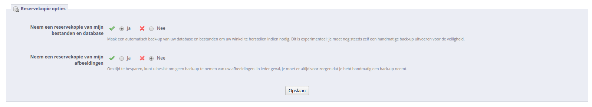

# Automatisch bijwerken

**Inhoudsopgave**

/\*\<!\[CDATA\[\*/\
div.rbtoc1597237783543 {padding: 0px;}\
div.rbtoc1597237783543 ul {list-style: disc;margin-left: 0px;}\
div.rbtoc1597237783543 li {margin-left: 0px;padding-left: 0px;}\
\
/\*]]>\*/

* [Automatisch bijwerken](automatisch-bijwerken.md#Automatischbijwerken-Automatischbijwerken)
  * [Downloaden en installeren van de 1-Click Upgrade module](automatisch-bijwerken.md#Automatischbijwerken-Downloadeneninstallerenvande1-ClickUpgrademodule)
  * [Het configuratiescherm van de module](automatisch-bijwerken.md#Automatischbijwerken-Hetconfiguratieschermvandemodule)
    * [Welkom](automatisch-bijwerken.md#Automatischbijwerken-Welkom)
    * [De checklist voor het bijwerken](automatisch-bijwerken.md#Automatischbijwerken-Dechecklistvoorhetbijwerken)
    * [De upgrade starten](automatisch-bijwerken.md#Automatischbijwerken-Deupgradestarten)
    * [Versievergelijking](automatisch-bijwerken.md#Automatischbijwerken-Versievergelijking)
    * [Terugzetten van reservekopie](automatisch-bijwerken.md#Automatischbijwerken-Terugzettenvanreservekopie)
    * [Reservekopie opties](automatisch-bijwerken.md#Automatischbijwerken-Reservekopieopties)
    * [Upgrade opties](automatisch-bijwerken.md#Automatischbijwerken-Upgradeopties)
  * [Het bijwerkproces](automatisch-bijwerken.md#Automatischbijwerken-Hetbijwerkproces)
  * [Terug naar de vorige versie: terugzetten](automatisch-bijwerken.md#Automatischbijwerken-Terugnaardevorigeversie:terugzetten)
  * [Terugzetten van de vorige versie: herstellen door middel van uw eigen reservekopie](automatisch-bijwerken.md#Automatischbijwerken-Terugzettenvandevorigeversie:herstellendoormiddelvanuweigenreservekopie)

## Automatisch bijwerken <a href="#automatischbijwerken-automatischbijwerken" id="automatischbijwerken-automatischbijwerken"></a>

PrestaShop's automatische update-tool maakt het mogelijk voor webwinkeleigenaren zonder technische kennis om hun eigen site bij te werken in slechts een paar klikken.

De 1-Click Upgrade module zou standaard beschikbaar moeten zijn op de "Module"-pagina (onder de categorie: "Administratie"): klik op de "Installeer"-knop en PrestaShop wordt bijgewerkt.

Werk uw winkel nooit zomaar bij. De automatische tool waarmee PrestaShop bijgewerkt kan worden kan in sommige situaties falen en mogelijk kunt u dan ook nog eens niet meer herstellen naar een vorige versie.

Het veiligst is om een exacte kopie van u winkel beschikbaar te hebben. Dat kan lokaal op uw eigen computer zijn of ergens op de webserver. Het moet al uw producten, categoriën, thema's, modules, vertalingen, instellingen, etc. bevatten.

Probeer een proefupgrade uit te voeren op die kopie. Als het lukt om te upgraden, controleer dan uw front en back office om te kijken of alles nog werkt zoals verwacht. Als dat niet het geval is, dan heeft de upgradetool problemen met uw configuratie en heeft u de [handmatige methode](handmatig-bijwerken.md) nodig, welke helaas niet meer ondersteund wordt en langer duurt, maar kan in uw situatie toch van pas komen.

### Downloaden en installeren van de 1-Click Upgrade module <a href="#automatischbijwerken-downloadeneninstallerenvande1-clickupgrademodule" id="automatischbijwerken-downloadeneninstallerenvande1-clickupgrademodule"></a>

Als de 1-Click Upgrade module niet beschikbaar is in uw installatie van PrestaShop 1.4, 1.5 of 1.6, dan kunt u deze gratis downloaden vanaf the [Addons](http://addons.prestashop.com/nl/) website.

Zelfs als u al de "1-Click upgrade" module hebt geïnstalleerd, zorg er dan alsnog voor dat u beschikt over de meest recente versie:

* PrestaShop 1.4: Controleer het versienummer in het "Modules"-tabblad, vergelijk deze met het versienummer op de [Addons](http://addons.prestashop.com/nl/) site. Als de versienummers verschillen, download dan de versie vanaf Addons en werk de module bij.
  * De module bijwerken gaat als volgt: deïnstalleer de oude versie en verwijder deze daarna, kopieer daarna de "/autoupgrade" map uit het zip-bestand van de module (deze wordt geleverd door de Addons website), kopieerd deze map naar de "/modules" map van uw PrestaShop-installatie. Als laatste installeert u de module weer in uw administratiepaneel.
* PrestaShop 1.5: PrestaShop controleert automatisch via de Addons website of u over de meest recente versie beschikt. Als er een nieuwe versie beschikbaar is, dan verschijnt de tekst "Bijwerken" naast de knop "Installeren/Deïnstalleren" van de module. Als u op de bijwerkknop klikt, dan download PrestaShop zelf de meest recente versie en werkt het de module bij.
* PrestaShop 1.6 en nieuwer: PrestaShop controleert automatisch via de Addons website of u over de meest recente versie beschikt. Als er een nieuwe versie beschikbaar is, dan verschijnt de tekst "Bijwerken" op de configuratieknop van de module. Als u op de bijwerkknop klikt, dan download PrestaShop zelf de meest recente versie en werkt het de module bij.

Volg simpelweg de normale manier om een module te installeren in PrestaShop:

1. Download de 1-Click Upgrade module vanaf PrestaShop Addons: [http://addons.prestashop.com/nl/administration-tools/5496-autoupgrade.html](http://addons.prestashop.com/nl/administration-tools/5496-autoupgrade.html). Bewaar het zip-bestand op uw bureaublad of andere locatie naar keuze.
2. Ga naar de "Modules" pagina in uw back office.
3.  Klik op "Nieuwe module toevoegen", deze knop is boven de modulelijst te vinden.\
    \


    Wanneer u update vanaf versie 1.4, klik dan op de link "Module toevoegen vanaf mijn computer", deze link is linksboven te vinden.
4. Klik op de knop "Kies een bestand" in het formulier dat nu opent ga zoek het zip-bestand van de module die zojuist hebt gedownload.
5. Klik op de knop "Upload deze module". PrestaShop pakt de module automatisch en voegt deze toe aan de `/modules` map.

De module is nu beschikbaar in uw modulelijst, maar u moet het nog wel installeren:

1. Type "autoupgrade" in de zoekbox van de modulelijst (niet de globale zoekfunctie linksboven).&#x20;
2. De module zou nu in de modulelijst moeten verschijnen.
3. Klik op de knop "Installeren" van de module.

De module is nu gereed om te configureren en te gebruiken.

### Het configuratiescherm van de module <a href="#automatischbijwerken-hetconfiguratieschermvandemodule" id="automatischbijwerken-hetconfiguratieschermvandemodule"></a>

Het configuratiescherm van de module is nu bereikbaar vanaf de modulelijst, door op de knop "Configureren" te klikken.

Het configuratiescherm is ook beschikbaar vanaf:

* PrestaShop 1.4: onder de tab "Gereedschap", onder de "1-Click Upgrade" tab.
* PrestaShop 1.5, 1.6 en nieuwer: onder "Geavanceerder instellingen/Geavanceerde parameters" en dan "1-Click Upgrade".

Het configuratiescherm toont een aantal onderdelen met informatie, tools en instelligen.

#### Welkom <a href="#automatischbijwerken-welkom" id="automatischbijwerken-welkom"></a>

Deze kleine sectie bevat een reminder om aan te geven dat een upgrade nooit 100% veilig kan zijn en dat het daarom verstandig is dat u een complete backup maakt van uw bestanden en data. Op deze manier, mocht de upgrade mislukken, kunt u alsnog de winkel herstellen - alhoewel er wel enig werk bij komt kijken.

Dit proces wordt in detail omschreven in hoofdstuk [Backups aanmaken en terugzetten](backups-aanmaken-en-terugzetten.md).


Noot: de 1-Click upgrade module maakt zelf ook een backup om ervoor te zorgen dat de gehele upgrade ongedaan gemaakt kan worden. Toch kunt u beter vertrouwen op uw eigen backups.

#### De checklist voor het bijwerken <a href="#automatischbijwerken-dechecklistvoorhetbijwerken" id="automatischbijwerken-dechecklistvoorhetbijwerken"></a>

De sectie "checklist voor het bijwerken" geeft u nuttige informatie over uw huidige PrestaShop-installatie en of het upgradeproces kan worden uitgevoerd.


U moet er zeker van zijn dat aan alle eisen op de lijst is voldaan voordat u verder kunt gaan met de upgrade.

* De 1-click upgrade module is up-to-date (uw huidige versie is x.x). Dit geeft aan of u de module zelf nog moet bijwerken. Als u zojuist de upgrade-module hebt geïnstalleerd dan is de kans klein dat deze nog moet worden bijgewerkt.\
  PrestaShop 1.4 - Als u niet de meest recente versie van de module hebt, dan verschijnt een knop onder dit veld, met de tekst "Installeer de laatste versie door te klikken op 'Toevoegen vanaf mijn pc'". Als u hierop klikt wordt u naar de "Modules"-pagina geleid. Vanaf hier kunt u op de knop "Nieuwe module toevoegen" klikken om het vooraf ingevulde formulier te openen. Klik op "Deze module downloaden" om de module bij te werken. Ga hierna weer terug naar de configuratiepagina van de module om te controleren of aan dit item op de checklist is voldaan.\
  PrestaShop 1.5/1.6 - Als u niet de meest recente versie van de module hebt, dan verschijnen er twee links naast dit veld, met de tekst "Bijwerken" en "Downloaden". Als u kiest voor bijwerken, dan wordt deze module automatisch bijgewerkt. Kiest u voor "Downloaden" dan volgt u het [stappenplan](automatisch-bijwerken.md#Automatischbijwerken-Stappenplanmoduleinstalleren) onder "Downloaden en installeren van de 1-Click Upgrade module". Ga hierna weer terug naar de configuratiepagina van de module om te controleren of aan dit item op de checklist is voldaan.
* Uw winkel root map is beschrijfbaar (met de juiste CHMOD permissies). Dit geeft aan of de toegangsrechten juist zijn ingesteld. Is dit niet het geval, dan moet u dit corrigeren met uw FTP-client.\
  Bekijk de sectie [Stap 3 & 4: Systeemcompatibiliteit & winkelinformatie](../aan-de-slag/prestashop-installeren.md#PrestaShopinstalleren-Systeemcompatibiliteit) uit het hoofdstuk [PrestaShop installeren](../aan-de-slag/prestashop-installeren.md).
* **PHP's "Safe mode" optie is uitgeschakeld**.
* **PHP's "allow\_url\_fopen" optie is ingeschakeld of cURL is geïnstalleerd**.
* **Uw winkel is in onderhoudsmodus**. Dit geeft aan of uw winkel nog actief is of in onderhoudsmodus staat. U moet uw winkel in onderhoudsmodus zetten gedurende het gehele updateproces (reservekopie maken van bestanden, reservekopie van database, automatisch bijwerken, verificatie). Dit is om te voorkomen dat u gedurende het proces geen bestellingen verliest (en uiteindelijk klanten). De module kan voor u de winkel in onderhoudsmodus zetten. Klik op de knop met de tekst "Klik hier om uw winkel in onderhoudsmodus te plaatsen". U kunt zelf ook de winkel in onderhoudsmodus zetten via de gebruikelijke configuratiepagina.
  * PrestaShop 1.4: in-/uitschakelen van de winkel op de pagina "Instellingen".
  * PrestaShop 1.5/1.6 en nieuwer: in-/uitschakelen van de winkel op de pagina "Onderhoud" onder het "Instellingen"-menu.
* **De cache mogelijkheid van PrestaShop is uitgeschakeld**. Dit geeft aan het of cachingmechanisme van PrestaShop is uitgeschakeld. U moet caching uitgeschakeld houden gedurende het upgradeproces. De module kan caching voor u niet uitschakelen.
  * PrestaShop 1.4: in-/uitschakelen van de cache kan op de pagina "Prestaties" onder het "Instellingen"-menu.
  * PrestaShop 1.5/1.6 en nieuwer: in-/uitschakelen van de cache kan op de pagina "Instellingen" onder het menu "Geavanceerde parameters/Geavanceerde instellingen".
* **PHP's max\_execution\_time instelling heft een hoge waarde of is volledig uitgeschakeld (huidige waarde: xxx).** Het automatisch bijwerken van PrestaShop is een langdurig proces, omdat de module het archief moet downloaden van prestashop.com, deze moet uitpakken en daarna de update zelf moet uitvoeren. Als deze waarde te laag is, dan kan het proces worden onderbroken en blijft u over met een beschadigde winkel. In het beste geval ziet u "Onbeperkt" staan.

Al deze indicatoren moeten groen zijn, anders verschijnt de knop "Werk PrestaShopo nu bij!" niet.

Wanneer de winkel is gehost op uw eigen lokale server ([`http://localhost`](http://localhost/) of [`http://127.0.0.1`](http://127.0.0.1/)), dan begrijpt de auto-upgrade module dat onderhoudsmodus niet is vereist, omdat niemand anders, behalve u, de site kan bereiken. Daarom, zelfs als de winkel zich niet in onderhoudsmodus bevindt, kan het zijn dat dit item alsnog wordt goedgekeurd.\


#### De upgrade starten <a href="#automatischbijwerken-deupgradestarten" id="automatischbijwerken-deupgradestarten"></a>

Dit gedeelte vergelijkt uw huidige versie van PrestaShop met de meeste recente stabiele versie. U kunt in een ogenblik zien of u moet updaten of niet. Als u weet dat er een nieuwere versie is dan hetgeen wordt getoond, dan kunt u een versiecontrole laten uitvoeren door te klikken op "Kijk na of er een nieuwe versie is".


Standaard is de updatetool ingesteld om uw winkel bij te werken naar de volgende kleine release. Dit betekend dat als u een versie van de 1.4.x branch gebruikt, het niet meteen de meest recente 1.6.x. versie zal tonen, maar eerder de laatste versie van 1.4.x. Als u wilt upgraden naar de meest recente versie van 1.6.x. vanuit 1.4.x. dan moet u klikken op de knop "Meer opties (Expert mode)", waar u het kanaal kunt aanpassen.\
Dit is ook erg handig als u wilt controleren op een andere versie dan de stabiele (bijvoorbeeld beta, RC of een andere onstabiele versie).

Voordat u de upgrade start, moet u zeker zijn dat u begrijpt wat er is ingesteld. De secties "Reservekopie opties" en "Upgrade opties" zijn beschikbaar aan de onderkant van de pagina (en worden verder in dit hoofdstuk omschreven). Zorg ervoor dat u ze allemaal begrijpt.

**Expert mode**

Deze sectie zorgt ervoor dat u precies kunt aangeven naar welke versie u PrestaShop wilt bijwerken.


De opties zijn:

* **Kanaal.** Kies het distributiekanaal dat u wilt gebruiken. De aangeraden optie is "Kleine release". Dat betekent elke stabiele versie binnen de huidige branch. De andere opties zijn:
  * **Grote release**. De volgende stabiele versie van de huidige of een nieuwere branch: omdat de huidige branch 1.6.x. is, gebruikt de update-tool de meest recente 1.6 versie (op het moment van schrijven: v1.6.1).
  * **Kleine release.** _Dit is de standaardinstelling._ Deze gebruikt alleen de stabiele releases binnen de huidige branch: als u PrestaShop 1.4.2 hebt, werkt het uw winkel bij naar 1.4.9, zelfs als 1.6.2 uitgebracht is.
  * **Release kandidaten**. RC-versies worden over het algemeen stabiel genoeg geacht voor de meeste gebruikers, maar nog niet goed genoeg voor een productieomgeving. Gebruik deze op eigen risico.
  * **Beta releases**, **alpha releases**. Dit zijn development-versies. Gebruik deze op eigen risico.
  * **Private releases (link en md5 hash nodig**. Soms uploaden PrestaShop-ontwikkelaars privéversies. Als u de juistie URL en hash hebt kunt u gemakkelijk naar een dergelijke versie upgraden.
  * **Lokaal archief**. Deze kan gebruikt worden als u de versie van PrestaShop waartoe u wilt upgraden hebt geüpload naar de juiste map: `/admin/autoupgrade/download`. Zodra u het archief hebt geselecteerd in het dropdownmenu geeft u het versienummer aan in het tekstveld (deze moet precies kloppen).
  * **Lokale map**. Deze kan gebruikt worden om gedownloadde en uitgepakte versies van PrestaShop te installeren. De map moet geplaatst worden in `/admin/autoupgrade/latest/prestashop`.
* **tak / branch**. Geeft aan of er iets beschikbaar is binnen het huidige kanaal.
* **naam**. De naam van de meest recente versie binnen het huidige kanaal.
* **URL**. De URL naar de meest recente versie binnen het huidige kanaal.
* **MD5 hash**. De controlesom voor de meest recente versie.

#### Versievergelijking <a href="#automatischbijwerken-versievergelijking" id="automatischbijwerken-versievergelijking"></a>

Voor de nieuwsgierige gebruiker: het aantal verschillen tussen de huidige en meest recente versie worden hier aangegeven.

.png>)

Als u direct wijzigingen hebt aangebracht aan de hoofdbestanden in plaats van de override-mogelijkheden toe te passen binnen PrestaShop, dan kunt u met deze lijst erachter komen of uw wijzigingen veilig zijn of niet.\
U kunt hoe dan ook de levensduur van uw wijzigingen verlengen door de veranderde bestanden om te zetten in override-bestanden. Bekijk de [ontwikkelaarshandleiding](http://doc.prestashop.com/display/PS16/Overriding+default+behaviors) hoe u dit kunt doen.

#### Terugzetten van reservekopie <a href="#automatischbijwerken-terugzettenvanreservekopie" id="automatischbijwerken-terugzettenvanreservekopie"></a>

Deze sectie verschijnt alleen wanneer er op zijn minst één upgrade is uitgevoerd.

Kijk hieronder voor meer informatie.

#### Reservekopie opties <a href="#automatischbijwerken-reservekopieopties" id="automatischbijwerken-reservekopieopties"></a>

Deze opties geven u meer controle over het reservekopieproces:

* **Neem een reservekopie van mijn bestanden en database**. U moet een reservekopie hebben van uw bestanden en de module kan daarvoor zorgen. U zou deze instellingen nooit uit moeten schakelen, tenzij daar expliciet om gevraagd wordt.
* **Neem een reservekopie van mijn afbeeldingen.** U zou de module ook een reservekopie laten maken van uw afbeeldingen, om ervoor te zorgen dat u met gemak een kopie kunt terugzetten.



#### Upgrade opties <a href="#automatischbijwerken-upgradeopties" id="automatischbijwerken-upgradeopties"></a>

Deze opties zorgen ervoor dat u meer controle hebt over het upgradeproces:

* **Server performantie**. Sommige gedeelde webhosts bieden slechte performance. Dit kan het updateproces hinderen of er zelfs voor zorgen dat het hierom faalt. "Laag" wordt standaard geselecteerd, maar als u weet dat u een krachtige server hebt, dan kunt u "Gemiddeld" (aangeraden voor krachtige VPS) of zelf "Hoog" kiezen (aangeraden voor krachtige dedicated server).
* **Schakel niet-native modules uit**. Het wordt aangeraaden om "Ja" te kiezen voor deze optie, want sommige modules kunnen PrestaShop hinderen tijdens het bijwerkproces.
* **Upgrade en overschakelen naar de standaard thema van de nieuwe versie**. Het upgradeproces overschijft het huidige standaardthema met de meest recente versie van het standaardthem.a Als u het standaardthema hebt gewijzigd, dan kunt u voorkomen dat deze wordt bijgewerkt. Er wordt afgeraden om het standaardthema te bewerken. Het is beter om een kopie te maken van het standaardthema en de wijzigingen hierop toe te passen.
* **Upgrade de standaard e-mails**. Bij elke update horen ook nieuwe standaard e-mailsjablonen. Deze worden normaal gesproken overschreven bij een update. Als u de templates hebt aangepast, dan kunt u deze beter behouden.&#x20;
* **Stap voor stap modus**. _Alleen dev mode_. Wanneer dit ingeschakeld is, zal de module stoppen bij elke stap en vragen om toestemming om verder te mogen.
* **Toon PHP fouten**. _Alleen dev mode._ Wanneer ingeschakeld, zal de module PHP-fouten tonen op het scherm. Deze kunnen u helpen bij het vinden van de oorzaak van een serverprobleem.


### Het bijwerkproces <a href="#automatischbijwerken-hetbijwerkproces" id="automatischbijwerken-hetbijwerkproces"></a>

Wanneer alle indicatoren van de lijst "De checklist voor het bijwerken" groen zijn, dan verschijnt de knop "PrestaShop nu bijwerken!" in het gedeelte "Start het bijwerken", samen met de URL waar de nieuwe versie vandaag zal worden gedownload.

Wanneer u klikt op "PrestaShop nu bijwerken!" wordt het gehele proces gestart.

Zodra het bijwerkproces is gelanceerd, wordt de gehele configuratiepagina vervangen door twee secties: "Activiteitenlog" en "Terugzetten".

De activiteitenlog geeft u een uitgebreid overzicht van wat de updater op dit moment aan het doen is. U kunt door dit venster scrollen:

* Verwijderde bestanden: alleen de voorbeeldbesatnden worden verwijderd, zoals lege override-klassen en controllers.
* Naam van het backup-archief: alle overige bestanden van uw huidige installatie worden in een zip-bestand bewaard.
* Databasetabellen worden toegevoegd aan het archief: uw bestanden zijn belangrijk, maar uw gehele catalogus wordt bewaard in de database en wordt daarom in hetzelfde archief gestopt.
* Verwijderde bestanden: veel daarvan zijn modules, controllers, klassen, CSS- en JavaScript-bestanden. Nu dat alle bestanden zijn bewaard in een archief, kunnen deze bestanden veilig worden verwijderd.
* Bestanden gekopieerd vanuit het nieuwe archief: alle huidige bestanden zijn vervangen door nieuwere versies.
* Samenvoegen van vertaalbestanden.
* Aanmaken, verwijderen, aanpassen en bijwerken van databasetabellen.
* Lege tijdelijke mappen: als het mogelijk is probeert de updater de mappen met cachebestanden te verwijderen.

Er worden veel bestanden genoemd tijdens het gehele prcoces. U hoeft niet alle notificaties te lezen, ze zijn er slechts om gelezen te worden wanneer er fouten optreden.

U ontvangt de melding "Upgrade compleet. Kijk na of het front office thema volledig werkt (probeer een account aan te maken, een bestelling te plaatsen...)" in het groen, samen met de laatste melding in de log: "Einde van het proces".\
De upgrader geeft ook aan dat u uw winkel uit onderhoudsmodus moet halen, maar voordat u dat doet, controleert u eerst even of alles werkt in uw back office: er mogen geen fouten voorkomen, alle producten en categoriën zijn nog steeds juist, samen met de afbeeldingen en bijlagen, etc. Totdat u heeft gecontroleerd of alles in uw winkel nog werkt, kunt u beter de winkel verbergen voor het publiek.&#x20;

Bij de eerste keer laden van pagina's zien ze er wellicht vreemd uit: omdat uw browser bestanden in de cache plaatst, is het mogelijk dat oude CSS-bestanden worden gebruikt in plaats van de nieuwe. Wanneer dit gebeurt kunt u de pagina meerdere keren proberen te herladen of de browser cache legen om zo de goede interface te krijgen.

Wanneer u upgrade van versie 1.4 naar versie 1.6, dan zullen uw menu's anders gerangschikt zijn dan wanneer u een versie installatie van versie 1.6 zou gebruiken.

Dat is omdat de tabs van PrestaShop 1.4 opnieuw zijn onderverdeel in de menu's van versie 1.6. Veel pagina's moesten hierom verplaatst worden om consistente menu's te krijgen. Ook gat de module er vanuit dat uw 1.4 tabs mogelijk zijn aangepast of verplaatst, door een module of door eigen aanpassingen. In dat geval blijft de upgrader voorzichtig en laat de tabs voor wat ze zijn en probeert ze niet op de 1.6 manier te rangschikken.

Asl u de posities van de paginas wilt wijzigen, zodra uw winkel is bijgewerkt naar versie 1.6, dan gaat u naar "Menu's" onder het menu "Administratie" en kunt u de posities daar wijzigen.

Zodra u er zeker van bent dat uw PrestaShop-installatie goed werkt, kunt u de shop weer inschakelen door naar de optie "Onderhoud" onder het menu "Instellingen" te gaan, korte tests uit te voeren op uw front office: zoeken naar producten, proefbestelling plaatsen, etc. In het kort: doorloop het gehele bestelproces om ervoor te zorgen dat u geen bestelling mist.

**Werkt alles naar behoren? Gefeliciteerd, u heeft nu succesvol uw PrestaShop-winkel bijgewerkt!**

JavaScript error

Met sommige serverconfiguraties verschijnt er een foutmelding met de tekst "Javascript error (parseJSON) detected for action "upgradeNow". Starting restoration...".

Volg onderstaande stappen om het probleem op te lossen:

* Open uw `php.ini` bestand en schakel de MySQLi en MySQL PDO extensies in (door de comment weg te halen). Als u geen toegang hebt tot uw `php.ini` bestand neem, dan contact op met uw hostingprovider.
*   Open het bestand `/modules/autoupgrade/db/Db.php` en zoek naar onderstaande regels (rond regel 210):

    ```
    public static function getClass()
    {
        $class = 'MySQL';
        /*if (PHP_VERSION_ID >= 50200 && extension_loaded('pdo_mysql'))
            $class = 'DbPDO';
        else if (extension_loaded('mysqli'))
            $class = 'DbMySQLi';*/
        return $class;
    }
    ```

    Verwijder simpelweg de comments van deze regels (verwijder `/*` en `*/`). De regels zouden er nu als volgt uit moeten zien:

    ```
    public static function getClass()
    {
        $class = 'MySQL';
        if (PHP_VERSION_ID >= 50200 && extension_loaded('pdo_mysql'))
            $class = 'DbPDO';
        else if (extension_loaded('mysqli'))
            $class = 'DbMySQLi';
        return $class;
    }
    ```

Als u dit hebt gedaan, wordt het bijwerkproces opnieuw gestart.

### Terug naar de vorige versie: terugzetten <a href="#automatischbijwerken-terugnaardevorigeversie-terugzetten" id="automatischbijwerken-terugnaardevorigeversie-terugzetten"></a>

Helaas zijn niet alle upgrades een even groot succes – wat de reden is om **altijd** een reservekopie te maken van uw bestanden en data, en waarom PrestaShop zelf een extra backup van de genoemde bestanden en data aanmaakt, waar u niet altijd vanuit mag gaan dat deze goed zijn. **Maak altijd eerst uw eigen backup.** Bekijk het hoofdstuk [Backups aanmaken en terugzetten](backups-aanmaken-en-terugzetten.md) van deze handleiding voor meer informatie.

PrestaShop's eigen reservekopiebestanden worden bewaard op uw server, en als blijkt dat de update niet is gegaan zoals had gemoeten, dan kunt u de backups vinden onder "Terugzetten" op de configuratiepagina van de 1-Click Upgrade module.\
Backupbestanden worden aangemaakt zodra het updateproces is gestart en zijn meteen beschikbaar in de dropdown die verschijnt naast "Kies uw backup".\
Kies de meest recente. De datum en tijdstip van aan het aanmaken van het bestand bevinden zicht vlak naast de naam: `Vversie-datum-uur-willekeurig`, bijvoorbeeld: "V1.4.9.0\_20120907-114024-f85f41a" voor een backup van een vorige PrestaShop 1.4.9 installatie, gemaakt op 7 september 2012 om 11:40:24.

De "Terugzetten"-knop doet twee dingen:

* Neemt de bestanden van de backup en plaatst deze over de huidige installatie.
* Neemt de data van de backup en plaatst deze over de huidige database.

Selecteer het backuparchief die u wilt gebruiken en klik op de "Terugzetten" knop. Net zoals bij het updateproces verdwijnt de gehele interface en blijven alleen de activieitenlog en terugzetten-secties over. U kunt de vooruitgang van het terugzetten volgen in de log en zodra het proces is voltooid, kunt u de winkel opnieuw bekijken om te controleren of alles goed is teruggezet.

### Terugzetten van de vorige versie: herstellen door middel van uw eigen reservekopie <a href="#automatischbijwerken-terugzettenvandevorigeversie-herstellendoormiddelvanuweigenreservekopie" id="automatischbijwerken-terugzettenvandevorigeversie-herstellendoormiddelvanuweigenreservekopie"></a>

Dit wordt in detail uitgelegd in hoofdstuk [Handmatig bijwerken](handmatig-bijwerken.md).
