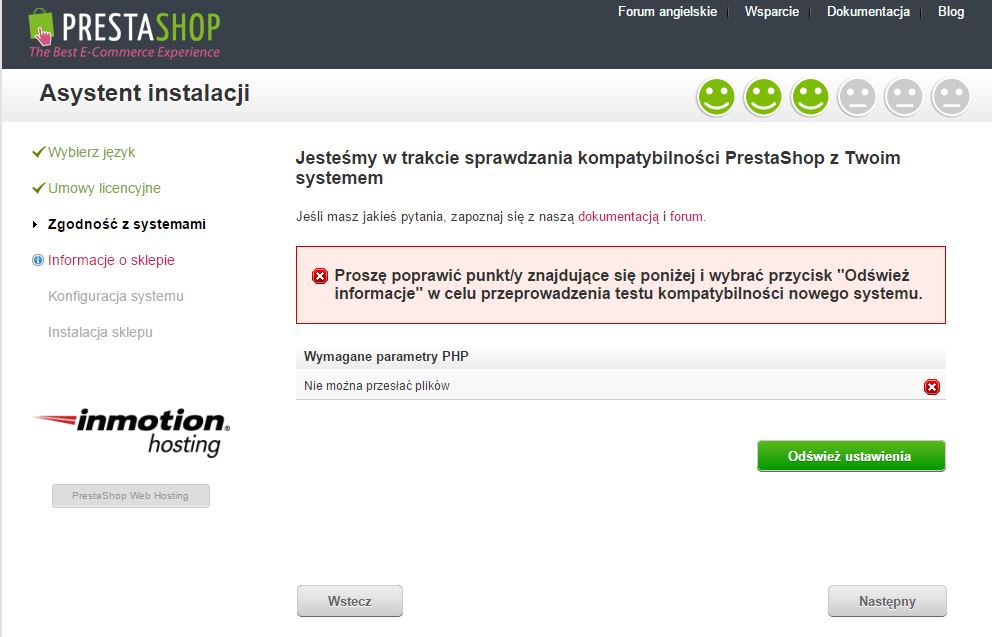

# Instalacja PrestaShop

**Spis treści**

/\*\<!\[CDATA\[\*/\
div.rbtoc1597140204294 {padding: 0px;}\
div.rbtoc1597140204294 ul {list-style: disc;margin-left: 0px;}\
div.rbtoc1597140204294 li {margin-left: 0px;padding-left: 0px;}\
\
/\*]]>\*/

* [Instalacja PrestaShop](instalacja-prestashop.md#InstalacjaPrestaShop-InstalacjaPrestaShop)
  * [Szybka instrukcja instalacji](instalacja-prestashop.md#InstalacjaPrestaShop-Szybkainstrukcjainstalacji)
  * [Szczegółowe instrukcje instalacji](instalacja-prestashop.md#InstalacjaPrestaShop-Szczegółoweinstrukcjeinstalacji)
    * [Pobieranie i rozpakowywanie archiwum PrestaShop](instalacja-prestashop.md#InstalacjaPrestaShop-PobieranieirozpakowywaniearchiwumPrestaShop)
    * [Przesyłanie PrestaShop na serwer](instalacja-prestashop.md#InstalacjaPrestaShop-PrzesyłaniePrestaShopnaserwer)
    * [Tworzenie bazy danych dla Twojego sklepu](instalacja-prestashop.md#InstalacjaPrestaShop-TworzeniebazydanychdlaTwojegosklepu)
    * [Uruchamianie instalatora](instalacja-prestashop.md#InstalacjaPrestaShop-Uruchamianieinstalatora)
      * [Krok 1: strona powitalna](instalacja-prestashop.md#InstalacjaPrestaShop-Krok1:stronapowitalna)
      * [Krok 2: licencja PrestaShop](instalacja-prestashop.md#InstalacjaPrestaShop-Krok2:licencjaPrestaShop)
      * [Kroki 3 i 4: zgodność z systemem i przechowywanie informacji](instalacja-prestashop.md#InstalacjaPrestaShop-Kroki3i4:zgodnośćzsystememiprzechowywanieinformacji)
      * [Krok 5: Konfiguracja systemu](instalacja-prestashop.md#InstalacjaPrestaShop-Krok5:Konfiguracjasystemu)
    * [Kończenie instalacji](instalacja-prestashop.md#InstalacjaPrestaShop-Kończenieinstalacji)

Rozdział ten został przygotowany dla osób, które chcą zainstalować PrestaShop na serwerze.\
Aby zainstalować PrestaShop na swoim komputerze (lokalnie), należy przejść do rozdziału: Instalacja PrestaShop na własnym komputerze (lokalnie).\
Po zapoznaniu się z tym rozdziałem można przejść do sekcji "Tworzenie bazy danych dla Twojego sklepu"

## Instalacja PrestaShop 

Instalacja PrestaShop jest bardzo prosta. Po umieszczeniu plików na serwerze, będzie można rozpocząć konfigurację w przeciągu około 5 minut. Automatyczny instalator wykonuje większość czynności za użytkownika. W przypadku mniej doświadczonych użytkowników proces instalacji może potrwać 10 - 20 minut.\
Przed rozpoczęciem, należy sprawdzić czy zostały spełnione wszystkie wymagania opisane w rozdziale "Czego potrzebujesz by zacząć?". Zalecamy dokładne zapoznanie z rozdziałem "Czego potrzebujesz by zacząć?" przed kontynuowaniem.

Niektórzy dostawcy usług hostingowych oferują instalację PrestaShop "na jedno kliknięcie". Takie rozwiązanie pozwala na oszczędność czasu i może być bardzo dobrą propozycją dla mnie doświadczonych użytkowników.

* 1&1 Hosting: [https://www.1and1.com/prestashop-hosting](http://clk.tradedoubler.com/click?p=199398\&a=2437674\&g=19589768)
* InMotion Hosting: [http://www.inmotionhosting.com/](http://www.inmotionhosting.com/)

\
Dostawcy Ci zwykle posługują się następującymi bibliotekami skryptów:

* SimpleScripts: [https://www.simplescripts.com/script\_details/install:PrestaShop](https://www.simplescripts.com/script\_details/install:PrestaShop),
* Installatron: [http://installatron.com/apps?locale=en#cmd=browser\&display=prestashop](http://installatron.com/apps?locale=en#cmd=browser\&display=prestashop),
* Softaculous: [http://www.softaculous.com/apps/ecommerce/PrestaShop](http://www.softaculous.com/apps/ecommerce/PrestaShop).

\
Niektóre z tych skryptów dają również możliwość aktualizacji sklepu PrestaShop "na jedno kliknięcie" co jest trudne do przecenienia.\
Czasem dostawcy usług hostingowych mają swoje własne skrypty instalacyjne - zalecamy sprawdzenie u dostawcy usługi hostingowej z jakich rozwiązań korzysta.

Co również istotne PrestaShop posiada również własne rozwiązanie hostingowe: po rejestracji na PrestaBox można skorzystać z tego rozwiązania. Dzięki temu wszelkie kwestie techniczne spadają na nasz zespół a użytkownik może zająć się sprzedażą i klientami. Po więcej szczegółów zapraszamy na [https://www.prestabox.com/](https://www.prestabox.com/)

### Szybka instrukcja instalacji 

Poniżej przedstawiamy szybką instrukcję instalacji dla osób, które poruszają się swobodnie w zagadnieniach instalacji aplikacji serwerowych opartych na PHP/MySQL. Jeśli nie wszytko będzie jasne po przeczytaniu poniższej listy zalecamy zapoznanie się ze szczegółowymi instrukcjami instalacji, które powinny rozwiać wszelkie wątpliwości.

1. Pobierz i rozpakuj archiwum PrestaShop.
2. Na serwerze stwórz bazę danych dla sklepu. Jeśli w MySQL nie ma użytkownika ze wszystkimi przywilejami - stwórz go.
3. Prześlij pliki PrestaShop do wybranej lokalizacji na serwerze. Nie przesyłaj folderu root `/prestashop prześlij jedynie plik w nim zawarte.`
4. Uruchom skrypt instalacyjny poprzez wejście z poziomu przeglądarki. Adres URL powinien odpowiadać lokalizacji plików PrestaShop
5. Postępuj zgodnie z instrukcjami instalatora.
6. Gdy zakończysz instalację skasuj folder /instal i utwórz nowy folder administratora domyślnie /admin. Zalecamy zmianę nazwy ze względów bezpieczeństwa.

PrestaShop jest teraz zainstalowana i może być konfigurowana! Przejdź do rozdziału Pierwsze kroki z PrestaShop 1.6

### Szczegółowe instrukcje instalacji 

#### Pobieranie i rozpakowywanie archiwum PrestaShop 

Najnowszą wersję oprogramowania PrestaShop można pobrać pod adresem [http://www.prestashop.com/pl/download](http://www.prestashop.com/pl/download)

Dostępna jest tylko jedna wersja instalacyjna PrestaShop: najnowsza, stabilna odpowiednia dla wszystkich sklepów.Jeśli chcesz pobrać jedną z wcześniejszych wersji oprogramowania przejdź na stronę [http://www.prestashop.com/pl/developers-versions](http://www.prestashop.com/pl/developers-versions). W dolnej części strony znajduje się sekcja "Poprzednio wydane wersje"

Zwracamy uwagę, że nie zalecamy instalowania starszych wersji PrestaShop

Kliknij na przycisk "Pobierz teraz" i zapisz na dysku lokalnym (np. na pulpicie). Pobierany plik będzie nazwany np. "prestashop\_1.6.0.9.zip" (lub będzie oznaczony innym numerem wersji PrestaShop).

Pobrany plik jest plikiem archiwum z rozszerzeniem zip. Plik archiwum tak jak folder zawiera wszystkie pliki PrestaShop z tą różnicą, że są to pliki spakowane. Aby kontynuować **musisz rozpakować plik archiwum**. Jest bardzo prawdopodobne, że Twój system operacyjny wspiera obsługę plików zip, jeśli nie, możesz pobrać i zainstalować jedno z poniższych narzędzi, które umożliwi Ci rozpakowanie archiwum:

* Windows:
  * 7-zip: [http://www.7-zip.org/](http://www.7-zip.org/)
  * WinZip: [http://www.winzip.com/win/en/index.htm](http://www.winzip.com/win/en/index.htm)
  * WinRAR: [http://www.rarlab.com/](http://www.rarlab.com/)
* Mac OS X:
  * iZip: [http://www.izip.com/](http://www.izip.com/)
  * WinZip Mac: [http://www.winzip.com/mac/](http://www.winzip.com/mac/)
  * Zipeg: [http://www.zipeg.com/](http://www.zipeg.com/)

Za pomocą programu obsługującego archiwa zip, rozpakuj plik do dogodnej lokalizacji (np. na pulpit). **Nie przesyłaj pliku zip na serwer.**

Po rozpakowaniu zobaczysz dwa główne składniki archiwum:

* folder "prestashop" zawierający wszystkie pliki PrestaShop - będzie umieszczony na serwerze.
* plik  "Install\_PrestaShop.html", który otwiera się w Twojej przeglądarce.

Pliku  "Install\_PrestaShop.html" nie przesyłaj na serwer.

#### Przesyłanie PrestaShop na serwer 

Do przeprowadzenia działań opisanych w tej sekcji będzie potrzebne konto w serwisie hostingowym (w przypadku braku takiego konta zalecamy przejście do sekcji "Czego potrzebujesz by zacząć?"), potrzebny będzie także folder zawierający pliki PrestaShop.

Na tym etapie prześlemy pliki PrestaShop na serwer, aby to uczynić należy nawiązać połączenie z serwerem za pomocą "klienta FTP". Odpowiedni program powinien zostać wybrany i zainstalować podczas lektury rozdziału "Czego potrzebujesz by zacząć?". My będziemy się posługiwać programem FileZilla ([http://filezilla-project.org/](http://filezilla-project.org/)).

Używając danych dostarczonych przez serwis hostingowy nawiąż połączenie z serwerem (używając klienta FTP). Jeśli nie masz danych do logowania skontaktuj się z dostawcą serwisu hostingowego. Po nawiązaniu połączenia przyszedł czad na przesłanie plików.

W programie FileZilla (lub innym wybranym) znajdź lokalizację zawierającą pliki PrestaShop. Powinna ona być widoczna w lewym oknie programu "Adres lokalny".

W prawej części okna "Adres zdalny", należny wskazań lokalizacje, gdzie mają zostać umieszczone pliki PrestaShop (w katalogu głównym domeny, sub-folderze, sub domenie). Lokalizacja ma duże znaczenie i powinna być wybrana świadomie w zależności od potrzeb własnych i dostawcy usług hostingowych:

* Dostawca usług hostingowych:
  * Niektórzy dostawcy wymagają umieszczenia plików w określonym folderze np. `/htdocs`, `/public_html`, `/web`, `/www`, `/`[`nazwa_domeny.com`](http://yourdomainname.com) `itp.`
  * Czasem podczas połączenia FTP użytkownik jest bezpośredni kierowany do właściwej lokalizacji.
* Ty:
  * Jeśli sklep ma się znajdować na głównej stronie domeny (np., [http://www.przyklad.com](http://www.example.com/)), należy przesłać do głównego folderu ("root").
  * Jeśli sklep ma się znajdować w sub-folderze Twojej domeny (np. [http://www.przyklad.com/](https://app.gitbook.com/pages/createpage.action?spaceKey=PS16\&title=www.przyklad.com\&linkCreation=true\&fromPageId=29655529)[sklep](https://app.gitbook.com/pages/createpage.action?spaceKey=PS16\&title=www.example.com\&linkCreation=true\&fromPageId=29655529)), należy najpierw za pośrednictwem klienta FTP stworzyć folder (prawy klawisz myszy "utwórz katalog") a potem umieścić w nim pliki.
  * Jeśli sklep ma znajdować się w sub-domenie (np. [http://sklep.przyklad.com](http://shop.example.com/)), należy najpierw utworzyć subdomenę. Tworzenie sub-domeny jest zależne od dostawcy usług hostingowych, możliwe że sub-domena jest tworzona przez dodanie folderu, możliwe również, że musi zostać utworzona z poziomu panelu administracyjnego.  Wszelkie informacje na ten temat powinny się znajdować w dokumentacji dostawcy usług hostingowych. Po stworzeniu sub-domeny można umieścić w niej pliki PrestaShop.

Po lewej stronie okna powinna być wskazana lokalizacja (rozpakowanych) plików PrestaShop na komputerze, po prawej stronie lokalizacja sieciowa gdzie pliki mają zostać przesłane. Aby przesłać pliki należy zaznaczyć pliki po lewej stronie i przeciągnąć do prawej części okna, można również kliknąć na nie prawym klawiszem mysz i wybrać opcję "Wyśiij"

****\
****Przesłanie plików na serwer może potrwać kilka minut, cierpliwości przesyłasz ponad 7500 plików rozmieszczonych w prawie 1000 folderach**.** Po jakimś czasie pliki PrestaShop powinny być już na serwerze. Świetnie!

#### Tworzenie bazy danych dla Twojego sklepu 

Zanim będzie można rozpocząć instalację PrestaShop, trzeba  dysponować bazą MySQL gotową do przechowywania danych Twojego sklepu. Jeśli nie masz jeszcze takiej bazy danych musisz ją stworzyć. Bazę danych można utworzyć za pomocą dowodnego narzędzia administracyjnego. My będziemy się posługiwać darmowym phpMyAdmin ([http://www.phpmyadmin.net](http://www.phpmyadmin.net/)), jest ono zainstalowane na większości serwisów hostingowych.

Niektóre serwisy hostingowe preferują narzędzia takie jak cPanel, Plesk lub wykonane na zamówienie. Zalecamy zapoznanie się z dokumentami udostępnionymi przez dostawcę usługi hostingowej, w której opisuje on jak obchodzić się z bazami danych MySQL. W przypadku wątpliwości dokumentacja na pewno będzie pomocna.

Połącz się z phpMyAdmin używając danych dostarczonych przez dostawcę hostingu. Dostęp powinien być możliwy z poziomu przeglądarki internetowej po wpisaniu adresu URL powiązanego z Twoją domeną.&#x20;

Po lewej stronie widać bazy danych, które zostały już utworzone na serwerze MySQL. Niektóre z nich powinny być zostawione w spokoju, gdyż są wykorzystywane przez phpMyAdmin lub przez hosta (np.: `phpmyadmin`, `mysql`, `information_schema`, `performance_schema`). Przeczytaj dokumentację dostarczoną przez dostawcę usługi aby sprawdzić czy któraś z baz może zostać wykorzystana do Twoich celów.

Tak czy inaczej, możesz utworzyć nową bazę danych przywodząc do zakładki "Databeses" w głównym formularzu "Utwórz bazę danych" wpisz nazwę nowej bazy danych i kliknij "Utwórz". Nowa baza danych pojawi się na liście z lewej strony. Ta nowa baza może być wykorzystana do przechowywania danych PrestaShop.

#### Uruchamianie instalatora 

To jest sekcja, w której opiszemy jak sprawić, by wszystko zadziałało: instalacja PrestaShop.

Proces instalacji jest dość prosty, a to za sprawą instalatora.  Prawdopodobnie uda się przeprowadzić cały proces instalacji w kilka minut, prosimy jednak o dokładne przeczytanie instrukcji.

Aby uruchomić instalator, przejdź do folderu gdzie znajdują się pliki PrestaShop: skrypt automatycznie wykryje, że PrestaShop nie jest jeszcze zainstalowana i uruchomi instalator. Możesz też podać dokładny link do instalatora [`http://www.example.com/prestashop_folder/install`](http://www.example.com/prestashop\_folder/install).

Jeśli przeprowadzasz instalację na swoim komputerze, będzie ona wykonywana w folderze lokalnego hosta czyli prawdopodobnie [`http://127.0.0.1/prestashop`](http://127.0.0.1/prestashop).

Od tego momentu, proces instalacji opiera się na wypełnianiu kolejnych formularzy.

Instalacja obejmuje sześć etapów. U góry strony asystent instalacji wyświetla informację gdzie w danym momencie się znajdujesz. Szare ikony zmieniają się w zielone po zakończeniu kolejnego etapu.

**Krok 1: strona powitalna**

Ta strona to szybkie wprowadzenie do procesu instalacji. Możesz wybrać język, w którym będzie prowadzona instalacja.

Otrzymujesz również link do strony z dokumentacją PrestaShop  ([http://doc.prestashop.com/](http://doc.prestashop.com/)) oraz numer telefonu wsparcia PrestaShop. Więcej informacji o wsparciu technicznym znajdziesz pod adresem [http://addons.prestashop.com/pl](http://addons.prestashop.com/pl/35-wsparcie)

Wybierz dogodny dla siebie język instalacji i kliknij "Następny". Wybrany język będzie również domyślnym językiem sklepu - jednak w razie potrzeby będziesz mógł go potem zmienić.

**Krok 2: licencja PrestaShop**

W tym kroku przedstawione zostaną wymaganiach licencji open-source czyli zasady na jakich można używać oprogramowania PrestShop. Nie możesz używać PrestaShop jeśli nie zgadzasz się z tymi zapisami. Oczekujemy od Ciebie akceptacji postanowień licencji.

Przeczytaj postanowienia licencyjne PrestaShop:

* _Open Software License 3.0_ dla PrestaShop - o tej licencji możesz przeczytać pod adresem: [http://www.opensource.org/licenses/OSL-3.0](http://www.opensource.org/licenses/OSL-3.0).&#x20;
* _Academic Free License 3.0_ dla modułów i szablonów o tej licencji możesz przeczytać pod adresem:[http://opensource.org/licenses/AFL-3.0](http://opensource.org/licenses/AFL-3.0).

Aby kontynuować instalację musisz wyrazić zgodę na postanowienia licencyjne.

Aby wyrazić zgodę zaznacz okienko " Zgadzam się z powyższymi warunkami" i kliknij "Następny". Jeśli nie zgadzasz się z postanowieniami licencji nie możesz instalować oprogramowania (przycisk "Następny" nie będzie działał).

**Kroki 3 i 4: zgodność z systemem i przechowywanie informacji**

Na tym etapie wykonywany jest test zgodności parametrów serwera z wymaganiami oprogramowania. W większości przypadków nie zobaczysz tej strony - pojawią się ona tylko jeśli zostaną wykryte jakieś problemy. Jeśli wszystko jest w porządku wyświetli się strona "Informacje o sklepie". W przypadku potrzeby można zobaczyć stronę trzecią należy kliknąć na link "Zgodność z systemami" po lewej stronie okna.

Jeśli w  kroku trzecim zostaną wykryte problemy instalator wyświetli stronę "Zgodność z systemami" gdzie będzie można znaleźć informacje na temat wykrytych błędów.

Kompatybilność systemu

Na tej stronie sprawdzana jest konfiguracja serwera: PHP, uprawnienia do plików i folderów, narzędzia innych dostawców itp.

Jeśli zostaną wykryte jakiekolwiek problemy instalator zatrzyma się, dając Ci możliwości sprawdzenia co spowodowało problem oraz naprawienia usterki (np. konfiguracji PHP)

Oto lista testów przeprowadzanych w tym etapie:&#x20;

| Test                                                       | Jak/gdzie to naprawić?                                                                                                  |
| ---------------------------------------------------------- | ----------------------------------------------------------------------------------------------------------------------- |
| Czy na serwerze jest zainstalowany PHP 5.1.2 (lub nowszy)? | Serwer                                                                                                                  |
| Czy PrestaShop może przesyłać pliki na serwer?             | php.ini file (`file_uploads`)                                                                                           |
| Czy PrestaShop może tworzyć nowe pliki i foldery?          | Przeglądarka/ klient FTP/ linia komend                                                                                  |
| Czy zainstalowano bibliotekę GD?                           | php.ini file (`extension=`[`php_gd2.so`](http://php\_gd2.so))                                                           |
| Czy włączono wsparcie MySQL?                               | php.ini file (`extension=`[`php_pdo_mysql.so`](http://php\_pdo\_mysql.so))                                              |
| Rekursywne prawa zapisu \~/config/                         | Przeglądarka/ klient FTP/ linia komend                                                                                  |
| Rekursywne prawa zapisu \~/cache/                          | Przeglądarka/ klient FTP/ linia komend                                                                                  |
| Rekursywne prawa zapisu \~/log/                            | Przeglądarka/ klient FTP/ linia komend                                                                                  |
| Rekursywne prawa zapisu \~/img/                            | Przeglądarka/ klient FTP/ linia komend                                                                                  |
| Rekursywne prawa zapisu \~/mails/                          | Przeglądarka/ klient FTP/ linia komend                                                                                  |
| Rekursywne prawa zapisu \~/modules/                        | Przeglądarka/ klient FTP/ linia komend                                                                                  |
| Rekursywne prawa zapisu \~/override/                       | Przeglądarka/ klient FTP/ linia komend                                                                                  |
| Rekursywne prawa zapisu \~/themes/default/lang/            | Przeglądarka/ klient FTP/ linia komend                                                                                  |
| Rekursywne prawa zapisu \~/themes/default/pdf/lang/        | Przeglądarka/ klient FTP/ linia komend                                                                                  |
| Rekursywne prawa zapisu \~/themes/default/cache/           | Przeglądarka/ klient FTP/ linia komend                                                                                  |
| Rekursywne prawa zapisu \~/translations/                   | Przeglądarka/ klient FTP/ linia komend                                                                                  |
| Rekursywne prawa zapisu \~/upload/                         | Przeglądarka/ klient FTP/ linia komend                                                                                  |
| Rekursywne prawa zapisu \~/download/                       | Przeglądarka/ klient FTP/ linia komend                                                                                  |
| Rekursywne prawa zapisu \~/sitemap.xml                     | Przeglądarka/ klient FTP/ linia komend                                                                                  |
| Czy PrestaShop może otwierać zewnętrzne URL?               | plik [php.in](http://php.in) (`allow_url_fopen`)                                                                        |
| Czy w PHP wyłączono "register global"?                     | plik php.ini (`register_globals`)                                                                                       |
| Czy włączono obsługę GZIP?                                 | plik .htaccess                                                                                                          |
| Czy jest dostępne rozszerzenie Mcrypt?                     | plik php.ini (więcej informacji [http://php.net/manual/en/mcrypt.setup.php](http://php.net/manual/en/mcrypt.setup.php)) |
| Czy w PHP wyłączono "magic quotes"?                        | plik php.ini (`magic_quotes_gpc`)                                                                                       |
| Czy załadowano rozszerzenie Dom?                           | `--enable-dom` compile time option                                                                                      |
| Czy zładowano rozszerzenie PDO dla MySQL?                  | plik php.ini (`extension=`[`php_pdo_mysql.so`](http://php\_pdo\_mysql.so))                                              |

Zmiana ustawień serwera PHP może być omawiana tylko na konkretnych przypadkach zależnych od poziomu uprawnień jakimi dysponujesz na serwerze, zmiana uprawnień do plików jest łatwiejsza do omówienia.

Uprawnienia służą do przyznawania poszczególnym użytkownikom (lub grupom użytkowników) dostępu i kontroli nad plikami oraz folderami. Instalator musi dokonać zmian w wielu przesłanych plikach i jeśli system nie pozwala na takie zmiany instalator nie będzie w stanie przeprowadzić instalacji.&#x20;

Innymi słowy jeśli instalator wskazuje, że jakieś katalogi lub pliki nie mają właściwych uprawnień musisz je zmodyfikować ręcznie; zmiany takie wymagają dostępu do plików na Twoim serwerze czyli musisz posłużyć się klientem FTP (np. FIleZilla) lub linią komend.

Zaloguj się na swoje konto używając klienta FTP, otwórz folder PrestaShop i przejdź do folderu wymagającego zmiany uprawnień zgodnie ze  wskazaniem instalatora.

CHMOD

CHMOD to komenda pozwalająca na zmianę upewnień do plików/folderów w systemach Unix/Linux (opis komendy i uprawnień: [http://pl.wikipedia.org/wiki/Chmod](http://pl.wikipedia.org/wiki/Chmod))

Nadawanie plikom i folderów "praw zapisu" oznacza "CHMOD 755" lub "CHMOD 775" - zalezie od serwisu hostingowego

Niektórzy dostawcy hostingu mogą wymagać uprawnień 777 jest to najwyższy poziom uprawnień i powinien być przyznawany z pełną świadomością dla konkretnych przypadków. Jeśli zmienisz uprawnienia na poziom 777 w celu instalacji PrestaShop, zalecamy by po zakończeniu instalacji powrócić do bezpieczniejszych ustawień (np. 775 dla folderów i 664 dla plików). Jak zawsze zalecamy wnikliwą lekturę dokumentacji dostarczonej przez dostawcę usługi hostingowej.&#x20;

FIleFilla (i większości klientów FTP) daje możliwość zmiany uprawnień bez konieczności używania linii komend systemu Unix/Linux. Zmiana uprawnień jest możliwa za pomocą interfejsu graficznego. Kiedy odszukasz dany folder, kliknij prawym klawiszem myszy i z menu kontekstowego wybierz "Prawa Pliku... otworzy się okno.

Zależnie od konfiguracji serwera, będzie konieczna zmiana zarówno praw odczytu  ("Odczyt") jak i wykonywania ("Wykonaj"). Natomiast prawa zapisu ("Zapis") muszą być przynajmniej przyznane  właścicielowi ("Prawa właściciela") i grupie ("Grupowe prawa dostępu"). W niektórych przypadkach może być konieczność przyznania praw zapisu dla dostępu publicznego ("Publiczne prawa dostępu"), zalecamy ostrożność zwykle nie jest dobrym pomysłem dawanie możliwości edycji instalacji PrestaShop wszystkim użytkownikom serwera.&#x20;

Może się zdarzyć, że wszystkie sub-foldery i pliki w danym folderze powinny dziedziczyć uprawnienia po nadrzędnym folderze w takim przypadku należy zanzczyć "Przechodź do podkatalogów"

Zalecamy aby podczas zmiany uprawnień na serwerze za pomocą klienta FTP sprawdzać czy zmiany przyniosły pożądany efekt można to uczynić za pomocą instalatora PrestaShop:  klikając "Odśwież ustawienia"&#x20;

Gdy wszystkie kontrolki będą zielone można kliknąć "dalej". Jeśli mimo prób nadal jakieś kontrolki nie są zielone upewnij się, że wyświetla się komunikat "Zgodność PrestaShop z Twoim systemem została zweryfikowania" - informacja na górze strony.

**Informacje systemowe**

Na tym etapie rozpoczyna się personalizowanie sklepu: nadawanie logo, wskazywanie głównego obszaru działalności, wpisywanie informacji o właścicielu sklepu (prawnie wiążących w większości krajów)

Zwracamy uwagę, iż w nazwie sklepu nie powinno się umieszczać dwukropka, gdyż może on sprawić, że nie wszystkie funkcję będą działały poprawnie (np. może on mieć wpływ na wysyłanie e-maili). Jeśli w nazwie sklepu konieczne jest rozgraniczenie dwóch sekcji zalecamy zastosowanie myślnika (np. "Mój Sklep - najlepsze miejsce na zakupy" zamiast "Mój Sklep: najlepsze miejsce na zakupy")

Jeśli chodzi o logo, zwracamy uwagę, że będzie się ono pojawiało:

* Na wszystkich stronach sklepu (zależnie od wybranego szablonu)
* Na zapleczu
* We wszystkich e-mailach wysyłanych do Klientów
* Na wszystkich dokumentach (np. rachunkach)

W związku z powyższym zachowanie domyślnego logo PrestaShop nie jest zalecane.

Aby kontynuować należny kliknąć "Następny"

**Krok 5: Konfiguracja systemu**

To okno zwiera informacje o lokalizacji serwera bazy danych oraz o tym, której bazy danych ma używać sklep. Te informacje jak i pozostałe wymagane na tej stronie powinny być dostarczone przez dostawcę usługi hostingowej.

Prosimy o wypełnienie wszystkich pól (informacjami uzyskanymi od dostawcy hostingu):

* **Database server address**. Adres serwera MySQL może być powiązany z domeną (np. [http://sql.example.com](http://sql.example.com/)), lub z hostem (np. [http://mysql2.alwaysdata.com](http://mysql2.alwaysdata.com/)), może to również być po prostu adres IP (np. 46.105.78.185).
* **Database name**. Nazwa bazy danych gdzie PrestaShop ma przechowywać dane. Może to być baza danych, która już była na serwerze lub ta która została stworzona przez użytkownika (za pomocą narzędzia administracyjnego takiego jak np. phpMyAdmin) więcej informacji o bazie danych w sekcji "Tworzenie bazy danych dla Twojego sklepu".
* **Database login**. Nazwa użytkownika bazy danych MySQL.
* **Database password**. Hasło użytkownika bazy MySQL.
* **Database engine**. Silnik bazy danych jest rdzeniem bazy, InnoDB jest domyślnym silnikiem i zalecamy jego używanie. Naturalnie jeśli użytkownik widzi potrzebę zmiany silnika nie będziemy się sprzeciwiać - jednak domyślny silnik będzie odpowiedni dla przeważające większości użytkowników.
* **Tables prefix**. Prefix do tabeli bazy danych "`ps_`" jest domyślny. Wszystkie tabele SQL PrestShop mają nazwę zgodną ze wzorem "`ps_cart`" lub "`ps_wishlist`". Może się jednak tak zdarzyć, że w jednej bazie danych będą przechowywane informacje kliku sklepów wówczas konieczne jest zróżnicowanie prefiksów. Zalecamy jednakże aby unikać takie sytuacji i dla każdej instalacji tworzyć odrębną bazę danych. Jeszcze lepszym rozwiązaniem jest stworzenie jednego sklepu i wykorzystanie funkcji "multistore" pozwalającej obsługiwać kilka sklepów za pomocą jednego zaplecza.&#x20;
* **Drop existing tables**. dostępne tylko w  "Dev mode", podczas reinstalacji bazy danych można zrezygnować z dotychczas posiadanej bazy danych  i stworzyć nową.

Aby upewnić się, że podano poprawne dane dotyczące bazy kliknij na "Przetestuj połączenie z bazą danych".

Po kliknięciu "dalej" instalator rozpocznie konfigurację sklepu, tworzenie i zapełnianie tabel bazy danych proces ten może potrwać - prosimy o cierpliwość i zalecamy nie wykorzystywanie w tym czasie przeglądarki do innych celów!

Instalator wykonuje następujące operacje:

* Tworzenie pliku `settings.inc.php` i zapisanie w nim ustawień.
* Tworzenie tabel bazy danych.
* Tworzenie domyślnego sklepu w domyślnym języku.&#x20;
* Wypełnienie tabel bazy danych.
* Zapisywanie informacji o sklepie.
* Instalacja domyślnych modułów.
* Instalacja danych demonstracyjnych (produkty, kategorie, uzytkownik, strona CMS itp.).
* Instalacja domyślnego szablonu.

Po zakończeniu wszystkich powyższych operacji sklep jest zainstalowany i gotowy do konfiguracji!

#### Kończenie instalacji 

Jak można przeczytać w ostatnim oknie instalatora jest jeszcze klika czynność, które trzeba wykonać przed zakończeniem instalacji.

W celu poprawy bezpieczeństwa sklepu konieczne jest usunięcie kliku plików i folderów, może to zostać zrobione za pomocą klienta FTP bezpośrednio na serwerze. Obiekty, które należy skasować to:

* Folder "/install" (koniecznie).
* Folder "/docs" (opcjonalnie) - chyba, że planowane są testy narzędzia importującego (folder zawiera przykładowe plik, które można wykorzystać do tego celu).
* Plik "[README.md](http://readme.md)" (opcjonalnie).

Aby przejść do obszaru administracyjnego kliknij "Zarządzaj sklepem"

Innym sposobem poprawy bezpieczeństwa instalacji jest zmiana nazwy folderu administracyjnego. Domyślna nazwa to "admin" można ją zmienić na inną np. "4dmin-1537" or "MySecReT4dm1n". **Zalecamy zapisanie nowo wprowadzonej nazwy folderu administracyjnego**, gdyż od chwili zmiany będzie ona stanowiła część adresu logowania.

Ostatnim zalecanym krokiem jest zmiana uprawnień do plików i folderów na "664" lub ewentualnie "666" (jeśli wymaga tego serwis hostingowy). Niektóre moduły mogą wymagać do poprawnego funkcjonowania uprawnień "755". Zmiany uprawnień mogą zostać wykonane za pomocą klienta FTP co opisano wcześniej.

**Gratulujemy! Instalacja została ukończona!**

Teraz możesz się zalogować na zaplecze sklepu (przypominamy, że adres logowania został zmodyfikowany przez zmianę nazwy folderu "admin") i rozpocząć wypełnianie katalogu produktów, uzupełnianie dostawców, wprowadzanie kosztów wysyłki; można również zmienić szablon i przeprowadzić konfigurację sklepu opis tego procesu znajduje się w rozdziale "Pierwsze kroki z PrestaShop" więcej informacji pod adresem: XXXXXXXXXXXXXXXXXXXXX.
