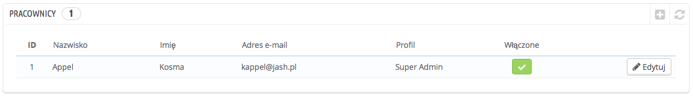
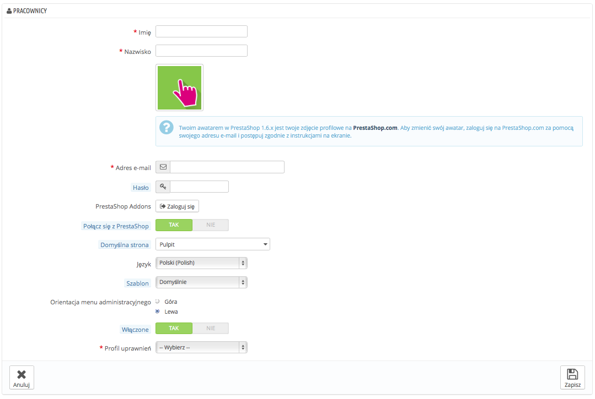
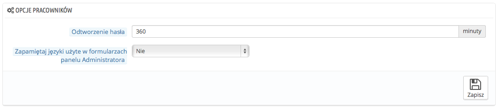

# Konfiguracja kont Pracowników

Strona "Pracownicy" preferencji, wymienia wszystkie konta użytkowników, które mają dostęp do Back-office Twojego sklepu. Domyślnie znajdziesz tam konto utworzone podczas instalacji sklepu, które automatycznie ma ustawione uprawnienia SuperAdmina. SuperAdmin ma dostępność wszystkich funkcji PrestaShopa bez ograniczeń.

Powinieneś utworzyć konta użytkowników dla każdego aktualnego pracownika, który ma cokolwiek wspólnego z Twoją firmą. To oznacza, że nie powinieneś pozwalać na używanie jednego, ogólnego konta dla wszystkich, ponieważ powinieneś być na bieżąco z tym, co kto robi w Twoim sklepie.  Oczywiście pracownicy mogą edytować zamówienia, akceptować płatności etc i powinieneś wiedzieć, co kto robi. Posiadanie dedykowanych kont dla każdego pracownika jest dobrym sposobem na zapewnienie, że twój zespół zarządza Twoim sklepem odpowiedzialnie.

## Dodawanie nowego pracownika 

Naciśnij przycisk "Dodaj nowy", który wyświetli formularz pracownika.

Posiada on wiele ustawień:

* **Imię i Nazwisko.** Te dane nie są widoczne dla klientów, ale Ty powinieneś wiedzieć, kto, co zrobił.
* **Hasło.** Postaraj się, aby nie było oczywiste, nie chcesz, żeby obcy ludzie z niego korzystali.
* **PrestaShop Addons.** Możesz połączyć konto pracownika z kontem na PrestaShop Addons.
* **Adres e-mail.** Jeśli na to zezwolisz, pracownik będzie otrzymywać wiadomości od klientów, oraz powiadomienia PrestaShopa na ten adres. Wykorzystywany jest on również jako login.
* **Domyślna strona.** Możesz zdecydować, która strona będzie pokazywać się pracownikowi po zalogowaniu, to mogą być statystyki dla SuperAdmina, albo zamówienia dla sprzedawcy.
* **Język.** Domyślny język, ponieważ twoim językiem może być polski, ale możesz mieć pracowników z innych krajów. Pamiętaj dodać potrzebne języki na stronie Lokalizacja->Języki.
* **Szablon.** Back-Office PrestaShopa może korzystać z innego szablonu, niż domyślny i tu możesz wybrać z którego chcesz korzystać.
* **Orientacja menu administracyjnego**. Możesz określić położenie menu administracyjnego.
* **Włączone** (Status). Możesz tymczasowo wyłączyć konto. To pozwala Ci na tworzenie tymczasowych kont dla użytkowników tymczasowych.
* **Profil uprawnień.** To bardzo ważne, abyś przypisał prawidłowy profil do każdego konta pracownika. Profil jest powiązany z zestawem uprawnień i dostępów i powinieneś poznać już istniejące, przedstawione w Administracja->Profile (patrz poniżej dla dodatkowych informacji). Profil określa do których części Twojego sklepu pracownik ma dostęp: na przykład: kiedy klienci się logują, to wyświetlają się im strony, tylko do których mają dostęp.

Avatar. Twoim awatarem w PrestaShop 1.6.x jest twoje zdjęcie profilowe na [PrestaShop.com](http://prestashop.com). Aby zmienić swój awatar, zaloguj się na [PrestaShop.com](http://prestashop.com) za pomocą swojego adresu e-mail i postępuj zgodnie z instrukcjami na ekranie.

## Opcje pracowników 

Ta część posiada dwie opcje:

* **Odtworzenie hasła.** Pozwala Ci na określenie frekwencji podczas której pracownik może zmienić swoje hasło.
* **Zapamiętaj języki użyte w formularzach panelu Administrator**a: Jeśli "Tak", to pracownicy mogą zachowywać swój domyślny język formularzy.

