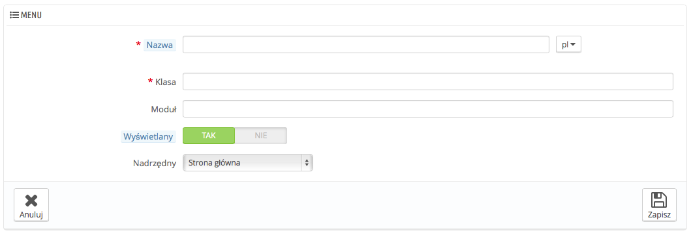

# Menu - konfiguracja

Organizacja menu w Back-Office PrestaShopa nie jest ustalona na sztywno, chociaż domyślne ustawienie zostało stworzone, aby mieć najbardziej przydatne strony były jak najłatwiej dostępne, możesz być innego zdania i możesz chcieć zmienić układ w całości, albo po części.

Ta strona pozwala Ci przemieszczać, edytować, wyłączać a nawet tworzyć strony w menu.

## Przemieszczanie menu 

Poszczególne pozycje w menu, mogą zmieniać położenie na liście. Wystarczy, że naciśniesz krzyżyk w kolumnie "Pozycja" i przeciągnąć daną linię na wybraną pozycję, gdy tylko upuścisz element, PrestaShop zachowa jego pozycję automatycznie.

Możesz również wyłączyć menu poprzez naciśniecie zielonego znaczka w kolumnie "Włączony". Pamiętaj jednak, że wyłączy to menu dla wszystkich użytkowników, jeśli chcesz ukryć to menu tylko przed częścią użytkowników to możesz to uczynić poprzez nadanie odpowiednich uprawnień ich profilom na stronie "Uprawnienia".

## Przemieszczanie stron 

Aby dostać się do stron powiązanych z menu, naciśnij "Szczegóły" dla danego menu, pojawi się wtedy lista przypisanych stron dla tego elementu z tymi samymi kolumnami.

Dokładnie tak jak w przypadku menu, aby zmienić położenie danej strony wystarczy przeciągnąć "krzyżyk" w kolumnie "Pozycja".

Możesz także przemieścić stronę do innego menu. nie można zrobić tego z poziomu listu, tylko trzeba wejść w tryb edycji strony, a następnie w polu "Nadrzędny" wybrać menu, gdzie strona powinna być przypisana. Naciśnij "zapisz", a strona zostanie zachowana w wybranym menu.

Możesz także wyłączyć stronę poprzez naciśniecie zielonego znaczka w kolumnie "Włączony". Pamiętaj jednak, że wyłączy to stronę dla wszystkich użytkowników, jeśli chcesz ukryć tę stronę tylko przed częścią użytkowników to możesz to uczynić poprzez nadanie odpowiednich uprawnień ich profilom na stronie "Uprawnienia".

## Tworzenie nowej strony lub menu 

Naciśnij "Dodaj nowy", aby wyświetlić formularz.

Formularz posiada kilka opcji, które mogą wydać się skomplikowane.

* **Nazwa**. Nadaj unikalną nazwę nowej stronie/menu.
*   **Klasa.** W skrócie: strony Back-Office PrestaShopa oparte są na określonych plikach wewnętrznych PHP, które nazywane są  "admin controllers" i przechowywane są w katalogu: `/controllers/admin.` Gdy utworzysz nową stronę, musisz wiedzieć, w który kontroler celować i co ważne w nazwę jago klasy, która stanowi nazwę pliku PHP.

    Na przykład, chcesz stworzyć stronę, wyświetlającą stronę backupu, musisz najpierw znaleźć nazwę jego kontrolera ( w tym przypadku AdminBackupController) i skopiować go do Pola "Klasa"
* **Moduł.** W niektórych przypadkach kontroler, dla którego chcesz stworzyć stronę pochodzi z modułu. W tym przypadku, musisz także wskazać identyfikator modułu (zazwyczaj to nazwa jego katalogu) i skopiować go do pola "Moduł", nazwa musi być zapisana małymi literami. W ten sposób PrestaShop będzie wiedzieć, że nie ma szukać kontrolera w katalogu `/controllers/admi`n , tylko w katalogu `/modules/nazwa-tego-modułu/`
* **Wyświetlany (**Status). Możesz wyłączyć w każdej chwili stronę, ale pamiętaj, że wyłączasz ją dla wszystkich użytkowników, nie tylko dla siebie.
* **Nadrzędny.** Możesz wybrać menu, do którego strona ma zostać przypisana.

Jeśli chcesz utworzyć nowe menu, wybierz "Strona główna" jako poziom nadrzędny.
