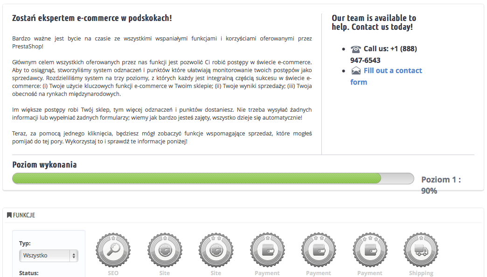

# Merchant Expertise Administracja

Ta strona jest generowana przez moduł o tej samej nazwie. Został specjalnie stworzony, aby śledzić postęp użytkowników jako sprzedawców internetowych, aby mogli oni zobaczyć ich rozwój w ciągu dni, miesięcy i lat. Ten moduł jest instalowany domyślnie.

Dodaje on system odznak i punktów, podzielony na 3 poziomy, każdy z nich stanowi integralną część sukcesu w świecie e-commerce:

* **Funkcje.** Twoje rozwój funkcji, takich jak Rozmiar katalogu, SEO etc.
* **Dokonania.** Twoje osiągnięcia na polu określonych celów e-commerce.
* **Międzynarodowy.** Śledź swoją obecność na rynkach międzynarodowych.

Im większy postęp twój sklep dokona, tym więcej punktów uzyska. Nie musisz wysyłać żadnych formularzy, ani wypełniać informacji, wszystko dzieje się automatycznie. To narzędzie jest po to, aby napędzać Twój biznes, obserwować Twój postęp i pokazywać Twoje osiągnięcia.
