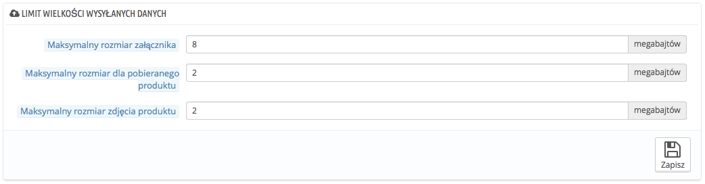

# Preferencje Administracyjne

Strona ta zawiera ogólne funkcje i ustawienia dotyczące pracy PrestaShopa, zawiera ona 4 części:

## Ogólny 

Ogólne ustawienia:

* **Automatycznie sprawdzaj aktualizacje modułów.** Możesz włączyć opcję regularnego sprawdzania nowych wersji modułów na stronie Addons. Jeśli będziesz z tego korzystać, przy module wymagającym aktualizacji pojawi się informacja "Aktualizuj"
* **Sprawdź adres IP cookie**. To dodatkowa opcja bezpieczeństwa, możesz włączyć sprawdzanie, czy klient łączy się z IP zachowanego w cookie(ciasteczku) jego przeglądarki.
* **Okres ważności plików cookie Front Office.** Domyślnie okres ważności ciasteczka PrestaShopa wynosi: 480 godzin (20 dni). Jeśli uważasz, że Twoje bezpieczeństwo tego wymaga, możesz skrócić ten okres.
* **Okres ważności plików cookie Back Office.** Domyślnie okres ważności ciasteczka PrestaShopa wynosi: 480 godzin (20 dni). Jeśli uważasz, że Twoje bezpieczeństwo tego wymaga, możesz skrócić ten okres.

## Limit wielkości wysyłanych danych 

Ta część pomoże Ci określić dopuszczalne limity danych przesyłanych, przez Ciebie i Twoich współpracowników (nie od klientów!).

Są trzy możliwe opcje, jedna ogólna i 2 szczegółowe.

* **Maksymalny rozmiar załącznik**a. Domyślna wartość jest pobierana z ustawień serwera, ale możesz ją obniżyć w razie potrzeby.
* **Maksymalny rozmiar dla pobieranego produktu**. Jeśli sprzedajesz produkty wirtualne (usługi albo produkty, które można pobrać), ten limit może ograniczyć rozmiar pliku, który Twój zespól może przesłać - w wyniki czego także ograniczony jest limit wielkości produktu. Zaplanuj ten rozmiar zawczasu, aby nie blokować niepotrzebnie Twój zespół później.
* **Maksymalny rozmiar zdjęcia produktu.** Podobnie jak w poprzednim punkcie. Możesz utworzyć limit na wielkość przesyłanego zdjęcia. To może też służyć jako przypomnienie, że należy redukować rozmiar zdjęcia przed przesłaniem, ponieważ ich rozmiar może mieć wpływ na prędkość strony (czas ładowania pliku z serwera) oraz kwestie związane z utrzymaniem przepustowości strony.

## Pomoc 

Aby pomóc Ci w codziennym korzystaniu z PrestaShop, drużyna deweloperów dodała wiele porad i informacji pomocniczych w ramach interfejsu.

* **Okienka pomocy dla Back Office.** Możesz określić, czy chcesz, aby informacje dodatkowe pojawiające się w panelu administracyjnym, były nadal widoczne.

## Powiadomienia 

Powiadomienia to te małe znaczki wraz z numerami widoczne na każdej stronie back-office, na prawo od nazwy sklepu. Liczba w dymku określa ilość nowych akcji powiązanych z nimi od ostatniego razu, gdy na nie nacisnąłeś.

Możesz określić otrzymywanie ich dla wybranych typów danych:

* **Pokaż powiadomienia o nowych zamówieniach.** Naciśnięcie przycisku koszyka, wyświetla listę nowych zamówień wraz podstawowymi informacjami dotyczącymi transakcji wraz z bezpośrednim linkiem do strony zamówienia.
* **Pokaż powiadomienia o nowych klientach**. Wyświetla listę nowych klientów, którzy zarejestrowali się w sklepie ostatnio.
* **Pokaż powiadomienia o nowych wiadomościach**. Wyświetla ostatnie wiadomości od klientów wysłane za pomocą formularza dostępnego na stronie.
