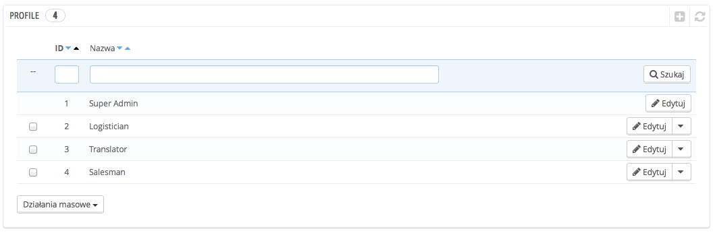
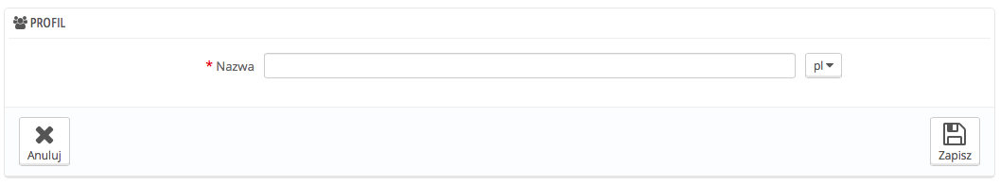

# Profile Pracowników

PrestaShop pozwala Ci na przypisanie pewnych obowiązków i praw każdemu pracownikowi, który pomaga przy prowadzeniu sklepu. Na przykład, administrator posiada dostęp do całego sklepu bez ograniczeń, podczas gdy pracownik może mieć dostęp do katalogu i zamówień.

Domyślnie Prestashop posiada 4 gotowe profile:

* **SuperAdmin**. Najwyższe uprawnienia. Posiada prawa i dostępy do wszystkiego w PrestaShopie.
* **Logistician.** Czyli osoba odpowiedzialna za pakowanie i wysyłanie zamówień. Ma dostęp wyłącznie do zamówień, wysyłki, oraz Magazynu i częściowe uprawnienia do Katalogu oraz kont klientów.
* **Translator**. Czyli osoby za przetłumaczenie zawartości Twojego sklepu. Mają dostęp do produktów i kategorii, stron CMS oraz strony "Tłumaczenia".
* **Salesman**. Sprzedawcy, oprócz tych samych praw co tłumacze, mają także dostęp do kont klientów, modułów, API i niektórych statystyk.

Możesz zobaczyć szczegóły uprawnień przeglądając każdy profil na stronie "Uprawnienia".

Profil SuperAdmin, nie może być usunięty, tylko jego nazwa może się zmienić.

Powinien być co najmniej jeden pracownik o profilu SuperAdmina.

## Dodawanie nowego profilu. 

Możesz dodać tyle profili, ile potrzebujesz.

Dodanie profilu jest proste, naciśnij "Dodaj nowy", wprowadź unikalną nazwę profilu i zachowaj.

Bardziej skomplikowana część, czyli nadawanie uprawnień, znajdziesz w kolejnym podrozdziale "Uprawnienia".
