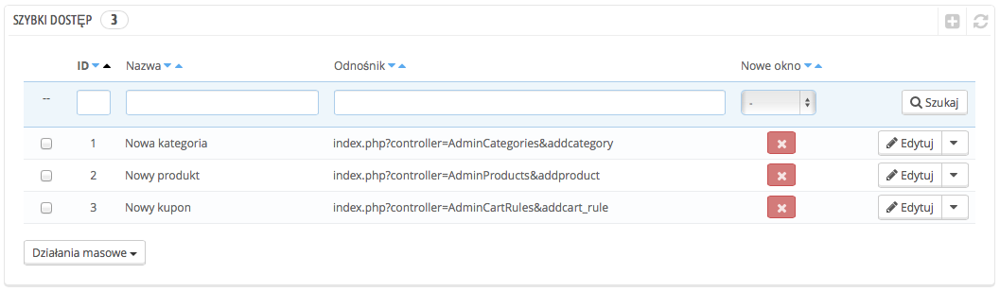
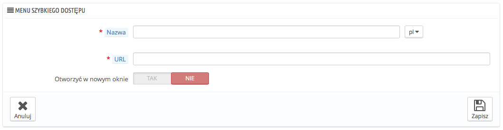

# Szybki dostęp - konfiguracja

PrestaShop posiada skróty do najważniejszych stron, które są dostępne poprzez menu "Szybki dostęp", które znajduje się w nagłówku każdej strony Back-office (obok nazwy użytkownika).

Strona konfiguracji "Szybki dostęp" umożliwia Ci stworzenie spersonalizowanych skrótów, aby ułatwić administrację jeszcze szybszą i łatwiejszą dla Ciebie i Twojego zespołu.

Strona wyświetla skróty, które zostały już utworzone, domyślnie są to:

* **Nowa kategoria.** przenosi Cię do formularza tworzenia nowej kategorii.
* **Nowy kupon.** przenosi Cię do formularza, gdzie możesz utworzyć nowy kupon.
* **Nowy produkt.** przenosi Cię do formularza, gdzie możesz utworzyć nowy produkt.

Możesz także włączyć opcję otwierania tych stron w nowej zakładce/nowym oknie.

Możesz utworzyć tyle skrótów, ile potrzeba, tylko nie przesadź, w końcu zbyt dużo elementów w szybkim dostępie mija się z celem.

## Dodawanie nowego linku 

Stwórzmy nowy skrót do formularza zamówień, z którego można tworzyć nowe zamówienia, dodawać klientów etc.

Jak zwykle naciśnij "Dodaj nowy" aby przejść do formularza:

* **Nazwa.** Nadaj skrótowi unikalną, krótką nazwę.
* **URL.** Wskaż adres docelowy. Oto jak możesz to zrobić nawet z kompleksowymi linkami:\

  1. Pozostaw tę stronę otwartą, otwórz stronę w nowej zakładce/nowym oknie Zamówienia->Zamówienia.
  2. Skopiuj jego adres URL z przeglądarki, na przykład: [http://www.myprestashop.com/admin8945/index.php?controller=AdminOrders\&token=f326b0419984706791c03f7e96599147](http://www.myprestashop.com/admin8945/index.php?controller=AdminOrders\&token=f326b0419984706791c03f7e96599147).
  3. `Usuń część: &token=xxx` oraz domenę, i katalog`/admin8945`, powinno Ci pozostać tylko: `index.php?controller=AdminOrders`.
  4. Tę pozostałość wklej w formularz na stronie do tworzenia skrótów.
* Otwórz w nowym oknie. Określ czy chcesz otwierać skrót w nowej zakładce/oknie.

Uwaga, możesz również stworzyć linki do zewnętrznych stron, na przykład do konta PayPal, wystarczy, że wkleisz kompletny adres URL wraz z nagłówkiem http://.
